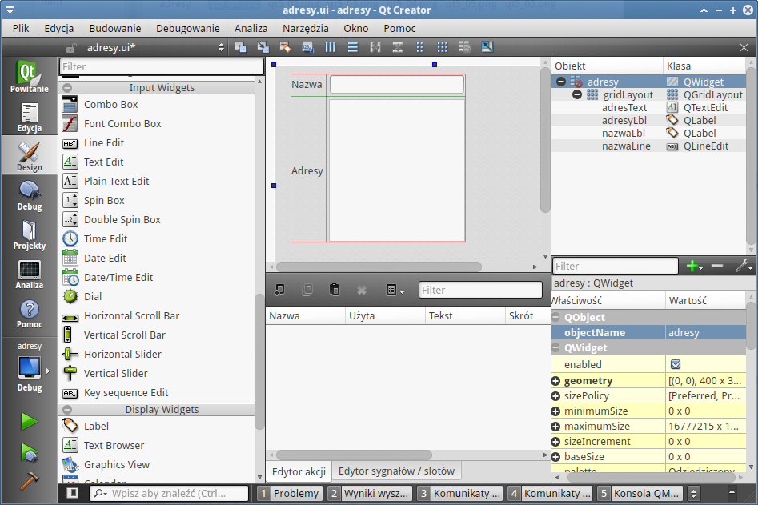
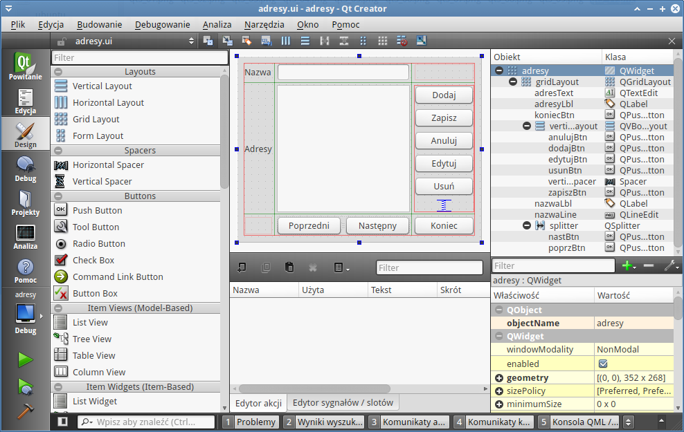
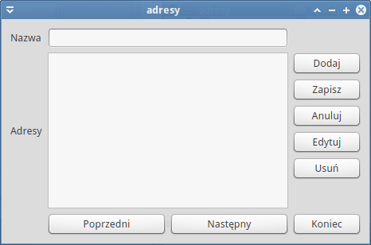
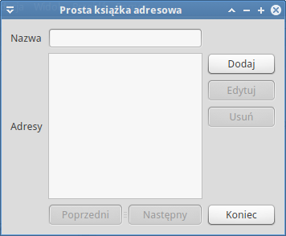

Adresy (Qt5)
###################

Niniejszy scenariusz pokazuje, jak zacząć programowanie z wykorzystaniem biblioteki
Qt w wersji 5 przy użyciu dedykowanego środowiska IDE Qt Creator.
Celem jest stworzenie prostej 1-okienkowej książki adresowej, w której
można dodawać dane adresowe powiązane z określoną nazwą, np. imieniem
i nazwiskiem.

.. contents::
    :depth: 1
    :local:

Nowy projekt
*****************

Po uruchomieniu aplikacji Qt Creator wybieramy przycisk "New Project",
który uruchamia kreatora aplikacji.

W pierwszym oknie "Applications" i "Qt Widget Applications", co
oznacza, że chcemy utworzyć program z interfejsem graficznym oparty
na klasie QWidget. W następnym oknie podajemy nazwę projektu,
np, "adresy", oraz wskazujemy ścieżkę do katalogu, w którym
będą zapisywane pliki wchodzące w skład projektu.
W następnym oknie wybieramy tzw. "kit", czyli zestaw definiujący
docelowe środowisko, kompilator itp. ustawienia. Dostępne
zestawy muszą być wcześniej określone w ustawieniach Qt Creatora

Kolejne okno pozwala definiować nazwę klasy głównej i klasę podstawową,
podajemy "adresy" i wybieramy "QWidget". W następnym ostatnim oknie
niczego nie zmieniamy, kończymy kliknięciem przycisku "Finish".

Efektem działania kreatora będzie utworzenie następujących plików:

    1) ``adresy.h`` - :term:`plik nagłówkowy`, tutaj będziemy deklarować wszystkie używane w programie
    obiekty (elementy interfejsu), a także publiczne sloty, czyli funkcje
    powiązanie z określonymi sygnałami (zdarzeniami).

    2) ``adresy.cpp`` - :term:`plik źródłowy`, tu znajdzie się kod tworzący obiekty interfejsu, łączący
    sygnały ze slotami, a wreszcie implementacja slotów.

    3) ``main.cpp`` - plik źródłowy, w którym tworzona i uruchamiana jest instancja naszej
    aplikacji.

    4) ``adresy.ui`` - jak wskazuje rozszerzenie ("ui" - ang. user interface),
    plik zawierać będzie opis graficznego interfejsu aplikacji zapisany
    za pomocą znaczników XML.

Tworzenie interfejsu
**********************

Zaczniemy od utworzenia głównego okna naszej aplikacji. W tym celu
dwa razy klikamy plik adresy.ui i przechodzimy do tworzenia
formularza.

Na początku klikamy obiekt "Grid Layout" z kategorii "Layouts" i rysujemy prostokąt na
formularzu tak, aby nie wypełniał go w całości. Dodana kontrolka
umożliwia porządkowanie innych elementów tworzących interfejs w prostokątnej
siatce. Dalej dodamy dwie etykiety, czyli obiekty "Label" z kategorii
"Display Widgets". Staramy się je umieścić jedna nad drugą w dodanej przed
chwilą siatce.

.. tip::

    Po wybraniu obiektu i najechaniu na *Grid Layout* należy obserwować
    niebieskie podświetlenia, które pojawiają się w pionie i poziomie,
    wskazują one, gdzie umieszczony zostanie dodawany obiekt.

Po dwukrotnym kliknięciu na dodane etykiety możemy zmienić treść przez nie wyświetlaną.
Modyfikujemy w ten sposób właściwość *text* danego obiektu. Etykieta
górna powinna zawierać tekst "Nazwa", dolna - "Adresy".

.. note::

    Lista wszystkich obiektów wyświetlana jest po prawej stronie na górze
    w oknie *Hierarchia obiektów*. W kolumnie *Obiekt* widzimy tam nazwy dodanych obiektów,
    a w kolumnie *Klasa* nazwy klas, które reprezentują. Po wskazaniu myszą
    dowolnego obiektu możemy edytować wszystkie jego właściwości poniżej.
    Np. nazwę obiektu zmienimy w polu *objectName*.

Nazwę etykiety górnej ustalamy na "nazwaLbl", dolnej - na "adresyLbl".

.. tip::

    Konwencji nazywania obiektów jest wiele, ważne żeby konsekwentnie trzymać
    się wybranej. Tutaj proponujemy uwzględnianie w nazwie typu obiektu
    przy użyciu skrótu pisanego z dużej litery, np. "nazwaLbl".

Po prawej stronie etykiety "Nazwa" dodajemy kontrolkę *Line Edit* z grupy *Input Widgets*
o nazwie "nazwaLine". Poniżej, czyli w drugiej kolumnie, tworzymy obiekt
*Text Edit* z tej samej grupy, co poprzedni o nazwie "adresText".
Powinniśmy uzyskać poniższy układ:

Czas na dodanie przycisków pozwalających inicjować działanie aplikacji.
Dodajemy więc 5 przycisków *PushButton* z kategorii *Buttons* po prawej stronie
i poza(!) obiektem *GridLayouts* jeden pod drugim. Na samym dole umieszczamy
kontrolkę *Vertical Spacer* z kategorii *Spacers*. Następnie zaznaczamy wszystkie dodane obiekty,
obrysowując je myszką, i klikamy ikonę *Rzmieść w pionie* (:kbd:`CTRL+L`)
na pasku narzędziowym. Teraz stworzoną grupę przeciągamy na siatkę
jako 3. kolumnę.

Musimy zmienić nazwy i tekst dodanych przycisków. Od góry ustawiamy kolejne
właściwości (nazwa/tekst): "dodajBtn/Dodaj", "zapiszBtn/Zapisz", "anulujBtn/Anuluj",
"edytujBtn/Edytuj", "usunBtn/Usuń". W efekcie powinniśmy uzyskać następującą formatkę:

.. figure:: img/qt5_09.png

Musimy dodać jeszcze 3 przyciski pozwalające na nawigację między adresami
i wyjście z programu. Poniżej obiektu siatki umieszczamy więc 2 przyciski (*PushButton*),
zaznaczamy je i klikamy ikonę *Rozmieść poziomo w splitterze*, następnie
przeciągamy grupę na dół 2. kolumny siatki. Na koniec dodajemy jeszcze jeden
przycisk na dole 3. kolumny. Dodanym obiektom zmieniamy właściwości (nazwa/tekst):
"poprzBtn/Porzedni", "nastBtn/Następny", "koniecBtn/Koniec".

Na koniec zaznaczamy formularz główny, na którym znajdują się wszystkie
elementy interfejsu i klikamy przycisk *Rozmieść w siatce* (:kbd:`CTRL+G`).
Dzięki temu kontrolki będą skalowane wraz ze zmianą rozmiaru okna.

W sumie uzyskujemy poniższy projekt:

Możemy uruchomić naszą aplikację, wybierając *Budowanie/Uruchom* (:kbd:`CTRL+R`)
lub klikając trzecią od dołu ikonę zielonego trójkąta w lewej kolumnie Qt Creatora.
Powinniśmy zobaczyć podobne do poniższego okno:

Deklaracje i implementacje
**************************

Po dodaniu elementów interfejsu musimy zadeklarować zmienne, za pomocą
których będziemy mogli nimi manipulować. Przechodzimy do pliku ``adresy.h``
i wprowadzamy poniższe zmiany:

.. raw:: html

    
<strong>adresy.h</strong> nr 

.. highlight:: cpp
.. literalinclude:: adresy01.h
    :linenos:

Na początku musimy zaimportować klasy, z których skorzystaliśmy przy budowie
interfejsu. Najważniejszą jest klasa podstawowa wszystkich elementów interfejsu,
czyli ``QWidget``. Kolejne trzy odpowiadają wykorzystanym przez nas kontrolkom
edycyjnym i przyciskom. Dodatkowa klasa ``QTextCodec`` pozwoli poprawnie wyświetlać
polskie znaki. W wewnątrz naszej klasy głównej, której deklaracja
rozpoczyna się w linii 14., deklarujemy prywatne (:term:`private`) właściwości,
których nazwy odpowiadają nazwom wcześniej dodanych elementów interfejsu
graficznego. Formalnie każda zmienna jest wskaźnikiem do obiektu odpowiedniego typu.

W pliku ``adresy.cpp`` korzystamy ze zadekarowanych zmiennych, aby ustawić początkowe
właściwości obiektów składających się na interfejs użytkownika.

.. raw:: html

    
<strong>adresy.cpp</strong> nr 

.. highlight:: cpp
.. literalinclude:: adresy01.cpp
    :linenos:

W obrębie konstruktora głównej klasy naszej aplikacji o nazwie ``adresy``,
którego definicja rozpoczyna się w linii 4., tworzymy instancje
klas użytych w interfejsie graficznym. Do zmiennych zadeklarownych w pliku
``adresy.h`` przypisujemy obiekty utworzone za pomocą operatora ``new``, a następnie
definiujemy ich początkowe właściwości.

Konstruktorowi odpowiada zawzwyczaj destruktur, a więc działanie, które
usuwa stworzony obiekt, w tym wypadku interfejs użytkownika: ``adresy::~adresy()``.

Aby określić stan elementów interfejsu wykorzystujemy odpowiednie właściwości
i metody reprezentujących je obiektów. Np. właściwość ``setReadOnly(true)`` blokuje
edycję danego elementu, a właściwość ``setEnabled(false)`` uniemożliwia kliknięcie
danego przycisku. Metoda ``hide()`` ukrywa obiekt.

Instrukcja ``QTextCodec::setCodecForLocale(QTextCodec::codecForName("UTF-8"))``
określa kodowanie komunikatów w standardzie "UTF-8" używanych w aplikacji,
które wprowadzane są dalej za pomocą funkcji ``trUtf8()``. Tak dzieje się np.
podczas określania tytułu okna w wywołaniu ``setWindowTitle()``.

.. tip::

    W środowisku MS Windows kodowanie powinno zostać ustawione na ``Windows-1250``.

Dzięki powyższym uzupełnieniom po uruchomieniu aplikacji pola nazwy i adresu
będą nieaktywne, będziemy mogli natomiast użyć przycisków ``Dodaj``, aby utworzyć
nowy wpis, lub ``Koniec``, aby zakończyć aplikację.

Sygnały i sloty
**************************

Działanie aplikacji z interfejsem graficznym polega w uproszczeniu na reagowaniu
na działania użytkownika, takie jak np. kliknięcie, naciśnięcie klawisza, przeciągnięcie itp.
Wszystkie **zdarzenia** generowane z poziomu interfejsu użytkownika w terminologii biblioteki :term:`Qt`
emitują tzw. :term:`sygnały`. Programista decyduje o tym, które z nich i jak są obsługiwane,
definiując tzw. :term:`sloty`, czyli **funkcje** powiązane z określonymi zdarzeniami.
Mechanizm sygnałów i slotów umożliwia komunikację między obiektami aplikacji.

Każda z funkcji obsługujących zdarzenia musi zostać najpierw zadeklarowana w pliku
``adresy.h`` w sekcji ``public slots:``, ich implementację musimy dopisać
później do pliku ``adresy.cpp``.

.. raw:: html

    
<strong>adresy.h</strong> nr 

.. highlight:: cpp
.. literalinclude:: adresy02.h
    :emphasize-lines: 5,7-9,24-28
    :lineno-start: 18
    :lines: 18-

Oprócz deklaracji `slotów` w liniach 24-26 dopisujemy deklaracje kilku potrzebnych
zmiennych. Definiujemy więc typ wyliczeniowy ``Tryb``, z którego
korzystamy deklarując zmienną ``aktTryb`` oraz prywatną funkcję pomocniczą
``aktGui``. Posłużą one do określania 1 z 3 stanów działania aplikacji, takich jak:
przeglądanie wpisów, dodawanie i ich edycja.

Dalej dopisujemy deklaracje zmiennych pomocniczych ``staraNazwa`` i ``staryAdres``.
Korzystamy tu z typu ``QString`` oznaczającego dane tekstowe.
Na końcu deklarujemy specjalną zmienną ``kontakty``, która posłuży
do przechowywania nazw i skojarzonych z nimi adresów w postaci słownika
typu ``QMap``. Poszczególne elementy takiej listy mają postać skojarzonych
ze sobą par ``(klucz, wartość)``.

.. raw:: html

    
<strong>adresy.cpp</strong> nr 

.. highlight:: cpp
.. literalinclude:: adresy02.cpp
    :emphasize-lines: 1-2
    :lineno-start: 53
    :lines: 53-

Powiązania między sygnałami i slotami ustalamy w pliku ``adresy.cpp``
za pomocą poleceń typu: ``connect(dodajBtn, SIGNAL(clicked()), this, SLOT(dodajKontakt()));``.
Funkcja ``conect()`` jako pierwszy argument wymaga zmiennej wskazującej obiekt, który
emituje sygnał określony w 2. argumencie (np. ``SIGNAL(clicked())``, czyli kliknięcie),
3. argument określa obiekt, który zostaje *powiadomiony* o zdarzeniu, w ostatnim
argumencie podajemy funkcję, która ma zostać wykonana (``SLOT(dodajKontakt())``).

Jak widać powyżej, na końcu konstruktora naszej klasy ``adresy`` wiążemy kliknięcia przycisków
``dodajBtn`` i ``koniecBtn`` z funkcjami ``dodajKontakt()`` i ``koniec()``.

Funkcja ``dodajKontakt()`` przygotowuje aplikację do przełączenia w stan
dodawania nowych danych. W tym celu najpierw zapamiętujemy
dotychczasową nazwę i adres, a następnie wywołujemy funkcję
pomocniczą z argumentem typu ``Tryb`` oznaczającym wymagany stan aplikacji:
``aktGui(dodajT)``.

Działanie funkcji ``aktGui()``, obsługującej stany aplikacji, polega na uaktywnianiu lub
wyłączaniu określonych elementów interfejsu w zależności od przeprowadzanej
przez użytkownika czynności. Np. w trybie dodawania i edycji odblokowujemy
możliwość wprowadzania tekstu w polach nazwy (``nazwaLine->setReadOnly(false);``)
i adresu (``adresText->setReadOnly(false);``), pokazujemy przyciski
pozwlające na zapis lub anulowanie wywołując metodę ``show()``. Wyłączamy
również nawigację, blokując odpowiednie przyciski (metoda ``setEnabled(false)``).
Po wejściu w tryb nawigacji czyścimy (``clear()``) zawartość pól nazwy i adresu, o ile
lista kontaktów jest pusta (``if (kontakty.isEmpty())``). Następnie uaktywniamy
przyciski edycji, usuwania i przeglądania, jeżeli mamy jakieś kontakty. Ilość
kontaktów zapisujemy wcześniej w osobnej zmiennej (``int ile=kontakty.size();``).
Na koniec przyciski zapisu i anulowania zostają zablokowane.

Slot ``koniec()`` wywoływany jest po kliknięciu przycisku *Koniec* i powoduje
zamknięcie aplikacji przy użyciu metody ``close()``. Wywołuje ona m.in.
destruktor klasy, co powoduje – w naszym przypadku – usunięcie instancji
obiektu interfejsu graficznego (``delete ui;``).

Dodawanie adresów
**************************

Pora zaimplementować obsługę trybu dodawania danych adresowych.
Najpierw do pliku nagłówkowego dopisujemy deklaracje odpowiednich slotów:

.. raw:: html

    
<strong>adresy.h</strong> nr 

.. highlight:: cpp
.. literalinclude:: adresy03.h
    :emphasize-lines: 4-5
    :lineno-start: 25
    :lines: 25-29

Musimy też na początku pliku dodać import klasy ``QMessageBox`` pozwalającej
wyświetlać informacje użytkownikowi.

Następnie przechodzimy do pliku ``adresy.cpp``, w którym trzeba powiązać
sloty ``zapiszKontakt()`` i ``anuluj()`` ze zdarzeniem kliknięcia przycisków
``zapiszBtn`` i ``anulujBtn``. Zadanie to proponujemy wykonać samodzielnie :-).

Na końcu pliku musimy dopisać definicje powiązanych funkcji:

.. raw:: html

    
<strong>adresy.cpp</strong> nr 

.. highlight:: cpp
.. literalinclude:: adresy03.cpp
    :lineno-start: 118
    :lines: 118-

Funkcja ``zapiszKontakt()`` pobiera tekst wpisany w pola edycyjne za pomocą
metod ``text()`` oraz ``toPlainText()`` i zapisuje je w zmiennych tekstowych.
Następnie sprawdza, czy użytkownik wprowadził obydwie informacje. Jeżeli
nie, wyświetla odpowiedni komunikat przy użyciu metody ``QMessageBox::information()``.
Pierwszy tekst, który przekazujemy do tej funkcji to tytuł okna dialogowego, drugi –
właściwy komunikat. Następnie, jeżeli aplikacja jest w trybie dodawania, sprawdza,
czy podana nazwa nie została zapisana wcześniej na liście ``kontakty``. Jeśli
nie (``if (!kontakty.contains(nazwa))``), dodaje nowe dane (``kontakty.insert(nazwa, adres);``) i wyświetla
potwierdzenie. W przeciwnym razie informuje użytkownika o duplikacie.
Na końcu aktywuje tryb nawigacji (``aktGui(nawigujT);``).

Jeżeli użytkownik rozmyśli się i kliknie odpowiedni przycisk, wywoływana jest
funkcja ``anuluj()``. Jak widać, przywraca ona w polach edycyjnych poprzednio
wprowadzane dane i również aktywuje tryb nawigacji.

Tryb nawigacji
********************

Obsługa nawigacji wymaga napisania funkcji obsługujących naciśnięcie przycisków
*Następny* i *Poprzedni*, które stają się aktywne, jeżeli mamy więcej niż
1 dodany adres. Jak zwykle, zaczynamy od zadeklarowania publicznych slotów ``nast()``
i ``poprz()`` w pliku nagłówkowym. Dopisanie tych 2 linijek pozostawiamy
do samodzielnego wykonania. Podobnie powiązanie zadeklarowanych slotów
z sygnałami (kliknięciami) obiektów ``nastBtn`` i ``poprzBtn`` w konstruktorze
klasy ``adresy``.

Następnie dopisujemy implementację zadeklarowanych funkcji na końcu pliku ``adresy.cpp``:

Na końcu pliku musimy dopisać definicje powiązanych funkcji:

.. raw:: html

    
<strong>adresy.cpp</strong> nr 

.. highlight:: cpp
.. literalinclude:: adresy04.cpp
    :lineno-start: 149
    :lines: 149-

Wyświetlając kolejną parę powiązanych danych, tzn. nazwę i przypisany jej adres(y),
musimy sprawdzić w fukcji ``nast()``, czy mamy kolejny wpis, czy też aktualny jest ostatni.
Wtedy należałoby wyświetlić wpis pierwszy. W tym celu pobieramy nazwę
aktualnie wyświetlonego wpisu i tworzymy obiekt tzw. ``iteratora`` inicjowanego
przez metodę ``find()`` i przypisanego do zmiennej ``i``: ``QMap<QString, QString>::iterator i = kontakty.find(nazwa);``.
Iterator umożliwia łatwe poruszanie się po liście słowników zapisanych w zmiennej ``kontakty``.
Metoda ``i.key()`` zwraca nam klucz, a ``i.value()`` przypisaną mu wartość.

Jeżeli bieżący wpis nie jest ostatnim inkrementujemy wartość iteratora (``if (i != kontakty.end()) i++;``).
W przeciwnym wypadku ustawiamy go na pierwszy wpis (``i = kontakty.begin();``);
Na koniec pozostaje wczytanie nazwy (``i.key()``) i przypisanych jej danych
(``i.value()``) do odpowiednich pól interfejsu.

Funkcja ``poprz()`` zaczyna się tak samo jak poprzednia, czyli od utworzenia
iteratora wskazującego na bieżący wpis. Jeżeli jesteśmy na początku listy,
ustawiamy iterator na element końcowy. Następnie przechodzimy do elementu
końcowego (``i--``) i wyświetlamy odpowiednie dane.

.. note::

    Metoda ``.end()`` klasy ``QMap`` zwraca iterator wskazujący na wirtualny (!)
    element po ostatnim elemencie listy. Dlatego, aby uzyskać dostęp do niego,
    musimy iterator dekrementować (``i--``).

Edycja i usuwanie
********************

Do oprogramowania zostay jeszcze dwa przyciski: ``btnEdytuj``, którego
kliknięcie powinno wywołać funkcję ``edytujKontakt()``, oraz ``btnUsun``,
który wywołuje funkcję ``usunKontakt()``. Samodzielnie dopisujemy
deklaracje funkcji do pliku nagłówkowego, a ich powiązania z sygnałami
umieszczamy w pliku źródłowym.

Następnie implementujemy funkcje:

.. raw:: html

    
<strong>adresy.cpp</strong> nr 

.. highlight:: cpp
.. literalinclude:: adresy05.cpp
    :lineno-start: 185
    :lines: 185-

Przejście do trybu edycji, czyli działanie funkcji ``edytujKontak()``,
polega na zapisaniu aktualnie wyświetlanych danych (przydatne, jeżeli
użytkownik anuluje zmiany) i uaktywnieniu trybu (``aktGui(edytujT);``),
tzn. odblokowaniu pól tekstowych i odpowiednich przycisków.

Usuwanie kontaktów również jest proste. Na początku pobieramy *nazwę* i związany
z nim *adres(y)*. Metoda ``.contains(nazwa)`` pozwala sprawdzić, czy lista kontaktów
zawiera słownik o podanym kluczu. Natępnie prosimy użytkownika o potwierdzenie
operacji. Po jego uzyskaniu najpierw wyświetlamy w aplikacji dane poprzedniego
wpisu dzięki wywołaniu zdefiniowanej wcześniej funkcji ``poprz()``, później
dopiero usuwamy wpis za pomocą metody ``.remove(nazwa)`` i wyświetlamy potwierdzenie.
Na koniec aktywujemy tryb nawigacji.

Poćwicz sam
==============

    Spróbuj rozszerzyć napisaną aplikację o możliwość przechowywania danych
    w pliku lub w bazie na dysku.

Materiały
*************

1. `Projekt Qt`_
2. `Biblioteka Qt 5`_
3. `Qt Creator`_
4. `Dokumentacja Qt 5`_
5. `Qt Developer Wiki (pl)`_

.. _Projekt Qt: https://qt-project.org/
.. _Biblioteka Qt 5: http://doc.qt.io/qt-5/
.. _Qt Creator: http://pl.wikipedia.org/wiki/Qt_Creator
.. _Dokumentacja Qt 5: http://doc.qt.io/qt-5/reference-overview.html
.. _Qt Developer Wiki (pl): http://qt-project.org/wiki/Wiki_Home_Polish

