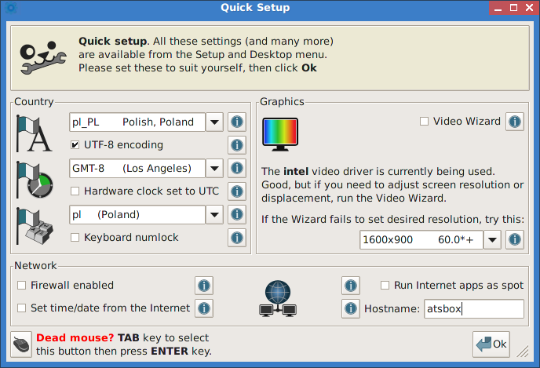
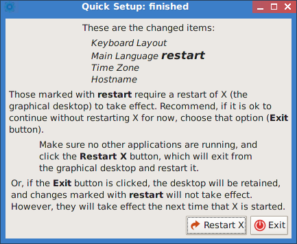
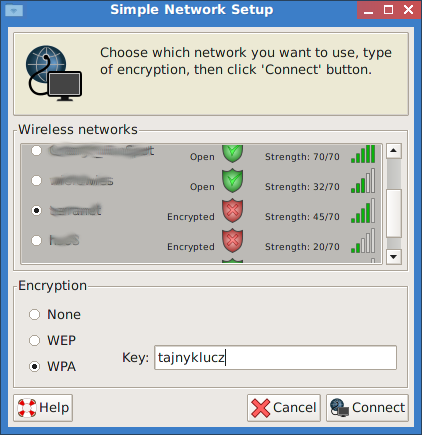
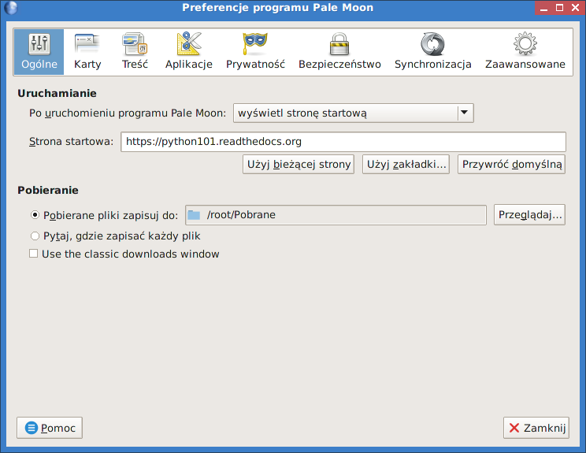
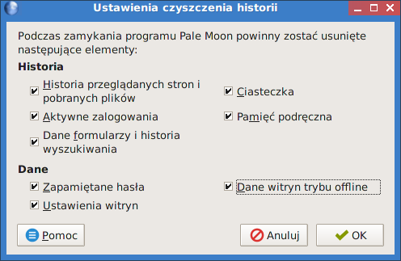

.. _konfiguracja:

Konfiguracja
################

Jeżeli nie chcesz używać udostępnionych przez nas plików zapisu,
możesz sam skonfigurować swój system. Poniżej wskazówki.

Ustawienia wstępne
*******************

Okno *QuickSetup ustawienia pierwszego uruchamiania* konfigurujemy
wg zrzutu i klikamy "Ok", dalej potwierdzamy konieczność doinstalowania
pakietu językowego, a w trzecim oknie klikamy "Exit" – bo niczego
jeszcze nie doinstalowaliśmy.

.. figure:: linimg/quicksetup02.png

Internet
*********

Uruchamia się *Internet kreator połączenia*, jeśli jesteśmy podpięci do
sieci kablem i dostajemy parametry przez DHCP, powinniśmy zobaczyć komunikat
"Congratulations, you are connected". W przeciwnym razie klikamy "Wired or wireless LAN",
w następnym oknie wybieramy na początek narzędzie "Simple Network Setup".
Po jego uruchomieniu powinniśmy zobaczyć listę wykrytych interfejsów,
z której wybieramy *wlan0* dla połączenia bezprzewodowego. Następnie
w razie potrzeby wskazujemy odpowiednią sieć, metodę zabezpieczeń
i podajemy hasło.

.. figure:: linimg/internet01.png
.. figure:: linimg/internet02.png
.. figure:: linimg/internet03.png
.. figure:: linimg/internet04.png

Jeżeli uzyskamy połączenie, w oknie "Network Connection Wizard" zobaczymy
aktywne interfejsy. Sugerujemy kliknąć "Cancel", a w ostatnim oknie
informacyjnym "Ok". Na koniec zamykamy okno *Welcome* kreatora.

.. figure:: linimg/internet06.png
.. figure:: linimg/internet07.png

Przeglądarka WWW
*****************

Domyślną przeglądarkę *Pale Moon* należy od czasu do czasu aktualizować.
W tym celu wybieramy *Start/Internet/Palemoon-updater*, zaznaczamy "Update Pale Moon" i klikamy OK.

.. figure:: linimg/palemoon01.png
.. figure:: linimg/palemoon02.png
.. figure:: linimg/palemoon03.png

Jeśli po aktualizacji przywita nas angielskojęzyczny interfejs, na stronie powitalnej
klikamy link "Language Packs", pobieramy plik tłumaczeń :file:`pl.xpi` i instalujemy.
Na koniec wpisujemy polu adresu polecenie "about:config", w pole wyszukiwania
"useragent" i zmieniamy opcję "general.useragent.locale" na "pl-PL" (o ile potrzeba).

.. figure:: linimg/palemoon04.png
.. figure:: linimg/palemoon05.png
.. figure:: linimg/palemoon06.png
.. figure:: linimg/palemoon07.png

Dotakowe ustawienia są opcjonalne, ale wskazane.
Wybieramy "Edycja/Preferencje", aby skonfigurować stronę domyślną,
i katalog pobieranych plików, np. :file:`root/Pobrane` (trzeba go utworzyć),
wreszcie opcje śledzenia i historii. Te ostatnie ustawienia wpływają na rozmiar wolnego
miejsca w pliku zapisu.

.. figure:: linimg/palemoon09.png

Na koniec można zainstalować blocker reklam wybierając odpowiedni dodatek,
np. AdBlockEdge, albo korzystając z narzędzia *Pup-Advert-Blocker* (Start/Internet/),
w którym wybieramy serwis "Mvps.org" i klikamy ikonę koła zębatego.
Ściągnięta lista zawierająca adresy IP oraz nazwy serwerów reklamowych
zostanie dodana do pliku :file:`/etc/hosts` i przekierowana na adres
lokalny, co uniemożliwi jakąkolwiek z nimi komunikację ;-)

.. _plikzapisu:

Plik zapisu
************

Podczas pierwszego zamknięcia system prosi o utworzenie `pliku zapisu <http://puppylinux.org/wikka/SaveFile>`_
(ang. *savefile*, dodatkowe informacje zob. w :ref:`puppy`), w którym
zapisywane będą wprowadzane przez nas zmiany: konfiguracja,
instalacja programów, utworzone dokumenty.

Na początku może pojawić się pytanie o przetłumaczenie informacji rozruchowych,
wybieramy "Yes" i potwierdzamy kolejny komunikat. Gdyby pytanie to pojawiło się
następnym razem, wybierz "No".

.. figure:: lxpupimg/lxpsave01.png
.. figure:: lxpupimg/lxpsave02.png

W następnym oknie klikamy "Zapisz", następnie "administrator".
Wybieramy partycję oznaczającą pendrajwa: w konfiguracjach z 1 dyskiem twardym
będzie ona oznaczona najczęsciej `sdb1` (kierujemy się rozmiarem i typem plików: vfat).

.. figure:: lxpupimg/lxpsave03.png
.. figure:: lxpupimg/lxpsave04.png
.. figure:: lxpupimg/lxpsave05.png

Następnie wybieramy ewentualnie szyfrowanie i system plików. Sugerujemy
`ext2` – najszybszy. Minimalny rozmiar to 32MB, zalecamy 512MB lub więcej.

.. figure:: lxpupimg/lxpsave06.png
.. figure:: lxpupimg/lxpsave07.png
.. figure:: lxpupimg/lxpsave08.png

Opcjonalnie rozszerzamy domyślną nazwę i potwierdzamy zapis.

.. figure:: lxpupimg/lxpsave09.png
.. figure:: lxpupimg/lxpsave10.png

Należy spokojnie poczekać na utworzenie pliku i wyłącznie komputera.

Czcionki
*********

Czcionki *ttf* wystarczy wgrać do katalogu :file:`/usr/share/fonts/default/TTF`.
Można użyć narzędzia *Manager fontów* (Start/Desktop/Desktop).

