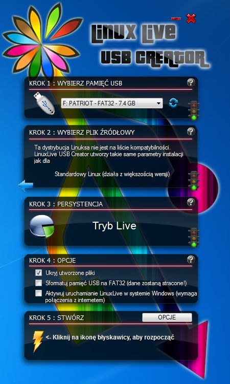

Problemy
#############

Jeśli nie da się uruchomić komputera za pomocą przygotowanego klucza,
przeczytaj poniższe wskazówki.

1. Zanim uznasz, że pendrajw nie działa, przetestuj go na innym sprzęcie!

2. W niektórych komputerach możliwość uruchamiania z napędu USB trzeba odblokować
   w BIOS-ie. Odpowiedniego ustawienia poszukaj w np. w opcji "Boot order".

3. Starsze komputery stacjonarne mogą wymagać wejścia do ustawień BIOSU
   (zazwyczaj klawisz :kbd:`F1`, :kbd:`F2` lub :kbd:`DEL`)
   i ustawienia pendrajwa (o ile zostanie wykryty) jako urządzenia startowego
   zamiast np. dysku twardego czy cdromu. Opuszczając BIOS zmiany należy zapisać!
   Komputer restartujemy bez usuwania klucza USB.

4. W przypadku komputerów stacjonarnych, jeżeli nie działają frontowe gniazda USB,
   podłącz klucz z tyłu!

5. Niebootujący pendrajw można sformatować za pomocą narzędzia
   `HP-USB-Disk-Storage-Format-Tool <http://www.dobreprogramy.pl/HP-USB-Disk-Storage-Format-Tool,Program,Windows,27581.html>`_,
   a następnie nagrać jeszcze raz obraz *(Lx)PupTahr*.

.. figure:: linimg/hpformat.jpg

6. Można wypróbować narzędzie `Linux Live USB Creator <http://www.linuxliveusb.com/en/download>`_.
   Użyj go do nagrania obrazu *(Lx)PupTahr*:

7. Spróbuj z innym pendrajwem.

8. Zmień maszynę, być może jest za stara lub za nowa!

9. Jeżeli masz bios UEFI z włączonym mechanizmem `SecureBoot <http://en.wikipedia.org/wiki/Unified_Extensible_Firmware_Interface#Secure_boot>`_,
   co stanowi normę dla laptopów z preinstalowanym Windows 7/8/...
   Spróbuj wyłączyć zabezpieczenie w biosie, możesz zajrzeć do instrukcji:

   - `pomoc Ubuntu`_
   - `pomoc Microsoft`_
   - `wsparcie HP`_

.. _pomoc Ubuntu: https://help.ubuntu.com/community/UEFI#SecureBoot
.. _pomoc Microsoft: http://technet.microsoft.com/en-us/library/dn481258.aspx
.. _wsparcie HP: http://h10025.www1.hp.com/ewfrf/wc/document?cc=pl&lc=pl&dlc=pl&docname=c03679388

Inne narzędzia
===============

.. tip::

    Część narzędzi udostępnia serwis ``dobreprogramy.pl``, niestety sugeruje
    użycie dodatkowej aplikacji do pobierania, ukrytej pod przycieskiem "Pobierz program".
    Sugerujemy używanie przycisku "Linki bezpośrednie" i wybór
    odpowiedniej wersji (32-/64-bitowej), jeżeli jest dostępna.

* `USB Image Tool <http://www.dobreprogramy.pl/USB-Image-Tool,Program,Windows,39717.html>`_
  – narzędzie do robienia obrazów dysków USB i nagrywania ich na inne pendrajwy.

.. figure:: linimg/usbimgtool.jpg

* `Image USB <http://osforensics.com/tools/write-usb-images.html>`_
   – świetny program do tworzenia obrazów napędów USB i nagrywania ich
   na wiele pendrajwów jednocześnie.

.. figure:: linimg/imageusb.jpg

* `Bootice <http://www.dobreprogramy.pl/BOOTICE,Program,Windows,47749.html>`_ –
  opcjonalne narzędzie do różnych operacji na dyskach. Za jego pomocą można
  np. utworzyć, a następnie odtworzyć kopię MBR pendrajwa.

.. figure:: linimg/bootice01.jpg
.. figure:: linimg/bootice02.jpg
.. figure:: linimg/bootice03.jpg

