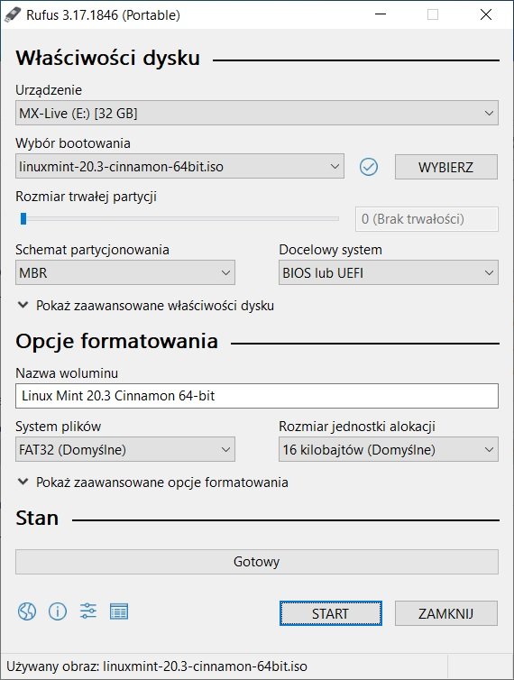
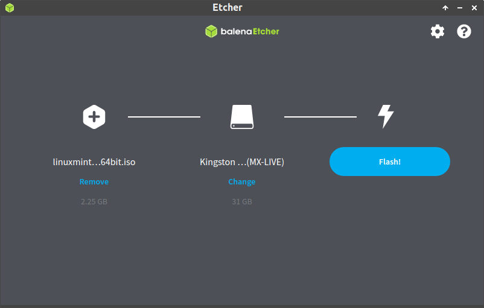
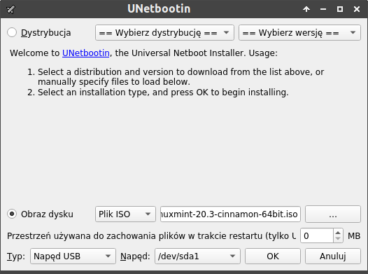

.. _kluczusb:

Linux Live USB
##############

Linuksa najłatwiej przetestować i zainstalować z klucza USB, na który nagrywamy obraz instalacyjny wybranej dystrybucji.
W ten sposób otrzymujemy system w wersji *live*. Przygotowany klucz może posłużyć również jako system przenośny,
który będzie zapisywał zmiany ustawień i tworzone dokumenty.

Polecamy dystrybucje oparte na `Debianie <https://www.debian.org/index.pl.html>`_, np.:

* `Linux Mint <https://linuxmint.com/download.php>`_,
* `Ubuntu <https://ubuntu.com/download>`_,
* `MX Linux <https://mxlinux.org/download-links/>`_.

Przygotowanie klucza USB
========================

1) Pobierz obraz ISO wybranej dystrybucji.
2) Przygotuj klucz USB – jeżeli planujesz używać Linuksa jako systemu przenośnego
   i chcez żeby system zapamiętywał ustawienia i dokumenty, użyj odpowiednio dużego napędu, np. 32 GB.
3) W systemie Windows pobierz program `Rufus <https://rufus.ie/pl/>`_.
   W systemie Linux do nagrania Linux Minta, Debiana itp. użyj programu `Etcher <https://www.balena.io/etcher/>`_
   lub `UNetbootin <https://unetbootin.github.io/>`_.
   Do nagrania MX Linuksa pobierz program `Live USB Maker <https://github.com/dolphinoracle/lum-qt-appimage/releases>`_.
4) Włóż pendrajwa do gniazda USB, uruchom pobrany program.
5) Wskaż obraz ISO i naciśnij odpowiedni przycisk (START, Ok, Dalej – zobacz zrzuty poniżej).

   Rufus

   Etcher

   UNetbootin

.. figure:: img/live_usb_maker.png

   MX Live USB Maker

Uruchomienie systemu Linux Live
===============================

Przygotowany klucz USB wkładamy do portu, uruchamiamy komputer naciskając podczas startu kilka razy odpowiedni
dla naszego komputera klawisz, np. F12 lub F10 (może być inny), aby przygotować listę urządzeń startowych.
Na liście wskazujemy nazwę wykrytego pendrive'a i klikamy myszą lub naciskamy Enter.

.. note::

    Niekiedy trzeba uruchomić komputer kilkukrotnie, żeby wykrył naciśnięcie odpowiedniego klawisza.

