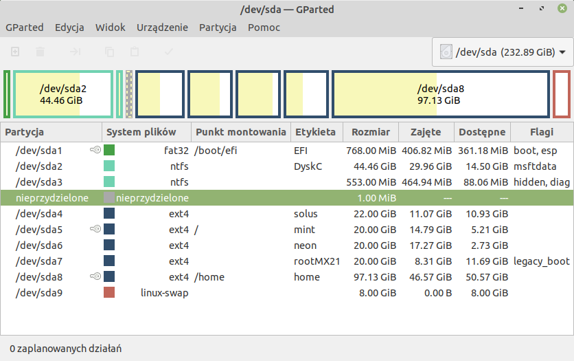

.. _parytcje:

Partycjonowanie
###############

Podstawy
========

Partycjonowanie to podział napędu (dysku, pendrive'a) na części, zwane `partycjami <https://pl.wikipedia.org/wiki/Partycja>`_.
Informacje o partycjach przechowywane są w tablicy partycji. W starszych komputerach dominował standard
MBR (ang. *Master Boot Record*). Dziś dominuje standard GPT (ang. *GUID Partition Table*).

W Linuksie partycje na dyskach HDD i pendrive'ach oznaczane są jako **sdXY** – gdzie **X** jest kolejną literą alfabetu,
a **Y** numerem: 1-4 dla partycji głównych, 5-n dla partycji logicznych (tworzonych na partycji rozszerzonej).
Zobacz poniższy zrzut:

Widok tablicy partycji w programie GParted.

Partycje na dyskach SSD NVMe (ang. *Non-Volatile Memory Express*) oznaczane są wg wzoru **nvmeX1n1pY**, gdzie **X**
jest numerem kontrolera, a **Y** numerem partycji. Zobacz poniższy zrzut:

Widok tablicy partycji w programie GParted.

Najczęściej wykorzystywanym w Linuksie `systemem plików <https://pl.wikipedia.org/wiki/System_plik%C3%B3w>`_
jest `ext4 <https://pl.wikipedia.org/wiki/Ext4>`_.

System Linux można zainstalować na 1 partycji, ale dobrą praktyką jest użycie przynajmniej 3.

* pierwszej na katalog główny (root, symbol **/**) – minimum 20-25 GB,
* drugiej na dane użytkowników (**/home**) – rozmiar według potrzeb,
* trzeciej jako partycji wymiany (**swap**) – rozmiar równy przynajmniej wielkości pamięci RAM.

MBR czy GPT
===========

Partycje można tworzyć podczas instalacji systemu lub wcześniej, co wydaje się wygodniejszym rozwiązaniem.
Do tego celu możemy użyć programu GParted dostępnego w systemach *Linux Live*.

1) Uruchom komputer za pomocą :ref:`klucza USB <_kluczusb>` i uruchom program GParted.
2) Za pomocą rozwijalnej listy lub polecenia *GParted / Urządzenia* wskaż odpowiedni napęd.
3) Wybierz polecenie *Widok / Informacje o urządzeniu*, jeżeli Twój dysk używa standardu MBR,
   przejdź do artykułu :ref:`Partycje MBR <_parytcjembr>`, jeśli nie lub chcesz użyć nowszego
   standardu GPT, czytaj dalej.

Dysk pusty
==========

Dysk z danymi
=============

   MX Live USB Maker

Uruchomienie systemu Linux Live
===============================

Przygotowany klucz USB wkładamy do portu, uruchamiamy komputer naciskając podczas startu kilka razy odpowiedni
dla naszego komputera klawisz, np. F12 lub F10 (może być inny), aby przygotować listę urządzeń startowych.
Na liście wskazujemy nazwę wykrytego pendrive'a i klikamy myszą lub naciskamy Enter.

.. note::

    Niekiedy trzeba uruchomić komputer kilkukrotnie, żeby wykrył naciśnięcie odpowiedniego klawisza.

