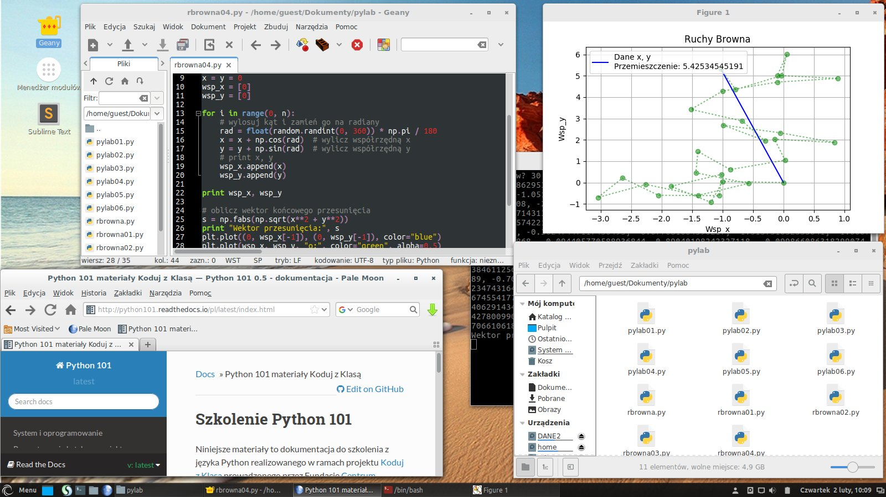
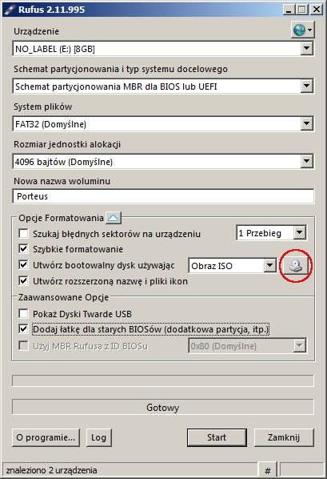
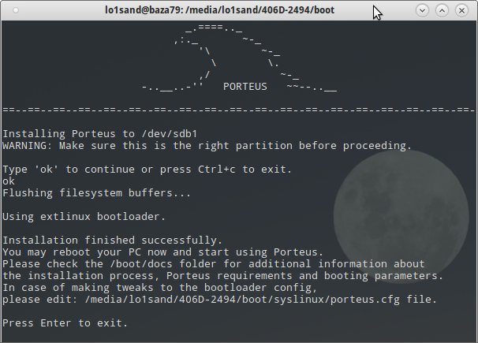
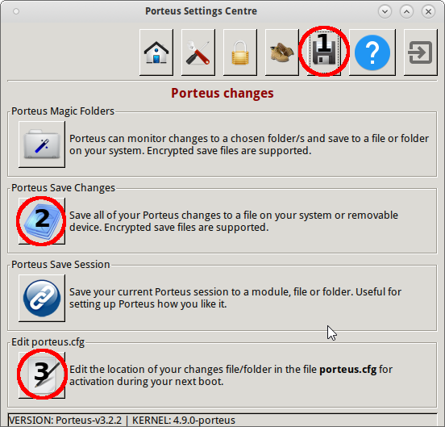
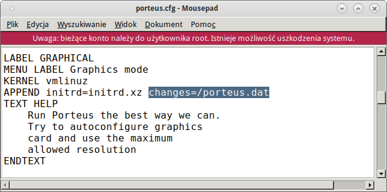
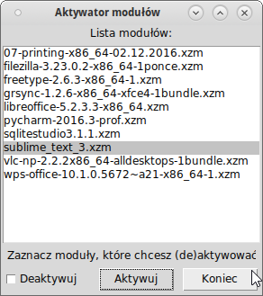
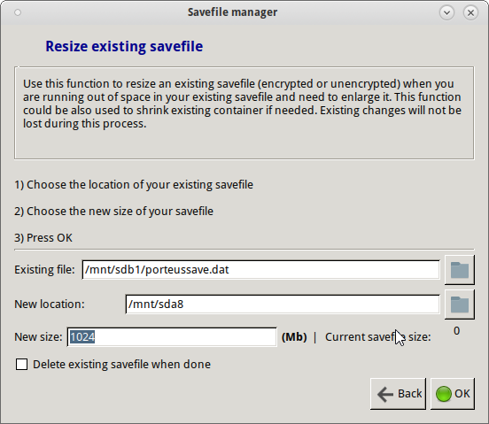
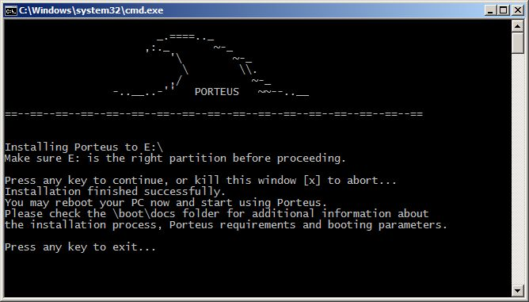

.. _porteus:

Porteus
###################

`Porteus <http://porteus.org/>`__ jest odmianą Linuksa typu *live* zoptymalizowaną
do uruchamiania z nośników wymiennych, np. kluczy USB. Oparty jest na najstarszej
dystrybucji Linuksa – `Slackware <https://pl.wikipedia.org/wiki/Slackware>`_.
System błyskawicznie startuje i pozwala na zachowanie wprowadzanych zmian,
tj. konfiguracji, oprogramowania czy dokumentów użytkownika w pliku zapisu.

Przygotowaliśmy 64-bitowe spolszczone wersje ze środowiskiem graficznym
`XFCE <https://pl.wikipedia.org/wiki/Xfce>`_ lub `Cinnamon <https://pl.wikipedia.org/wiki/Cinnamon>`_,
które bardzo dobrze nadają się m. in. do nauki programowania i realizacji materiałów
`Python101 <http://python101.rtfd.org>`_.

.. figure:: img/porteus322X.jpg

   Porteus 3.2.2 XFCE 64-bit

   Porteus 3.2.2 Cinnamon 64-bit

.. contents:: Spis treści
    :backlinks: none

Klucz USB
=========

Przygotowanie pendrajwa z systemem jest bardzo proste:

1. Pobieramy obraz *iso* systemu:
   `porteus322XFCE.iso <https://drive.google.com/open?id=0B1zG9cfNyT7WakRQN1BWUEV4UFk>`_ [środowisko XFCE, 09.05.2017] lub
   `porteus322Cinnamon.iso <https://drive.google.com/open?id=0B1zG9cfNyT7WZHlLNl9WYzBjdGs>`_ [środowisko Cinnamon, 13.02.2017].

2. Przygotowujemy pustego pendrajwa o pojemności min. 2GB. Im szybszy, tym lepszy!

**W systemie Windows**:

3. Do nagrania Porteusa na pendrajwa polecamy program `Rufus <https://rufus.akeo.ie/?locale=pl_PL>`_.
   Pobierz, uruchom, wskaż plik *iso* i nagraj.

**W systemie Linux**:

3. Montujemy pobrany obraz z uprawnieniami administratora (roota) w katalogu :file:`/mnt/loop`:

.. code-block:: bash

    ~$ sudo mkdir /mnt/loop
    ~S sudo mount -o loop /path/to/Porteus-XFCE-v3.2.2-x86_64.iso /mnt/loop

4. Wkładamy klucz USB, który powinien zostać wykryty jako partycja :file:`/dev/sdb1` lub :file:`/dev/sdc1` i zamontowany w katalogu :file:`/media/nazwa_użytkownika/etykieta_klucza`. Sprawdzimy to poleceniem ``mount|grep "sdb"`` lub otwierając menedżer plików.

5. Kopiujemy zawartość zamontowanego obrazu na pendrajwa za pomocą polecenia (lub menedżera plików):

.. code-block:: bash

    ~$ cp -r /mnt/loop/* /media/nazwa_użytkownika/etykieta_klucza

6. Wchodzimy do katalogu :file:`boot` na pendrajwie(!) i wydajemy polecenie z uprawnieniami roota:

.. code-block:: bash

    /media/nazwa_użytkownika/etykieta_klucza$ sudo bash Porteus-installer-for-Linux.com

– upewniamy się, że wyświetlona została partycja klucza USB (np. :file:`/dev/sdb1`), wpisujemy *ok* i potwierdzamy.

Pierwsze uruchomienie
=====================

Po włożeniu pendrajwa do gniazda USB i włączeniu komputera należy nacisnąć klawisz
wywołujący *Boot menu*. Zazwyczaj jest to któryś z klawiszy funkcyjnych, np.: :kbd:`F12`.
Czasem trzeba wywołać BIOS i dopiero wtedy wybrać wpis typu *USB Device* oznaczający
naszego pendrajwa.

Podczas pierwszego uruchomienia zobaczymy komunikat "couldn't find /porteus.dat" informujący,
że system nie może znaleźć pliku zapisu. Tak ma być, naciskamy :kbd:`Enter`.

Po uruchomieniu **tworzymy plik zapisu**, w którym przechowywane będą wszystkie zmiany.

1. Wybieramy *Start/System/Porteus Setings Centre*, podajemy hasło roota (tj. "toor"),
   klikamy ikonę dyskietki (1), następnie ikonę *Porteus Save Changes* (2),
   a w następnym oknie wybieramy przycisk *Create*.

2. **W polu "Savefile name" wpisujemy nazwę pliku**: ``porteus.dat``.

   W polu **Location** klikamy ikonę folderu i wskazujemy napęd USB, zazwyczaj "sdb1" lub "sdc1".
   (Po wybraniu nazwy napędu powinniśmy widzieć na nim katalog :file:`porteus`).

   Rozmiar zostawiamy domyślny lub podajemy większy,
   np. 768 lub 1024 MB. Klikamy "OK" i czekamy na utworzenie pliku.

.. figure:: img/savefile_02a.png

3. Na koniec **ponownie uruchomiamy system**!

.. attention::

  Domyślna nazwa pliku zapisu, :file:`porteus.dat`, wpisana jest w pliku :file:`boot/syslinux/porteus.cfg`.
  Jeżeli zapis nie działa albo utworzyliśmy plik o innej nazwie i chcielibyśmy go użyć, należy
  otworzyć wspomniany plik, np. klikając przycisk *Edit porteus.cfg* (3) w oknie
  "Porteus Settings Centre" i wpisać właściwą ścieżkę do pliku zapisu: ``changes=/nazwa_pliku_zapisu.dat``.
  Uwaga: ``/`` oznacza główny katalog pendrajwa!

Moduły
=======

Porteus ma budowę modularną, składa się ze skompresowanych paczek w formacie *xzm*, zawierających system plików `SquashFS <https://pl.wikipedia.org/wiki/SquashFS>`_. Na kluczu USB (płycie CD) znajduje się katalog :file:`porteus` zawierający wszystkie moduły w podkatalogach:

* :file:`base` – moduły systemu bazowego,
* :file:`modules` – tu umieszczamy moduły ładowane automatycznie podczas startu,
* :file:`optional` – oprogramowanie dodatkowe, ładowane na żądanie.

.. attention::

    Moduły są aktualizowane, aby usunąć ewentualne błędy lub dodać funkcjonalności:

    * `Lista zmian <https://drive.google.com/open?id=0B1zG9cfNyT7WUms4TnNkX3ZOa2s>`_ »»»
    * `Pobierz moduły <https://drive.google.com/open?id=0B1zG9cfNyT7WSTlWWWdTdzRBQnc>`_ »»»

Obraz iso, katalog :file:`potrteus/modules`, zawiera :

1. :file:`01-devel` – podstawowe narzędzia deweloperskie (kompilatory);
2. :file:`02-pl-locales` – spolszczenie ze słownikami;
3. :file:`02-tcltk` – biblioteki Tcl/Tk wymagane przez Pythona;
4. :file:`04-python2` – Python 2.7.13 (XFCE) lub 2.7.11 (Cinnamon) + PyQt5;
5. :file:`05-python3` – Python 3.6.1 (XFCE) lub 3.5.2 (Cinnamon) + PyQt5;
6. :file:`06-qt5` – biblioteka Qt 5.7 (XFCE) lub 5.6 (Cinnamon);
7. :file:`09-fonts-msubuinf` – dodatkowe czcionki;
8. :file:`10-palemoon` – przeglądarka Palemoon 27.3.1;
9. :file:`15-flashplayer-plugin` – wtyczka Flash Player 25.0.0.148;
10. :file:`50-git` – system kontroli wersji `Git <https://pl.wikipedia.org/wiki/Git_(oprogramowanie)>`_ 2.9;
11. :file:`55-keepassx` – menedżer haseł KeePassX 2.0.3;
12. :file:`90-tools` – narzędzia ``lxrandr`` (zarządzanie ekranami), ``xmag``, ``tree``;
13. :file:`91-geany` – Geany 1.29, programistyczne IDE;
14. :file:`95-sublime_text_3` – zaawansowany edytor programistyczny Sublime-Text 3 (3126);
15. :file:`99-home-guest` – prekonfiguracja środowiska XFCE lub Cinnamon.

W katalogu :file:`porteus/optional` znajdziesz:

* :file:`biblioteki-py2.xzm` – zawiera biblioteki potrzebne do realizacji scenariuszy
  `Python101 <http://python101.rtfd.org>`_: Django, Django registration, Flask, Peewee,
  Sqlalchemy, flask-sqlalchemy, /home/guest/robot, /home/guest/mcpi-sim.

.. note::

  Pakiety Pythona 2 i 3 zawierają:
  *IPython (+QtConsole), Matplotlib, PyGame, Turtle, PyQt*.
  Przyrostki ``-x`` i ``-c`` odróżniają wersje dla XFCE i Cinnamona.

Dodatkowe moduły
----------------

`Moduły opcjonalne <https://drive.google.com/open?id=0B1zG9cfNyT7WbzRYa2NiM0tZNUU>`_ po pobraniu
można wgrać do katalogu :file:`potrteus/optional`:

* :file:`libreoffice-5.2.3.3-x86_64.xzm` – spolszczony pakiet biurowy LibreOffice;
* :file:`sqlitestudio3.1.1.xzm` – menedżer baz danych SQLite;
* :file:`etherpad-lite-1.5.7.xzm` – notatnik uruchamiany w przeglądarce umożliwiający współpracę nad dokumentami, polecenia: ``sudo /etc/rc.d/rc.etherpad-lite start``, ``sudo /etc/rc.d/rc.etherpad-lite stop``;
* :file:`vsftpd-3.0.3.xzm` – serwer FTP, polecenia: ``sudo rc.ftp start``, ``sudo rc.ftp stop``
* :file:`gimp-2.8.18.xzm` – zaawansowany edytor graficzny;
* :file:`ghostscript-9.19.xzm` – narzędzia do przetwarzania języka PostScript i fomatu PDF;
* :file:`sylpheed-3.5.1.xzm` – klient pocztowy z filtrem spamu;
* :file:`xnview-0.8.4.xzm` – wielofunkcyjny menedżer plików graficznych;
* :file:`faenza-icon-1.3.xzm` – zestaw ikon Faenza;
* :file:`firefox-52.0b1.xzm` – przeglądarka WWW Firefox;
* :file:`qt-creator-4.2.0.xzm` – lekkie środowisko programistyczne dla biblioteki Qt5.
* :file:`kivy-1.9.1.xzm` – międzyplatformowy framework do projektowania aplikacji wykorzystujących naturalny interfejs użytkownika, w tym aplikacji mobilnych;
* :file:`pycharm-2016.3-prof.xzm` – profesjonalne zaawansowane środowisko IDE dla Pythona w wersji Professional Trial;
* :file:`django-1.10.5.xzm` – wirtualne środowisko .pve z frameworkiem Django i biblioteką django-registration;
* :file:`mcpi.xzm` – biblioteki do konstruowania świata w `Minecraft Pi Edition <http://python101.readthedocs.io/pl/latest/mcpi/index.html>`_;
* :file:`robobt-game.xzm` – wirtualne środowisko env z bibliotekami do `Robot Game <http://python101.readthedocs.io/pl/latest/rg/index.html>`_;
* :file:`biblioteki-py2.xzm` – zob. wyżej.

Zarządzanie modułami
--------------------

Moduły z katalogu :file:`optional` mogą być (de)aktywowane na żądanie.
Służy do tego *Menedżer modułów*. W menu podręcznym modułów (po kliknięciu
ich prawym klawiszem) znajdziesz również polecenia "Activate" i "Deactivate".

Wskazówki
=========

1. Domyślne konta i hasła: **root** (administratora) => *toor*, **guest** => *guest*.
   Konto **guest** skonfigurowano do wykonywania poleceń z prawami roota za pomocą komendy ``sudo``.
   Jeżeli po podaniu hasła roota jakaś operacja nie chce się wykonać, podaj hasło *guest*.

2. Jeżeli chcesz, aby jakiś moduł był wczytywany podczas startu systemu,
   umieść go w katalogu :file:`porteus/modules`. Z kolei moduł usunięty z tego katalogu
   nie będzie domyślnie dostępny.

3. Ilość dostępnego miejsca w pliku zapisu sprawdzimy za pomocą poleceń:

.. code-block:: bash

    ~$ du -sh /mnt/live/memory/changes (poda ilość zajętego miejsca)
    ~$ df -h /mnt/live/memory/changes (poda ilość wolnego miejsca)

4. Informacje o komputerze: *Start/System/Porteus system info*, np. o miejscu instalacji: *Porteus/Boot_info*.

.. figure:: img/psi.png

5. Możesz korzystać z wielu plików zapisu umieszczonych na pendrajwie. Nazwę aktualnego wpisujesz w pliku
   :file:`boot/syslinux/porteus.cfg`:

.. figure:: img/porteus_cfg1.png

6. Plik zapisu możesz powiększyć:

* start systemu w trybie "Always Fresh mode";
* następnie *Start/System/Porteus save file manager* i "I want to resize a save file":

.. attention::

    Tworzony jest nowy plik zapisu w podanej lokalizacji zawierający dotychczasowe zmiany.
    Nowym plikiem trzeba nadpisać dotychczasowy!

7. Plik zapisu można przenosić między różnymi pendrajwami. Można go archiwizować i przeglądać w dowolnym
   systemie opartym na Linuksie. W tym celu montujemy plik z uprawnieniami roota np. do katalogu :file:`/mnt`:

.. code-block:: bash

    ~$ sudo mount -o loop ścieżka_do_pliku/porteussave.dat /mnt

8. Jeżeli masz problem z ustawieniem jasności ekranu laptopa, spróbuj polecenia z opcjonalnym argumentem:

.. code-block:: bash

    ~$ setbright.sh 190

9. Skróty klawiszowe (``Super`` oznacza klawisz Windows):

  * :kbd:`Super+T` lub :kbd:`CTRL+AL+T` – terminal, np. Terminator;
  * :kbd:`Super+F` – menedżer plików;
  * :kbd:`Super+E` – edytor Geany;
  * :kbd:`Super+S` – edytor Sublime Text;
  * :kbd:`Super+Y` – IDE PyCharm Professional (moduł opcjonalny);
  * :kbd:`Super+W` – przeglądarka, np. Palemoon;
  * :kbd:`Super+R` – Lxrandr (zarządzanie ekranami);
  * :kbd:`Super+K` – Keepassx (menedżer haseł).

Problemy
========

1. Jeżeli Rufus w MS Windows nie zadziała, rozpakowujemy zawartość obrazu na pendrajwa, np. za pomocą menedżera archiwów `7zip <http://www.7-zip.org/>`_. Wchodzimy do katalogu :file:`boot` na pendrajwie(!) i uruchamiamy plik ``Porteus-installer-for-Windows``, upewniamy się, że wyświetlona została litera wskazująca na pendrajwa i potwierdzamy.

2. Nie każdy komputer da się uruchomić z pendrajwa. Możliwe przyczyny:

  * BIOS komputera nie obsługuje bootowania z urządzeń USB – to dotyczy starych maszyn (>10 lat?);
  * BIOS nie obsługuje konkretnego pendrajwa – to zdarza się z pendrajwami *noname*;
  * BIOS wymaga zapisania pendrajwa na liście dysków – trzeba wejśc do BIOSU i ustawić pendrajwa
    jako pierwsze urządzenie startowe na liście dysków twardych;
  * BIOS UEFI – na początku spróbujmy trybu *generic*, później dopiero *UEFI*.

3. Jeżeli polecenie "Otwórz Terminal tutaj" otwiera ciągle ten sam katalog,
   kliknij prawym klawiszem okno Terminatora, wybierz "Preferencje" i odznacz opcję "SerwerDbus".
