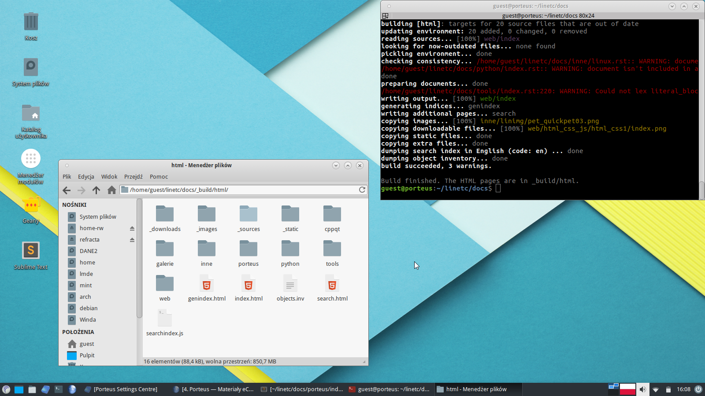
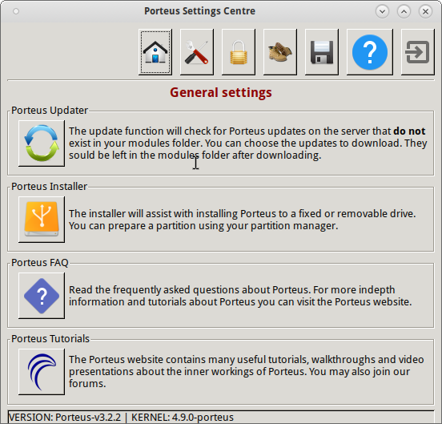
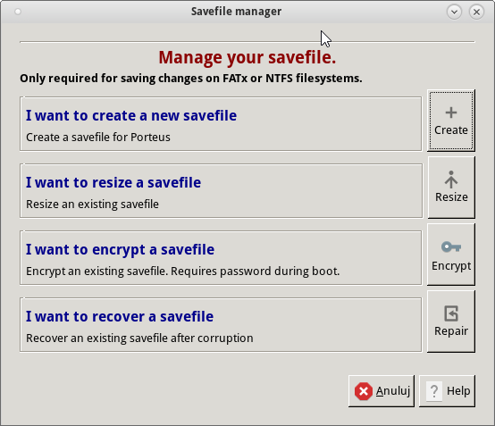
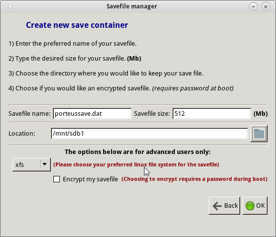
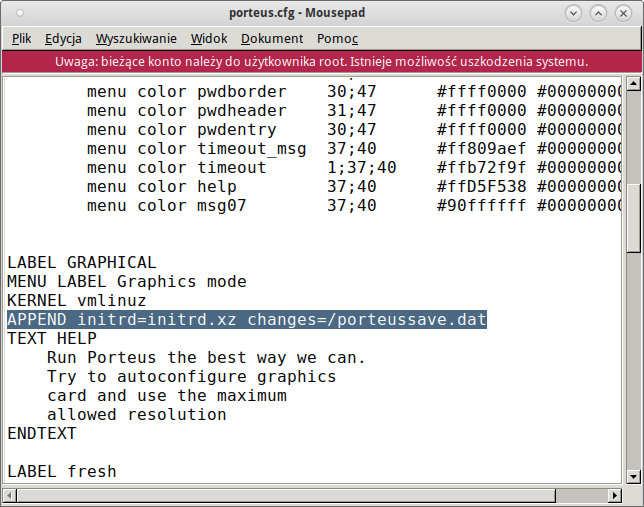

.. _porteus:

Porteus
###################

Porteus jest odmianą Linuksa typu *live* zoptymalizowaną do uruchamiania z nośników wymiennych,
np. kluczy USB. System błyskawicznie się uruchamia i pozwala na zachowanie wprowadzanych zmian,
tj. konfiguracji, oprogramowania czy dokumentów użytkownika. Oparty jest na najstarszej
dystrybucji Linuksa o nazwie `Slackware <https://pl.wikipedia.org/wiki/Slackware>`_.

   Porteus 3.2.2 XFCE 64-bit

.. contents:: Spis treści
    :backlinks: none

Pobieranie i nagrywanie
=======================

1. Pobieramy obraz iso 64-bitowej wersji ze środowiskiem graficznym `XFCE <https://pl.wikipedia.org/wiki/Xfce>`_: `Porteus-XFCE-v3.2.2-x86_64.iso <http://dl.porteus.org/x86_64/Porteus-v3.2.2/Porteus-XFCE-v3.2.2-x86_64.iso>`_.

2. Przygotowujemy pustego pendrajwa o pojemności min. 2GB. Im szybszy, tym lepszy!

**W systemie Linux**:

3. Montujemy pobrany obraz z uprawnieniami administratora (roota) do katalogu :file:`/mnt/loop`:

.. code-block:: bash

    ~$ sudo mkdir /mnt/loop
    ~S sudo mount -o loop /path/to/Porteus-XFCE-v3.2.2-x86_64.iso /mnt/loop

4. Wkładamy klucz USB, który powinien zostać wykryty jako partycja :file:`/dev/sdb1` lub :file:`/dev/sdc1` i zamontowany w katalogu :file:`/media/nazwa_użytkownika/etykieta_klucza`. Sprawdzimy to poleceniem ``mount|grep "sdb"`` lub otwierając menedżer plików.

5. Kopiujemy zawartość zamontowanego obrazu na pendrajwa:

.. code-block:: bash

    ~$ cp -r /mnt/loop/* /media/nazwa_użytkownika/etykieta_klucza

– lub za pomocą menedżera plików.

6. Wchodzimy do katalogu :file:`boot` na pendrajwie(!) i wydajemy polecenie z uprawnieniami roota:

.. code-block:: bash

    /media/nazwa_użytkownika/etykieta_klucza$ sudo bash Porteus-installer-for-Linux.com

– upewniamy się, że wyświetlona została partycja klucza USB (np. :file:`/dev/sdb1`), wpisujemy *ok* i potwierdzamy.

.. figure:: img/porteus_usb_install_linux.jpg

**W systemie Windows**:

3. Do nagrania Porteusa na pendrajwa możemy wykorzystać program `Rufus <https://rufus.akeo.ie/?locale=pl_PL>`_.

4. Jeżeli Rufus nie zadziała, rozpakowujemy zawartość obrazu na pendrajwa, np. za pomocą menedżera archiwów `7zip <http://www.7-zip.org/>`_.

5. Wchodzimy do katalogu :file:`boot` na pendrajwie(!) i uruchamiamy plik ``Porteus-installer-for-Windows``, upewniamy się, że wyświetlona została litera wskazująca na pendrajwa i potwierdzamy.

.. figure:: img/porteus_usb_install_windows.jpg

Budowa
======

Porteus ma budowę modularną, składa się ze skompresowanych paczek w formacie *xzm*, zawierających system plików `SquashFS <https://pl.wikipedia.org/wiki/SquashFS>`_. Na kluczu USB (płycie CD) znajduje się katalog :file:`porteus` zawierający wszystkie moduły w podkatalogach:

* :file:`base` – moduły systemu bazowego,
* :file:`modules` – tu umieszczamy moduły ładowane automatycznie podczas startu,
* :file:`optional` – oprogramowanie dodatkowe, ładowane na żądanie.

Dodatkowe moduły
----------------

Przygotowaliśmy dodatkowe moduły, które przekształcają Porteusa w gotowe do pracy środowisko
programistyczne (Python, C++, biblioteki Qt5). Pobierz `moduły tu <https://drive.google.com/open?id=0B1zG9cfNyT7WX0lNNFMwdEo2ems>`_ (z katalogu :file:`3.2.2`).

Lista pakietów, które proponujemy umieścić w katalogu :file:`modules`:

1. :file:`01-glibc-i18n-x86_64-1jay.xzm` – podstawa spolszczenia, obowiązkowy;
2. :file:`02-pl-locales.xzm` – spolszczenie;
3. :file:`03-fonts-ms-ubu.xzm` – zestaw dodatkowych czcionek, zalecane;
4. :file:`04-devel.xzm` – podstawowe narzędzia deweloperskie (kompilatory), zalecane;
5. :file:`05-python2.7.11_stuff.xzm` – Python 2.7.11, IPython, QtConsole, Terminator, Matplotlib, PyGame;
6. :file:`08-pyqt5.6.xzm` – biblioteki Qt (+QtDesigner) i PyQt w wersji 5.6;
7. :file:`10-geany-1.28-x86_64-1gv.xzm` – Geany, programistyczne IDE;
8. :file:`11-palemoon-27.0.3-x86_64-1.xzm` – przeglądarka Palemoon 27.x
9. :file:`12-git-2.9.0-x86_64-1.xzm` – narzędzia do obsługi systemu kontroli wersji `Git <https://pl.wikipedia.org/wiki/Git_(oprogramowanie)>`_;
10. :file:`15-keepassx-2.0.3-x86_64-1alien.xzm` – menedżer haseł;
11. :file:`50-infinality-fonts.xzm` – poprawione wyświetlanie czcionek, zalecane;
12. :file:`99-home-guest.xzm` – pakiet prekonfigurujący środowisko XFCE, zalecany.

Paczki do katalogu :file:`optional`:

* :file:`libreoffice-5.2.3.3-x86_64.xzm` – spolszczony pakiet biurowy LibreOffice;
* :file:`sublime_text_3.xzm` – zaawansowany edytor programistyczny SublimeText 3;
* :file:`sqlitestudio3.1.1.xzm` – menedżer baz danych SQLite.

.. tip::

    Aby aktywować paczki z katalogu :file:`optional`, należy kliknąć wybrany pakiet
    prawym klawiszem w menedżerze plików i wybrać polecenie `Activate`. Pakiet można
    też usunąć z systemu, wybierając z menu podręcznego polecenie `Deactivate`.

    Można również użyć narzędzia *Menedżer modułów*.

.. figure:: img/menedzer_modulow.png

Pierwsze uruchomienie
=====================

Po pierwszym uruchomieniu, należy stworzyć specjalny plik, w którym zapisywane będą zmiany w systemie.

1. Wybieramy *Start/System/Porteus Setings Centre*, podajemy hasło roota (tj. "toor") i klikamy ikonę dyskietki.

.. figure:: img/psc02.png

2. Klikamy ikonę *Porteus Save Changes* i wybieramy opcję "I want to create a new save file" przyciskiem *Create*.

3. W polu "Location" kilkamy ikonę folderu i wskazujemy napęd USB. W komputerach z jednym dyskiem twardym będzie to nazwa "sdb1". Jeżeli mamy wątpliwości, możemy uruchomić *Start/System/Porteus system info*, kliknąć *Porteus/Boot_info* i sprawdzić wpis "# Booting device".

.. figure:: img/psi.png

4. W polu "Savefile name" wpisujemy nazwę pliku, np. "porteussave.dat", rozmiar zostawiamy domyślny lub podajemy większy, np. 768 lub 1024 MB. Na koniec klikamy "OK".

5. Po zapisaniu pliku powracamy do okna "Porteus Settings Centre", w którym wybieramy *Edit porteus.cfg*. Plik ten znajduje się w katalogu :file:`/boot/syslinux` na pendrajwie i definiuje opcje startowe systemu. Odszukujemy pierwszy wpis "changes=/porteus" i zmieniamy na ``changes=/porteussave.dat`` zgodnie z podaną wcześniej nazwą pliku zapisu.

Po ponownym uruchomieniu systemu wszystkie zmiany będą zapisywane.

Wskazówki
=========

 Jeżeli tworzymy lub ściągamy i zapisujemy wiele plików, warto sprawdzać ilość dostępnego miejsca w pliku zapisu:

.. code-block:: bash

    ~$ du -sh /mnt/live/memory/changes (poda ilość zajętego miejsca)
    ~$ df -h /mnt/live/memory/changes (poda ilość wolnego miejsca)

W przypadku wyczerpywania się wolnego miejsca w pliku zapisu możemy zwiększyć jego rozmiar wybierając:

* start systemu w trybie "Always Fresh mode";
* następnie *Start/System/Porteus save file manager* i "I want to resize a save file":

.. figure:: img/resf.png

.. warning::

    Uwaga: tworzony jest nowy plik zapisu w podanej lokalizacji zawierający dotychczasowe zmiany.
    Nowym plikiem trzeba nadpisać dotychczasowy!

Metryka
-------

:Autor: Robert Bednarz (ecg@ecg.vot.pl)

:Utworzony: |date| o |time|

.. |date| date::
.. |time| date:: %H:%M

.. raw:: html

    
