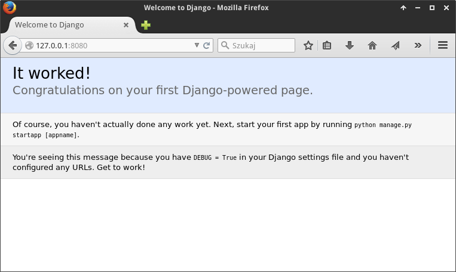
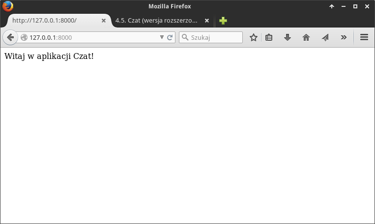
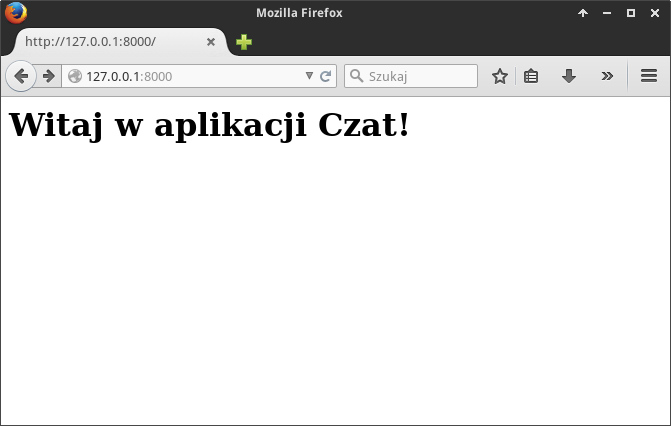
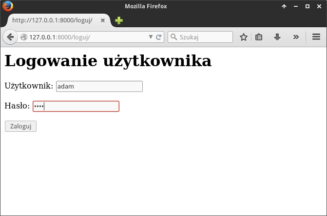
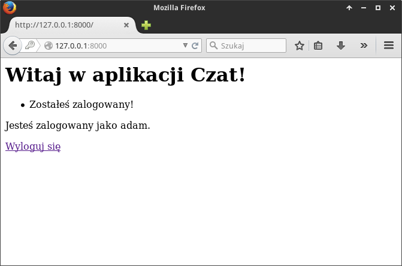
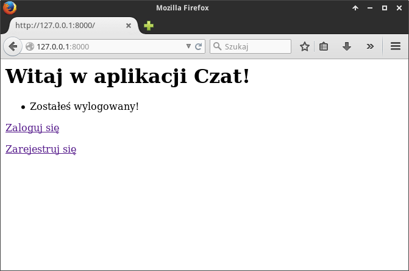
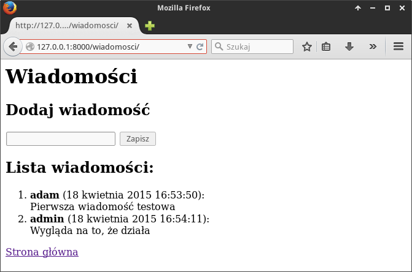

Czat (wersja rozszerzona)
#########################

.. highlight:: python

Zastosowanie Pythona i frameworka Django do stworzenia aplikacji internetowej
Czat; prostego czata, w którym zarejestrowani użytkownicy będą mogli wymieniać się
krótkimi wiadomościami.

.. attention::

    **Wymagane oprogramowanie**:

      * Python v. 2.7.x
      * Django v. 1.8.x
      * Interpreter bazy SQLite3

.. contents::
    :depth: 1
    :local:

Projekt i aplikacja
**********************

Tworzymy nowy projekt Django oraz szkielet naszej aplikacji. W katalogu domowym wydajemy polecenia w terminalu:

.. raw:: html

    
Terminal nr 

.. code-block:: bash

    ~$ django-admin.py startproject czatpro
    ~$ cd czatpro
    ~/czatpro$ python manage.py migrate
    ~/czatpro$ django-admin.py startapp czat

Powstanie katalog projektu :file:`czatpro` z **podkatalogiem ustawień** o takiej samej nazwie :file:`czatpro`.
Utworzona zostanie również inicjalna baza danych z tabelami wykorzystywanymi przez Django.

Dostosowujemy ustawienia projektu: rejestrujemy naszą aplikację w projekcie, ustawiamy polską wersję językową oraz lokalizujemy
datę i czas. Edytujemy plik :file:`czatpro/settings.py`:

.. raw:: html

    
Kod nr 

.. code-block:: python

    # czatpro/czatpro/settings.py

    INSTALLED_APPS = (
        'django.contrib.admin',
        'django.contrib.auth',
        'django.contrib.contenttypes',
        'django.contrib.sessions',
        'django.contrib.messages',
        'django.contrib.staticfiles',

        'czat',  # rejestrujemy aplikację
    )

    LANGUAGE_CODE = 'pl'  # ustawienie języka

    TIME_ZONE = 'Europe/Warsaw'  # ustawienie strefy czasowej

.. note::

    Jeżeli w jakimkolwiek pliku, np. ``settings.py`` chcemy używać polskich znaków,
    musimy na początku wstawić deklarację kodowania: ``# -*- coding: utf-8 -*-``

Teraz uruchomimy :term:`serwer deweloperski`, wydając polecenie:

.. raw:: html

    
Terminal nr 

.. code-block:: bash

    ~/czatpro$ python manage.py runserver

Po wpisaniu w przeglądarce adresu *127.0.0.1:8000* zobaczymy stronę powitalną.

.. note::

    * Domyślnie serwer nasłuchuje na porcie ``8000``, można to zmienić, podając port w poleceniu:
      ``python manage.py runserver 127.0.0.1:8080``.

    * Lokalny serwer deweloperski zatrzymujemy za pomocą skrótu :kbd:`Ctrl+C`.

Budowanie aplikacji w Django nawiązuje do wzorca projektowego :term:`MVC`, czyli
Model-Widok-Kontroler. Więcej informacji na ten temat umieściliśmy w osobnym
materiale :ref:`MVC <mvc_wzorzec>`.

Model danych
**********************

Budując aplikację, zaczynamy od zdefiniowania modelu (zob. :term:`model`), czyli klasy opisującej tabelę zawierającą
wiadomości. Atrybuty klasy odpowiadają polom tabeli. Instancje tej klasy będą reprezentować wiadomości
utworzone przez użytkowników, czyli rekordy tabeli. Każda wiadomość będzie zwierała treść,
datę dodania oraz wskazanie autora (użytkownika).

W pliku :file:`~/czatpro/czat/models.py` wpisujemy:

.. raw:: html

    
Kod nr 

.. highlight:: python
.. literalinclude:: models_z1.py
    :linenos:

Opisując klasę ``Wiadomosc`` podajemy nazwy poszczególnych właściwości (pól) oraz typy przechowywanych w nich danych.
Po zdefiniowaniu przynajmniej jednego modelu możemy zaktualizować bazę danych,
czyli zmienić/dodać potrzebne tabele:

.. raw:: html

    
Terminal nr 

.. code-block:: bash

    ~/czatpro$ python manage.py makemigrations czat
    ~/czatpro$ python manage.py migrate

.. figure:: img/czat02.png

.. note::

    Domyślnie Django korzysta z bazy SQLite zapisanej w pliku :file:`db.sqlite3`.
    Warto zobaczyć, jak wygląda. W terminalu wydajemy polecenie ``python manage.py dbshell``,
    które otworzy bazę w interpreterze ``sqlite3``. Następnie:
    * ``.tables`` - pokaże listę tabel;
    * ``.schema czat_wiadomosc`` - pokaże instrukcje SQL-a użyte do utworzenia podanej tabeli
    * ``.quit`` - wyjście z interpretera.

.. figure:: img/czat03.png

Panel administracyjny
**********************

Utworzymy panel administratora dla projektu, dzięki czemu będziemy mogli zacząć
dodawać użytkowników i wprowadzać dane. Otwieramy więc plik :file:`~/czat/czat/admin.py`
i rejestrujemy w nim nasz model jako element panelu:

.. raw:: html

    
Kod nr 

.. highlight:: python
.. literalinclude:: admin.py
    :linenos:
    :emphasize-lines: 5, 8

.. note::

    Warto zapamiętać, że każdy model, funkcję, formularz czy widok, których chcemy użyć,
    musimy najpierw zaimportować za pomocą klauzuli typu ``from <skąd> import <co>``.

Do celów administracyjnych potrzebne nam będzie odpowiednie konto. Tworzymy
je, wydając w terminalu poniższe polecenie. Django zapyta o nazwę, email i hasło administratora.
Podajemy: "admin", "", "admin".

.. raw:: html

    
Terminal nr 

.. code-block:: bash

    ~/czatpro$ python manage.py createsuperuser

Po ewentualnym ponownym uruchomieniu serwera wchodzimy na adres *127.0.0.1:8000/admin/*.
Logujemy się podając dane wprowadzone podczas tworzenia bazy.
Otrzymamy dostęp do panelu administracyjnego, w którym możemy dodawać nowych użytkowników i wiadomości [#]_.

.. [#] Bezpieczna aplikacja powinna dysponować osobnym mechanizmem rejestracji
   użytkowników i dodawania wiadomości, tak by nie trzeba było udostępniać
   panelu administracyjnego osobom postronnym.

.. figure:: img/czat04.png

Ćwiczenie 1
============

Po zalogowaniu na konto administratora dodaj użytkownika "adam".
Na stronie szczegółów, która wyświetli się po jego utworzeniu, zaznacz
opcję "W zespole", następnie w panelu "Dostępne uprawnienia" zaznacz opcje
dodawania (*add*), zmieniania (*change*) oraz usuwania (*del*) wiadomości
(wpisy typu: "czat | wiadomosc | Can add wiadomosc") i przypisz je
użytkownikowi naciskając strzałkę w prawo.

.. figure:: img/czat06.png

Przeloguj się na konto "adam" i dodaj dwie przykładowe wiadomości.
Następnie utwórz w opisany wyżej sposób kolejnego użytkownika o nazwie "ewa"
i po przelogowaniu się dodaj co najmniej 1 wiadomość.

.. figure:: img/czat05.png

.. raw:: html

    

Model w panelu
==============

W formularzu dodawania wiadomości widać, że etykiety nie są spolszczone, z kolei
dodane wiadomości wyświetlają się na liście jako "Wiadomosc object".
Aby poprawić te niedoskonałości, uzupełniamy plik :file:`models.py`:

.. raw:: html

    
Kod nr 

.. highlight:: python
.. literalinclude:: models.py
    :linenos:
    :emphasize-lines: 2-3
    :lineno-start: 10
    :lines: 10-21

W definicji każdego pola jako pierwszy argument dopisujemy spolszczoną etykietę,
np. ``u'data publikacji'``. W podklasie ``Meta`` podajemy nazwy modelu w liczbie
pojedynczej i mnogiej. Dodajemy też funkcję ``__unicode__``, której zadaniem
jest "autoprezentacja" klasy, czyli wyświetlenie treści wiadomości.
Po odświeżeniu panelu administracyjnego (np. klawiszem :kbd:`F5`) nazwy zostaną spolszczone.

.. note::

    Prefiks ``u`` wymagany w Pythonie v.2 przed łańcuchami znaków oznacza
    kodowanie w unikodzie (ang. *unicode*) umożliwiające wyświetlanie m.in. znaków narodowych.

.. tip::

    W Pythonie v.3 zamiast nazwy funkcji ``_unicode__`` należy użyć ``str``.

.. figure:: img/czat09.png

Widoki i szablony
*******************

Panel administracyjny już mamy, ale po wejściu na stronę główną zwykły użytkownik
niczego poza standardowym powitaniem Django nie widzi. Zajmiemy się teraz
stronami po stronie (:-)) użytkownika.

Aby utworzyć stronę główną, zakodujemy pierwszy :term:`widok` (zob. :ref:`więcej »»» <mvc_widok>`),
czyli funkcję o przykładowej nazwie ``index()``, którą powiążemy z adresem URL głównej strony (/).
Najprostszy widok zwraca jakiś tekst: ``return HttpResponse("Witaj w aplikacji Czat!")``.
W pliku :file:`views.py` umieszczamy:

.. raw:: html

    
Kod nr 

.. highlight:: python
.. literalinclude:: views_z1.py
    :linenos:
    :emphasize-lines: 9

Teraz musimy **powiązać widok z adresem url**. Na początku do pliku projektu :file:`czatpro/urls.py`
dopiszemy import ustawień z naszej aplikacji:

.. raw:: html

    
Kod nr 

.. highlight:: python
.. literalinclude:: urls_p1.py
    :linenos:
    :emphasize-lines: 2-3
    :lineno-start: 19
    :lines: 19-

Parametr ``namespace='czat'`` definiuje przestrzeń nazw, w której dostępne będą zdefiniowane
dla naszej aplikacji mapowania między adresami url a widokami.

Następnie **tworzymy (!)** plik :file:`czat/urls.py` o następującej treści:

.. raw:: html

    
Kod nr 

.. highlight:: python
.. literalinclude:: urls_z1.py
    :linenos:
    :emphasize-lines: 5, 8

Podstawową funkcją wiążącą adres z widokiem jest ``url()``. Jako pierwszy parametr przyjmuje wyrażenie
regularne oznaczane ``r`` przed łańcuchem dopasowania. Symbol ``^`` to początek,
``$`` – koniec łańcucha. Zapis ``r'^$'`` to adres główny serwera.
Drugi parametr wskazuje widok (funkcję), która ma obsłużyć dany adres.
Trzeci parametr ``name`` pozwala zapamiętać skojarzenie url-a i widoku pod nazwą,
której będzie można użyć np. do wygenerowania adresu linku.

Przetestujmy nasz widok wywołując adres ``127.0.0.1:8000``. Powinniśmy zobaczyć tekst
podany jako argument funkcji ``HttpResponse()``:

.. raw:: html

    

Prosty szablon
==================

Zazwyczaj odpowiedzią na żądanie typu GET z adresu URL będzie strona w HTML-u.
Szablony takich stron umieszczamy w podkatalogu aplikacji, który tworzymy
za pomocą menedżera plików lub poleceniem:

.. raw:: html

    
Terminal. Kod nr 

.. code-block:: bash

    ~/czat/czat$ mkdir -p templates/czat

Następnie w nowym, pustym pliku umieszczamy kod:

.. raw:: html

    
Plik <i>index.html</i>. Kod nr 

.. highlight:: html
.. literalinclude:: index_z2.html
    :linenos:

Plik zapisujemy pod nazwą :file:`~/czat/czat/templates/czat/index.html`.

Na koniec w pliku :file:`views.py` zmieniamy instrukcje odpowiedzi:

.. raw:: html

    
Kod nr 

.. highlight:: python
.. literalinclude:: views_z2.py
    :linenos:
    :emphasize-lines: 5, 10-11

Po zaimportowaniu funkcji ``render()`` używamy jej do zwrócenia szablonu.
Jako pierwszy argument podajemy obiekt ``request`` zawierający wszystkie dane żądania,
a jako drugi nazwę szablonu uwzględniającą katalog nadrzędny.

Sprawdź działanie aplikacji pod adresem *127.0.0.1:8000/*:

Rejestrowanie użytkowników
***************************

Zamiast zakładać konta użytkownikom w panelu administracyjnym lepiej umozliwić
samodzielne rejestrowanie. Utworzymy formularz i obsłużymy go w skojarzonym widoku (funkcji)
``rejestruj()``, który:

* zwróci formularz przygotowany w szablonie :file:`rejestruj.html` w odpowiedzi
  na żądanie typu :term:`GET`, wysłane spod adresu URL *http://127.0.0.1:8000/rejestruj*;

* sprawdzi poprawność przesłanych danych (nazwę użytkownika i hasło), utworzy konto
  zaloguje użytkownika i przekieruje go na stronę główną
  w odpowiedzi na żądanie typu :term:`POST`;

Na początku pliku :file:`views.py` importujemy wymagane metody, później uzupełniamy
widok ``index()`` i dodajemy widok ``rejestruj()``:

.. raw:: html

    
Kod nr 

.. highlight:: python
.. literalinclude:: views_z3.py
    :linenos:
    :lineno-start: 1
    :lines: 1-
    :emphasize-lines: 6-9, 19-36

W odpowiedzi na żądanie GET funkcja zaimportuje wbudowany formularz tworzenia użytkowników,
utworzy i zapisze jego instancję w słowniku ``kontekst``, na końcu zwróci wyrenderowany szablon
:file:`rejestruj.html`, do którego przekazany zostanie wspomniany słownik.

Szablon tworzymy w pliku :file:`~/czat/czat/templates/czat/rejestruj.html`:

.. raw:: html

    
<i>rejestruj.html</i>. Kod nr 

.. highlight:: html
.. literalinclude:: rejestruj_z3.html
    :linenos:

W tagu ``{{ form.as_p }}`` odczytujemy przekazany formularz i wyświetlamy
jego pola w znacznikach akapitów (``

``).

Aby przetestować działanie aplikacji, trzeba powiązać widok ``rejestruj()``
z adresem URL ``/rejestruj``, co robimy w pliku :file:`urls.py`:

Warto także zauważyć, jak tworzymy komunikaty zwrotne dla użytkownika.
Wykorzystujemy wbudowany w Django system komunikatów: ``messages.success(request, "Zostałeś zarejestrowany.")``.
Tak utworzone komunikaty możemy odczytać w każdym szablonie ze zmiennej
``messages`` (zob. niżej szablon :file:`index.html`).

Tworzymy nowy szablon

Wiążemy adres URL *rejestruj/* z utworzonym widokiem. Do pliku
dopisujemy:

.. raw:: html

    
Kod nr 

.. highlight:: python
.. literalinclude:: urls_z3.py
    :linenos:
    :emphasize-lines: 3
    :lineno-start: 10
    :lines: 10-

Gdybyśmy już teraz odwiedzili adres ``127.0.0.1:8000/rejestruj``, powinniśmy
zobaczyć poniższy formularz:

.. figure:: img/czat12rej.png

Modyfikujemy również szablon strony głównej:

.. raw:: html

    
Plik index.html nr 

.. highlight:: html
.. literalinclude:: index_z3.html
    :linenos:

W szablonach dostępne są podstawowe instrukcje sterujące, takie jak np.
```` czy ````. Tę pierwszą wykorzystamy do wyświetlenia
komunikatów użytkownikowi, drugą m. in. do sprawdzenia, czy stronę odwiedza
użytkownik uwierzytelniony. Dane przekazane do szablonu możemy wyświetlać
stosując odpowiednią notację, np.: ``{{ user.username }}``.
Dodatkowo wyświetlane dane można obrabiać za pomocą filtrów,
np. ``{{ komunikat|capfirst }}`` – w tym wypadku wszystkie komunikaty
zostaną wyświetlone z wielkiej litery.

W pliku :file:`index.html` umieszczamy również link do strony rejestracji,
który wyświetlany będzie tylko użytkownikom niezalogowanym. Aby wygenerować adres
strony w atrybucie ``href`` używamy funkcji ``url``, za którą podajemy
w cudzysłowach nazwę nadaną adresowi w pliku ``urls.py``, np.:
````.

Ćwiczenie 2
===============

Po ewentualnym ponownym uruchomieniu serwera, zarejestruj nowego użytkownika
o nazwie "ewa". Powinieneś zobaczyć poniższą stronę:

.. figure:: img/czat13rej.png

W przeglądarce wpisz adres *127.0.0.1:8000/rejestruj*, aby przejść do strony
rejestracji. Na stronie wyświetla się formularz, mimo że jesteś już zarejestrowany
i zalogowany.

Spróbuj zmienić szablon ``rejestruj.html``, tak aby zalogowanym
użytkownikom wyświetlał się tekst "Jesteś już zarejestrowany" oraz
link do strony głównej, a niezalogowanym formularz rejestracji.

.. tip::

    Wykorzystaj tag ```` i obiekt ``user``, tak jak zrobiliśmy to
    w widoku ``index()`` i dopisz odpowiedni kod w widoku ``rejestruj()``.

Przykładowy efekt poprawnego wykonania ćwiczenia:

.. figure:: img/czat14rej.png

Logowanie i wylogowywanie
**************************

Skoro użytkownicy mogą się rejestrować, trzeba umożliwić im również logowanie
i wylogowywanie z serwisu. Również to zadanie można zrobić dwojako.
Pierwszy sposób to tak jak w przypadku rejestracji stworzenie widoków
w pliku :file:`views.py` i powiązanie ich z adresami w pliku :file:`urls.py`.

Na początku jak zawsze importujemy wymagane funkcje, później dopisujemy
widok ``loguj()`` i ``wyloguj()`` w pliku :file:`views.py`:

.. raw:: html

    
Kod nr 

.. highlight:: python
.. literalinclude:: views_z4.py
    :linenos:
    :lineno-start: 37
    :lines: 37-

Podobnie jak w przypadku rejestrowania użytkowników, korzystamy z wbudowanego w Django
formularza logowania ``AuthenticationForm``. Dzięki temu nie musimy
"ręcznie" sprawdzać poprawności podanych danych, robi to metoda ``is_valid()``
formularza. Jeżeli nie zwróci ona błędu, możemy zalogować użytkownika za
pomocą funkcji ``login()``, której przekazujemy obiekty ``HttpRequest``
(przesłane żądanie) i ``User`` – obiekt użytkownika zwrócony przez metodę
``get_user()`` formularza.

Wylogowanie polega na użyciu funkcji ``logout(request)`` – wyloguje ona
użytkownika, którego dane zapisane są w przesłanym żądaniu.

Jak widać, do logowania potrzebujemy szablonu. Najprościej utworzyć go
na podstawie szablonu :file:`rejestruj.html`. Otwórzmy go i zapiszmy do
pliku :file:`~/czat/czat/templates/czat/loguj.html`. Później wystarczy
dostosować wywietlany tekst. Szablon z uwzględnieniem zmian wprowadzonych
w ćwiczeniu 2. może wyglądać tak:

.. raw:: html

    
Plik loguj.html nr 

.. highlight:: html
.. literalinclude:: loguj_z4.html
    :linenos:

Pozostaje skojarzenie odpowiednich adresów URL z utworzonymi widokami.
W pliku :file:`urls.py` dopisujemy reguły:

.. raw:: html

    
Kod nr 

.. highlight:: python
.. literalinclude:: urls_z4.py
    :linenos:
    :emphasize-lines: 4-5
    :lineno-start: 10
    :lines: 10-

Możesz przetestować działanie dodanych funkcji wywołując w przeglądarce adresy:
``127.0.0.1:8000/loguj`` i ``127.0.0.1:8000/wyloguj``. Przykładowy formularz
wygląda tak:

.. note::

    **Podsumujmy**: działanie wszystkich omówionych do tej pory widoków jest podobne.
    Po przejściu pod adres określony w pliku :file:`urls.py`, np. *127.0.0.1:8000/loguj/*,
    wywoływany jest powiązany z nim widok zdefiniowany w pliku :file:`views.py`,
    np. ``loguj()``. Tego typu operacja generuje żądanie typu :term:`GET`,
    w odpowiedzi na które zwracany jest szablon (np. :file:`loguj.html`)
    wyświetlający przekazny do niego formularz (np. ``AuthenticationForm``).

    Po wypełnieniu formularza użytkownik wciska odpowiedni przycisk, który
    inicjuje żądanietypu :term:`POST`, a więc przesyłanie danych na serwer.
    Widoki ``rejestruj()`` i ``loguj()`` wychwytują i przetwarzają takie żądania,
    tj. rejestrują lub logują użytkownika. W odpowiedzi użytkownik
    zostaje przekierowany z odopiwednim komunikatem na stonę główną.

Ćwiczenie 3
=================

Adresów logowania i wylogowywania nikt w serwisach nie wpisuje ręcznie.
Wstaw zatem odpowiednie linki do szablonu strony głównej. Użytkownik
niezalogowany powinien zobaczyć odnośnik *Zaloguj*, użytkownik
zalogowany – *Wyloguj*. Przykładowe strony mogą wyglądać tak:

Widoki ogólne
**************************

Zajmiemy sie teraz drugim sposobem stworzenia formularza rejestracji, logowania
i wylogowania. Formularze te bowiem działają, ale nie do końca tak jak powinny.
Spróbuj zarejestrować dodanego już użytkownika, albo przesłać niepełny
formularz. Zauważysz, że nie dostajemy żadnej informacji o błędach.
Można oczywiście dopisać ich obsługę do odpowiednich widoków lub wygenerować
je w szablonach, ale... wcale nie trzeba tego robić. W przypadku prostych
aplikacji wystarczą wbudowane w Django widoki ogólne (ang. *generic views*)
i formularze.

Wszystko da się zrobić w pliku ``urls.py``, który zmieniamy następująco:

.. raw:: html

    
Kod nr 

.. highlight:: python
.. literalinclude:: urls_z5.py
    :linenos:
    :emphasize-lines: 10-19
    :lineno-start: 10
    :lines: 10-

Na początku importujemy widok przeznaczony do dodawania danych
(``CreateView``), następnie formularz tworzenia użytkownika (``UserCreationForm``)
i logowania (``AuthenticationForm``). Do generowania adresów url
potrzebna będzie również funkcja ``reverse_lazy()``.

Następnie zakomentowujemy dotychczasowe powiązania adresów i widoków.
Dodajemy natomiast nowe. Do adresu */rejestruj* przypisujemy wywołanie
metody ``as_view()`` widoku ogólnego ``CreateView``. Do obsłużenia adresów */loguj*
i */wyloguj* używamy dedykowanych widoków ``login`` i ``logout``.

Na działanie widoków wpływają przekazywane im w różny sposób ustawienia właściwości,
takie jak:

* ``template_name`` – szablon, który zostanie użyty do zwrócenia odpowiedzi;
* ``form_class`` – formularz, który zostanie przekazany do szablonu;
* ``success_url`` – adres, na który nastąpi przekierowanie w przypadku braku błędów
  (np. po udanej rejestracji);
* ``next_page`` – adres strony, na który nastąpi przekierowanie użytkownika
  po wykonaniu żądanych akcji (np. udanym wylogowaniu).

Pozostaje nam jeszcze określić stronę, na którą powinien zostać przekierowany
użytkownik po udanym zalogowaniu. W tym wypadku na końcu pliku :file:`settings.py`
definujemy wartość zmiennej ``LOGIN_REDIRECT_URL``:

.. raw:: html

    
Kod nr 

.. code-block:: python

    # czat/czat/settings.py

    from django.core.urlresolvers import reverse_lazy
    LOGIN_REDIRECT_URL = reverse_lazy('index')

To wszystko. Zauważ, że funkcje ``rejestruj()``, ``loguj()`` i ``wyloguj()``,
które umieściliśmy wczesniej w pliku :file:`views.py` nie są już potrzebne!
Przetestuj teraz działanie formularza rejestracji! Spróbuj dodać
zarejestrowanego już użytkownika, wysłać pusty lub niekompletny formularz.

Obsługa wiadomości
***********************************

Chcemy, by zalogowani użytkownicy mogli przeglądać wiadomości wszystkich użytkowników,
zmieniać, usuwać i dodawać własne. Najprostszy sposób to skorzystanie z omówionych wyżej
ogólnych widoków wbudowanych.

.. note::

    Django oferuje wbudowane widoki ogólne przeznaczone do typowych operacji:

    * DetailView i ListView – (ang. *generic display view*) widoki przeznaczone
      do prezentowania szczegółów i listy danych;
    * FormView, CreateView, UpdateView i DeleteView – (ang. *generic editing views*)
      widoki przeznaczone do wyświetlania formularzy ogólnych, w szczególności
      służących dodawaniu, uaktualnianiu, usuwaniu obiektów (danych).

Do wyświetlania listy wiadomości użyjemy klasy ``ListView``.
Do pliku :file:`urls.py` dopisujemy importy:

.. raw:: html

    
Kod nr 

.. code-block:: python

    from django.contrib.auth.decorators import login_required
    from django.views.generic.list import ListView
    from czat.models import Wiadomosc

– i wiążemy adres */wiadomosci* z wywołaniem widoku:

.. raw:: html

    
Kod nr 

.. highlight:: python
.. literalinclude:: urls_z6.py
    :linenos:
    :lineno-start: 32
    :lines: 32-38

Zakładamy, że wiadomości mogą oglądać tylko użytkownicy zalogowani. Dlatego
całe wywołanie widoku umieszczamy w funkcji ``login_required()``.
Parametr ``login_url`` określa adres, na który przekierowany zostanie
niezalogowany użytkownik.

W wywołaniu ``ListView.as_view()`` wykorzystujemy kolejne właściwości
modyfikujące działanie widoków:

* ``model`` – podajemy model, którego dane zostaną pobrane z bazy;
* ``context_object_name`` – pozwala zmienić domyślną nazwę (object_list)
  listy obiektów przekazanych do szablonu;
* ``paginate_by``– pozwala ustawić ilość ilość obiektów wyświetlanych na stronie.

Potrzebujemy jeszcze szablonu, którego Django szuka pod domyślną nazwą
*<nazwa modelu>_list.html*, czyli w naszym przypadku tworzymy plik
:file:`~/czat/czat/templates/czat/wiadomosc_list.html`:

.. raw:: html

    
Plik wiadomosc_list.html nr 

.. highlight:: html
.. literalinclude:: wiadomosc_list_z6.html
    :linenos:

W tym momencie widok wiadomości powinien już działać. Przetestuj!

Ćwiczenie 4
===================

W szablonie listy wiadomości przed znacznikiem zamykającym ``</body>``
dodaj link do strony głównej. Przykładowy efekt prezentujemy poniżej
(zrzut zawiera również elementy, które dodamy później):

.. figure:: img/czat18wiadomosci.png

**Dodawanie wiadomości** zrealizujemy wykorzystując widok ``CreateView``.
Ponieważ nasz model wiadomości zawiera klucz obcy, mianowicie pole autor,
tym razem dostosujemy klasę widoku w pliku :file:`views.py`. Dzięki temu
będziemy mogli rozszerzyć standardową funkcjonalność widoku.

.. raw:: html

    
Kod nr 

.. highlight:: python
.. literalinclude:: views_z7.py
    :linenos:
    :lineno-start: 58
    :lines: 58-

Dostosowując widok ogólny tworzymy opartą na nim klasę ``UtworzWiadomosc``.
Z nieomówionych dotąd ustawień widoku widzimy właściwość ``fields`` –
pozwala ona określić w postaci listy pola, które mają znaleźć się na formularzu.
Jak widać, pomijamy pole ``autor``.

Właśnie dlatego musimy nadpisać metodę ``form_valid()``, która sprawdza
poprawność przesłanych danych i zapisuje je w bazie. Żądanie POST otrzymane od
użytkownika nie będzie zawierało danych autora. Musimy je uzupełnić.
Polecenie ``wiadomosc = form.save(commit=False)`` tworzy obiekt wiadomości,
ale go nie zapisuje. Dzięki temu w następnych instrukcjach możemy
uzupełnić dane autora, po czym jeszcze raz zapisujemy wiadomość, tym razem w bazie.

Metoda ``get_initail()`` pozwala ustawić domyślne wartości dla wybranych
pól. Wykorzystujemy ją do zainicjowania pola ``data_pub`` aktualna datą.

Metoda ``get_context_data()`` z punktu widzenia dodawania wiadomości
nie jest potrzebna, ale używamy jej po to, aby na jednej stronie
obok formularza dodawania wiadomości wyświetlić ich listę. Inicjujemy
ją poleceniem ``Wiadomosc.objects.filter(autor=self.request.user)``
wybierającym wiadomości utworzone przez zalogowanego użytkownika.

Ćwiczenie 5
==============

Podobnie jak wyżej potrzebujemy szablonu, który dla widoków dodawania domyślnie
nazywają się *<nazwa modelu>_form*. Na podstawie szablonu ``wiadomosc_list.html``
utwórz szablon  ``wiadomosc_form.html``>. Przed listą wiadomości umieść
kod wyświetlający formularz:

.. raw:: html

    
Plik wiadomosc_form.html nr 

.. highlight:: html
.. literalinclude:: wiadomosc_form_z7.html
    :linenos:
    :lineno-start: 14
    :lines: 14-19

Dodamy teraz dwa widoki przeznaczone do aktualizaowania i usuwania wpisów.
Zakładamy, że adresy do tych operacji będą miały postać: */aktualizuj/id_wiadomości*
oraz */usun/id_wiadomości*, gdzie *id_wiadomosci* jest identyfikatorem
obiektu do zaktualizowania/usunięcia. Tym razem zaczniemy od zmian w pliku :file:`urls.py`:

.. raw:: html

    
Kod nr 

.. highlight:: python
.. literalinclude:: urls_z8.py
    :linenos:
    :lineno-start: 42
    :lines: 42-50

Nowością w powyższym kodzie są wyrażenia regularne definiujące adresy z dodatkowym
parametrem, np. ``r'^aktualizuj/(?P<pk>\d+)/'``. Część ``/(?P<pk>\d+)`` oznacza,
że oczekujemy liczby dziesiętnej, która zostanie zapisana do zmiennej o nazwie
``pk`` – nazwa jest tu skrótem od ang. wyrażenia *primary key*, co znaczy
"klucz główny". Zmienna ta oznaczać będzie identyfikator wiadomości i dostępna
będzie w widokach.

**Usuwanie danych** realizujemy za pomocą widoku ``DeleteView``, który należy
zaimportować w pliku :file:`urls.py`: ``from django.views.generic.edit import DeleteView``.
Domyślny szablon dla tego widoku przyjmuje nazwę *<nazwa-modelu>_confirm_delete.html*,
dlatego uproścliśmy jego nazwę we właściwości ``template_name``.

Ćwiczenie 6
==============

Utwórz szablon :file:`wiadomosc_usun.html` wzorując sie na wcześniejszych
szablonach. Zamiast instrukcji wyświetlającej formularz umieść kod:

.. raw:: html

    
Plik wiadomosc_usun.html nr 

.. highlight:: html
.. literalinclude:: wiadomosc_usun_z8.html
    :linenos:
    :lineno-start: 17
    :lines: 17

.. figure:: img/czat20wiadomosci.png

Nieco więcej pracy wymaga **dostosowanie widoku aktualizacji**. W pliku
:file:`views.py` utworzymy klasę ``AktualizujWiadomosc`` opartą na
widoku ogólnym ``UpdateView``:

.. raw:: html

    
Kod nr 

.. highlight:: python
.. literalinclude:: views_z8.py
    :linenos:
    :lineno-start: 85
    :lines: 85-102

Formularz generowany przez Django dla danego widoku można dostosować.
Odpowiada za to właściwość ``form_class``, której przypisujemy utworzoną
w nowym pliku :file:`forms.py` klasę modyfikującą domyślne ustawienia:

.. raw:: html

    
Kod nr 

.. highlight:: python
.. literalinclude:: forms_z8.py
    :linenos:

Klasa ``AktualizujWiadomoscForm`` oparta jest na wbudowanej klasie ``ModelForm``.
Właściwości podklasy ``Meta`` pozwalają określić cechy formularza
wyświetlanego przez widok, który go wykorzystuje:

* ``model`` – oznacza to samo co w widokach, czyli model, dla którego tworzony jest formularz;
* ``fields`` – to samo co w widokach, lista pól do wyświetlenia;
* ``exclude`` – opcjonalnie lista pól do pominięcia;
* ``widgets`` – słownik, którego klucze oznaczają pola danych, a ich wartości
  odpowiadające im w formularza HTML typy pól i ich właściwości, np. rozmiar.

Na wyjaśnienie zasługuje jeszcze metoda ``get_object()`` widoku aktualizacji.
Jej zadanie to wybranie z bazy danych i zwrócenie do formularza wiadomości,
której identyfikator został przekazany w adresie pod nazwą *pk*:
``wiadomosc = Wiadomosc.objects.get(id=self.kwargs['pk'])``.

Ćwiczenie 7
==============

Żeby przetestować aktualizowanie i usuwanie wiadomości, w szablonie
:file:`wiadomosc_list.html` wygeneruj linki *Edytuj* i *Usuń* tylko
dla wiadomości utworzonych przez zalogowanego użytkownika.

Wstaw w odpowiednie miejsce szablonu poniższy kod:

.. raw:: html

    
Plik wiadomosc_lista.html nr 

.. highlight:: html
.. literalinclude:: wiadomosc_list_z8.html
    :linenos:
    :lineno-start: 20
    :lines: 20-23

Dodaj również te same linki do listy wiadomości na stronach dodawania i aktualizowania.

.. figure:: img/czat18wiadomosci.png

Wiadomości jeszcze raz
************************

Dodawanie wiadomości można zrealizować bez wbudowanych widoków ogólnych.
Potrzebować będziemy widoku o nazwie np. ``wiadomosci()`` do wyświetlania
(żądania GET) i dodawania wiadomości (żądania POST), który zwracał będzie
szablon np. :file:`wiadomosci.html`. Widok ten powiążemy z adresem */wiadomosci*.
Do pliku :file:`views.py` dodajemy importy i kod funkcji:

.. raw:: html

    
Kod nr 

.. highlight:: python
.. literalinclude:: views_z9.py
    :linenos:
    :lineno-start: 105
    :lines: 105-

Widać powyżej, że treść przesłanej wiadomości wydobywamy ze słownika
``request.POST`` za pomocą metody ``get('tekst', '')``. Jej pierwszy argument
odpowiada nazwie pola formularza użytej w szablonie, które chcemy odczytać.
Drugi argument oznacza wartość domyślną, przydatną, jeśli
pole będzie niedostępne. Po sprawdzeniu długości wiadomości, możemy
ją utworzyć wykorzystując konstruktor naszego modelu
``Wiadomosc(tekst=tekst, data_pub=timezone.now(), autor=request.user)``.
W formie nazwanych argumentów podajemy mu wartości kolejnych pól.
Zapisanie nowej wiadomości w bazie sprowadza się do polecenia ``wiadomosc.save()``.

Na koniec przekierowujemy użytkownika do tego samego widoku,
ale tym razem jest to żądanie typu :term:`GET`.
W odpowiedzi na nie pobieramy wszystkie wiadomości z bazy (``Wiadomosc.objects.all()``),
i przekazujemy do szablonu, który zwracamy użytkownikowi.

Zadaniem szablonu zapisanego w pliku :file:`~/czat/czat/templates/wiadomosci.html`
jest wyświetlenie komunikatów zwrotnych, formularza dodawania wiadomości
i listy wiadomości dodanych.

.. raw:: html

    
Plik wiadomosci.html nr 

.. highlight:: html
.. literalinclude:: wiadomosci_z9.html
    :linenos:

Ćwiczenie 8
=====================

Powiąż widok ``wiadomosci()`` z adresem */wiadomosci* w pliku :file:`urls.py`,
nadając mu nazwę *wiadomosci*, a następnie uzupełnij szablon widoku głównego,
aby zalogowanym użytkownikom wyświetlał się link prowadzący do strony z wiadomościami.
W szablonie ``wiadomosci.html`` dodaj link do strony głównej i link wylogowania.

.. tip::

    Definicje w pliku :file:`urls.py` sprawdzane są po kolei, zwracany jest
    widok przypisany pierwszemu napotaknemu dopasowaniu adresu. Jeżeli chcemy
    przetestować działanie widoku ``wiadomosci()`` dla wykorzystanego już
    adresu */wiadomosci* przypisanego wbudowanemu widokowi ListView, powiązanie
    należy umieścić przed nim, np. na początku.

Zaloguj się i przetestuj wyświetlanie [#]_ i dodawanie wiadomości pod adresem
*127.0.0.1:8000/wiadomosci/*. Sprawdź, co się stanie po wysłaniu pustej
wiadomości.

.. [#] Jeżeli nie dodałeś do tej pory żadnej wiadomości, lista na początku
   będzie pusta.

Poniższe zrzuty prezentują efekty naszej pracy:

.. figure:: img/czat21wiadomosci.png

Szablony
*****************

Zapewne zauważyłeś, że większość kodu w szablonach, a zatem i w stronach
HTML, które z nich powstają, się powtarza, albo jest bardzo podobna.
Biorąc pod uwagę schematyczną budowę stron WWW jest to nieuniknione.
Django dysponuje wbudowanym silnikiem szablonów, który ułatwia ich tworzenie.

Szablony, jak można było zauważyć, składają się ze zmiennych i tagów.
Zmienne, które ujmowane są w podwójne nawiasy sześciokątne ``{{ zmienna }}``,
zastępowane są konkretnymi wartościami. Tagi z kolei, oznaczane notacją
```` tworzą mini-język szablonów i pozwalają kontrolować logikę budowania treści.
Najważniejsze tagi, ````, ````, ````
– już stosowaliśmy.

Spróbujmy uprościć i ujednolicić nasze szablony. Zacznijmy od szablonu
bazowego, który umieścimy w pliku :file:`~/czat/czat/templates/czat/baza.html`:

.. raw:: html

    
Plik baza.html nr 

.. highlight:: html
.. literalinclude:: baza_z10.html
    :linenos:

Jest to zwykły tekstowy dokument, zawierający schemat strony utworzony z
wymaganych znaczników HTML oraz bloki zdefiniowane za pomocą tagów mini-języka
szablonów. W pliku tym umieszczamy stałą i wspólną strukturę stron w serwisie
(np. nagłówek, menu, sekcja treści, stopka itp.) oraz wydzielamy bloki,
których treść będzie można zmieniać w szablonach konkretnych stron.

Wykorzystując szablon podstawowy, zmieniamy stronę główną, czyli plik
:file:`index.html`:

.. raw:: html

    
Plik index.html nr 

.. highlight:: html
.. literalinclude:: index_z10.html
    :linenos:

Jak widać, szablon dziedziczy z szablonu bazowego. Odpowiada za to tag
````. Dalej pomijamy strukturalne znaczniki HTML
zdefiniowane w bazie, zastępujemy natomiast zawartość bloków, które
uznajemy za potrzebne na danej stronie.

Postępując na tej samej zasadzie modyfikujemy szablon rejestracji:

.. raw:: html

    
Plik rejestruj.html nr 

.. highlight:: html
.. literalinclude:: rejestruj_z10.html
    :linenos:

Ćwiczenie 9
==============

Wzorując się na podanych przykładach zmień pozostałe szablony tak, aby
opierały się na szablonnie bazowym. Wygląd stron nie powinien ulec zmianie!

Style, skrpyty, pliki
************************

Nasze szablony zyskały na zwięzłości i przejrzystości, ale nadal pozbawione
są elementarnych dla dzisiejszych stron WWW zasobów, takich jak
style CSS, skrypty JavaScript czy zwykłe obrazki. Jak je dołączyć?

Przede wszystkim potrzebujemy osobnego katalogu :file:`~czat/czat/static/czat`.
W terminalu w katalogu projektu (!) wydajemy polecenie:

.. raw:: html

    
Kod nr 

.. code-block:: bash

    ~/czat $ mkdir -p czat/static/czat

W powyższym katalogu tworzy się zazwyczaj podkatalogi dla różnych typów
zasobów, np. :file:`css`, :file:`js` czy :file:`img`. Sugerujemy, żeby
je utworzyć. Tworzymy również przykładowy plik :file:`~/czat/czat/static/czat/css/style.css`:

.. raw:: html

    
Plik style.css nr 

.. highlight:: css
.. literalinclude:: style_z11.css
    :linenos:

Do podkatalogu :file:`~/czat/czat/static/czat/img` wrzucamy obrazki z podanego
:download:`archiwum `. Wreszcie zmieniamy szablon podstawowy:

.. raw:: html

    
Plik baza.html nr 

.. highlight:: html
.. literalinclude:: baza_z11.html
    :linenos:
    :lines: 2, 7-8, 33-37

Kod z linii 1. ```` umieszczamy na samym początku
dokumentu. Konfiguruje on ścieżkę do zasobów. Kod z linii 3. wklejamy
za znacznikiem ``<title>`` w sekcji ``<head>``. Ilustruje on, jak dołączamy
style czy skrypty, mianowicie używamy tagu ````. Wreszcie
kod z linii 5-8 zawierający znacznik ``
`` z obrazkami wstawiamy
na końcu pliku przed znacznikiem zamykającym ``</body>``. Widzimy tu,
jak wstawiać obrazki. Wygląd strony głównej po zmianach:

.. figure:: img/czat22szabl.png

Ćwiczenie 10
==============

W szablonie bazowym stwórz osobny block umożliwiający zastępowanie wstawionych
obrazków. Zmień dowolny szablon inny niż strona główna tak, aby wyświetlał
inne obrazki. Pamiętaj o zapisaniu dodatkowych obrazków do odpowiedniego katalogu!

.. tip::

    Tag ```` musisz wstawić do każdego szablonu
    (w dowolnym miejscu), w którym chcesz odwoływać się do plików
    z katalogu :file:`static`.

.. figure:: img/czat23szabl.png

Na powyższym zrzucie widać wykonane ćwiczenie, czyli użycie dodatkowych
obrazków. Jednak strona nie wygląda dobrze, ponieważ treść podpowiedzi
nachodzi na logo Django (oczywiście przy małym rozmiarze okna przeglądarki).
Spróbujemy temu zaradzić.

Wykorzystamy prosty skrypt JQuery. Na początku ściągnij bibliotekę i skrypt
z podanego :download:`archiwum <js.zip>`. Rozpakuj pliki do katalogu
:file:`static/js`. Następnie do szablonu podstawowego :file:`baza.html`
dodaj przed tagiem zamykającym ``</body>`` kod:

.. raw:: html

    
Plik baza.html nr 

.. highlight:: html
.. literalinclude:: baza_z12.html
    :linenos:
    :lines: 39-40

Po odświeżeniu strony powinnieneś zobaczyć poprawioną stronę:

.. figure:: img/czat24szabl.png

cdn.

Materiały
***************

Słownik
================

.. include:: ../glossary.rst

1. O Django http://pl.wikipedia.org/wiki/Django_(informatyka)
2. Strona projektu Django https://www.djangoproject.com/
3. Co to jest framework? http://pl.wikipedia.org/wiki/Framework
4. Co nieco o HTTP i żądaniach GET i POST http://pl.wikipedia.org/wiki/Http

Źródła
===========

* :download:`czat_pr.zip <czat_pr.zip>`

Metryka
===============

:Autor: Robert Bednarz

:Utworzony: |date| o |time|

.. |date| date::
.. |time| date:: %H:%M

.. raw:: html

    
