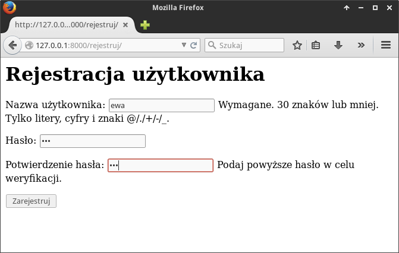
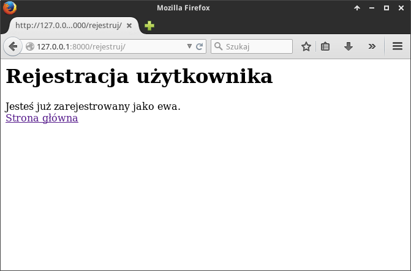

Tworzymy szablon logowania w pliku

W scenariuszu podstawowym utworzylismy widoki pozwalające na zalogowanie i
wylogowanie się użytkownika.

Zamiast zakładać konta użytkownikom w panelu administracyjnym lepiej umozliwić
samodzielne rejestrowanie. Utworzymy formularz i obsłużymy go w skojarzonym widoku (funkcji)
``rejestruj()``, który:

* zwróci formularz przygotowany w szablonie :file:`rejestruj.html` w odpowiedzi
  na żądanie typu :term:`GET`, wysłane spod adresu URL *http://127.0.0.1:8000/rejestruj*;

* sprawdzi poprawność przesłanych danych (nazwę użytkownika i hasło), utworzy konto
  zaloguje użytkownika i przekieruje go na stronę główną
  w odpowiedzi na żądanie typu :term:`POST`;

Na początku pliku :file:`views.py` importujemy wymagane metody, później uzupełniamy
widok ``index()`` i dodajemy widok ``rejestruj()``:

.. raw:: html

    
Kod nr 

.. highlight:: python
.. literalinclude:: views_z3.py
    :linenos:
    :lineno-start: 1
    :lines: 1-
    :emphasize-lines: 6-9, 19-36

W odpowiedzi na żądanie GET funkcja zaimportuje wbudowany formularz tworzenia użytkowników,
utworzy i zapisze jego instancję w słowniku ``kontekst``, na końcu zwróci wyrenderowany szablon
:file:`rejestruj.html`, do którego przekazany zostanie wspomniany słownik.

Szablon tworzymy w pliku :file:`~/czat/czat/templates/czat/rejestruj.html`:

.. raw:: html

    
<i>rejestruj.html</i>. Kod nr 

.. highlight:: html
.. literalinclude:: rejestruj_z3.html
    :linenos:

W tagu ``{{ form.as_p }}`` odczytujemy przekazany formularz i wyświetlamy
jego pola w znacznikach akapitów (``

``).

Aby przetestować działanie aplikacji, trzeba powiązać widok ``rejestruj()``
z adresem URL ``/rejestruj``, co robimy w pliku :file:`urls.py`:

Warto także zauważyć, jak tworzymy komunikaty zwrotne dla użytkownika.
Wykorzystujemy wbudowany w Django system komunikatów: ``messages.success(request, "Zostałeś zarejestrowany.")``.
Tak utworzone komunikaty możemy odczytać w każdym szablonie ze zmiennej
``messages`` (zob. niżej szablon :file:`index.html`).

Tworzymy nowy szablon

Wiążemy adres URL *rejestruj/* z utworzonym widokiem. Do pliku
dopisujemy:

.. raw:: html

    
Kod nr 

.. highlight:: python
.. literalinclude:: urls_z3.py
    :linenos:
    :emphasize-lines: 3
    :lineno-start: 10
    :lines: 10-

Gdybyśmy już teraz odwiedzili adres ``127.0.0.1:8000/rejestruj``, powinniśmy
zobaczyć poniższy formularz:

Modyfikujemy również szablon strony głównej:

.. raw:: html

    
Plik index.html nr 

.. highlight:: html
.. literalinclude:: index_z3.html
    :linenos:

W szablonach dostępne są podstawowe instrukcje sterujące, takie jak np.
```` czy ````. Tę pierwszą wykorzystamy do wyświetlenia
komunikatów użytkownikowi, drugą m. in. do sprawdzenia, czy stronę odwiedza
użytkownik uwierzytelniony. Dane przekazane do szablonu możemy wyświetlać
stosując odpowiednią notację, np.: ``{{ user.username }}``.
Dodatkowo wyświetlane dane można obrabiać za pomocą filtrów,
np. ``{{ komunikat|capfirst }}`` – w tym wypadku wszystkie komunikaty
zostaną wyświetlone z wielkiej litery.

W pliku :file:`index.html` umieszczamy również link do strony rejestracji,
który wyświetlany będzie tylko użytkownikom niezalogowanym. Aby wygenerować adres
strony w atrybucie ``href`` używamy funkcji ``url``, za którą podajemy
w cudzysłowach nazwę nadaną adresowi w pliku ``urls.py``, np.:
````.

Ćwiczenie 2
===============

Po ewentualnym ponownym uruchomieniu serwera, zarejestruj nowego użytkownika
o nazwie "ewa". Powinieneś zobaczyć poniższą stronę:

.. figure:: img/czat13rej.png

W przeglądarce wpisz adres *127.0.0.1:8000/rejestruj*, aby przejść do strony
rejestracji. Na stronie wyświetla się formularz, mimo że jesteś już zarejestrowany
i zalogowany.

Spróbuj zmienić szablon ``rejestruj.html``, tak aby zalogowanym
użytkownikom wyświetlał się tekst "Jesteś już zarejestrowany" oraz
link do strony głównej, a niezalogowanym formularz rejestracji.

.. tip::

    Wykorzystaj tag ```` i obiekt ``user``, tak jak zrobiliśmy to
    w widoku ``index()`` i dopisz odpowiedni kod w widoku ``rejestruj()``.

Przykładowy efekt poprawnego wykonania ćwiczenia:

