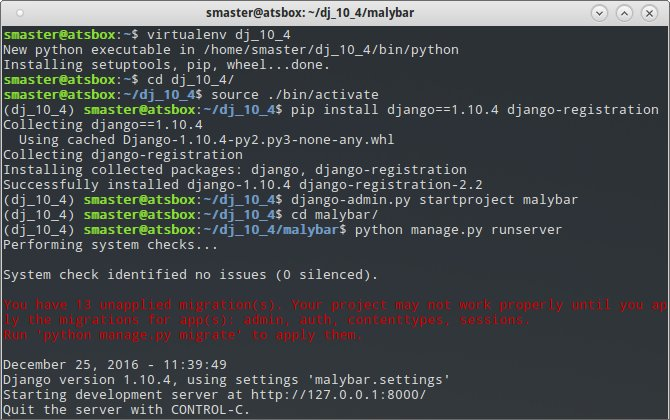
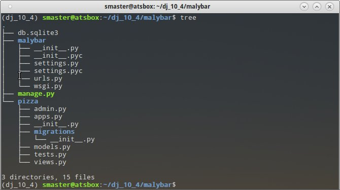

Django
#######

`Django <https://www.djangoproject.com/>`_ to napisany w Pythonie framework
przeznaczony do szybkiego tworzenia aplikacji internetowych.
Został zaprojektowany przez zespół doświadczonych praktyków w taki sposób,
żeby odciążyć programistę od wykonywania typowych, a jednocześnie uciążliwych czynności.
Zalety Django to szybkość, bezpieczeństwo i skalowalność. Inne cechy wymienione są
na polskiej stronie Wikipedii: `Django (framework) <https://pl.wikipedia.org/wiki/Django_(framework)>`_.

Przygotowanie środowiska
========================

Do pracy z Django potrzebny jest przede wszystkim **interpreter Pythona 2.7.x**.
Jest on domyślnie obecny w systemach Linux. Natomiast w systemach Windows i Mac OS X
należy wejść na stronę `Donwload Python <https://www.python.org/downloads/>`_,
pobrać odpowiedni instalator (32- lub 64-bitowy) Pythona (**wersja 2.7.x**!)
i zainstalować. Opis instalacji znajdziesz na stronie `Interpreter Pythona <http://python101.readthedocs.io/pl/latest/env/windows.html#inerpreter-pythona>`_.

Poza Pythonem potrzebny jest również instalator pakietów Pythona `pip`.
W systemach Linux wywodzących się z Debiana (Ubuntu, Linux Mint)
wystarczy wydać w terminalu polecenie:

.. code-block:: bash

    ~$ sudo apt install python-pip

W systemie Windows `pip` jest instalowany razem z interpreterem.
Korzystając z omawianego narzędzia wydajemy w konsoli tekstowej polecenie:

.. code-block:: bash

    ~$ sudo pip install virtualenv

Narzędzie `virtualenv` posłuży nam do przygotowania **wyizolowanego środowiska Pythona**,
zawierającego wybraną wersję Django. W konsoli wydajemy polecenia:

.. code-block:: bash

		~$ virtualenv dj_10_4
		~$ cd dj_10_4
		~$ source ./bin/activate
		~$ pip install Django==1.10.4
		~$ pip install django-registration

Pierwsze polecenie tworzy katalog zawierający najważniejsze komponenty Pythona.
Nazwa :file:`dj_10_4` jest umowna, w założeniu ma być skrótem wskazującym wykorzystaną
wersję Django. Aby skorzystać z przygotowanego środowiska, należy
go zawsze na początku aktywować, wydając w utworzonym katalogu polecenie ``source ./bin/activate``.
Opuszczenie środowiska umożliwia komenda ``deactivate``.

Polecenia ``pip install ...`` instalują wskazaną wersję Django oraz dodatkową aplikację
ułatwiającą zarządzanie użytkownikami. Tak zainstalowane moduły będą dostępne
tylko w aktywowanym środowisku.

Ćwiczenie
---------

Zgodnie z powyższym opisem przygotuj samodzielnie wirtualne środowisko do pracy z Django.

.. tip::

	Projektując aplikację będziemy często korzystać z poleceń wydawanych w katalogu
	:file:`dj_10_4` w terminalu. Nie zamykaj więc okna terminala.

Projekt
========

Otwórz terminal, przejdź do katalogu z utworzonym wcześniej wirtualnym środowiskiem
:file:`dj_10_4` i aktywuj go. Utworzymy teraz projekt i uruchomimy serwer deweloperski.
Wydajemy polecenia:

.. code-block:: bash

    ~/dj_10_4$ django-admin stratproject malybar
    ~/dj_10_4$ cd malybar
    ~/dj_10_4/malybar$ python manage.py runserver

Tyle wystarczy, żeby utworzyć szkielet serwisu i uruchomić serwer deweloperski,
który możemy wywołać wpisując w przeglądarce adres: ``127.0.0.1:8000``.
Większość zmian w kodzie nie wymaga restartowania serwera. W razie potrzeby
serwer zatrzymujemy naciskając w terminalu skrót :kbd:`CTRL+C`.

Poznajmy strukturę plików naszego projektu. W terminalu wydajemy jedno z poleceń:

.. code-block:: bash

  ~/dj_10_4/malybar$ tree
	~/dj_10_4/malybar$ ls -R

Nazwa zewnętrznego katalogu :file:`malybar` nie ma znaczenia, można ją dowolnie zmieniać,
to tylko pojemnik na projekt. Zawiera on:

	- :file:`manage.py` – skrypt Pythona do zarządzania projektem;
	- :file:`db.sqlite3` – bazę danych w domyślnym formacie SQLite3.

**Katlog projektu** :file:`malybar/malybar` zawiera:

	- :file:`settings.py` – konfiguracja projektu;
	- :file:`urls.py` – swego rodzaju "menu" naszego projektu, a więc lista wpisów
	  definiująca adresy URL, które będziemy obsługiwać;
	- :file:`wsgi.py` – plik konfiguracyjny wykorzystywany przez serwery WWW.

Plik :file:`__init__.py` obecny w danym katalogu wskazuje, że dany katalog jest modułem Pythona.

Aplikacja
=========

W ramach jednego projektu (serwisu internetowego) może działać wiele aplikacji.
Utworzymy teraz naszą aplikację `pizza` i zobaczymy strukturę plików:

.. code-block:: bash

	~/dj_10_4/malybar$ python manage.py startapp pizza
	~/dj_10_4/malybar$ tree pizza
	lub:
	~/dj_10_4/malybar$ ls -R pizza

**Katalog aplikacji** :file:`malybar/pizza` zawiera:

	- :file:`apps.py` – ustawienia aplikacji;
	- :file:`admin.py` – konfigurację panelu administracyjnego;
	- :file:`models.py` – plik definiujący modele danych przechowywanych w bazie;
	- :file:`views.py` – plik zawierający funkcje lub klasy definiujące tzw. *widoki* (ang. *views*), obsługujące żądania klienta przychodzące do serwera;

Ustawienia projektu
===================

Otwieramy i edytujemy plik :file:`malybar/settings.py`.

**Dostępne w projekcie aplikacje** znajdują się w liście ``INSTALLED_APPS``. Domyślnie Django udostępnia
kilka obsługujących podstawowe funkcjonalności serwisu internetowego. Na początku tej listy
dodamy konfigurację aplikacji `pizza`, a na końcu zainstalowanej wcześniej `django-registration`:

.. raw:: html

	
Kod nr : <i>malybar/settings.py</i>

.. highlight:: python
.. literalinclude:: malybar/settings.py
    :linenos:
    :lineno-start: 33
    :lines: 33-42
    :emphasize-lines: 2, 9

**Lokalizacja projektu** obejmuje ustawienie języka i strefy czasowej:

.. raw:: html

	
Kod nr : <i>malybar/settings.py</i>

.. highlight:: python
.. literalinclude:: malybar/settings.py
    :linenos:
    :lineno-start: 108
    :lines: 108-110

**Konfiguracja adresów URL projektu** zawarta jest w pliku :file:`malybar/urls.py`. Każda aplikacja definiuje
zazwyczaj swoją listę obsługiwanych adresów, którą należy dołączyć:

.. raw:: html

    
Kod nr 

.. highlight:: python
.. literalinclude:: malybar/urls_01.py
    :linenos:
    :lineno-start: 16
    :lines: 16-24
    :emphasize-lines: 3, 6-7

Funkcja ``include()`` jako pierwszy parametr przyjmuje ścieżkę dostępu do konfiguracji adresów danej
aplikacji. W praktyce jest to nazwa katalogu, w którym znajduje się aplikacja, operator ``.`` (kropka)
oraz domyślna nazwa pliku konfiguracyjnego :file:`urls.py` bez rozszerzenia.
Wartość parametru ``namespace`` definiuje przestrzeń nazw, w której dostępne będą adresy używane w aplikacji.

Widok domyślny
==============

**Mapowanie adresów URL aplikacji** tworzymy w nowym pliku :file:`pizza/urls.py`,
który wypełniamy następującym kodem:

.. raw:: html

    
Kod nr 

.. highlight:: python
.. literalinclude:: pizza/urls_01.py
    :linenos:
    :lineno-start: 1
    :lines: 1-
    :emphasize-lines: 2, 5

Lista ``urlpatterns`` zawiera powiązania między adresami URL a obsługującymi je widokami
zapisanymi w pliku :file:`views.py`, który importujemy w drugiej linii.

Funkcja ``url()`` przyporządkowuje adresowi URL widok, który go obsługuje. Pierwszy parametr to wyrażenie
regularne, do którego Django próbuje dopasować adres otrzymany w żądaniu od klienta. Drugi to nazwa widoku.
Trzeci to unikalna nazwa, dzięki której można odwoływać się w aplikacji do zdefiniowanego adresu.

**Widok** definiuje jakiś typ strony WWW, za pomocą którego użytkownik wykonuje w aplikacji
jakieś operacje, np. wyświetla zestawienie danych. Technicznie widok zazwyczaj składa się
z funkcji otrzymującej żądanie klienta i jakiegoś szablonu służącego prezentowaniu danych.

Widok domyślny obsługujący żądania typu GET przychodzące na adres podstawowy serwera
zdefiniujemy w pliku :file:`pizza/views.py`:

.. raw:: html

    
Kod nr 

.. highlight:: python
.. literalinclude:: pizza/views_01.py
    :linenos:
    :lineno-start: 1
    :lines: 1-

.. warning::

	Linia ``# -*- coding: utf-8 -*-`` to określenie kodowania znaków.
	Należy umieszczać je w pierwszej linii każdego pliku, w którym zamierzamy używać polskich
	znaków, czy to w komentarzach czy w kodzie.

Nazwa funkcji – ``index()`` – jest umowna. Każdy widok otrzymuje szczegóły żądania wysłanego przez klienta
(obiekt typu ``HttpRequest``) i powinien zwrócić jakąś odpowiedź (``HttpResponse``).
W tym wypadku zwracamy funkcję ``render()`` wywołującą wskazany jako drugi parametr szablon,
który otrzymuje dane w postaci słownika ``kontekst`` (nazwa umowna).

**Szablon** (ang. *template*) – to plik tekstowy, służący generowaniu najczęściej plików HTML.
Oprócz tagów HTML-a, zawiera zmienne oraz tagi sterujące języka szablonów Django.

.. note::

	Szablony umieszczamy w katalogu: :file:`pizza/templates/pizza`!

Zawartość szablonu :file:`index.html`:

.. raw:: html

    
Kod nr 

.. highlight:: python
.. literalinclude:: pizza/templates/pizza/index_01.html
    :linenos:
    :lineno-start: 1
    :lines: 1-

Zobacz, jak w znaczniku ``
`` wstawiamy przekazaną do szablonu zmienną ``komunikat``,
używamy podwójnych nawiasów sześciennych: ``{{ nazwa_zmiennej }}``.

.. tip::

	W tym miejscu warto usystematyzować dodawanie kolejnych funkcji do naszej aplikacji.
	**Zazwyczaj** proces ten przebiega wg. schematu:

	1) w pliku :file:`urls.py`: przyporządkowujemy adres widokowi;
	2) w pliku :file:`views.py`: definiujemy widok, który najczęściej zwraca szablon połączony z przekazanymi do nego danymi;
	3) w katalogu :file:`templates/nazwa_aplikacji`: tworzymy szablon, który łączy znaczniki HTML-a i dane.

Test widok domyślnego
---------------------

W tym momencie powinieneś przetestować działanie aplikacji. Sprawdź, czy działa serwer. Jeżeli
nie, uruchom go. W przeglądarce odśwież lub wpisz adres domyślny serwera testowego, tj.:
``127.0.0.1:8000``. Powinieneś zobaczyć nazwę projektu i powitanie.

W przypadku błędów Django wyświetla obszerne informacje, które na pierwszy rzut oka
są bardzo skomplikowane. Nie musisz studiować całości, żeby zrozumieć, co poszło nie tak.
Skup się na początku komunikatu!

Model danych
============

Django jest wyposażone we własny system ORM (ang.), służący zarówno do definiowania,
jak i zarządzania źródłami danych.

W pliku :file:`moja_apl/models.py` definiujemy klasę(y) opisującą(e) źródła danych aplikacji.
Odpowiadają one tabelom w bazie danych. Każda klasa zawiera pola opisujące przechowywane w nich
informacje. Pola odpowiadają kolumnom w tabelach.

Następnie tworzymy tzw. *migrację*, czyli informację o zmianie modelu naszej aplikacji.

.. code-block:: bash

    $ python manage.py make migrations moja_apl
    $ python manage.py sqlmigrate moja_apl 0001
    $ python manage.py migrate

Drugie opcjonalne polecenie pozwala zobaczyć klauzule SQL-a, które zostaną użyte do wprowadzenia
zdefiniowanych w modelu zmian do bazy. Ostatnie polecenie na podstawie migracji wszystkich
zarejestrowanych aplikacji tworzy bazę danych, a w niej odpowiednie tabele.

Testowanie modelu
-----------------

Po zdefiniowaniu modelu możemy go od przetestować w konsoli, zanim wykorzystamy
go w aplikacji.

.. code-block:: bash

    $ python manage.py shell

Powyższe polecenie uruchamia konsolę Pythona (rozszerzoną, jeżeli jest dostępna) i tworzy
środowisko testowe. Zobaczmy, jak za pomocą bazodanowego API zarządzać danymi.
Na początku **tworzenie danych** (ang. *create*):

.. code-block:: bash

	$ pytanie = Pytanie(tresc="Jak się nazywasz?")
	$ pytanie.save()
	$ print pytanie.id, pytanie.tresc, pytanie.data_pub

[zrzut]

.. code-block:: bash

	$ from django.utils import timezone
	$ pytanie = Pytanie(tresc="Gdzie mieszkasz??", data_pub=timezone.now())
	$ pytanie.save()
	$ print pytanie.id, pytanie.tresc, pytanie.data_pub

Przećwiczmy też **wydobywanie danych** (ang. *read*) z bazy:

.. code-block:: bash

	$ pytania = Pytanie.objects.all()
	$ print pytania
	$ print pytania[0].id, pytania[0].tresc, pytania[0].data_pub
	$ pytanie = Pytanie.objects.get(pk=2)
	$ print pytanie.tresc
	$ Pytanie.objects.filter(data_pub__year=timezone.now().year)
	$ Pytanie.objects.filter(tresc__startswith='Kiedy')
	$ Pytanie.objects.count()

Strona administracyjna
======================

Zarządzanie treściami czy użytkownikami wymaga panelu administracyjnego, Django dostarcza nam
go automatycznie. Na początku tworzymy konto administratora:

.. code-block:: bash

    $ python manage.py createsuperuser

Django zapyta o nazwę, e-mail i hasło. Podajemy: “admin”, “” (pomijamy), “admin”.
Jeżeli chcemy mieć możliwość dodawania treści, w pliku :file:`pizza/admin.py`
importujemy nasz(e) model(e) i rejestrujemy go(je):

.. highlight:: python
.. literalinclude:: pizza/admin_01.py
    :linenos:
    :lineno-start: 1
    :lines: 1-

**Ćwiczenie**

Uruchom serwer, a w przeglądarce wpisz adres: ``127.0.0.1:8000/admin``.
Po zalogowaniu się dodaj dwa pytania. Następnie utwórz konto dla użytkownika "uczen"
z hasłem "q1w2e3". Przydziel mu prawa do dodawania, modyfikowania i usuwania pytań.
Przeloguj się na konto "uczen" i dodaj jeszcze dwa pytania.

[zrzut]

