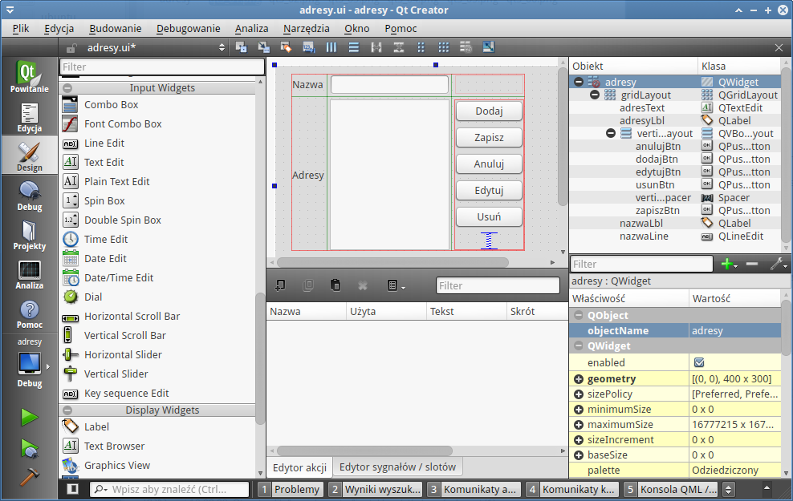

Adresy (Qt5)
============================

Niniejszy scenariusz pokazuje, jak zacząć pracę w środowisku IDE Qt Creator
przy wykorzystaniu biblioteki Qt w wersji 5.

Nowy projekt
------------------

Po uruchomieniu aplikacji Qt Creator wybieramy przycisk "New Project",
który uruchamia kreatora aplikacji.

W pierwszym oknie "Applications" i "Qt Widget Applications", co
oznacza, że chcemy utworzyć program z interfejsem graficznym oparty
na klasie QWidget. W następnym oknie podajemy nazwę projektu,
np, "adresy", oraz wskazujemy ścieżkę do katalogu, w którym
będą zapisywane pliki wchodzące w skład projektu.
W następnym oknie wybieramy tzw. "kit", czyli zestaw definiujący
docelowe środowisko, kompilator itp. ustawienia. Dostępne
zestawy muszą być wcześniej określone w ustawieniach Qt Creatora

Kolejne okno pozwala definiować nazwę klasy głównej i klasę podstawową,
podajemy "adresy" i wybieramy "QWidget". W następnym ostatnim oknie
niczego nie zmieniamy, kończymy kliknięciem przycisku "Finish".

Efektem działania kreatora będzie utworzenie następujących plików:

    1) ``adresy.h`` - tutaj będziemy deklarować wszystkie używane w programie
    obiekty (elementy interfejsu), a także publiczne sloty, czyli funkcje
    powiązanie z określonymi sygnałami (zdarzeniami).

    2) ``adresy.cpp`` - tu znajdzie się kod tworzący obiekty interfejsu, łączący
    sygnały ze slotami, a wreszcie implementacja slotów.

    3) ``main.cpp`` - plik, w którym tworzona i uruchamiana jest instancja naszej
    aplikacji.

    4) ``adresy.ui`` - jak wskazuje rozszerzenie ("ui" - ang. user interface),
    plik zawierać będzie opis graficznego interfejsu aplikacji zapisany
    za pomocą znaczników XML.

Tworzenie interfejsu
------------------------

Zaczniemy od utworzenia głównego okna naszej aplikacji. W tym celu
dwa razy klikamy plik adresy.ui i przechodzimy do tworzenia
formularza.

Na początku klikamy obiekt "Grid Layout" z kategorii "Layouts" i rysujemy prostokąt na
formularzu tak, aby nie wypełniał go w całości. Dodana kontrolka
umożliwia porządkowanie innych elementów tworzących interfejs w prostokątnej
siatce. Dalej dodamy dwie etykiety, czyli obiekty "Label" z kategorii
"Display Widgets". Staramy się je umieścić jedna nad drugą w dodanej przed
chwilą siatce.

.. tip::

    Po wybraniu obiektu i najechaniu na *Grid Layout* należy obserwować
    niebieskie podświetlenia, które pojawiają się w pionie i poziomie,
    wskazują one, gdzie umieszczony zostanie dodawany obiekt.

Po dwukrotnym kliknięciu na dodane etykiety możemy zmienić treść przez nie wyświetlaną.
Modyfikujemy w ten sposób właściwość *text* danego obiektu. Etykieta
górna powinna zawierać tekst "Nazwa", dolna - "Adresy".

.. note::

    Lista wszystkich obiektów wyświetlana jest po prawej stronie na górze
    w oknie *Hierarchia obiektów*. W kolumnie *Obiekt* widzimy tam nazwy dodanych obiektów,
    a w kolumnie *Klasa* nazwy klas, które reprezentują. Po wskazaniu myszą
    dowolnego obiektu możemy edytować wszystkie jego właściwości poniżej.
    Np. nazwę obiektu zmienimy w polu *objectName*.

Nazwę etykiety górnej ustalamy na "nazwaLbl", dolnej - na "adresyLbl".

.. tip::

    Konwencji nazywania obiektów jest wiele, ważne żeby konsekwentnie trzymać
    się wybranej. Tutaj proponujemy uwzględnianie w nazwie typu obiektu
    przy użyciu skrótu pisanego z dużej litery, np. "nazwaLbl".

Po prawej stronie etykiety "Nazwa" dodajemy kontrolkę *Line Edit* z grupy *Input Widgets*
o nazwie "nazwaLine". Poniżej, czyli w drugiej kolumnie, tworzymy obiekt
*Text Edit* z tej samej grupy, co poprzedni o nazwie "adresText".
Powinniśmy uzyskać poniższy układ:

.. figure:: img/qt5_08.png

Czas na dodanie przycisków pozwalających inicjować działanie aplikacji.
Dodajemy więc 5 przycisków *PushButton* z kategorii *Buttons* po prawej stronie
i poza(!) obiektem *GridLayouts* jeden pod drugim. Na samym dole umieszczamy
kontrolkę *Vertical Spacer* z kategorii *Spacers*. Następnie zaznaczamy wszystkie dodane obiekty,
obrysowując je myszką, i klikamy ikonę *Rzmieść w pionie* (:kbd:`CTRL+L`)
na pasku narzędziowym. Teraz stworzoną grupę przeciągamy na siatkę
jako 3. kolumnę.

Musimy zmienić nazwy i tekst dodanych przycisków. Od góry ustawiamy kolejne
właściwości (nazwa/tekst): "dodajBtn/Dodaj", "zapiszBtn/Zapisz", "anulujBtn/Anuluj",
"edytujBtn/Edytuj", "usunBtn/Usuń". W efekcie powinniśmy uzyskać następującą formatkę:

Musimy dodać jeszcze 3 przyciski pozwalające na nawigację między adresami
i wyjście z programu. Poniżej obiektu siatki umieszczamy więc 2 przyciski (*PushButton*),
zaznaczamy je i klikamy ikonę *Rozmieść poziomo w splitterze*, następnie
przeciągamy grupę na dół 2. kolumny siatki. Na koniec dodajemy jeszcze jeden
przycisk na dole 3. kolumny. Dodanym obiektom zmieniamy właściwości (nazwa/tekst):
"poprzBtn/Porzedni", "nastBtn/Następny", "koniecBtn/Koniec".

Na koniec zaznaczamy formularz główny, na którym znajdują się wszystkie
elementy interfejsu i klikamy przycisk *Rozmieść w siatce* (:kbd:`CTRL+G`).
Dzięki temu kontrolki będą skalowane wraz ze zmianą rozmiaru okna.

W sumie uzyskujemy poniższy projekt:

.. figure:: img/qt5_10.png

Możemy uruchomić naszą aplikację, wybierając *Budowanie/Uruchom* (:kbd:`CTRL+R`)
lub klikając trzecią od dołu ikonę zielonego trójkąta w lewej kolumnie Qt Creatora.
Powinniśmy zobaczyć podobne do poniższego okno:

.. figure:: img/qt5_11.png

Deklaracje zmiennych
-----------------------

Po dodaniu elementów interfejsu musimy zadeklarować zmienne, za pomocą
których będziemy mogli nimi manipulować. Przechodzimy do pliku ``adresy.h``
i wprowadzamy poniższe zmiany:

.. raw:: html

    
<strong>adresy.h</strong> nr 

.. highlight:: cpp
.. literalinclude:: adresy01.h
    :linenos:

Na początku musimy zaimportować klasy, z których skorzystaliśmy przy budowie
interfejsu. Dodatkowa klasa ``QTextCodec`` pozwoli nam poprawnie wyświetlać
polskie znaki. Następnie wewnątrz naszej klasy głównej, której deklaracja
rozpoczyna się w linii 14., deklarujemy prywatne (:term:`private`) właściwości,
których nazwy odpowiadają nazwom wcześniej dodanych elementów interfejsu
graficznego. Formalnie każda zmienna jest wskaźnikiem do obiektu odpowiedniego typu.

.. raw:: html

    
<strong>adresy.cpp</strong> nr 

.. highlight:: cpp
.. literalinclude:: adresy01.cpp
    :linenos:

W obrębie konstruktora głównej klasy naszej aplikacji o nazwie ``adresy``,
którego definicja rozpoczyna się w linii 4., tworzymy instancje
klas użytych w interfejsie graficznym. Do zmiennych zadeklarownych w pliku
``adresy.h`` przypisujemy obiekty utworzone za pomocą operatora ``new``, a następnie
definiujemy ich początkowe właściwości.

Konstruktorowi odpowiada zawzwyczaj destruktur, a więc działanie, które
usuwa stworzony obiekt, w tym wypadku interfejs użytkownika: ``adresy::~adresy()``.

Właściwość ``setReadOnly(true)`` blokuje edycję danego elementu, podobnie
właściwość ``setEnabled(false)`` uniemożliwia kliknięcie danego przycisku.
Metoda ``hide()`` ukrywa obiekt. Instrukcja ``QTextCodec::setCodecForLocale(QTextCodec::codecForName("UTF-8"))``
określa kodowanie komunikatów w standardzie "UTF-8" używanych w aplikacji,
które wprowadzane są dalej za pomocą funkcji ``trUtf8()``. Tak dzieje się np.
podczas określania tytułu okna w wywołaniu ``setWindowTitle()``.

.. tip::

    W środowisku MS Windows kodowanie powinno zostać ustawione na ``Windows-1250``.

Dzięki powyższym uzupełnieniom po uruchomieniu aplikacji okno nazwy i danych
adresów jest nieaktywne, możemy natomiast użyć przycisków ``Dodaj``, aby utworzyć
nowy wpis, lub ``Koniec``, aby zakończyć aplikację.

.. figure:: img/qt5_12.png

Używanie naszej aplikacji będzie polegało na klikaniu przycisków, wpisywaniu
bądź edycji danych i ich zapisywaniu. Wszystkie te czynności generowane z poziomu
interfejsu użytkownika określa się w terminologii :term:`biblioteki qt` jako
:term:`sygnały`, czyli **zdarzenia**. Programista decyduje o tym, które z nich i jak
są obsługiwane, definiując tzw. :term:`sloty`, czyli **funkcje** powiązane z określonymi
zdarzeniami. Powiązania między sygnałami i slotami ustalamy w pliku ``adresy.cpp``
za pomocą polecenia typu: ``connect(dodajBtn, SIGNAL(clicked()), this, SLOT(dodajKontakt()));``.
Słowo kluczowe ``conect`` łączy zdarzenie (sygnał ``clicked()``, czyli kliknięcie)
z działaniem (slot ``dodajKontakt()``, czyli funkcją).

Każda z funkcji obsługujących zdarzenia musi zostać zadeklarowana w pliku
``adresy.h`` w sekcji ``public slots:``, ich implementację musimy dopisać
do pliku ``adresy.cpp``.

.. raw:: html

    
<strong>adresy.h</strong> nr 

.. highlight:: cpp
.. literalinclude:: adresy02.h
    :emphasize-lines: 5,7-9,24-28
    :lineno-start: 18
    :lines: 18-

Materiały
---------------------

1. `Biblioteka Qt`_
2. `Qt Creator`_

Pojęcia
^^^^^^^^^^^^^

.. glossary::

    Klasa
        program komputerowy.

    Obiekt
        zestaw komponentów i bibliotek wykorzystywany do budowy aplikacji,
        przykładem jest biblioteka Pythona Flask.

    public
        operator widoczności, pola (właściwości) i metody (funkcje) klasy
        deklarowne po nim są dostępne z każdeg miejsca programu.

    private
        operator widoczności, pola (właściwości) i metody (funkcje) klasy
        deklarowne po nim są dostępne tylko w jej obrębie.

    Qt Creator
        wieloplatformowe środowisko :term:`IDE` (zintegrowane środowisko programistyczne)
        dla aplikacji pisanych w językach C++, JavaScript i QML. Zawiera m.in. `debugger <http://pl.wikipedia.org/wiki/Debugger>`_
        i edytor GUI (graficznego interfejsu użytkownika).

    sygnały
        zdarzenia generowane za pomocą graficznego interfejsu użytkownika, takie
        jak kliknięcie elementu, edycja, przeciągnięcie itp.

    sloty
        funkcje przypisane sygnałom, definiują działania podejmowane w przypadku
        zastnienia danego zdarzenia.

.. _Biblioteka Qt: https://qt-project.org/
.. _Qt Creator: http://pl.wikipedia.org/wiki/Qt_Creator

Poćwicz sam
^^^^^^^^^^^^^

    Spróbuj napisać wersję omówionej w innym scenariuszu aplikacji :ref:`ToDo <todo>`
    przy wykorzystaniu wybranego systemu ORM, tj. Peewee lub SQLAlchemy.

Metryka
^^^^^^^

:Autor: Robert Bednarz (ecg@ecg.vot.pl)

:Utworzony: |date| o |time|

.. |date| date::
.. |time| date:: %H:%M

.. raw:: html

    
