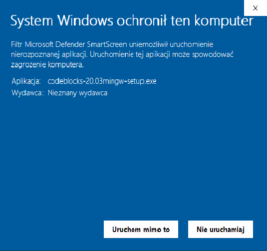
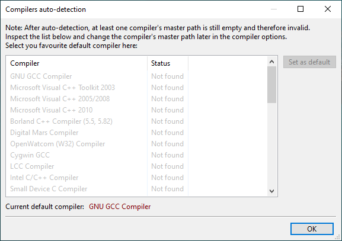
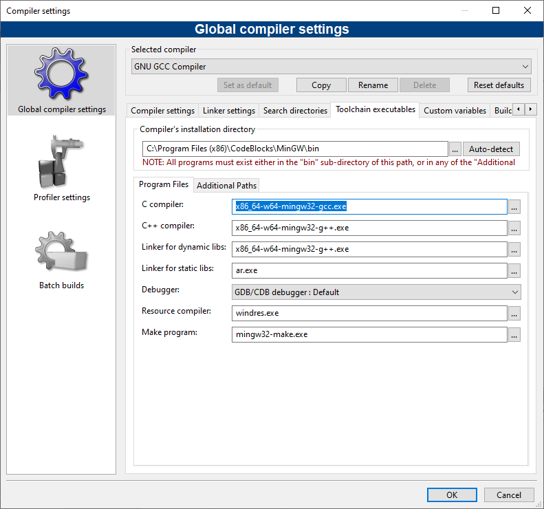
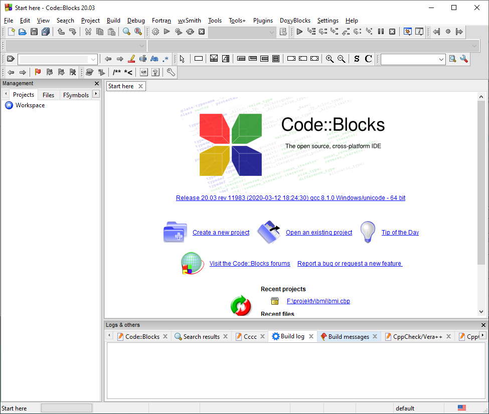
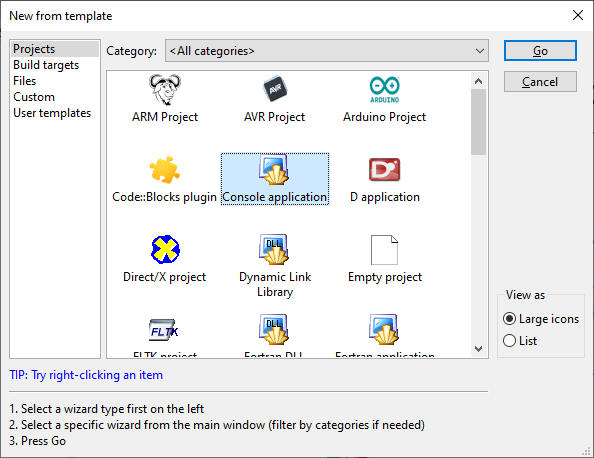
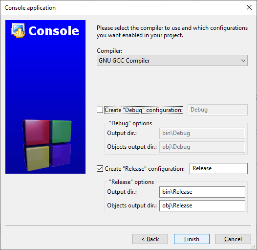
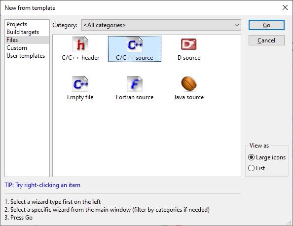
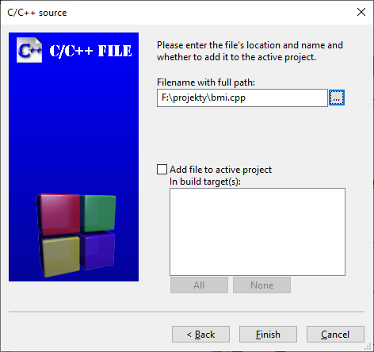

.. _kompilator-cpp:

Kompilator C/C++
################

Linux
=====

W systemie Linux potrzebne narzędzia są zazwyczaj obecne, ale w razie potrzeby wystarczy
doinstalować pakiet ``g++`` odpowiednim menedżerem pakietów, np.:

.. code-block:: bash

    ~$ sudo apt-get install g++

Windows
=======

Code::Blocks
------------

W systemie Windows możemy zainstalować środowisko IDE `Code::Blocks <http://www.codeblocks.org/>`_,
które zawiera kompilator. Ze strony `Download the binary release <http://www.codeblocks.org/downloads/26>`_
pobieramy instalator *codeblocks-20.03mingw-setup.exe* zawierający kompilator MinGW w wersji 64-bitowej
lub odpowiednią wersję 32-bitową. Podczas próby instalacji Windows 10 może chwalić się, że ochronił nasz
komputer. Ignorujemy tę mądrość i wybieramy "Uruchom mimo to":

Instalujemy z domyślnymi ustawieniami. Podczas pierwszego uruchomienia powinniśmy wskazać domyślny
kompilator. Niestety Windows może go nie wykryć, pozostaje kliknąć "OK.

Aplikację można ewentualnie powiązać z plikami typu C/C++ – ale jeżeli planujemy używać innego edytora,
warto zaznaczyć "No, leave everything as it is".

Ustawienia kompilatora
----------------------

Jeżeli podczas pierwszego uruchomienia Windows nie wykrył kompilatora, wybieramy z menu polecenie "Settings / Compiler...".
W wyświetlonym oknie klikamy zakładkę "Toolchain executables". Wskazujemy odpowiednią ścieżkę i pliki w kolejnych polach:

1. "Compiler's installation directory" – klikamy trzy kropki i wskazujemy katalog z plikami kompilatora,
   najczęściej: :path:`C:\Program Files (x86)\CodeBlocks\MinGW\bin`.
2. "C compiler", "C++ compiler", "Linker..." – w razie potrzeby zamieniamy nazwy wersji 32-bitowe na 64-bitowe
   dopisując ``x86_64-w64-``, np.: ``x86_64-w64-mingw32-gcc.exe``.
3. Zatwierdzamy zmiany klikając "OK".

Warto dodać katalog kompilatora do ścieżki systemowej, żeby można go było łatwo używać w innych edytorach kodu,
np. Geany. Otwieramy wiersz poleceń (``cmd`` lub PowerShell) i wydajemy polecenie:

   .. code-block:: bash

      setx PATH "%PATH%;C:\Program Files (x86)\CodeBlocks\MinGW\bin"

Restartujemy wiersz poleceń i wydajemy komendę:

   .. code-block:: bash

      g++ --version

Powinniśmy zobaczyć odpowiedź, czyli informację o wersji kompilatora.

Programowanie
-------------

Pisanie prostych, jednoplikowych programów w Code::Blocks nie jest specjalnie wygodne,
o wiele lepszym wyborem są tutaj inne edytory, np. Geany. Jednak jeżeli chcesz spróbować
programować w Code::Blocks po uruchomieniu środowiska kliknij "Create a new project".

Następnie mamy dwie możliwości: utworzenie całego projektu lub pojedynczego pliku.
W pierwszym przypadku wybieramy *Projects / Console applications*, w kolejnych oknach wskazujemy język
C++, podajemy nazwę projektu, katalog z projektami, wybieramy kompilator i wersje do stworzenia:

Na koniec plik główny projektu o nazwie :file:`main.cpp` znajdziesz po lewej stronie okna głównego w panelu "Projects".

Druga możliwość to dodanie pojedynczego pliku. W tym celu w oknie "New from template" wybierz
*Files / C/C++ Source*, a dalej wskaż ścieżkę i nazwę dodawanego pliku.

Niestety, plik dodany w ten sposób będzie pusty i musisz szablon programu C++ skądś skopiować.

.. tip::

   Polecenia kompilacji, budowania i uruchamiania razem z przypisanymi im skrótami klawiaturowymi
   znajdziesz w menu "Build".

Kmpilator MinGw
===============

Innym rozwiązaniem jest instalacja kompilatora z projektu `MinGw`_ bez środowiska IDE.
W tym celu pobieramy instalator `mingw-get-setup.exe <http://sourceforge.net/projects/mingw/files/Installer>`_
i uruchamiamy.

.. figure:: ../img/mingw01.jpg

W oknie wyboru pakietów zaznaczamy widoczne poniżej paczki, w tym przede wszystkim
``mingw32-gcc-g++``, a następnie wybieramy polecenie *Installation/Apply*.

.. figure:: ../img/mingw02.jpg

Po pobraniu i rozpakowaniu wskazanych narzędzi oraz zakończeniu instalatora (*Close*)
trzeba dodać do ścieżki systemowej położenie kompilatora i linkera;
dzięki temu będzie można korzystać z tych i innych narzędzi bezpośrednio
z Geany lub okienka konsoli tekstowej. W oknie "Uruchamianie" (:kbd:`WIN+R`)
wpisujemy polecenie wywołujące okno "Zmienne środowiskowe" – można je również
uruchomić z okna właściwości komputera:

.. figure:: ../img/mingw03.jpg
.. figure:: ../img/mingw04.jpg

Klikamy przycisk *Nowa* i tworzymy nową zmienną użytkownika zgodnie z podanym
zrzutem:

.. figure:: ../img/mingw05.jpg
.. figure:: ../img/mingw06.jpg

.. tip::

    Powyżej przedstawiliśmy instalację narzędzi :term:`MinGw` z konta zwykłego
    użytkownika. Można w razie potrzeby czynności te wykonać również z konta administratora,
    co pozwoli udostępnić narzędzia wszystkim użytkownikom. Podobnie
    ścieżkę do kompilatora itd. można dopisać do zmiennej systemowej ``PATH``,
    dzięki czemu wszyscy użytkownicy będą mogli wywoływać narzędzia bez
    podawania pełnej ich lokalizacji.

Materiały
=========

1. `MinGw`_

.. _MinGw: http://www.mingw.org/

