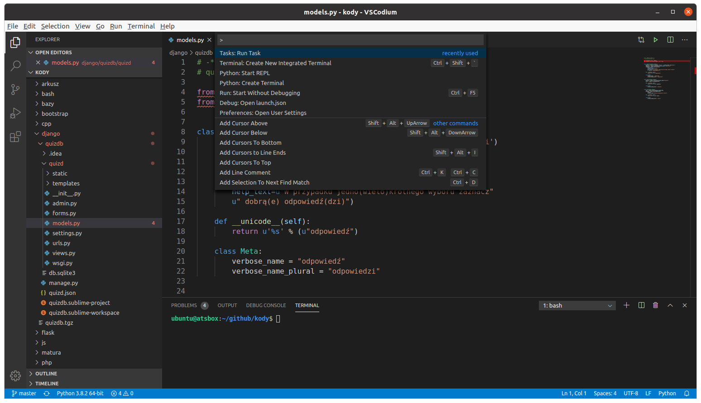

.. _edytory:

Edytory
#######

Edytory programistyczne to edytory plików źródłowych zapisywanych w postaci tekstu. Wszystkie oferują
mechanizmy ułatwiające kodowanie, takie jak kolorowanie składni, wsparcie standardów kodowania, automatyczne
domykanie nawiasów, cudzysłowów, tagów, autowcięcia, dopełnianie poleceń, czy wreszcie
kompilowanie, budowanie i uruchamianie tworzonego kodu. Wymienione poniżej edytory mają budowę
modułową, tzn. obsługują wtyczki, za pomocą których rozszerzamy możliwości programu.

.. _geany-opis:

Geany
=====

.. figure:: ../img/geany01.png

`Geany <http://www.geany.org>`_ to proste i lekkie środowisko IDE dostępne na
licencji `GNU General Public Licence <http://pl.wikipedia.org/wiki/GNU_General_Public_License>`_.

Linux
----------------

W systemach linuksowych korzystamy z dedykowanych menedżerów, np. w Ubuntu (Linux Mint itp.)
wystarczy wpisać w terminalu:

.. code-block:: bash

   ~$ sudo apt-get install geany geany-plugins

Można też skorzystać z graficznego instalatora "Oprogramowanie".

.. figure:: ../img/geany02.png

Windows
------------------

Ze strony `Download / Releases <http://www.geany.org/Download/Releases>`_ ściągamy instalator
*geany-1.36_setup.exe* (wersja może być nowsza) i uruchamiamy. Podczas instalacji nic
nie musimy zmieniać. Następnie ze strony `Download Geany-Plugins <https://plugins.geany.org/downloads.html>`_
pobieramy *geany-plugins-1.36_setup.exe* (wersja może być nowsza) i doinstalowujemy wtyczki.
Podczas instalacji niczego nie musimy zmieniać.

Konfiguracja
------------

Dodatkowe **schematy kolorowania** składni można pobrać ze strony
`Geany Themes on GitHub <http://https://github.com/codebrainz/geany-themes>`_.
Katalog :file:`colorschemes` należy skopiować do katalogu konfiguracyjnego edytora, np.
w systemie Linux będzie to :file:`~/.config/geany`. Wyboru schematu kolorowania
dokonujemy w menu *Widok / Schematy kolorów*.

**Wtyczki** włączamy w menu `Narzędzia / Menedżer wtyczek`. Warto zaznaczyć przynajmniej "Addons" i "Przeglądarka plików".
Zanim wyjdziemy z okna naciskamy przycisk "Preferencje" i na zakładce
"Przeglądarka plików" zaznaczamy opcję "Podążanie za ścieżką do bieżącego pliku".

W menu `Edycja / Preferencje` :kbd:`CTRL+ALT+P` w zakładce `Edytor / Wcięcia` zaznaczamy opcje,
jak na zrzucie poniżej:

.. figure:: ../img/geany03.png

W następnej zakładce `Auto-uzupełnianie` zaznaczmy m.in. domykanie nawiasów:

.. figure:: ../img/geany04.png

Czcionki można dostosować w `Edycja / Preferencje / Interfejs`.

Kodowanie
---------

W zależności od języka programowania nowe pliki można tworzyć na podstawie szablonów:
`Plik / Nowy z szablonu`. Menu *Zbuduj* zawiera polecenia kompilacji (:kbd:`F8`),
budowania (:kbd:`F9`) oraz uruchamiania kodu (:kbd:`F5`). Narzędzia wykorzystywane
do wykonywania tych akcji definiujemy w *Zbuduj / Zdefiniuj polecenia budowania*.
Np. dla kodu Pythona warto (zwłaszcza w systemie Linux) wskazać interpreter w wersji 3:

.. figure:: ../img/geany05.png

Wcięcia wstawiają się automatycznie lub poprzez naciśnięcie klawisza :kbd:`TAB`.
Jeżeli chcielibyśmy wciąć od razu cały blok kodu, zaznaczamy go i również używamy :kbd:`TAB`
lub :kbd:`CTRL+I`, zmniejszenie wcięcia uzyskamy naciskając :kbd:`CTRL+U`.

.. _st3-opis:

Sublime Text 3
==============

.. figure:: ../img/st301.png

Sublime Text 3 to szybki, lekki i elastyczny edytor dla programistów. Wybrane narzędzia:

   * wygodne otwieranie plików: :kbd:`CTRL+P`,
   * wielokrotna selekcja i edycja: po zaznaczeniu zmiennej :kbd:`CTRL+D`,
   * zaznaczenie wszystkich wystąpień i jednoczesna edycja: :kbd:`ALT+F3`,
   * szybkie otwieranie pliku: :kbd:`CTRL+P`
   * lista wszystkich poleceń: :kbd:`CTRL+SHIFT+P`
   * lista wszystkich definicji: :kbd:`CTRL+R`
   * równoczesna edycja kilku plików: *View / Layout*

Linux
-------

W Ubuntu i podobnych systemach (Linux Mint) wchodzimy na stronę
`Linux Package Manager Repositories <http://www.sublimetext.com/docs/3/linux_repositories.html>`_
i wykonujemy instrukcje dla menedżera `apt` wybierając wersję stabilną (ang. *stable*).

Można też skorzystać z graficznego instalatora "Oprogramowanie".

.. figure:: ../img/st302.png

W Windows
------------------

Po wejściu na stronę `Sublime Text 3 <http://www.sublimetext.com/3>`_
pobieramy archiwum dla wersji 32- lub 64-bitowej. Instalujemy standardowo
dwukrotnie klikając pobrany plik.

Wtyczki
-------

Wtyczki do ST3 przechowywane są w repozytorium `Package Control <https://packagecontrol.io/>`_,
zarządzamy nimi z poziomu edytora. Instalacja każdej wtyczki polega na wywołaniu listy
poleceń :kbd:`CTRL+SHIFT+P` i wpisaniu *Install Package*. Na początku trzeba zainstalować wtyczkę
*Package Control*: wpisz *Install Package Control* i zatwierdź :kbd:`Enter`.

W podobny sposób instalujemy inne wtyczki. Na początek warto zainstalować
następujące:

* `Anaconda <https://packagecontrol.io/packages/Anaconda>`_ – podstawowy dodatek do programowania w Pythonie
  dostępny w menu podręcznym podczas edycji plików ".py"
* `SublimeREPL <https://packagecontrol.io/packages/SublimeREPL>`_ – pozwala uruchamiać kod Pythona
  w terminalu osadzonym w edytorze za pomocą skrótu :kbd:`CTRL+SHIFT+R`
* `Emmet <https://packagecontrol.io/packages/Emmet>`_ – rozszerzanie / uzupełnianie składni HTML, CSS itp.
* `View in Browser <https://packagecontrol.io/packages/View%20In%20Browser>`_ – otwiera edytowane dokumenty HTML
  w przeglądarce (domyślnie Firefox), ale można to zmienić w konfiguracji: *Preferences > Package Settings > View In Browser*
* `Color Picker <https://packagecontrol.io/packages/ColorPicker>`_ – dodaje próbnik kolorów wywoływany skrótem :kbd:`CTRL+SHIFT+C`

Ustawienia wtyczek opisane są w dokumentacji. Globalne ustawienia edytora definiujemy w *Preferences > Settings – User*.
Ustawienia dla wybranego języka programowania dostępne są po wybraniu
*Preferences > Settings – More > Syntax Specific – User*, ewentualne zmiany należy zapisać pod nazwą
*LANGUAGE.sublime-settings*, np. *Python.sublime-settings* w podkatalogu :file:`Packages/User`.

.. tip::

   Położenie i zawartość katalogu, o którym mowa powyżej, możesz sprawdzić wybierając *Preferences / Browse Packages*
   i wchodząc do katalogu :file:`User`.

Systemy budowania
-----------------

Do kompilacji (budowania) i uruchamiania Sublime Text 3 wykorzystuje tzw. systemy budowania.
Dostępne systemy sprawdzisz i wybierzesz w *Tools / Build System*. Domyślne ustawienia nie zadziałają,
jeżeli chcemy uruchamiać skrypty interaktywne, tzn. takie, które wymagają podania jakiś danych wejściowych.
Aby było to możliwe, trzeba użyć wtyczek lub utworzyć własne systemy budowania dla poszczególnych języków.
Poniżej znjdziesz archiwa zawierające przykładowe konfiguracje. Jeżeli z nich skorzystasz:

* szkielet skryptu Pythona wstawisz wpisując "py" i naciskając klawisz :kbd:`TAB`;
* skrypty Pythona uruchomisz naciskając :kbd:`CTRL+SHIFT+R` (pod warunkiem, że polecenie `python` uruchamia Pythona w wersji 3)
  lub :kbd:`CTRL+SHIFT+P`, wpisując "Python3" i wybierając "SublimeREPL: Python3 - RUN current file";
* lokalne pliki HTML otworzysz w przeglądarce (domyślnie Mozilla Firefox) naciskając :kbd:`CTRL+B` i wybierając
  "Browser"
* pliki źródłowe C++ skompilujesz / uruchomisz naciskając :kbd:`CTRL+SHIFT+B` i wybierając "C++" / "C++ - Uruchom".

Repozytoria Git-a
-----------------

Repozytoria obsłużymy za pomocą:

* wtyczki `GitSavvy <https://packagecontrol.io/packages/GitSavvy>`_ – po instalacji wciśnij
  :kbd:`CTRL+SHIFT+P`, wpisz "git" i wybierz "git:status";

* lub dedykowanego programu `Sublime Merge <https://www.sublimemerge.com/>`_.
  W systemie Linux Ubuntu itp., jeżeli dodaliśmy wcześniej repozytoria dla SublimeText3,
  wystarczy wydać polecenie:

    .. code-block:: bash

      sudo apt install sublime-merge

  – lub skorzystać z graficznego instalatora "Oprogramowanie".
  W Windows pobieramy instalator ze strony `Download <https://www.sublimemerge.com/download>`_
  i instalujemy.

  Poprawnie zainstalowany program można wywołać z poziomu SublimeText3,
  jeżeli otworzyliśmy katalog zawierający repozytorium. Wystarczy kliknąć charakterystyczną dla Gita
  rozgałęzioną ikonę na dolnym pasku statusu.

Na skróty
---------

Konfiguracja wszystkich ustawień wymaga przeczytania dokumentacji programu oraz instalowanych wtyczek.
Zamiast tego możesz spróbować zainstalować przygotowane archiwa, które znajdziesz w serwisie GitHub pod adresem
`lo1cgsan/konfig <https://github.com/lo1cgsan/konfig/tree/master/st3>`_.

Archiwum dla Linuksa (`st3-linux.tgz`) po pobraniu wypakuj poleceniem:

.. code-block:: bash

    ~/Pobrane$ tar xzvf st3-linux.tgz -d ~/.config

Archiwum dla Windowsa (`st3-windows.zip`) wypakuj przy użyciu wbudowanego lub zainstalowanego menedżera archiwum
do katalogu: :file:`C:\\Użytkownicy\\nazwa_użytkownika\\Dane aplikacji`
lub :file:`C:\\Users\\nazwa_użytkownika\\AppData\\Roaming`.

VS Code
=======

`Visual Studio Code <https://code.visualstudio.com/>`_ to otwartoźródłowy edytor programistyczny firmy Microsoft.
Wykorzystuje framework Electron napisany w języku Java Script, dlatego zajmuje relatywnie dużo miejsca i jest wolniejszy
od aplikacji tworzonych w innych językach. Oferuje jednak wiele przydatnych narzędzi (m. in. wbudowana obsługa Gita)
i ułatwień, działa na różnych systemach.

Linux
-----

Wersje binarne przygotowywane przez Microsoft nie są zgodne z zasadami `licencji FLOSS <https://dwheeler.com/essays/floss-license-slide.html>`_,
zawierają również telemetrię. Dlatego lepiej użyć wersji przygotowanych w ramach projektu `VSCodium <https://vscodium.com/>`_.
W systemach opartych na Debianie (Ubuntu, Linux Mint) najlepiej użyć repozytoriów. W terminalu wydajemy polecenia:

.. code-block:: bash

   ~$ wget -qO - https://gitlab.com/paulcarroty/vscodium-deb-rpm-repo/raw/master/pub.gpg | sudo apt-key add -
   ~$ echo 'deb https://gitlab.com/paulcarroty/vscodium-deb-rpm-repo/raw/repos/debs/ vscodium main' | sudo tee --append /etc/apt/sources.list.d/vscodium.list
   ~$ sudo apt update && sudo apt install codium

Tak zainstalowany edytor będzie automatycznie aktualizowany wraz z całym systemem.

Windows
-------

Ze strony `Download Visual Studio Code <https://code.visualstudio.com/Download>`_ pobieramy wersję "User" (instalacja
dla jednego użytkownika) lub "System installer" (instalacja ogólnosystemowa) dostosowaną do architektury
naszego systemu (64- lub 32-bitową) i instalujemy.

Po wyjściu nowej wersji programu procedurę należy powtarzać.

Konfiguracja
------------

Jak każdy profesjonalny edytor programistyczny, program wymaga poznania odpowiednich skrótów klawiaturowych
i doinstalowania dodatków zależnych od używanego języka programowania. Pomaga w tym bardzo dobrze przygotowana
dokumentacja dla większości języków, np.:

* `Python <https://code.visualstudio.com/docs/languages/python>`_
* `C++ <https://code.visualstudio.com/docs/languages/cpp>`_
* `HTML <https://code.visualstudio.com/docs/languages/html>`_
* `CSS itd. <https://code.visualstudio.com/docs/languages/css>`_
* `PHP <https://code.visualstudio.com/docs/languages/php>`_

Dostępne są również przewodniki omawiające programnowanie w wybranych językach, np.:

* `Getting Started with Python in VS Code <https://code.visualstudio.com/docs/python/python-tutorial>`_
* `Using GCC with MinGW <https://code.visualstudio.com/docs/cpp/config-mingw>`_
* `Using C++ on Linux in VS Code <https://code.visualstudio.com/docs/cpp/config-linux>`_

Wspomnieć można, że wersja dla Windowsa pozwala zainstalować dodatek umożliwiający pracę na projektach
zapisanych w środowisku `WSL (Windows Subsystem for Linux) <https://pl.wikipedia.org/wiki/Windows_Subsystem_for_Linux>`_.
Nie jest to co prawda rozwiązanie dorównujące wygodzie programowania w Linuksie, ale jako proteza wystarczy.

Python
------

* Po zainstalowaniu rozszerzenia Microsoft "Python" i otwarciu skryptu Pythona, możesz zobaczyć komunikat
  typu "Linter pylint is not installed", wybierz wtedy "Install".
* Błędy składniowe w skryptach zobaczysz po naciśnięciu :kbd:`CTRL+SHIFT+M`
* Skrypty Pythona uruchomisz używając ikony w prawym górnym rogu okna edytora lub z menu podręcznego "Run Python File in Terminal".
* Interaktywny interpreter Pythona wywołasz po naciśnięciu :kbd:`CTRL+SHIFT+P` i wpisaniu "Python: Start REPL".

C++
-----

* Po zainstalowaniu rozszerzenia Microsoft "C/C++" trzeba utworzyć nowe zadanie budowania plików C++, należy postąpić
  zgodnie z instrukcjami na stronie dokumentacji C++ Edytora (zobacz wyżej). Po utworzeniu zadania kompilację wywołujemy
  naciśnięciem :kbd:`CTRL+SHIFT+B`, natomiast pliki wynikowe uruchamiamy ręcznie w terminalu.

