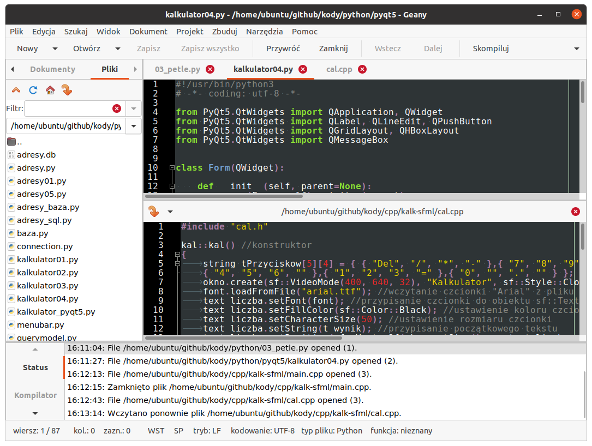
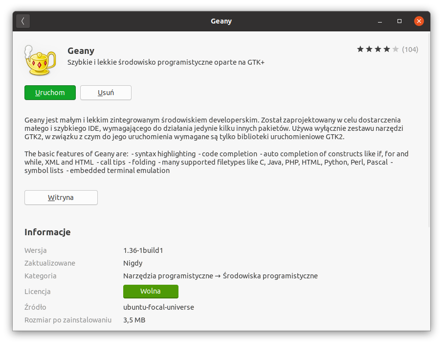
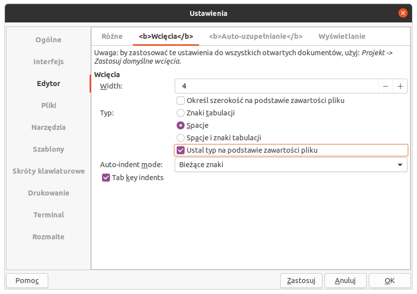
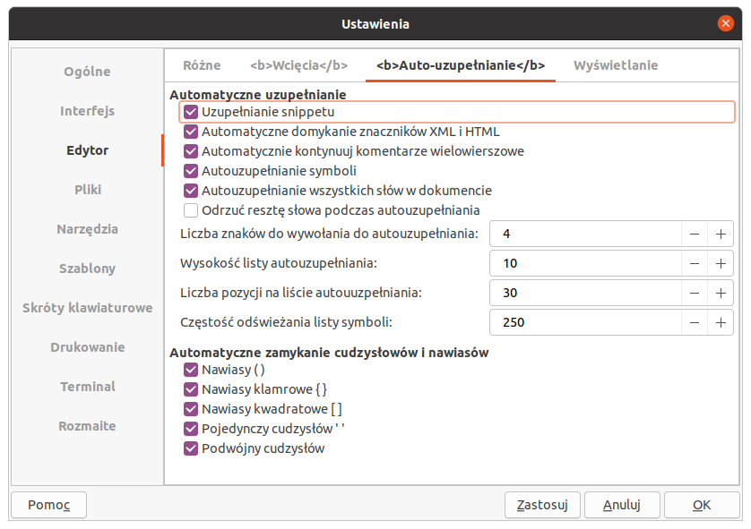
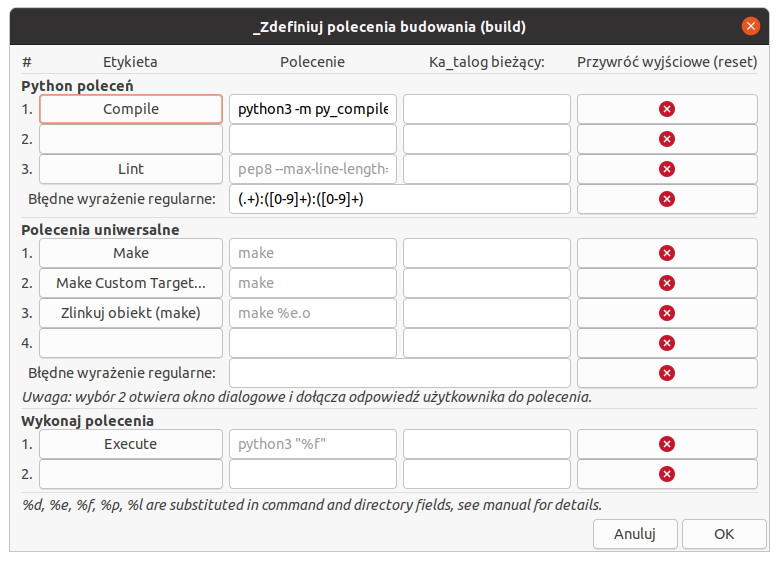
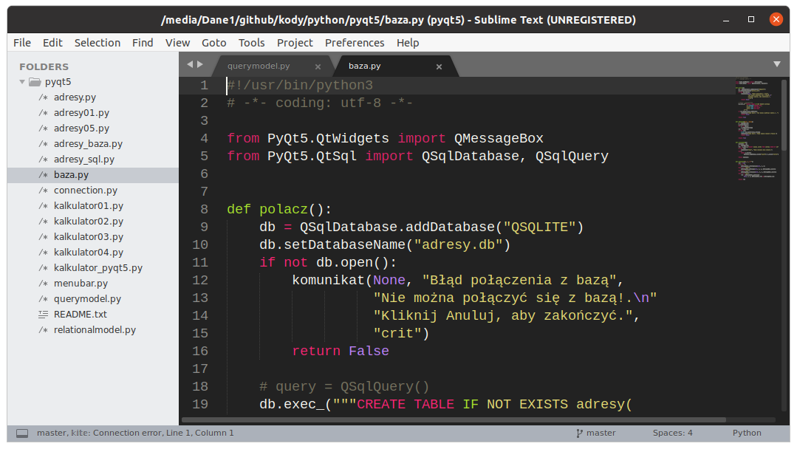
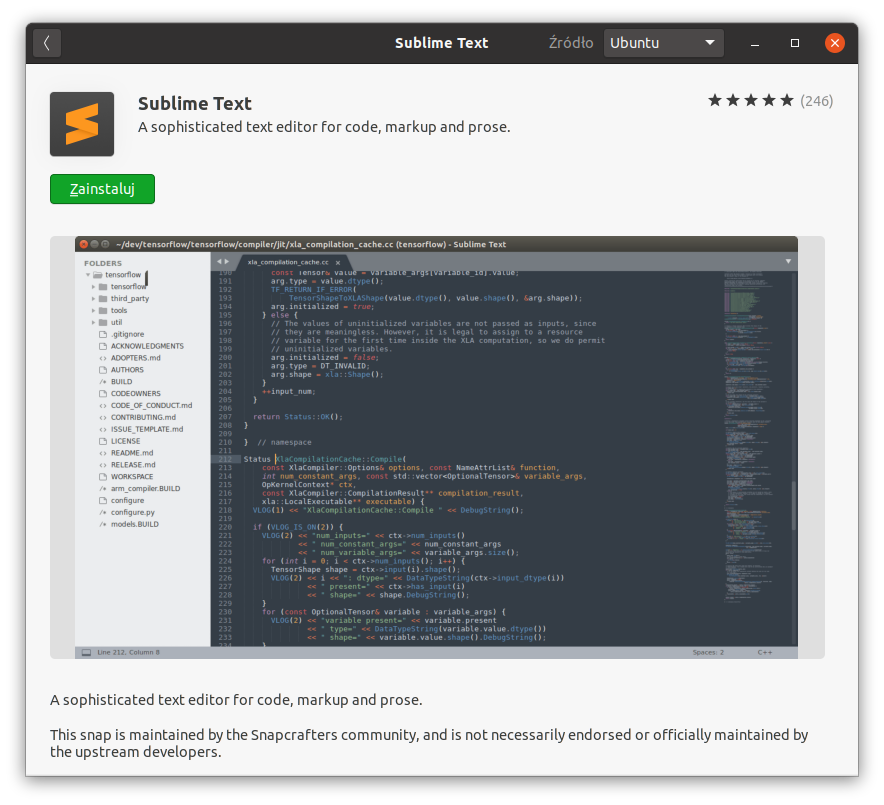

.. _edytory:

Edytory
#######

Edytory programistyczne to edytory plików źródłowych zapisywanych w postaci tekstu. Wszystkie oferują
mechanizmy ułatwiające kodowanie, takie jak kolorowanie składni, wsparcie standardów kodowania, automatyczne
domykanie nawiasów, cudzysłowów, tagów, autowcięcia, dopełnianie poleceń, czy wreszcie
kompilowanie, budowanie i uruchamianie tworzonego kodu. Wymienione poniżej edytory mają budowę
modułową, tzn. obsługują wtyczki, za pomocą których rozszerzamy możliwości programu.

.. _geany-opis:

Geany
=====

`Geany <http://www.geany.org>`_ to proste i lekkie środowisko IDE dostępne na
licencji `GNU General Public Licence <http://pl.wikipedia.org/wiki/GNU_General_Public_License>`_.

Linux
----------------

W systemach linuksowych korzystamy z dedykowanych menedżerów, np. w Ubuntu (Linux Mint itp.)
wystarczy wpisać w terminalu:

.. code-block:: bash

   ~$ sudo apt-get install geany geany-plugins

Można też skorzystać z graficznego instalatora "Oprogramowanie".

Windows
------------------

Ze strony `Download / Releases <http://www.geany.org/Download/Releases>`_ ściągamy instalator
*geany-1.36_setup.exe* (wersja może być nowsza) i uruchamiamy. Podczas instalacji nic
nie musimy zmieniać. Następnie ze strony `Download Geany-Plugins <https://plugins.geany.org/downloads.html>`_
pobieramy *geany-plugins-1.36_setup.exe* (wersja może być nowsza) i doinstalowujemy wtyczki.
Podczas instalacji niczego nie musimy zmieniać.

Konfiguracja
------------

Dodatkowe **schematy kolorowania** składni można pobrać ze strony
`Geany Themes on GitHub <http://https://github.com/codebrainz/geany-themes>`_.
Katalog :file:`colorschemes` należy skopiować do katalogu konfiguracyjnego edytora, np.
w systemie Linux będzie to :file:`~/.config/geany`. Wyboru schematu kolorowania
dokonujemy w menu *Widok / Schematy kolorów*.

**Wtyczki** włączamy w menu `Narzędzia / Menedżer wtyczek`. Warto zaznaczyć przynajmniej "Addons" i "Przeglądarka plików".
Zanim wyjdziemy z okna naciskamy przycisk "Preferencje" i na zakładce
"Przeglądarka plików" zaznaczamy opcję "Podążanie za ścieżką do bieżącego pliku".

W menu `Edycja / Preferencje` :kbd:`CTRL+ALT+P` w zakładce `Edytor / Wcięcia` zaznaczamy opcje,
jak na zrzucie poniżej:

W następnej zakładce `Auto-uzupełnianie` zaznaczmy m.in. domykanie nawiasów:

Czcionki można dostosować w `Edycja / Preferencje / Interfejs`.

Kodowanie
---------

W zależności od języka programowania nowe pliki można tworzyć na podstawie szablonów:
`Plik / Nowy z szablonu`. Menu *Zbuduj* zawiera polecenia kompilacji (:kbd:`F8`),
budowania (:kbd:`F9`) oraz uruchamiania kodu (:kbd:`F5`). Narzędzia wykorzystywane
do wykonywania tych akcji definiujemy w *Zbuduj / Zdefiniuj polecenia budowania*.
Np. dla kodu Pythona warto (zwłaszcza w systemie Linux) wskazać interpreter w wersji 3:

Wcięcia wstawiają się automatycznie lub poprzez naciśnięcie klawisza :kbd:`TAB`.
Jeżeli chcielibyśmy wciąć od razu cały blok kodu, zaznaczamy go i również używamy :kbd:`TAB`
lub :kbd:`CTRL+I`, zmniejszenie wcięcia uzyskamy naciskając :kbd:`CTRL+U`.

.. _st3-opis:

Sublime Text 3
==============

Sublime Text 3 to szybki, lekki i elastyczny edytor dla programistów. Wybrane narzędzia:

   * wygodne otwieranie plików: :kbd:`CTRL+P`,
   * wielokrotna selekcja i edycja: po zaznaczeniu zmiennej :kbd:`CTRL+D`,
   * zaznaczenie wszystkich wystąpień i jednoczesna edycja: :kbd:`ALT+F3`,
   * lista wszystkich poleceń: :kbd:`CTRL+SHIFT+P`
   * równoczesna edycja kilku plików: *View / Layout*

Linux
-----------------

W Ubuntu i podobnych systemach (Linux Mint) wchodzimy na stronę
`Linux Package Manager Repositories <http://www.sublimetext.com/docs/3/linux_repositories.html>`_
i wykonujemy instrukcje dla menedżera `apt` wybierając wersję stabilną (ang. *stable*).

Można też skorzystać z graficznego instalatora "Oprogramowanie".

W Windows
------------------

Po wejściu na stronę `Sublime Text 3 <http://www.sublimetext.com/3>`_
pobieramy archiwum dla wersji 32- lub 64-bitowej. Instalujemy standardowo
dwukrotnie klikając pobrany plik.

Konfiguracja
------------

Wtyczki do ST3 przechowywane są w repozytorium `Package Control <https://packagecontrol.io/>`_,
zarządzamy nimi z poziomu edytora. Na początku instalujemy *Package Control*: wywołujemy listę
poleceń :kbd:`CTRL+SHIFT+P`, wpisujemy *Install Package Control* i zatwierdzamy :kbd:`Enter`.

Wtyczki instalujemy po wybraniu listy poleceń i wpisaniu *Install Package*. W wyświetlonym oknie
wpisujemy nazwę wtyczki i po jej odnalezieniu i zaznaczeniu zatwierdzamy naciśnięciem :kbd:`Enter`.

Polecane wtyczki:

* `Anaconda <https://packagecontrol.io/packages/Anaconda>`_ – podstawowy dodatek do programowania w Pythonie
  dostępny w menu podręcznym podczas edycji plików ".py".
* `Emmet <https://packagecontrol.io/packages/Emmet>`_ – rozszerzanie składni HTML, CSS itp.
* `SublimeREPL <https://packagecontrol.io/packages/SublimeREPL>`_ – pozwala uruchamiać kod Pythona
  w edytorze za pomocą skrótu :kbd:`CTRL+SHIFT+R` lub :kbd:`CTRL+B`
* `Color Picker <https://packagecontrol.io/packages/ColorPicker>`_ –
  dodaje próbnik kolorów wywoływany skrótem :kbd:`CTRL+SHIFT+C`

Niektóre wtyczki wymagają ustawień, które opisane są w dokumentacji.
Globalne ustawienia edytora definiujemy w *Preferences >Settings – User*.
Ustawienia dla wybranego języka programowania dostępne są po wybraniu
*Preferences > Settings – More > Syntax Specific – User*,
plik należy zapisać pod nazwą *LANGUAGE.sublime-settings*, np. *Python.sublime-settings*
w podkatalogu :file:`Packages/User`.

Obsługa Git-a
-------------

Za pomocą wtyczki:

* `GitSavvy <https://packagecontrol.io/packages/GitSavvy>`_ – po instalacji wciśnij
  :kbd:`CTRL+SHIFT+P`, wpisz "git" i wybierz "git:status"

Za pomocą dedykowanego programu `Sublime Merge <https://www.sublimemerge.com/>`_.
W systemie Linux Ubuntu itp., jeżeli dodaliśmy wcześniej repozytoria dla SublimeText3,
wystarczy wydać polecenie:

.. code-block:: bash

   sudo apt install sublime-merge

– lub skorzystać z graficznego instalatora "Oprogramowanie".
W Windows pobieramy instalator ze strony `Download <https://www.sublimemerge.com/download>`_
i instalujemy.

Poprawnie zainstalowany program można wywołać z poziomu SublimeText3,
jeżeli otworzyliśmy katalog zawierający repozytorium. Wystarczy kliknąć charakterystyczną dla Gita
rozgałęzioną ikonę na dolnym pasku statusu.

Skrypty Pythona
---------------

Zainstaluj dodatki Anaconda i SublimeREPL. Utwórz pusty plik i zapisz z rozszerzeniem ``.py``.
Wybierz *Preferences / Settings – Syntax Specific*. W otwartym pliku :file:`Python.sublime-settings` wklej kod:

.. code-block:: bash

   {
     // editor options
     // tabs and whitespace
     "auto_indent": true,
     "ensure_newline_at_eof_on_save": true,
     "folder_exclude_patterns":
     [
       ".svn",
       ".git",
       ".hg",
       "CVS",
       "__pycache__"
     ],
     "indent_to_bracket": true,
      "rulers": [79],
      "shift_tab_unindent": true,
      "smart_indent": true,
      "tab_size": 4,
      "translate_tabs_to_spaces": true,
      "trim_automatic_white_space": true,
      "use_tab_stops": true,
      "word_wrap": true,
      "wrap_width": 80
   }

Plik powinien zostać zapisany w podkatalogu :file:`sublime-text-3/Packages/User` znajdującym się
w katalogu konfiguracyjnym (zob. :term:`katalog konfiguracyjny`) użytkownika.

.. tip::

   Zawartość katalogu, o którym mowa powyżej, możesz przywołać wybierając *Preferences / Browse Packages*
   i wchodząc do katalogu :file:`User`.

Uruchomienie skryptu Pythona polega na naciśnięciu skrótu :kbd:`CTRL+SHIFT+R` lub :kbd:`CTRL+B`,
skrypt zostanie uruchomiony w nowej karcie edytora. Po wykonaniu skryptu warto kartę zamknąć :kbd:`CTRL+W`.

Systemy budowania
-----------------

Do kompilacji (budowania) i ewentualnie uruchamiania SublimeText3 wykorzystuje różne systemy budowania.
Dostępne systemy sprawdzisz i wybierzesz w *Tools / Build System*. Skrót :kbd:`CTRL+B` powinien wywołać
automatycznie dobrany system dla danego języka.

W przypadku języka Python skrypty można uruchamiać za pomocą wtyczki SublimeREPL lub zdefiniowanego systemu,
co przydaje się wtedy, kiedy mamy kilka wersji Pythona.

Przykładowy nowy system dla Pythona 3 tworzymy wybierając *Tools / Build System / New Build System*,
do pliku wklejamy kod:

.. code-block:: bash

   {
     "cmd": ["/usr/bin/python3", "$file"],
     "selector": "source.python",
     "file_regex": '^[ ]*File "(...*?)", line ([0-9]*)'
   }

– zapisujemy pod nazwą :file:`Python3.sublime-build` w katalogu :file:`User`.
Trzeba zwrócić uwagę na polecenie podawane w kluczu "cmd", musi ono być adekwatne dla używanego systemu operacyjnego.

C++
---

Programy w C++ powinny być budowane automatycznie po naciśnięciu :kbd:`CTRL+B`, ale po zainstalowaniu kompilatora
MinGW w systemie Windows warto stworzyć nowy system budowania i umieścić w nim kod:

.. code-block:: bash

   {
     "cmd": ["g++", "-o", "${file_path}/${file_base_name}.exe", "-static-libgcc", "-static-libstdc++", "*.cpp"],
     "file_regex": "^(..[^:]*):([0-9]+):?([0-9]+)?:? (.*)$",
     "working_dir": "${file_path}",
     "selector": "source.c, source.cpp, source.c++",
     "path": "c:/Program Files/mingw-w64/mingw64/bin",
     "shell": true,
     "variants": [
        {
          "name": "Run",
          "cmd": ["g++", "-o", "${file_path}/${file_base_name}.exe", "-static-libgcc", "-static-libstdc++", "*.cpp", "&", "${file_path}/${file_base_name}.exe"]
        }
      ]
   }

Plik zapisujemy pod nazwą :file:`C++.sublime-build` w katalogu :file:`User`.

Następnie pobieramy :download:`archiwum zip <ide/st3.zip>`
i wypakowujemy do katalogu :file:`~/.config` za pomocą menedżera archiwów
albo polecenia w terminalu:

.. code-block:: bash

    ~$ unzip st3.zip -d ~/.config

Następnie pobieramy :download:`archiwum zip <ide/st3.zip>`, wypakowujemy do katalogu
:file:`C:\\Użytkownicy\\nazwa_użytkownika\\Dane aplikacji` i zmieniamy nazwę folderu
:file:`sublime-text-3` na :file:`Sublime Text 3`.

Materiały
=========

1. `Edytor Geany <http://www.geany.org/>`_

