Git
###

`Git <http://pl.wikipedia.org/wiki/Git_%28oprogramowanie%29>`_ Source Code Mirror
– to rozproszony system wersjonowania kodów źródłowych napisany
przez `Linusa Torvaldsa <http://pl.wikipedia.org/wiki/Linus_Torvalds>`_,
twórcę `jądra Linux <http://pl.wikipedia.org/wiki/Linux_%28j%C4%85dro%29>`_.
Skrót SCM bywa również rozwijany jako *software configuration management*,
co oznacza "zarządzanie konfiguracją oprogramowania". Gita można używać
do rozwijania zarówno małych, jak i dużych projektów (np. Arch Linux, GIMP, jQuery).

Konto i repozytorium
====================

Przede wszystkim wchodzimy na stronę  `<https://github.com/>`_ i zakładamy konto podając:
nazwę użytkownika, email i hasło. Następnie dodajemy pierwsze puste repozytorium.
Możemy postępować wg poniższych instrukcji:

*   Krok 1 – `założenie konta <https://help.github.com/articles/signing-up-for-a-new-github-account/>`_;
    podajemy nazwę użytkownika, adres email i hasło, jako typ konta wybieramy *free*.
*   Krok 2 – `weryfikacja adresu e-mail <https://help.github.com/articles/verifying-your-email-address/>`_
*   Krok 3 – `zakładamy repozytorium <https://help.github.com/articles/create-a-repo/>`_ dla projektu,
    wybieramy typ *Public* (publiczne)

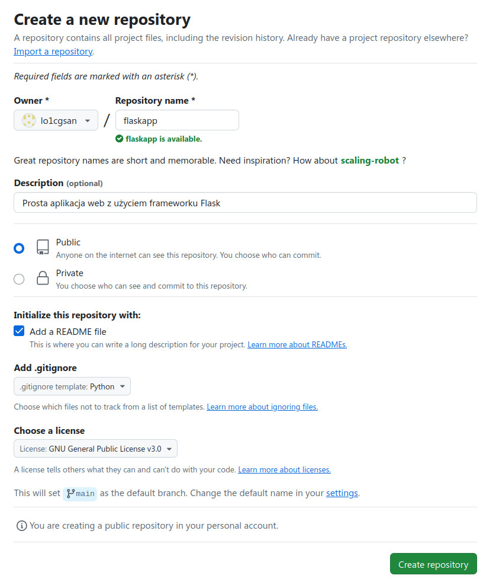

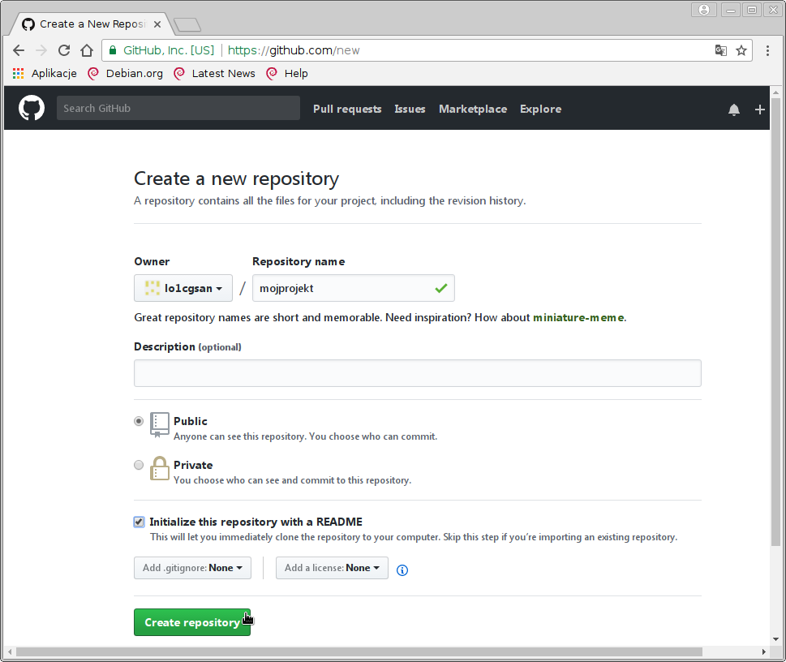

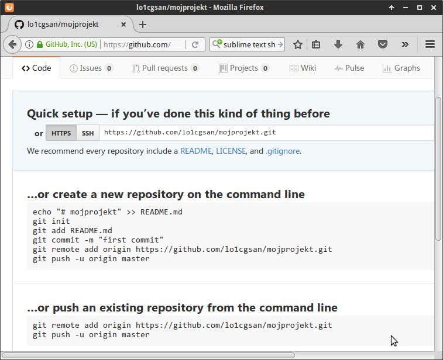

.. tip::

    Nie zamykaj powyższej strony! Będzie potrzebna za chwilę.

Linux i Windows
===============

Poniższy scenariusz napisano przy założeniu pracy w systemie Linux, który dla Gita
jest środowiskiem naturalnym. Przyjęto następujące założenia:

* polecenia mogą być wydawane w dowolnym terminalu;
* ``~$`` – oznacza katalog domowy użytkownika, czyli ścieżkę :file:`/home/nazwa_użytkownika`;
* ``~/mojprojekt$`` – to podkatalog projektu utworzony w katalogu domowym.

W systemie Windows:

* używamy konsoli ``Git Bash`` (skrót znajdziesz na pulpicie po zainstalowaniu klienta (zob. niżej));
* katalog domowy (:file:`C:\Users\nazwa_użytkownika`) nie jest najlepszym miejscem na pracę z projektem,
  katalog projektu proponujemy utworzyć na pulpicie lub lepiej na innej partycji (zob. zrzut w nast. sekcji);
* jeżeli ``Git Bash`` nie działa, używamy standardowej konsoli ``cmd``,
  ale wtedy musimy pamiętać o :ref:`kilku różnicach <cmdexe>`.

.. note::

    W obydwu systemach tworzenie katalogów i plików oraz ich edycja mogą być
    wykonywane przy użyciu narzędzi z interfejsem graficznym, czyli menedżera
    plików i edytora tekstu.

Klient i konfiguracja
=====================

Treściami projektu można zarządzać bezpośrednio w serwisie *GitHub*
za pomocą przeglądarki. Częściej jednak pracujemy w repozytorium lokalnym,
obsługiwanym za pomocą jakiegoś programu. Do nauki Gita najlepszy jest podstawowy
klient tekstowy działający w terminalu.

W **Linuksie** instalacja sprowadza się do użycia odpowiedniego menedżera pakietów:

.. code-block:: bash

    w Debianie (Ubuntu, Mint):
    ~$ sudo apt-get install git
    w Archu (Manjaro, Antergos):
    ~# pacman -S git

W **Windows** tego samego klienta tekstowego pobieramy ze strony
`<http://git-scm.com/download/win>`_ i instalujemy z konta zwykłego użytkownika
zaznaczając wskazane na poniższym zrzucie opcje:

.. figure:: img/git_shell_install.jpg

.. note::

    Po zrozumieniu podstaw Gita można oczywiście zainstalować programy
    z interfejsem graficznym, np.: `SmartGit <http://www.syntevo.com/smartgit/>`_,
    lub obsługiwać repozytorium z poziomu edytora kodu,
    np. Sublime Text 3 czy PyCharm.

**Podstawowa konfiguracja**: w terminalu wydajemy polecenia:

.. code-block:: bash

    ~$ git config --global user.name "nazwa_użytkownika"
    ~$ git config --global user.email email_użytkownika
    ~$ git config --list

Podana nazwa użytkownika i email będą wykorzystywane do podpisywania wprowadzanych
w projekcie zmian.

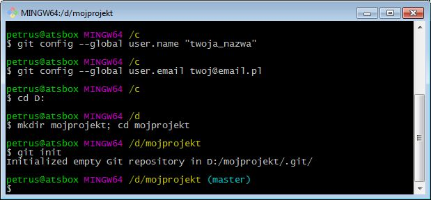

   Początek pracy z Gitem w Git-Bash pod Windows

Nowe repozytorium
=================

Repozytorium lokalne możemy utworzyć od podstaw, a później dopiero połączyć go ze zdalnym.
Wydajemy polecenia:

.. code-block:: bash

    ~$ mkdir mojprojekt; cd mojprojekt
    ~/mojprojekt$ git init
    ~/mojprojekt$ echo "Moje pierwsze repozytorium" > README.md
    ~/mojprojekt$ git status
    ~/mojprojekt$ git add README.md
    ~/mojprojekt$ git status
    ~/mojprojekt$ git commit -m "Dodanie opisu projektu"

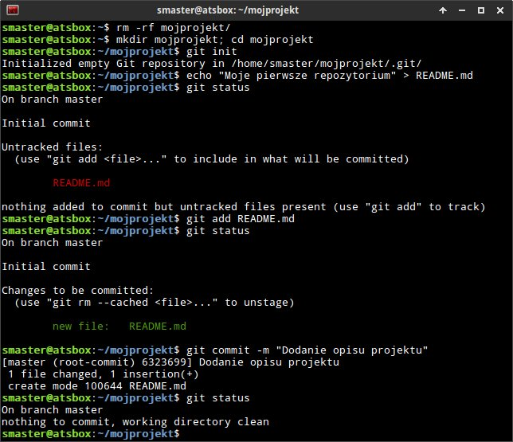

- na początku tworzymy katalog dla projektu i wchodzimy do niego;
- ``git init`` inicjuje repozytorium w ukrytym katalogu :file:`.git`;
- ``echo`` tworzy plik :file:`README.md` z opisem projektu
  (można to zrobić w dowolnym edytorze);
- ``git status`` – pokazuje status plików;
- ``git add nazwa_pliku`` – przenosi plik do "poczekalni";
- ``git commit -m "komentarz"`` – zatwierdza zmiany w repozytorium, tworząc tzw. migawkę.

.. note::

    Jeżeli pominiemy w ``git commit`` przełącznik ``-m`` otwarty zostanie domyślny edytor,
    w którym należy opisać dokonywane zmiany.

Stany plików
============

Podczas pracy nad projektem stan pliku zależy od miejsca, w którym się on znajduje.
Git wyróżnia **trzy przestrzenie**:

* katalog roboczy (ang. *working directory*);
* poczekalnia (ang. staging area);
* repozytorium (katalog .git).

.. figure:: img/areas.png

Możliwe stany plików to:

* **nieśledzony** (ang. *untracked*) – nowe pliki w katalogu roboczym;
  polecenie ``git add`` rozpoczyna ich śledzenie;
* **śledzony** (ang. *tracked*):

  * niezmieniony (ang. *unmodified*) w katalogu roboczym;
  * zmieniony (ang. *modified*) w katalogu roboczym;
  * czekający na zatwierdzenie (ang. *staged*) – pliki w poczekalni dodane poleceniem ``git add``;

.. figure:: img/lifecycle.png

Polecenie ``git commit`` zatwierdza aktualną zawartość poczekalni w migawce
(ang. *snapshot*) tworzonej w repozytorium.

Master i origin
===============

Repozytorium lokalne można połączyć i zsynchronizować ze zdalnym. Wystarczy użyć poleceń,
które sugeruje GitHub po utworzeniu pustego repozytorium. Wracamy do przeglądarki,
kopiujemy i wykonujemy w terminalu polecenia:

.. code-block:: bash

    ~/mojprojekt$ git remote add origin https://github.com/nazwa_konta/mojprojekt.git
    ~/mojprojekt$ git push -u origin master

* ``git remote`` – dodaje zdalne repozytorium określone przez *Git URL* do lokalnego;
* ``git push`` – synchronizuje zawartość aktualnej lokalnej gałęzi ``master``
  z repozytorium zdalnym o domyślnej nazwie ``origin``.

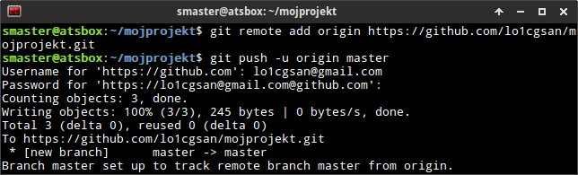

W wyniku powyższych operacji lokalna gałąź *master* zaczyna śledzić zdalną
o takiej samej nazwie.

.. tip::

    **Sprawdź** w przeglądarce, czy zawartość repozytorium zdalnego odpowiada lokalnemu.

Klonowanie repozytorium
=======================

.. warning::

    Jeżeli wykonujesz scenariusz od początku i sprawdziłeś, że zawartość zdalnego
    repozytorium na GitHubie odpowiada lokalnemu, usuń teraz lokalny katalog
    :file:`mojprojekt` za pomocą menedżera plików lub polecenia:

    .. code-block:: bash

        ~$ rm -rf ~/mojprojekt

Repozytorium lokalne utworzymy również przez klonowanie. Możemy klonować założone
przez siebie na GitHubie repozytoria lub istniejące publiczne (wtedy tworzymy tzw. forki).
Sprowadza się to do wydania polecenia w terminalu:

.. code-block:: bash

    ~$ git clone https://github.com/nazwa_użytkownika/nazwa_repozytorium.git [nazwa_katalogu]

Najważniejszy jest argument *Git URL*, czyli schematyczny adres repozytorium,
który możemy pobrać na stronie głównej repozytorium klikając przycisk "Clone or download":

.. figure:: img/git_clone.jpg

W rezultacie w bieżącym katalogu utworzony zostanie katalog o nazwie repozytorium
lub o nazwie podanej w opcjonalnym argumencie `[nazwa_katalogu]`.

Praca z repozytorium
=====================

Zmiany zdalne
-------------

Wprowadźmy kilka przykładowych zmian w projekcie za pomocą interfejsu serwisu GitHub:

* Zmieńmy plik :file:`README.md`: klikamy jego nazwę, a następnie ikonę
  edycji w prawym górnym rogu obok przycisku "History". Dopisujemy coś, przewijamy w dół,
  wpisujemy opis zmiany i zatwierdzamy klikając "Commit changes".

* Następnie tworzymy nowy plik :file:`pierwszy.txt` klikając przycisk "Create new file" w głównym
  widoku repozytorium. Wpisujemy coś i zatwierdzamy zmiany.

.. figure:: img/git_zdalne.jpg

Pobranie i scalenie
-------------------

Ponieważ dokonaliśmy zmian w repozytorium zdalnym (*origin*), repozytorium lokalne jest nieaktualne.
Sytuacja taka może być częsta, zwłaszcza gdy projekt rozwijany jest zespołowo.
Dlatego codzienną pracę warto rozpoczynać od ściagnięcia (ang. *fetch*) zmian zdalnych i
scalenia (ang. *merge*) z wersją lokalną:

.. code-block:: bash

    ~$ git pull [origin] [master]

Opcjonalne argumenty określają nazwy repozytorium zdalnego i lokalnej gałęzi.
Ewentualny komunikat "Already up-to-date." oznacza brak zmian na serwerze.

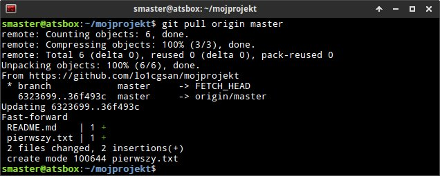

Zmiany lokalne
--------------

Praca w repozytorium lokalnym jest najwygodniejsza. Przećwiczmy typowe operacje.
Zmienimy treść pliku :file:`README.md` i utworzymy plik :file:`drugi.txt`:

.. code-block:: bash

    ~/mojprojekt$ echo "Zmiana lokalna" >> README.md
    ~/mojprojekt$ echo "Drugi plik" > drugi.txt
    ~/mojprojekt$ git status
    ~/mojprojekt$ git diff
    ~/mojprojekt$ git add --all
    ~/mojprojekt$ git diff
    ~/mojprojekt$ git diff --staged

* ``git diff`` – pokazuje różnice między katalogiem roboczym a poczekalnią, ale bez plików nieśledzonych;
* ``git add --all`` – dodaje do poczekalni wszystkie zmiany z katalogu roboczego;
* ``git diff --staged`` – pokaże zmiany między poczekalnią a ostatnią migawką projektu.

Zauważmy, że po dodaniu zmian do poczekalni polecenie ``git diff`` nie pokazuje żadnych różnic.

.. tip::

    Podczas dodawania plików do poczekalni można używać symboli wieloznacznych i nazw katalogów,
    np. ``git add '*.txt'`` lub ``git add doc``. Można też korzystać z poleceń powłoki, np.:
    ``find . -name "*.rst" -exec git add {} \;``. Inne warianty to:

      * ``git add -A`` – dodanie wszystkich zmian;
      * ``git add .`` – dodanie plików nowych i zmienionych, ale nie usuniętych;
      * ``git add -u`` – dodanie zmienionych i usuniętych, ale nie nowych.

Zróbmy teraz kolejną zmianę w pliku :file:`README.md` i sprawdżmy status:

.. code-block:: bash

    ~/mojprojekt$ echo "Druga zmiana lokalna" >> README.md
    ~/mojprojekt$ git status
    ~/mojprojekt$ git diff
    ~/mojprojekt$ git diff --staged

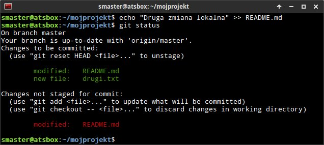

Jak widać, plik :file:`README.md` ma dwie wersje! Jedna (poprzednia) znajduje się w poczekalni,
a aktualna w katalogu roboczym i ma status zmienionej. Chcąc włączyć ją do najbliższej migawki
należałoby ją ponownie dodać poleceniem ``git add``. Zrobimy inaczej, zatwierdzimy zmiany:

.. code-block:: bash

    ~/mojprojekt$ git commit -m "Zmiana pliku README i inne"
    ~/mojprojekt$ git status
    ~/mojprojekt$ git diff HEAD

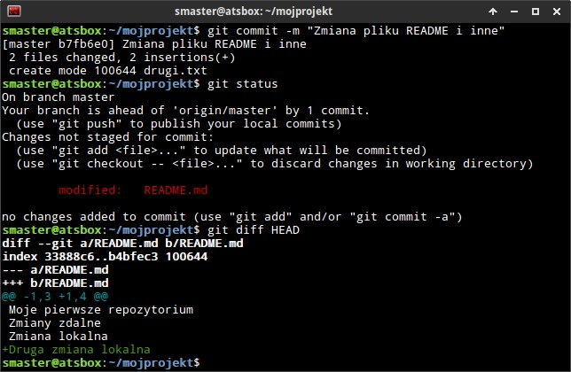

Która wersja pliku :file:`README.md` trafiła do migawki? Oczywiście ta z poczekalni,
o czym upewnia nas polecenie ``git diff HEAD``. Pokazuje ono wszystkie różnice między
ostatnią migawką (``HEAD``) a śledzonymi plikami.

Zmiany można też zatwierdzać bez dodawania ich do poczekalni, ale
operacja ta działa tylko dla plików śledzonych.:

.. code-block:: bash

    ~/mojprojekt$ git commit -am "Druga zmiana README.md"
    ~/mojprojekt$ git status

.. figure:: img/git_status3.jpg

Warto w tym miejscu zwrócić uwagę na komunikat statusu: *Your branch is ahead of 'origin/master' by 2 commits.*
– oznacza on, że mamy dwa lokalne zatwierdzenia nieprzesłane do repozytorium zdalnego.
Na razie zostawmy to, zajmiemy się tym później.

Cofanie zmian
-------------

Utworzymy teraz katalog :file:`doc`, a w nim pliki :file:`index.rst` i :file:`slownik.txt`
z przykładową treścią.

.. code-block:: bash

    ~/mojprojekt$ mkdir doc
    ~/mojprojekt$ echo "Dokumenty" >> doc/index.rst
    ~/mojprojekt$ echo "Słownik" >> doc/slownik.txt
    ~/mojprojekt$ git add .
    ~/mojprojekt$ git status
    ~/mojprojekt$ git reset HEAD doc/slownik.txt
    ~/mojprojekt$ git status

* ``git add .`` – dodaje nowe pliki do poczekalni (i rozpoczyna ich śledzenie);
* ``git reset HEAD nazwa_pliku`` – pozwala wycofanie pliku z poczekalni, w tym wypadku
  plik wraca do stanu "nieśledzony".

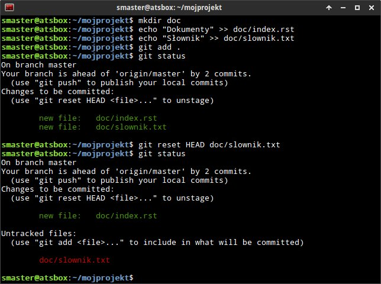

Wykonajmy teraz następujące polecenia, aby zobaczyć, jak cofać zmiany
niedodane do poczekalni:

.. code-block:: bash

    ~/mojprojekt$ git add doc
    ~/mojprojekt$ echo "Katalog projektu" >> doc/katalog.rst
    ~/mojprojekt$ echo "Słownik" >> doc/slownik.rst
    ~/mojprojekt$ git add .
    ~/mojprojekt$ echo "Dokumentacja projektu" >> doc/katalog.rst
    ~/mojprojekt$ cat doc/katalog.rst
    ~/mojprojekt$ git checkout -- doc/katalog.rst
    ~/mojprojekt$ cat doc/katalog.rst

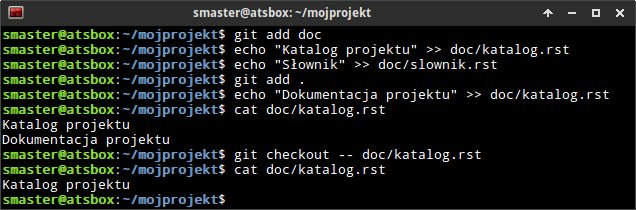

.. warning::

    Użycie ``git checkout -- nazwa_pliku`` usuwa wprowadzone zmiany bezpowrotnie.

Historia zmian
--------------

Zatwierdzimy dotychczasowe zmiany, przejrzymy listę i sprawdzimy,
jak wyglądała pierwsza wersja pliku :file:`README.md`:

.. code-block:: bash

    ~/mojprojekt$ git commit -m "Dodanie katalogu doc"
    ~/mojprojekt$ git log
    ~/mojprojekt$ git checkout 75468
    ~/mojprojekt$ cat README.md
    ~/mojprojekt$ git checkout master
    ~/mojprojekt$ cat README.md

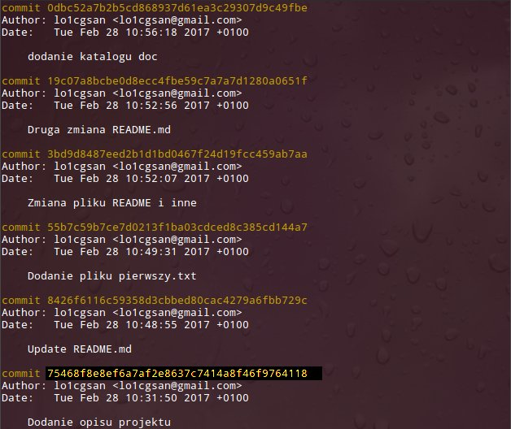

* ``git log`` – pokazuje historię zmian, każda zmiana oznaczona jest unikalnym skrótem typu ``commit 75468...``; wypróbuj: ``git log --pretty=format:"%h - %s"``;
* ``git checkout 75468`` – przełącza nas do migawki oznaczonej podanym początkiem skrótu;
* ``git checkout master`` – powracamy do stanu aktualnego.

Synchronizacja
--------------

Pozostaje przesłanie zmian do repozytorium zdalnego:

.. code-block:: bash

    ~/mojprojekt$ git push

* ``git log`` – pokaże listę zatwierdzeń, ;
* ``git push`` – przesyła zmiany lokalne do repozytorium zdalnego; prosi o podanie nazwy użytkownika
  i hasła do konta na GitHubie.

Operacje na plikach
-------------------

.. tip::

    Nie należy usuwać śledzonych plików/katalogów lub zmieniać ich nazw
    za pomocą narzędzi systemowych, np. menedżera plików, ponieważ
    Git nie będzie nic o tym wiedział i zasypie nas wieloma komunikatami
    podczas sesji.

Do zarządzania plikami używamy następujących poleceń:

.. code-block:: bash

    ~/mojprojekt$ git rm --cached "*.txt"
    ~/mojprojekt$ git mv doc/katalog.rst doc/projekt.rst
    ~/mojprojekt$ git status
    ~/mojprojekt$ git commit -a -m "Porządki  w projekcie"
    ~/mojprojekt$ git reset --soft HEAD~1
    ~/mojprojekt$ git rm -f "*.txt"
    ~/mojprojekt$ git status
    ~/mojprojekt$ git commit -a -m "Porządki  w projekcie"
    ~/mojprojekt$ git push

* ``git rm --cached`` – usuwa pliki śledzone z poczekalni, ale nie zdysku;
* jeżeli mają być usunięte również z dysku, używamy tylko ``git rm``;
* ``git mv`` – pozwala przenieść lub zmienić nazwę pliku;
* ``git reset --soft HEAD~1`` – anuluje ostatnie zatwierdzenie;
* ``git rm "*.txt"`` – usuwa pliki z poczekalni i z dysku, wymaga przełącznika ``-f``,
  jeżeli usuwany plik ma niezatwierdzone zmiany.

Rozwiązywanie konfliktów
------------------------

[todo]

Materiały
=========

.. tip::

    * Jeżeli podczas tworzenia repozytorium na GitHubie zaznaczymy opcję
      *Initialize this repository with a README*, utworzony zostanie plik,
      w którym umieszcza się opis projektu.
    * Do wygodnej pracy w systemie Windows można skonfigurować
      `Git w powłoce PowerShell <https://git-scm.com/book/be/v2/Git-in-Other-Environments-Git-in-Powershell>`_

.. _cmdexe:

.. note::

    Uwagi dla użytkowników powłoki ``cmd.exe`` w Windows:

    * separatorem w ścieżkach jest znak backslash ``\``, w wyrażeniach wieloznacznych używamy podwójnych
      cudzysłowów, np. ``"*.txt"``;
    * polecenia konsoli są inne:

      - ``md mojprojekt`` – utworzy katalog projektu (odpowiednik ``mkdir``);
      - ``rd /s /q mojprojekt`` – usunie katalog projektu (odpowiednik ``rm -rf``);
      - ``type doc\katalog.rst`` – pokaże zawartość pliku (odpowiednik ``cat``).

Pomijanie plików
----------------

Nie wszystkie typy plików powinny być synchronizowane między repozytorium lokalnym i zdalnym.
Np. pliki pośrednie tworzone przez kompilatory i interpretery, pliki tymczasowe, wirtualne
środowiska itp. zapychałyby nam niepotrzebnie repozytorium zdalne. Git pozwala zdefiniować
listę ignorowanych plików za pomocą wyrażeń wieloznacznych zapisanych w ukrytym pliku
(rozpoczyna się kropką!) :file:`.gitignore`, który umieszczamy w głównym katalogu projektu.
Pobierz i przejrzyj :download:`przykładową zawartość <gitignore.txt>`.
Inne przykładowe wzorce plików znajdziesz w repozytorium `gitignore <https://github.com/github/gitignore>`_.

Odwiedź
-------

1. `Strona projektu Git <http://git-scm.com/>`_.
2. `Pro Git v. 1 <https://git-scm.com/book/pl/v1>`_ – wersja polska.
3. `Python 101 – Git <http://python101.readthedocs.io/pl/latest/git/index.html>`_ (materiał w j. polskim)
4. :download:`Git Cheat Sheet <https://services.github.com/on-demand/downloads/github-git-cheat-sheet.pdf>`
5. `Pro Git v. 2 <https://git-scm.com/book/en/v2>`_ – wersja angielska.
