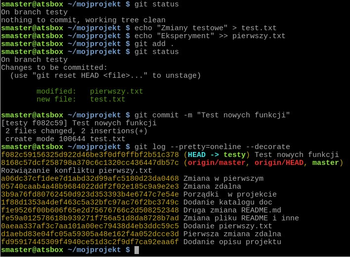
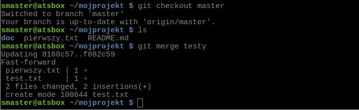

Git
###

`Git <http://pl.wikipedia.org/wiki/Git_%28oprogramowanie%29>`_ Source Code Mirror
– to rozproszony system wersjonowania kodów źródłowych napisany
przez `Linusa Torvaldsa <http://pl.wikipedia.org/wiki/Linus_Torvalds>`_,
twórcę `jądra Linux <http://pl.wikipedia.org/wiki/Linux_%28j%C4%85dro%29>`_.
Skrót SCM bywa również rozwijany jako *software configuration management*,
co oznacza "zarządzanie konfiguracją oprogramowania". Gita można używać
do rozwijania zarówno małych, jak i dużych projektów (np. Arch Linux, GIMP, jQuery).

Repozytorium zdalne
====================

Przede wszystkim wchodzimy na stronę  `<https://github.com/>`_ i zakładamy konto podając:
nazwę użytkownika, email i hasło. Następnie dodajemy pierwsze puste repozytorium.
Możemy postępować wg poniższych instrukcji:

*   Krok 1 – `założenie konta <https://help.github.com/articles/signing-up-for-a-new-github-account/>`_;
    podajemy nazwę użytkownika, adres email i hasło, jako typ konta wybieramy *free*.
*   Krok 2 – `weryfikacja adresu e-mail <https://help.github.com/articles/verifying-your-email-address/>`_
*   Krok 3 – `zakładamy repozytorium <https://help.github.com/articles/create-a-repo/>`_ dla projektu,
    wybieramy typ *Public* (publiczne)

.. figure:: img/git_repo01.jpg

.. figure:: img/git_repo02.jpg

.. figure:: img/git_repo03.jpg

.. tip::

    Nie zamykaj powyższej strony! Będzie potrzebna za chwilę.

Klient Gita
===========

Treściami projektu można zarządzać bezpośrednio w serwisie *GitHub*
za pomocą przeglądarki. Częściej jednak pracujemy w repozytorium lokalnym,
obsługiwanym za pomocą jakiegoś programu. Do nauki Gita najlepszy jest podstawowy
klient tekstowy działający w terminalu.

W systemie **Linux** instalacja sprowadza się do użycia odpowiedniego menedżera pakietów:

.. code-block:: bash

    w Debianie (Ubuntu, Mint):
    ~$ sudo apt-get install git
    w Archu (Manjaro, Antergos):
    ~# pacman -S git

Podczas pracy w Linuksie:

* polecenia mogą być wydawane w dowolnym terminalu;
* ``~$`` – oznacza katalog domowy użytkownika, czyli ścieżkę :file:`/home/nazwa_użytkownika`;
* ``~/mojprojekt$`` – to podkatalog projektu utworzony w katalogu domowym.

W systemie **Windows** tego samego klienta tekstowego pobieramy ze strony
`<http://git-scm.com/download/win>`_ i instalujemy z konta zwykłego użytkownika
zaznaczając wskazane na poniższym zrzucie opcje:

.. figure:: img/git_shell_install.jpg

Podczas pracy w Windows:

* używamy konsoli ``Git Bash`` (dostępna po zainstalowaniu klienta);
* katalog projektu proponujemy utworzyć na partycji innej niż systemowa (zob. zrzut w nast. sekcji);
* jeżeli ``Git Bash`` nie działa, używamy standardowej konsoli ``cmd``,
  ale wtedy musimy pamiętać o :ref:`kilku różnicach <cmdexe>`.

.. note::

    * Poniższy scenariusz napisano w oparciu o system Linux, który dla Gita
      jest środowiskiem naturalnym. Nie ma jednak problemów z jego realizacją w Windows.

    * W obydwu systemach tworzenie katalogów i plików oraz ich edycja mogą być
      wykonywane przy użyciu narzędzi z interfejsem graficznym, czyli menedżera
      plików i edytora tekstu.

    * Po zrozumieniu podstaw Gita można oczywiście zainstalować programy
      z interfejsem graficznym, np.: `SmartGit <http://www.syntevo.com/smartgit/>`_,
      lub obsługiwać repozytorium z poziomu edytora kodu,
      np. Sublime Text 3 czy PyCharm.

Konfiguracja
============

W terminalu wydajemy polecenia:

.. code-block:: bash

    ~$ git config --global user.name "nazwa_użytkownika"
    ~$ git config --global user.email email_użytkownika
    ~$ git config --global push.default simple
    ~$ git config --list

W powyższych poleceniach ustawiamy nazwę użytkownika i email, które będą wykorzystywane
do podpisywania wprowadzanych w projekcie zmian. Ustawienie ``push.default simple``
określa sposób synchronizowania repozytorium lokalnego ze zdalnym.

.. figure:: img/git_bash.jpg

   Początek pracy z Gitem w Git-Bash pod Windows

Repozytorium lokalne
====================

Repozytorium lokalne można utworzyć poprzez sklonowanie zdalnego lub od podstaw.
Przećwiczymy ten drugi sposób, a później nowo utworzone repozytorium połączymy ze zdalnym.
Wydajemy polecenia:

.. code-block:: bash

    ~$ mkdir mojprojekt; cd mojprojekt
    ~/mojprojekt$ git init
    ~/mojprojekt$ echo "Moje pierwsze repozytorium" > README.md
    ~/mojprojekt$ git status
    ~/mojprojekt$ git add README.md
    ~/mojprojekt$ git status
    ~/mojprojekt$ git commit -m "Opis projektu"

.. figure:: img/git_init.jpg

- na początku tworzymy katalog dla projektu i wchodzimy do niego;
- ``git init`` inicjuje repozytorium w ukrytym katalogu :file:`.git`;
- ``echo`` tworzy plik :file:`README.md` z opisem projektu (można to zrobić w dowolnym edytorze);
- ``git status`` – pokazuje status plików;
- ``git add nazwa_pliku`` – przenosi plik do "poczekalni";
- ``git commit -m "komentarz"`` – zatwierdza zmiany w repozytorium, tworząc tzw. migawkę,
  po przełączniku ``-m`` podajemy opis zmian.

.. note::

    Jeżeli pominiemy opcję ``-m`` otwarty zostanie domyślny edytor,
    w którym należy opisać zatwierdzane zmiany.

Stany plików
============

Podczas pracy nad projektem stan pliku zależy od miejsca, w którym się on znajduje.
Git wyróżnia **trzy przestrzenie**:

* katalog roboczy (ang. *working directory*);
* poczekalnia (ang. staging area);
* repozytorium (katalog :file:`.git`).

.. figure:: img/areas.png

Możliwe stany plików to:

* **nieśledzony** (ang. *untracked*) – nowe pliki w katalogu roboczym;
* **śledzony** (ang. *tracked*):

  * niezmieniony (ang. *unmodified*) w katalogu roboczym;
  * zmieniony (ang. *modified*) w katalogu roboczym;
  * czekający na zatwierdzenie (ang. *staged*) – pliki w poczekalni dodane poleceniem ``git add``;

.. figure:: img/lifecycle.png

Polecenia:

* ``git add`` – rozpoczyna śledzenie nowych plików oraz przenosi do poczekalni pliki śledzone i zmodyfikowane;
* ``git commit`` – zatwierdza aktualną zawartość poczekalni w migawce (ang. *snapshot*) tworzonej w repozytorium.

Master i origin
===============

Repozytorium lokalne połączymy i zsynchronizujemy ze zdalnym, które utworzyliśmy wcześniej.
Wracamy do przeglądarki, na stronę nowo utworzonego repozytorium zdalnego.
Kopiujemy, wklejamy i wykonujemy w terminalu polecenia sugerowane przez Gita:

.. code-block:: bash

    ~/mojprojekt$ git remote add origin https://github.com/nazwa_konta/mojprojekt.git
    ~/mojprojekt$ git push -u origin master

* ``git remote add`` – dodaje zdalne repozytorium określone przez *Git URL* do lokalnego;
* ``git push`` – synchronizuje zawartość aktualnej lokalnej gałęzi ``master``
  z repozytorium zdalnym o domyślnej nazwie ``origin``.

.. figure:: img/git_remote.jpg

W wyniku powyższych operacji lokalna gałąź *master* zaczyna śledzić zdalną
o takiej samej nazwie.

.. tip::

    **Sprawdź** w przeglądarce, czy zawartość repozytorium zdalnego odpowiada lokalnemu.

Klonowanie repozytorium
=======================

.. warning::

    Jeżeli sprawdziłeś, że zawartość zdalnego repozytorium na GitHubie
    odpowiada lokalnemu, usuń teraz katalog :file:`mojprojekt`
    za pomocą menedżera plików lub polecenia:

    .. code-block:: bash

        ~$ rm -rf ~/mojprojekt

Repozytorium lokalne powstaje również poprzez sklonowanie zdalnego. Możemy klonować założone
przez siebie na GitHubie repozytoria lub istniejące publiczne (wtedy tworzymy tzw. forki).
Wystarczy polecenie w terminalu:

.. code-block:: bash

    ~$ git clone https://github.com/nazwa_użytkownika/nazwa_repozytorium.git [nazwa_katalogu]

Najważniejszy jest argument *Git URL*, czyli schematyczny adres repozytorium,
który możemy pobrać na stronie głównej repozytorium po kliknięciu w przycisk "Clone or download":

.. figure:: img/git_clone.jpg

W rezultacie w bieżącym katalogu utworzony zostanie katalog o nazwie repozytorium
lub o nazwie podanej w opcjonalnym argumencie `[nazwa_katalogu]`.

Zmiany zdalne
=============

Wprowadźmy kilka przykładowych zmian w projekcie za pomocą interfejsu serwisu GitHub:

* Zmieńmy plik :file:`README.md`: klikamy jego nazwę, a następnie ikonę
  edycji w prawym górnym rogu obok przycisku "History". Dopisujemy coś, przewijamy w dół,
  wpisujemy opis zmiany i zatwierdzamy klikając "Commit changes".

* Następnie tworzymy nowy plik :file:`pierwszy.txt` klikając przycisk "Create new file" w głównym
  widoku repozytorium. Wpisujemy coś i zatwierdzamy zmiany.

.. figure:: img/git_zdalne.jpg

Pobranie i scalenie
===================

Ponieważ dokonaliśmy zmian w repozytorium zdalnym (*origin*), repozytorium lokalne jest nieaktualne.
Sytuacja taka może być częsta, zwłaszcza gdy projekt rozwijany jest zespołowo.
Dlatego codzienną pracę warto rozpoczynać od ściągnięcia (ang. *fetch*) zmian zdalnych i
scalenia (ang. *merge*) ich z wersją lokalną:

.. code-block:: bash

    ~$ cd mojprojekt
    ~/mojprojekt$ git pull [origin] [master]

Opcjonalne argumenty określają nazwy repozytorium zdalnego i lokalnej gałęzi.
Ewentualny komunikat "Already up-to-date." oznacza brak zmian na serwerze.

.. figure:: img/git_pull.jpg

Zmiany lokalne
==============

Praca w repozytorium lokalnym jest najwygodniejsza. Przećwiczmy typowe operacje.
Zmienimy treść pliku :file:`README.md` i utworzymy plik :file:`drugi.txt`:

.. code-block:: bash

    ~/mojprojekt$ echo "Pierwsza zmiana lokalna" >> README.md
    ~/mojprojekt$ echo "Drugi plik" > drugi.txt
    ~/mojprojekt$ git status
    ~/mojprojekt$ git diff
    ~/mojprojekt$ git add --all
    ~/mojprojekt$ git diff
    ~/mojprojekt$ git diff --staged

* ``git diff`` – pokazuje różnice między katalogiem roboczym a poczekalnią, ale bez plików nieśledzonych;
* ``git add --all`` – dodaje do poczekalni wszystkie zmiany z katalogu roboczego;
* ``git diff --staged`` – pokaże zmiany między poczekalnią a ostatnią migawką projektu.

Zauważmy, że po dodaniu zmian do poczekalni polecenie ``git diff`` nie pokazuje żadnych różnic.

Zróbmy teraz kolejną zmianę w pliku :file:`README.md` i sprawdźmy status:

.. code-block:: bash

    ~/mojprojekt$ echo "Druga zmiana lokalna" >> README.md
    ~/mojprojekt$ git status
    ~/mojprojekt$ git diff
    ~/mojprojekt$ git diff --staged

.. figure:: img/git_status.jpg

Jak widać, plik :file:`README.md` ma dwie wersje! Jedna (poprzednia) znajduje się w poczekalni,
a aktualna w katalogu roboczym i ma status zmienionej. Chcąc włączyć ją do najbliższej migawki
należałoby ją ponownie dodać poleceniem ``git add``. Zrobimy inaczej, zatwierdzimy zmiany:

.. code-block:: bash

    ~/mojprojekt$ git commit -m "Zmiana pliku README i inne"
    ~/mojprojekt$ git status -vv
    ~/mojprojekt$ git diff HEAD

.. figure:: img/git_status2.jpg

Która wersja pliku :file:`README.md` trafiła do migawki? Oczywiście ta z poczekalni,
o czym upewniają nas ostatnie polecenia:

* ``git status -vv`` – pokazuje stan repozytorium oraz wszystkie zmiany w śledzonych plikach;
* ``git diff HEAD`` – pokazuje wszystkie różnice między ostatnią migawką a śledzonymi plikami.

Zmiany można też zatwierdzać z pominięciem poczekalni, ale
operacja ta działa tylko dla plików śledzonych:

.. code-block:: bash

    ~/mojprojekt$ git commit -am "Druga zmiana README.md"
    ~/mojprojekt$ git status

.. figure:: img/git_commit_am.jpg

Warto w tym miejscu zwrócić uwagę na komunikat statusu: *Your branch is ahead of 'origin/master' by 2 commits.*
– oznacza on, że mamy dwa lokalne zatwierdzenia nieprzesłane do repozytorium zdalnego.
Na razie zostawmy to, zajmiemy się tym później.

Cofanie zmian
=============

**Wycofanie z poczekalni**: utworzymy teraz katalog :file:`doc`,
a w nim pliki :file:`index.rst` i :file:`slownik.txt` z przykładową treścią.

.. code-block:: bash

    ~/mojprojekt$ mkdir doc
    ~/mojprojekt$ echo "Dokumenty" > doc/index.rst
    ~/mojprojekt$ echo "Słownik" > doc/slownik.txt
    ~/mojprojekt$ git add .
    ~/mojprojekt$ git status
    ~/mojprojekt$ git reset HEAD doc/slownik.txt
    ~/mojprojekt$ git status

* ``git add .`` – dodaje nowe pliki do poczekalni (i rozpoczyna ich śledzenie);
* ``git reset HEAD nazwa_pliku`` – usuwa plik z poczekalni, w tym wypadku
  plik wraca do stanu "nieśledzony".

.. figure:: img/git_reset.jpg

**Zmiana i wycofanie zatwierdzenia** – załóżmy, że po zatwierdzeniu zmian dokonaliśmy poprawek
i uznaliśmy, że powinny zostać uwzględnione w ostatniej migawce:

.. code-block:: bash

    ~/mojprojekt$ git commit -m "Początek dokumentacji"
    ~/mojprojekt$ echo "Spis treści" >> doc/index.rst
    ~/mojprojekt$ git add .
    ~/mojprojekt$ git commit --amend -m "Początek dokumentacji poprawiony"
    ~/mojprojekt$ git reset --soft HEAD~1

* ``git commit --amend`` – poprawia (ang. *amend*) poprzednie zatwierdzenie, tj. dodaje zmiany z poczekalni
  i ewentualnie zmienia komentarz;
* ``git reset --soft HEAD~1`` – wycofuje ostatnią migawkę.

.. figure:: img/git_reset2.jpg

**Wycofanie zmian z katalogu roboczego**: wykonamy teraz kolejne polecenia,
aby zobaczyć, jak cofać zmiany niedodane do poczekalni:

.. code-block:: bash

    ~/mojprojekt$ git add doc
    ~/mojprojekt$ echo "Katalog projektu" > doc/katalog.rst
    ~/mojprojekt$ echo "Słownik" > doc/slownik.rst
    ~/mojprojekt$ git add .
    ~/mojprojekt$ echo "Dokumentacja projektu" >> doc/katalog.rst
    ~/mojprojekt$ git diff
    ~/mojprojekt$ git checkout -- doc/katalog.rst
    ~/mojprojekt$ cat doc/katalog.rst

.. figure:: img/git_checkout.jpg

.. warning::

    Użycie ``git checkout -- nazwa_pliku`` usuwa wprowadzone zmiany bezpowrotnie.

Historia zmian
==============

Zatwierdzimy dotychczasowe zmiany, przejrzymy listę i sprawdzimy,
jak wyglądała pierwsza wersja pliku :file:`README.md`:

.. code-block:: bash

    ~/mojprojekt$ git commit -m "Dodanie katalogu doc"
    ~/mojprojekt$ git log
    ~/mojprojekt$ git checkout 869d7
    ~/mojprojekt$ cat README.md
    ~/mojprojekt$ git checkout master
    ~/mojprojekt$ cat README.md

.. figure:: img/git_log.jpg

* ``git log`` – pokazuje historię zmian, każda zmiana oznaczona jest unikalnym skrótem typu ``commit 869d7...``; wypróbuj: ``git log --pretty=oneline --decorate`` oraz ``git log --pretty=format:"%h - %s"``;
* ``git checkout 869d7`` – przełącza nas do migawki oznaczonej podanym początkiem skrótu;
* ``git checkout master`` – powracamy do stanu aktualnego.

Synchronizacja
==============

Pozostaje przesłanie zatwierdzonych zmian do repozytorium zdalnego:

.. code-block:: bash

    ~/mojprojekt$ git status
    ~/mojprojekt$ git push

* ``git push`` – przesyła zmiany lokalne do repozytorium zdalnego; wymaga podania nazwy użytkownika
  i hasła do konta na GitHubie.

.. figure:: img/git_push.jpg

Operacje na plikach
===================

.. tip::

    Nie należy usuwać śledzonych plików/katalogów lub zmieniać ich nazw
    za pomocą narzędzi systemowych, np. menedżera plików, ponieważ
    Git nie będzie nic o tym wiedział i zasypie nas wieloma komunikatami
    podczas sesji.

**Usuwanie plików i zmiany nazw** realizujemy za pomocą następujących poleceń:

.. code-block:: bash

    ~/mojprojekt$ git rm --cached pierwszy.txt
    ~/mojprojekt$ git mv doc/katalog.rst doc/projekt.rst
    ~/mojprojekt$ git status
    ~/mojprojekt$ git rm -f "*.txt"
    ~/mojprojekt$ git status
    ~/mojprojekt$ git commit -am "Porządki  w projekcie"

* ``git rm --cached`` – usuwa pliki śledzone z poczekalni, ale nie z dysku;
* jeżeli mają być usunięte również z dysku, używamy tylko ``git rm``;
* ``git mv`` – pozwala przenieść lub zmienić nazwę pliku;
* ``git rm -f`` – usuwa śledzone pliki z poczekalni i z dysku, wymaga przełącznika ``-f``,
  jeżeli usuwany plik ma niezatwierdzone zmiany.

.. figure:: img/git_rm_mv.jpg

Konflikty wersji
================

W czasie pracy nad projektem zdarzyć się może, że jakiś plik został
zmieniony zarówno w repozytorium zdalnym, np. przez współpracownika,
jak i lokalnie przez nas. Jeżeli nie ściągnęliśmy ostatniej zdalnej
wersji pliku, próba wysłania naszych zmian na serwer wywoła komunikat
o konflikcie. Przećwiczmy taką możliwość.

* **W repozytorium zdalnym zmieniamy plik** :file:`pierwszy.txt`,
* lokalnie dodajemy usunięty wcześniej plik :file:`pierwszy.txt` i wprowadzamy zmiany,
* zatwierdzamy zmiany i próbujemy wgrać je na serwer:

.. code-block:: bash

    ~/mojprojekt$ git status
    ~/mojprojekt$ git add .
    ~/mojprojekt$ echo "Zmiana lokalna w pierwszym" >> pierwszy.txt
    ~/mojprojekt$ git commit -am "Zmiana w pierwszym"
    ~/mojprojekt$ git push

.. figure:: img/git_push2.jpg

Powyższy komunikat zawiera sugestię, co zrobić. Zastosujemy się do niej
i pobierzemy zmiany z serwera:

.. code-block:: bash

    ~/mojprojekt$ git pull

.. figure:: img/git_pull2.jpg

Konflikt dotyczy pliku :file:`pierwszy.txt`. Zawartość pobrana z serwera
nie zgadza się z lokalną. Zgodnie z podpowiedzią:
``fix conflicts and then commit the result`` – rozwiążemy konflikty
i zatwierdzimy rezultat. W dowolnym edytorze otwieramy zatem plik:

.. figure:: img/git_edit.jpg

Git używa znaczników, aby wskazać różnice:

* ``<<<<<<< HEAD`` – początek różnic;
* ``=======`` – separator zmian lokalnych i zdalnych;
* ``>>>>>>> skrót`` – znacznik końca bloku różnic.

Usuwamy znaczniki, zapisujemy ostateczną wersję pliku,
następnie zatwierdzamy i wysyłamy zmiany na serwer:

.. code-block:: bash

    ~/mojprojekt$ cat pierwszy.txt
    ~/mojprojekt$ git commit -am "Rozwiązanie konfliktu w pierwszy.txt"
    ~/mojprojekt$ git push

Gałęzie
=======

Gałąź (ang. *branch*) służą testowaniu nowego kodu. Można utworzyć wiele gałęzi,
rozwijać kod w każdej z nich niezależnie, a następnie scalać wybrane zmiany.

.. note::

    Formalnie gałąź jest wskaźnikiem, czyli nazwą odsyłającą do któregoś z zestawu zmian
    zachowanych w repozytorium. Domyślna gałąź nazywa się *master* i tworzona jest przez
    polecenie ``git init``. Podczas zatwierdzania zmian wskaźnik *master* przesuwany jest tak,
    aby wskazywał na ostatnią migawkę.

Utworzymy teraz nową gałąź, przełączymy się do niej, wprowadzimy kilka zmian i zatwierdzimy je:

.. code-block:: bash

    ~/mojprojekt$ git branch testy
    ~/mojprojekt$ git checkout testy
    ~/mojprojekt$ git branch -vv
    ~/mojprojekt$ git status
    ~/mojprojekt$ echo "Zmiany testowe" > test.txt
    ~/mojprojekt$ echo "Eksperyment" >> pierwszy.txt
    ~/mojprojekt$ git add .
    ~/mojprojekt$ git commit -m "Test nowych funkcji"
    ~/mojprojekt$ ls

* ``git branch nazwa_gałęzi`` – tworzy gałąź o podanej nazwie;
* ``git checkout nazwa_gałęzi`` – przełącza na podaną gałąź;
* ``git checkout -b testy`` – tworzy gałąź i przełącza do niej (zastępuje dwa poprzednie polecenia);
* ``git branch -vv`` – wyświetla informacje o gałęziach.

.. note::

    Git używa specjalnego wskaźnika ``HEAD`` wskazującego aktualną gałąź.
    Użyj ``git log --pretty=oneline --decorate``, aby zobaczyć, na którą gałąź wskazuje.

Wrócimy teraz do gałęzi *master* i scalimy z nią zmiany z gałęzi *testy*:

.. code-block:: bash

    ~/mojprojekt$ git checkout master
    ~/mojprojekt$ ls
    ~/mojprojekt$ git merge testy
    ~/mojprojekt$ git branch -d testy

* ``git merge nazwa_gałęzi`` – scala zmiany z podanej gałęzi z aktualną;
* ``git branch -d nazawa_gałęzi`` – usuwa gałąź (jeśli jest już niepotrzebna).

.. note::

    Zmiana aktywnej gałęzi przywraca katalog roboczy do stanu z ostatniej migawki
    w danej gałęzi. W naszym przykładzie zwróć uwagę, że po przełączeniu się do gałęzi *master*
    z gałęzi *testy* "zniknął" plik :file:`text.txt`.

Pomijanie plików
================

Nie wszystkie typy plików powinny być synchronizowane między repozytorium lokalnym i zdalnym.
Np. pliki pośrednie tworzone przez kompilatory i interpretery, pliki tymczasowe, wirtualne
środowiska itp. zapychałyby nam niepotrzebnie repozytorium zdalne. Git pozwala zdefiniować
listę ignorowanych plików za pomocą wyrażeń wieloznacznych zapisanych w ukrytym pliku
(rozpoczyna się kropką!) :file:`.gitignore`, który umieszczamy w głównym katalogu projektu.

* :download:`Przykładowa zawartość <gitignore.txt>` pliku :file:`.gitignore`.
* `Wzorce dla różnych języków programowania <https://github.com/github/gitignore>`_.

Cheat Sheet
===========

* ``git config --global`` – konfiguruje ustawienia ``user.name``, ``user.email``, ``push.default``;
* ``git init`` – inicjuje repozytorium Gita;
* ``git status`` – pokazuje stan repozytorium;
* ``git status -vv`` – pokazuje stan repozytorium oraz zmiany;
* ``git status -sb`` – pokazuje stan repozytorium oraz zmiany w skrócie;
* ``git add nazwa_pliku/katalogu`` – rozpoczyna śledzenie pliku/katalogu, dodaje zmiany do poczekalni;
* ``git -all`` lub ``-A`` – dodanie wszystkich zmian do poczekalni;
* ``git add '*.txt'`` – dodanie do poczekalni wszystkich plików tekstowych;
* ``git add .`` – dodanie plików nowych i zmienionych, ale nie usuniętych;
* ``git -u`` – dodanie zmienionych i usuniętych, ale nie nowych;
* ``git commit -m "opis zmiany"`` – tworzy migawkę ze zmian znajdujących się w poczekalni;
* ``git -am "opis zmiany"`` – tworzy migawkę z wszystkich zmian pomijając poczekalnię;
* ``git commit --amend -m "opis zmiany"`` – uzupełnia i aktualizuje ostatnią migawkę;
* ``git remote add origin GitURL`` – dodaje repozytorium zdalne do lokalnego;
* ``git clone GitURL [katalog]`` – klonuje repozytorium zdalne do katalogu lokalnego;
* ``git push [-u] [origin] [master]`` – wysyła zmiany lokalne do repozytorium zdalnego;
* ``git diff`` – pokazuje zmiany w katalogu roboczym;
* ``git diff --staged`` – pokazuje zmiany pomiędzy katalogiem roboczym a poczekalnią;
* ``git diff HEAD`` – pokazuje zmiany w porównaniu do ostatniej migawki;
* ``git reset HEAD plik`` – wycofuje zmianę pliku z poczekalni;
* ``git reset --soft HEAD~1`` – wycofuje ostatnią migawkę;
* ``git checkout -- plik`` – cofa zmianę pliku w katalogu roboczym;
* ``git checkout skrót/tag/gałąź`` – pozwala przejść do stanu wskazanego przez skrót migawki,
  tag lub nazwę gałęzi, np. *master*;
* ``git checkout -b gałąź`` – tworzy podaną *gałąź* i przełącza do niej;
* ``git log`` – wyświetla historię zmian, opcja: ``--pretty=oneline --decorate``, ``-p`` – historia zawartości zmian, ``--stat`` – lista zmienianych plików;
* ``git rm --cached plik`` – usuwa plik z poczekalni, ale nie z katalogu roboczego;
* ``git rm -f plik`` – usuwa plik z poczekalni i katalogu roboczego;
* ``git mv stara nowa`` – zmienia *starą* nazwę na *nową*;
* ``git branch gałąź`` – tworzy *gałąź*, opcje: ``-vv`` – informacje o gałęziach, ``-d gałąź`` – usuwa gałąź;
* ``git merge gałąź`` – scala zmiany z podanej *gałęzi* do aktualnej.

Materiały
=========

.. tip::

    * Jeżeli podczas tworzenia repozytorium na GitHubie zaznaczymy opcję
      *Initialize this repository with a README*, utworzony zostanie plik,
      w którym umieszcza się opis projektu.
    * Do wygodnej pracy w systemie Windows można skonfigurować
      `Git w powłoce PowerShell <https://git-scm.com/book/be/v2/Git-in-Other-Environments-Git-in-Powershell>`_
    * Użytkownicy Windows mogą skonfigurować klienta Gita tak, aby nie wyświetlał ostrzeżeń o konwersji znaków
      końca lini (*LF will be replaced by CRLF*) wydając polecenie: ``git config --global core.autocrlf true``.

.. _cmdexe:

.. note::

    Uwagi dla użytkowników powłoki ``cmd.exe`` w Windows:

    * separatorem w ścieżkach jest znak backslash ``\``, w wyrażeniach wieloznacznych używamy podwójnych
      cudzysłowów, np. ``"*.txt"``;
    * polecenia konsoli są inne:

      - ``md mojprojekt`` – utworzy katalog projektu (odpowiednik ``mkdir``);
      - ``rd /s /q mojprojekt`` – usunie katalog projektu (odpowiednik ``rm -rf``);
      - ``type doc\katalog.rst`` – pokaże zawartość pliku (odpowiednik ``cat``).

Odwiedź
-------

1. `Strona projektu Git <http://git-scm.com/>`_.
2. `Pro Git v. 1 <https://git-scm.com/book/pl/v1>`_ – wersja polska.
3. `Python 101 – Git <http://python101.readthedocs.io/pl/latest/git/index.html>`_ (materiał w j. polskim)
4. `Git Cheat Sheet <https://services.github.com/on-demand/downloads/github-git-cheat-sheet.pdf>`_
5. `Pro Git v. 2 <https://git-scm.com/book/en/v2>`_ – wersja angielska.
