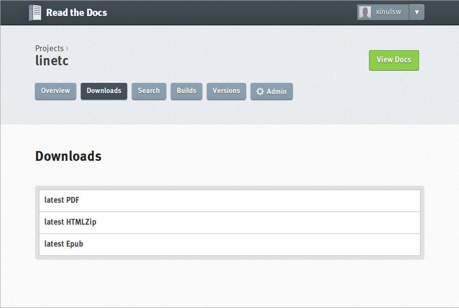

Narzędzia
###################

.. _tools:

Poniżej przedstawiamy zestaw przykładowych narzędzi do programowania, tworzenia
skryptów i dokumentacji, stron WWW itp. zadań.

Geany
*************

`Geany <http://www.geany.org/>`_ to proste i lekkie środowisko IDE dostępne na licencji
`GNU General Public Licence <http://pl.wikipedia.org/wiki/GNU_General_Public_License>`_.
Geany oferuje kolorowanie składni dla najpopularniejszych języków,
m.in. C, C++, C#, Java, PHP, HTML, Python, Perl i Pascal,
wsparcie dla kodowania w ponad 50 standardach, dopełnianie poleceń, mechanizmy automatycznego zamykanie tagów dla HTML\XML,
auto-wcięć, pracy na kartach i wiele, wiele więcej. Podczas pisania kodu przydatny okazuje się brudnopis,
pozwalający tworzyć dowolne notatki, a także możliwość kompilacji plików źródłowych
bezpośrednio z poziomu programu.

Instalacja
===============

W systemie **Linux** korzystamy z dedykowanego menedżera pakietów, np. w Xubuntu
(i innych debianopochodnych) lub Archu wystarczy wpisać w terminalu:

.. code-block:: bash

    ~$ sudo apt-get install geany geany-plugins
    ~# pacman -S geany geany-plugins

.. note::
    Przykłady poleceń będziemy podawali dla systemów opartych na Debianie (Ubuntu
    i pochodne, Mint), które wykorzystyują menedżer oprogramowania ``apt``; oraz
    dla systemów opartych na Arch Linuksie (Arch, Bridge, Manjaro) i korzystających
    z menedżera ``pacman``.

W **MS Windows** ściągamy i instalujemy `pełną wersję binarną Geany <http://www.geany.org/Download/Releases>`_
przeznaczoną dla tych systemów. *Pełna* oznacza tutaj, ze zawiera biblioteki
GTK wykorzystywane przez program. Podczas standardowej instalacji można
zmienić katalog docelowy, np. na ``C:\Geany``.

.. figure:: img/geany1.jpg

Zanim rozpoczniemy pracę w edytorze, warto dostosować kilka ustawień.

W menu `Narzędzia/Menedżer wtyczek` zaznaczamy pozycję "Addons" (dostępna
po zainstalowaniu wtyczek), a następnie "Przeglądarka plików".
Zanim wyjdziemy z okna naciskamy przycisk "Preferencje" i na zakładce
"Przeglądarka plików" zaznaczamy opcję "Podążanie za ścieżką do bieżącego pliku".
Dzięki temu w panelu bocznym w zakładce "Pliki" zobaczymy listę katalogów i plików,
które łatwo możemy otwierać.

.. figure:: img/geany2.jpg
.. figure:: img/geany3.jpg

W menu `Edycja/Preferencje` :kbd:`CTRL+ALT+P` w zakładce `Edytor/Wcięcia` jako
"Typ" wcięć wybieramy opcję "spacje".

.. figure:: img/geany4.jpg

Warto zapamiętać i stosować kilka użytecznych skrótów. Jeśli kodujemy w C/C++: :kbd:`F8` – uruchamia
linker, :kbd:`F9` – buduje plik wykonawczy. Klawisz :kbd:`F5` uruchamia
z kolei pliki wykonywalne, skrypty Pythona lub otwiera strony HTML w przeglądarce.
Wcięcia wstawiają się automatycznie lub poprzez naciśnięcie klawisza :kbd:`TAB`.
Jeżeli chcemy wciąć od razu cały blok kodu, zaznaczamy go i również używamy
:kbd:`TAB` lub :kbd:`CTRL+I`, zmniejszenie wcięcia uzyskamy naciskając :kbd:`CTRL+U`.

.. figure:: img/geany5.jpg

Środowisko Geany nie zawiera narzędzi potrzebnych do kompilowania czy wykonywania
programów pisanych w różnych językach. Wymagane narzędzia musimy doinstalować osobno.

Kompilator C/C++
*********************

W systemie **Linux** wystarczy zazwyczaj wydać jedno polecenie wykorzystujące
używany w danej dystrybucji menedżer pakietów, np.:

.. code-block:: bash

    ~$ sudo apt-get install gcc
    ~# pacman -S gcc

W **MS Windows** instalujemy minimalistyczne środowisko deweloperskie
dostarczające wolne narzędzia :term:`GNU Compiler Collection`, czyli `MinGw`_. W tym
celu pobieramy instalator `mingw-get-setup.exe <http://sourceforge.net/projects/mingw/files/Installer>`_
i uruchamiamy.

.. figure:: img/mingw01.jpg

W oknie wyboru pakietów zaznaczamy widoczne poniżej paczki, w tym przede wszystkim
``mingw32-gcc-g++``, a następnie wybieramy polecenie *Installation/Apply*.

.. figure:: img/mingw02.jpg

Po pobraniu i rozpakowaniu wskazanych narzędzi oraz zakończeniu instalatora (*Close*)
trzeba dodać do ścieżki systemowej położenie kompilatora i linkera;
dzięki temu będzie można korzystać z tych i innych narzędzi bezpośrednio
z Geany lub okienka konsoli tekstowej. W oknie "Uruchamianie" (:kbd:`WIN+R`)
wpisujemy polecenie wywołujące okno "Zmienne środowiskowe" – można je również
uruchomić z okna właściwości komputera:

.. figure:: img/mingw03.jpg
.. figure:: img/mingw04.jpg

Klikamy przycisk *Nowa* i tworzymy nową zmienną użytkownika zgodnie z podanym
zrzutem:

.. figure:: img/mingw05.jpg
.. figure:: img/mingw06.jpg

.. tip::

    Powyżej przedstawiliśmy instalację narzędzi :term:`MinGw` z konta zwykłego
    użytkownika. Można w razie potrzeby czynności te wykonać również z konta administratora,
    co pozwoli udostępnić narzędzia wszystkim użytkownikom. Podobnie
    ścieżkę do kompilatora itd. można dopisać do zmiennej systemowej ``PATH``,
    dzięki czemu wszyscy użytkownicy będą mogli wywoływać narzędzia bez
    podawania pełnej ich lokalizacji.

Biblioteka Qt
******************

:term:`Qt` to zestaw bibliotek przeznaczonych dla języka C++, QML i Java,
który znakomicie ułatwia tworzenie graficznego interfejsu użytkownika.
Zawiera również klasy udostępniające obsługę m.in. multimediów , sieci
czy baz danych.

System i środowisko IDE
========================

Bilioteka :term:`Qt` jest przenośna z założenia, więc programować z jej wykorzystaniem
można w wielu systemach i środowiskach. Proponujemy system Linux,
np. dystrybucję :term:`Debian` (v. Jessie) lub :term:`Xubuntu 14.04`.
Instalacja wymaganych narzędzi sprowadza się do wydania prostych poleceń
w terminalu:

.. code-block:: bash

    ~$ sudo apt-get update
    ~$ sudo apt-get install qtcreator qt5-qmake qt5-default qt4-qtconfig

Pierwsze polecenie zaktualizuje repoytoria, czyli wersje dostępnego oprogramowania;
drugie zainstaluje dedykowane :term:`środowisko IDE`, które pozwala projektować
interfejs graficzny, bardzo ułatwia edycję kodu, pozwala budować, uruchamiać
i debugować różne wersje tworzonych aplikacji.

Qt5 w systemie Windows
========================

Instalacja jest bardzo prosta. Pobieramy `Qt Online Installer for Windows <https://www.qt.io/download-open-source/>`_
i uruchamiamy. Następnie przeprowadzamy standardową instalację z domyślnymi
ustawieniami, podając w razie potrzeby hasło administratora.

.. figure:: img/qtwin01.jpg

.. figure:: img/qtwin02.jpg

Wygląd i działanie aplikacji :term:`Qt Creator` w systemie Linux i Windows są
takie same.

.. figure:: img/qtcreator.png

Interpreter Pythona
*********************

W systemach **Linux** Python jest szeroko stosowany i dostępny jest w ramach
standardowej instalacji większości dystrybucji i to zarówno w wersji 2.x,
jak i 3.x. Dla formalności polecenia instalacyjne to:

.. code-block:: bash

    ~$ sudo apt-get install python2 python3
    ~# pacman -S python python2

.. note::

    Warto zauważyć, że w dystrybucjach opartych na Debianie polecenie ``python``
    jest dowiązaniem do wersji 2.x, a paczki nazywają się odpowiednio ``python2-...``
    lub ``python3-...``. W Arch Linuksie i pochodnych nazwa ``python`` domyślnie
    wskazuje wersję 3.x (!), podobnie nazwy pakietów dodatkowych. Wersja i paczki
    z liniii 2.x mają w nazwie ``python2``.

Polecić natomiast można doinstalowanie rozszerzonej konsoli:

.. code-block:: bash

    ~$ sudo apt-get install ipython2 ipython3
    ~# pacman -S ipython ipython2

W **MS Windows** najprościej zainstalować Pythona przy użyciu skryptu konsoli PowerShell
dostępnej w wersjach *Professional* (oznaczoną niebieską ikoną i niebieskiem tłem):

.. code-block:: posh

    (new-object System.Net.WebClient).DownloadFile("https://www.python.org/ftp/python/2.7.8/python-2.7.8.msi", "$pwd\python-2.7.8.msi")
    msiexec /i python-2.7.8.msi TARGETDIR=C:\Python27
    [Environment]::SetEnvironmentVariable("Path", "$env:Path;C:\Python27\;C:\Python27\Scripts\", "User")
    (new-object System.Net.WebClient).DownloadFile("https://raw.github.com/pypa/pip/master/contrib/get-pip.py", "$pwd\get-pip.py")
    C:\Python27\python.exe get-pip.py virtualenv

Jeżeli w naszej wersji Windows nie ma PowerShella, ściągamy `interpreter Pythona`_
i instalujemy ręcznie, pamiętając o zaznaczeniu opcji "Add Python.exe to Path".

.. _interpreter Pythona: https://www.python.org/downloads/

.. figure:: img/python01.jpg

Następnie instalujemy program ``pip`` do zarządzania dodatkowymi bibliotekami za pomocą polecenia:

.. code-block:: bash

    python -c "exec('try: from urllib2 import urlopen \nexcept: from urllib.request import urlopen');f=urlopen('https://raw.github.com/pypa/pip/master/contrib/get-pip.py').read();exec(f)"

Aby uruchamiać skrypty bezpośrednio z poziomu Geany lub konsoli tekstowej bez
podawania pełnej ścieżki warto ją dodać do zmiennej użytkownika lub systemu
o nazwie ``PATH``, tak jak pokazano wyżej dla narzędzi *MinGw*.
Na potrzeby pojedynczej sesji odpowiedni efekt osiągniemy wydając polecenie
w konsoli:

.. code-block:: bat

    set PATH=%PATH%;c:\Python27\;c:\Python27\Scripts\

Git
**********************

`Git <http://pl.wikipedia.org/wiki/Git_%28oprogramowanie%29>`_ Source Code Mirror – to rozproszony system wersjonowania kodów źródłowych napisany
przez `Linusa Torvaldsa <http://pl.wikipedia.org/wiki/Linus_Torvalds>`_, twórcę `jądra Linux <http://pl.wikipedia.org/wiki/Linux_%28j%C4%85dro%29>`_.
Skrót SCM bywa również rozwijany jako *software configuration management*,
co oznacza "zarządzanie konfiguracją oprogramowania". Gita można używać
do rozwijania zarówno małych, jak i dużych projektów (np. Arch Linux, GIMP, jQuery).

Konto
=======

Przede wszystkim wchodzimy na stronę  `<https://github.com/>`_.
Następnie wykonujemy poniższe instrukcje:

*   Krok 1 – `założenie konta <https://help.github.com/articles/signing-up-for-a-new-github-account/>`_;
    podajemy nazwę użytkownika, adres email i hasło, jako typ konta wybieramy *free*.
*   Krok 2 – `weryfikacja adresu e-mail <https://help.github.com/articles/verifying-your-email-address/>`_
*   Krok 3 – `zakładamy repozytorium <https://help.github.com/articles/create-a-repo/>`_ dla projektu,
    wybieramy typ *Public* (publiczne) oraz *Initialize this repository with a README* (utwórz początkowy plik README.md).

To wszystko. Od tej pory można rozwijać projekt.

Klient Gita
================

Treść projektu można dodawać do repozytorium centralnego w serwisie *github.com*
za pomocą przeglądarki. Częściej jednak robi się to offline, czyli pracuje się
na swoim repozytorium lokalnym za pomocą jakiegoś programu.

Ze względu na szybkość działania polecamy środowisko **Linux**. Instalacja
podstawowego klienta tekstowego w systemach debianopodobnych (poza samym Debianem :-),
Ubuntu, Linux Mint, PepperMint itd.) i opartych na Arch Linuksie (np. Bridge Linux)
sprowadza się do użycia odpowiedniego menedżera pakietów:

.. code-block:: bash

    ~$ sudo apt-get install git
    ~# pacman -S git

W systemach **Windows** tego samego klienta tekstowego pobieramy ze strony `<http://git-scm.com/download/win>`_
i instalujemy wybierając domyślne opcje.

Po opanowaniu podstaw obsługi Gita można oczywiście zainstalować programy
z graficznym interfejsem użytkownika, jednak w większości przypadków
jest to niekonieczne.

Lokalne repozytorium
====================

Pierwszą rzeczą będzie najczęściej sklonowanie założonego repozytorium
na nasz komputer. Uruchamiamy więc terminal (wiersz poleceń czy też konsolę
tekstową) i wydajemy polecenie:

.. code-block:: bash

    ~$ git clone https://github.com/nazwa_użytkownika/nazwa_repozytorium.git

Jak widać argumentem jest tutaj `Git url`, czyli schematyczny adres repozytorium,
który możemy sprawdzić na stronie `github.com`. Domyślnym protokołem transferu jest
``https``, chociaż można wykorzystywać również inne, np. ``SSH``.
W rezultacie w bieżącym folderze (zazwyczaj katalogu domowym użytkownika)
utworzony zostanie katalog o nazwie naszego projektu zawierający wszystkie
dodane do tej pory materiały, np. plik ``README.md``, oraz ukryty katalog
konfiguracyjny ``.git``, którego nie należy usuwać.

.. note::

    Za pomocą narzędzia ``git`` można również utworzyć zupełnie nowy projekt.
    Służy do tego opcja ``init``. Możliwe jest również sklonowanie istniejącego
    projektu do katalogu o narzuconej nazwie, trzeba ją dodać na końcu polecenia
    ``git clone``.


Podstawy Gita
=====================

.. note::

    Wszystkie poniższe polecenia wydajemy w głównym katalogu projektu.
    Warto poczytać polską wersję 1 `podręcznika Git SCM <http://git-scm.com/book/pl/v1/>`_.
    Dostępna jest również `wersja 2 podręcznika Git <http://git-scm.com/book/en/v2/>`_, ale tylko w j. angielskim.

Codzienną pracę projektem warto rozpocząć od zsynchronizowania wersji lokalnej
z ewentualnymi zmiananami zapisanymi na serwerze:

.. code-block:: bash

    ~$ git pull

Bardzo często będziemy korzystać z polecenia:

.. code-block:: bash

    ~$ git status

– które informuje nas o tym, jakie pliki zostały dodane do poczekalni, ale są nieśledzone
(ang. *Untracked files*), jakie zostały zmienione, ale nie zostały zatwierdzone
(ang. *Changes not staged for commit*), a jakie czekają na zatwierdzenie
(ang. *Changes to be committed*). Komunikat *On branch master* informuje,
że pracujemy na głównej gałęzi (ang. master branch) projektu.

Zarówno nieśledzone, jak i niezatwierdzone pliki, które chcemy umieścić w projekcie,
dodajemy poleceniem:

.. code-block:: bash

    ~$ git add ścieżka/nazwa_pliku

Można używać znaków specjalnych, np. ``git add *.jpg``. Jeżeli mamy rozbudowaną
strukturę katalogów w projekcie, przydatne jest polecenie dodające
nowe zmiany hurtowo i rekursywnie:

.. code-block:: bash

    ~$ find . -name "*.rst" -exec git add {} \;

Po dodaniu wszystkich nowych plików i zmian do poczekalni, trzeba je zatwierdzić:

.. code-block:: bash

    ~$ git commit -m "Opis zmian ..."

Jeżeli pominiemy opcjonalny przełącznik ``-m`` otwarty zostanie edytor, w którym
opisujemy dokonywane zmiany.

Zatwierdzone zmiany prześlemy na serwer wydając polecenie:

.. code-block:: bash

    ~$ git push

– które poprosi nas o podanie nazwy użytkownika (adres email) i hasła, a następnie
prześle informacje na serwer.

Powyższy porządek komend jest typowy dla sesji z gitem.

.. note::

    Wskazówka: nie należy usuwać plików/katalogów lub zmieniać ich nazw w katalogu
    projektu za pomocą narzędzi systemowych, np. menedżera plików, ponieważ
    Git nie będzie nic o tym wiedział i zasypie nas wieloma komunikatami
    podczas sesji. Zamiast tego używamy poniższych poleceń:

.. code-block:: bash

    ~$ git rm plik
    ~$ git rm -rf katalog
    ~$ git mv stara_nazwa nowa_nazwa

ReStructuredText i Sphinx
***************************

Git dobrze nadaje się do prowadzenia projektów nie tylko typowo programistycznych,
ale również dokumentacyjnych i szkoleniowych, a więc zawierających nie tylko kod,
ale przede wszystkim instrukcje, poradniki, scenariusze, itp.

W katalogu naszego projektu zakładamy katalog podrzędny o nazwie np. ``docs``,
w którym tworzyć będziemy naszą dokumentację.

.. code-block:: bash

    ~/nazwa_projektu$ mkdir docs

Dokumenty zapisywane będą w formacie `reStructuredText <http://pl.wikipedia.org/wiki/ReStructuredText>`_,
czyli za pomocą tekstowego języka znaczników, w plikach z rozszerzeniem ``.rst``.
Zawartość tych plików może być później przetworzona do postaci formatów
docelowych, takich jak HTML, PDF czy LaTeX. Zadanie to realizowane będzie
przez narzędzie `Sphinx <http://sphinx-doc.org/>`_ napisane w Pythonie
i służące m.in. do tworzenia dokumentacji tego języka.

Instalacja Sphinksa
=======================

Przede wszystkim potrzebujemy interpretera Pythona i narzędzia instalacji
modułów dodatkowych ``pip`` – zobacz w sekcji `Interpreter Pythona`_.
Następnie wydajemy polecenia:

.. code-block:: bash

    ~$ sudo apt-get install mercurial
    ~$ sudo pip install sphinx_rtd_theme hg+https://bitbucket.org/birkenfeld/sphinx#sphinx

    W Archu:
    ~# pacman -S mercurial
    ~# sudo pip install sphinx_rtd_theme hg+https://bitbucket.org/birkenfeld/sphinx#sphinx

.. note::

    Instalacja klienta systemu kontroli wersji `Mercurial <http://pl.wikipedia.org/wiki/Mercurial>`_
    wynika z tego, że korzysta z niego projekt Sphinx. Instalacja tematu ``sphinx_rtd_theme``
    jest opcjonalna, domyślny temat wygląda tak, jak w `dokumentacji Pythona <https://docs.python.org/2.7/whatsnew/2.7.html>`_.

Teraz możemy przejść do konfiguracji Sphiksa, która sprowadza się do wygenerowania
pliku z ustawieniami o nazwie ``conf.py``. W głownym katalogu tworzonej dokumentacji,
czyli ``docs``, wydajemy polecenie:

.. code-block:: bash

    ~$ sphinx-quickstart

Na większość pytań kreatora odpowiadamy naciśnięciem :kbd:`Enter`, przyjmując ustawienia
domyślne. Zwrócić uwagę należy na:

* ``Project name:`` – wpisujemy nazwę naszego projektu;
* ``Author name(s):`` – wpisujemy autora;
* ``Project version:`` – podajemy wersję, np. 1;
* ``Project release:`` – podajemy wydanie, np. 0;
* ``Project langiage [en]:`` – określamy język jako ``pl``;
* ``Please indicate... Sphinx extensions:`` – odpowiadając ``y`` dołączamy rozszerzenia, można włączyć:
  ``autodoc``, ``doctest``, ``pngmath`` i ``viewcode`` – przydają się w dokumentacji Pythona.
  Zobacz: `lista rozszerzeń Sphinksa <http://sphinx-doc.org/latest/extensions.html>`_;
* ``Create Makefile?`` – odpowiadamy ``y``, dzięki czemu budowanie dokumentacji sprowadzi się do wydania
  polecenia ``make html``.

Po skonfigurowaniu Sphinksa w katalogu ``docs`` powinny znaleźć się pliki: ``conf.py, Makefile, make.bat``
i ``index.rst``, a także katalogi ``_build, _static, _templates``.

Jeżeli chcemy używać tematu *sphinx_rtd_theme* na końcu pliku ``conf.py`` dopisujemy::

    try:
        import sphinx_rtd_theme
        html_theme = "sphinx_rtd_theme"
        html_theme_path = [sphinx_rtd_theme.get_html_theme_path()]
    except:
        pass

Tworzenie dokumentacji
========================

Na początku warto dostosować plik główny, czyli ``index.rst``.
Jest on naszą "stroną główną", zawiera m. in. dyrektywę tworzącą
spis treści:

.. code-block:: rst

    Welcome to Projekt ILO's documentation!
    =======================================

    Contents:

    .. toctree::
       :maxdepth: 2

       Serwis eCG <http://ecg.vot.pl/>
       cwiczenia/index
       programowanie/index


    Indices and tables
    ==================

    * :ref:`genindex`
    * :ref:`modindex`
    * :ref:`search`

Jak widać domyślne komunikaty są w języku angielskim, należy więc je spolszczyć
zmieniąjąc treść według uznania. Dyrektywa ``.. toctree::`` generuje spis
treści na podstawie wskazanych plików. W powyższym listingu dodano dwa
przykładowe wpisy wskazujące pliki ``index.rst`` umieszczone we wskazanych
podkatalogach. Sphinx odczytuje nagłówki z tych plików i umieszcza w spisie.
Domyślnie sczytywane są dwa poziomy zagnieżdżenia (``:maxdepth: 2``).
Gdybyśmy chcieli mieć numerację, dodalibyśmy opcję: ``:numbered:``.
Pokazano również, jak dodawać stałe linki w spisie (``Serwis eCG ...``).

Z sekcji indeksów (``Indices ...``) można usunąć wszystkie spisy lub
zostawić wybrane, np. ``genindex`` udostępnia indeks zdefiniowanych terminów
i pojęć.

Dokumenty w katalogu ``docs`` warto kategoryzować i umieszczać w osobnych
katalogach. Nazwy plików mogą być dowolne, chociaż dobrze jest przyjąć jakąś
przejrzystą konwencję. Poszczególne pliki należy traktować jako kolejne
strony w wersji HTML.

Podstawy reST
==================

Żeby zrozumieć proste w gruncie rzeczy zasady formatowania reST najlepiej
podglądać kod gotowych stron! Wystarczy w nagłówku kliknąć link *View page source*,
skopiować, wkleić i wypełnić własną treścią. Zacznij od strony, którą czytasz...

Jeżeli chcesz rozumieć, czytaj dalej. Podstawowe zasady są następujące:

- Wcięcia są ważne!
- Akapity itp. oddzielamy pustym wierszem.
- \*pochylenie\*, \*\*pogrubienie\*\*
- \`\`przykład kodu\`\`

Nagłówki
---------------

Kolejne poziomy nagłówków tworzymy poprzez podkreślanie ich sekwencjami znaków:

.. code-block:: rst

    Część 1
    ##############

    Rozdział 2
    **************

    Sekcja 3
    ==============

    Podsekcja 4
    --------------

    Podpodsekcja 5
    ^^^^^^^^^^^^^^

    Akapit 6
    """"""""""""""

Wybór znaków nie jest narzucony, ale najlepiej trzymać się jednej konwencji,
np. powyższej.

Dyrektywy
---------------

Ogólna postać dyrektyw to:

.. code-block:: rst

    .. <nazwa>:: <argumenty>
        :<opcja>: <wartość>

        treść

Użyteczne dyrektywy:

- ``.. image:: ścieżka/plik.jpg`` – pozwala wstawić obrazek
- ``.. figure:: ścieżka/plik.jpg`` – pozwala wstawić obrazek z etykietą
- ``.. note::`` – warte zauważenia
- ``.. tip::`` – wskazówka
- ``.. warning::`` – ostrzeżenie
- ``.. highlight:: cpp`` – formatuj kod jako *cpp* (lub ``python``, ``bash``, ``html`` itd.)
- ``.. literalinclude:: ścieżka/test.cpp`` – wstaw kod z podanego pliku
- ``.. code block:: cpp`` – treść poniżej to kod w *cpp* (lub ``python``, ``bash``, ``html`` itd.)
- ``.. raw:: html`` – interpretuj treść poniżej jako HTML
- ``.. include:: ścieżka/plik.rst`` – wstaw treść z innego pliku

Listy
---------------

Aby uzyskać listę wypunktowaną lub numerowaną stosujemy:

.. code-block:: rst

    * punkt
    * punkt drugi zawiera
      dwie linie

    1. punkt 1
    2. punkt 2

    #. automatyczne numerowanie
    #. automatyczne numerowanie


Linki
----------------

- ```Nagłówek`_`` – link do nagłówka w bieżącym dokumencie
- ``.. _Strona Pythona: http:\\www.python.org`` – definicja linku,
  ```Strona Pythona`_`` – wstawienie linku
- ```Strona Pythona <http:\\www.python.org>`_`` – tak też można
- ``.. _nazwa-linku:`` – definicja linku w dokumentacji,
  ``:ref:`zobacz tutaj <nazwa-linku>``` – wstawienie linku

.. tip::

    Powtórzmy, najlepszą metodą poznania składni reST jest przeglądanie
    źródeł gotowych plików.

Budowanie dokumentacji
=======================

W katalogu głównym dokumentacji, czyli ``docs`` wydajemy polecenie:

.. code-block:: bash

    ~/projekt/docs$ make html

W terminalu zobaczymy komunikaty, niektóre z nich będą informacją o błędach
w formatowaniu, które musimy usunąć. Gotowa wersja zostanie umieszczona
w katalogu ``_build/html``. Możemy go wgrać do sieci, możemy spakować i udostępnić
– po otwarciu pliku ``index.html`` w przeglądarce zobaczymy efekt naszej pracy.

Od czasu do czasu, zwłaszcza po wielu zmianach położenia plików i katalogów,
budowanie dokumentacji warto poprzedzić usunięciem poprzedniej wersji HTML:

.. code-block:: bash

    ~/projekt/docs$ make clean

Dokumentacja online
======================

Projekty hostowane w serwisie `GitHub <https://github.com/>`_ łatwo podpiąć
do serwisu `Read the Docs <https://readthedocs.org/>`_, który umożliwia
automatyczne generowanie wersji HTML, PDF, a nawet Epub (chociaż przy wykorzystaniu stabilnej,
a nie testowej wersji Sphinksa) i udostępnianie jej online.

W tym celu trzeba założyć konto na stronie
`Read the Docs – Sign Up <https://readthedocs.org/accounts/signup/>`_.
Po zalogowaniu importujemy projekt z GitHuba (ang. Import a Project –
Import from GitHub) i po potwierdzeniu domyślnych opcji możemy
cieszyć wersją online dostępną pod adresem typu: http://nazwa_projektu.readthedocs.org.
Wersję PDF ściągniemy po zalogowaniu, wejściu na stronę projektu, wybraniu
zakładki *Downloads* i linku *latest PDF*.



Serwer deweloperski WWW
************************

Jeżeli chcemy tworzyć i testować aplikacje sieciowe wykorzystujące bazy danych
za pomocą języków skryptowych, np. PHP czy Python, potrzebujemy środowiska testowego,
na które składa się :term:`serwer WWW`, :term:`interpreter` języka skryptowego i :term:`system bazodanowy`.
Zestawy takiego oprogramowania określa się skrótami `WAMP <http://pl.wikipedia.org/wiki/WAMP>`_ lub `LAMP <http://pl.wikipedia.org/wiki/LAMP>`_ w zależności
od wykorzystywanego systemu operacyjnego: W – Windows, L – Linux.
Pozostałe litery rozwija się najczęściej jako:

* A – `Apache <http://pl.wikipedia.org/wiki/Apache_%28serwer%29>`_;
* M – `MySQL <http://pl.wikipedia.org/wiki/MySQL>`_, w linuksach raczej `MariaDB <http://pl.wikipedia.org/wiki/MariaDB>`_;
* P – `PHP <http://pl.wikipedia.org/wiki/PHP>`_, `Perl <http://pl.wikipedia.org/wiki/Perl>`_ lub `Python <http://pl.wikipedia.org/wiki/Python>`_.

Wymienionego oprogramowanie to najpopularniejsze, ale nie jedyne rozwiązania.
Dostępnych jest wiele innych, równie dobrych serwerów czy baz danych.
Warto też wiedzieć, że instalacja i konfiguracja kompletu wymienionych programów nie jest zazwyczaj
konieczna. Np. jeżeli tworzymy aplikacje sieciowe w Pythonie wystarcza dedykowana
biblioteka (np. Flask) lub :term:`framework` (np. Django), które zapewniają
serwer HTTP i obsługę wbudowanej bazy SQLite.

Linux
===================

W systemach opartych na Debianie (Ubuntu, Linux Mint itd.) lub na Arch Linuksie
można zainstalować serwer Apache2 i interpreter PHP5 za pomocą dedykowanych
menedżerów pakietów, czyli odpowiednio:

.. code-block:: bash

    ~$ sudo apt-get install apache2 php5 php5-gd php5-sqlite php5-curl libapache2-mod-php5
    ~# pacman -S apache php php-gd php-sqlite php-curl libapache-mod-php5

Podstawowa konfiguracja sprowadza się do uaktywnienia odpowiednich modułów:

.. code-block:: bash

    ~$ sudo a2enmod userdir rewrite
    ~$ sudo service apache2 restart

    ~# a2enmod userdir rewrite
    ~# systemctl restart httpd

– i odblokowania możliwości wykopnywania skryptów w katalogach domowych
użytkowników poprzez zakomentowanie następujących linii z pliku
``/etc/apache2/mods-available/php5.conf`` (Debian) lub ``/etc/httpd/mods-available/php5.conf``
(Arch):

.. code-block:: bash

    # To re-enable PHP in user directories comment the following lines
    # (from <IfModule ...> to </IfModule>.) Do NOT set it to On as it
    # prevents .htaccess files from disabling it.
    #<IfModule mod_userdir.c>
    #    <Directory /home/*/public_html>
    #        php_admin_flag engine Off
    #    </Directory>
    #</IfModule>

Tworzone strony umieszczamy w podkatalogu ``public_html`` katalogu domowego.
Wywołujemy je wpisując w przeglądarce adres: ``127.0.0.1/~użytkownik`` –
powinny zostać zwrócone pliki ``index.php`` lub ``index.html``, o ile istnieją.
Jeżeli mamy kilka projektów, umieszczamy je w podkatalogach, np.
``public_html/projekt1`` i wywołujemy: ``127.0.0.1/~użytkownik/projekt1``.

.. _serwer2go-ins:

Serwer2Go w Windows
===================

W systemie Microsoftu najłatwiej skorzystać z gotowego zestawu WAMP.
Proponujemy `Serwer2Go <http://www.server2go-web.de/download/download.html>`_, ściągamy
wersję **exe** *Apache 1.3.35* + *PHP 5.3.2, SQLite*, czyli pierwszą dostępną.
Następnie uruchamiamy i wskazujemy miejsce instalacji, proponujemy główny katalog
wybranego dysku, *C:*, *D:* itp.:

.. figure:: img/server2go01.jpg

.. figure:: img/server2go02.jpg

Po rozpakowaniu plików, wchodzimy do katalogu instalacyjnego, aby otworzyć
w edytorze plik konfiguracyjny ``pms_config.ini``. M. in. dlatego, że Internet Explorer
nie najlepiej współpracuje z serwerem, we wspomnianym pliku zmieniamy ustawienia:

.. code-block:: bash

    ShowTrayIcon=1
    StartLocal=1
    BrowserType=FIREFOX

Oprogramowanie uruchamiamy za pomocą pliku ``Server2Go``, który uruchomi serwer
WWW pod adresem ``127.0.0.1:4001`` w Firefoksie. Swoje strony umieszczamy
w podkatalogu ``htdocs`` katalogu instalacyjnego.

Materiały
**************

1. `Geany`_
2. `MinGw`_
3. `Język Python`_
4. `Biblioteka Qt`_
5. `Qt Creator`_
6. `Strona projektu Git`_
7. `First Steps with Sphinx`_
8. `Wprowadzenie do składni Sphinx reST`_
9. `Docutils`_
10. `Składnia reST & Sphinx`_

.. _Geany: http://www.geany.org/
.. _MinGw: http://www.mingw.org/
.. _Język Python: https://www.python.org/
.. _Biblioteka Qt: https://qt-project.org/
.. _Qt Creator: http://pl.wikipedia.org/wiki/Qt_Creator
.. _Strona projektu Git: http://git-scm.com/
.. _First Steps with Sphinx: http://sphinx-doc.org/tutorial.html
.. _Wprowadzenie do składni Sphinx reST: http://sphinx-doc.org/rest.html
.. _Docutils: http://docutils.sourceforge.net/
.. _Składnia reST & Sphinx: http://thomas-cokelaer.info/tutorials/sphinx/rest_syntax.html

Słownik
===========

.. glossary::

    Qt
        zestaw bibliotek programistycznych ułatwiających tworzenie aplikacji
        z interfejsem graficznym w językach C++, QML i Java.

    środowisko IDE
        zintegrowane środowisko programistyczne (ang. Integrated Development Environment, IDE),
        składające się z jednej lub wielu aplikacji, umożliwiające tworzenie,
        testowanie, budowanie i uruchamianie kodu.

    Qt Creator
        wieloplatformowe :term:`środowisko IDE` dla aplikacji pisanych
        w językach C++, JavaScript i QML.
        Zawiera m.in. `debugger <http://pl.wikipedia.org/wiki/Debugger>`_
        i edytor GUI (graficznego interfejsu użytkownika).

    MinGw
        ang. *Minimalist GNU for Windows*; minimalistyczne środowisko
        dostarczające narzędzia GNU (linker, kompilator itd.) pozwalające
        na kompilację natywnych plików wykonywalnych dla Windows
        z kodu pisanego w C/C++.

    GNU Compiler Collection
        zestaw kompilatorów do różnych języków programowania rozwijany
        w ramach projektu GNU i udostępniany na licencji GPL oraz LGPL.
        Zob. hasło w `Wikipedii <http://pl.wikipedia.org/wiki/GNU_Compiler_Collection>`__.

    GPL
        ang. GNU General Public License – licencja wolnego i otwartego
        oprogramowania stworzona w 1989 roku przez Richarda Stallmana
        i Ebena Moglena na potrzeby Projektu GNU. Ostatnia wersja, trzecia,
        opublikowana została 29 czerwca 2007 r.
        Zob. hasło w `Wikipedii <http://pl.wikipedia.org/wiki/GNU_General_Public_License>`__.

    Debian
        jedna z najstarszych i wiądących dystrybucji Linuksa, umożliwia
        elastyczną konfigurację systemu i dostosowanie go do własnych potrzeb.
        Jak większość dystrybucji, umożliwia wybór wielu środowisk graficznych,
        np. XFCE lub Gnome.

    Xubuntu 14.04
        odmiana jednej z najpopularniejszych dystrybucji Linuksa, Ubuntu,
        dostarczana z klasycznym, lekkim i konfigurowlanym środowiskiem
        graficznym XFCE.

    środowisko graficzne
        w systemach linuksowych zestaw oprogramowania tworzący GUI, czyli graficzny
        interfejs użytkownika, często zawiera domyślny wybór aplikacji przeznaczonych
        do wykonywania typowych zadań. Najpopularnijesze środowiska to `XFCE`_,
        `Gnome`_, `KDE`_, `LXDE`_, `Cinnamon`_, `Mate`_.

    serwer WWW
        (ang. web server) – oprogramowanie obsługujące protokół http, podstawowy protokół sieci WWW,
        służący przesyłaniu dokumentów hipertekstowych.

    interpreter
        program, który analizuje kod źródłowy, a następnie go wykonuje. Interpretery są
        podstawowym składnikiem języków wykorzystywanych do pisania skryptów wykonywanych
        po stronie klienta WWW (`JavaScript`_) lub serwera (np. Python, `PHP`_).

    system bazodanowy
        system zarządzania bazą danych (ang. Database Management System, DBMS) – oprogramowanie
        służące do zarządzania bazami danych, np. `SQLite`_, MariaDB, MySQL, PostgreSQL.

    framework
        (ang. framework – struktura) – oprogramowanie będące zestawem narzędzi ułatwiających
        i przyśpieszających tworzenie aplikacji.

.. _Debian: https://www.debian.org/index.pl.html
.. _Ubuntu: http://ubuntu.pl
.. _Xubuntu: http://xubuntu.org/
.. _Gnome: http://pl.wikipedia.org/wiki/GNOME
.. _KDE: http://pl.wikipedia.org/wiki/KDE
.. _LXDE: http://pl.wikipedia.org/wiki/LXDE
.. _Cinnamon: http://en.wikipedia.org/wiki/Cinnamon_%28software%29
.. _Mate: http://pl.wikipedia.org/wiki/MATE
.. _XFCE: http://www.xfce.org/
.. _JavaScript: http://pl.wikipedia.org/wiki/JavaScript
.. _PHP: http://pl.wikipedia.org/wiki/PHP
.. _SQLite: http://pl.wikipedia.org/wiki/SQLite

Metryka
========

:Autor: Robert Bednarz (ecg@ecg.vot.pl)

:Utworzony: |date| o |time|

.. |date| date::
.. |time| date:: %H:%M

.. raw:: html

    <style>
        div.code_no { text-align: right; background: #e3e3e3; padding: 6px 12px; }
        div.highlight, div.highlight-python { margin-top: 0px; }
    </style>
