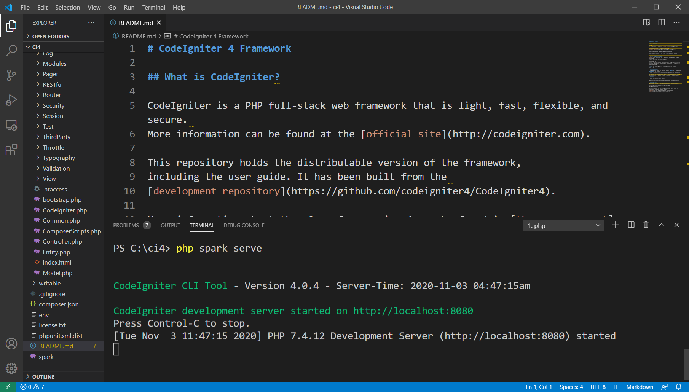
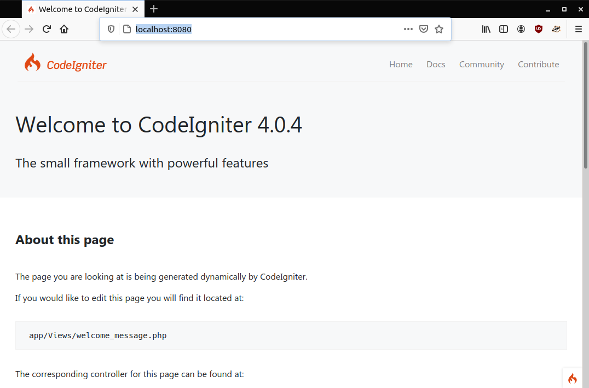

CodeIgniter
===============

`CodeIgniter <https://codeigniter.com>`_ to framework do tworzenia aplikacji i serwisów WWW
napisany w języku PHP. Cechuje go prostota, wydajność i duże możliwości. Do działania wymaga
poprawnie zainstalowanego interpretera PHP wraz z rozszerzeniami (przynajmniej): `intl` i `mbstring`.

Instalacja
------------

Możliwa jest instalacja przez menedżer pakietów PHP Composer oraz ręczna. Skorzystamy z drugiej możliwości.
Ze strony głównej pobieramy archiwum zip o nazwie np.: `framework-4.04.zip` i rozpakowujemy w wybranym katalogu,
np. :file:`C:\\ci4`. W katalogu z rozpakowanym frameworkiem otwieramy terminal lub wczytujemy go
do wybranego edytora programistycznego, np. VSCode (VSCodium). Serwer deweloperski uruchamiamy
poleceniem:

.. code-block:: bash

   php spark serve

   Uruchomienie serwera z poziomu edytora VSCode.

Po otwarciu strony `localhost:8080` w przeglądarce powinniśmy zobaczyć:

   Domyślna strona startowa CodeIgniter po poprawnej instalacji.

