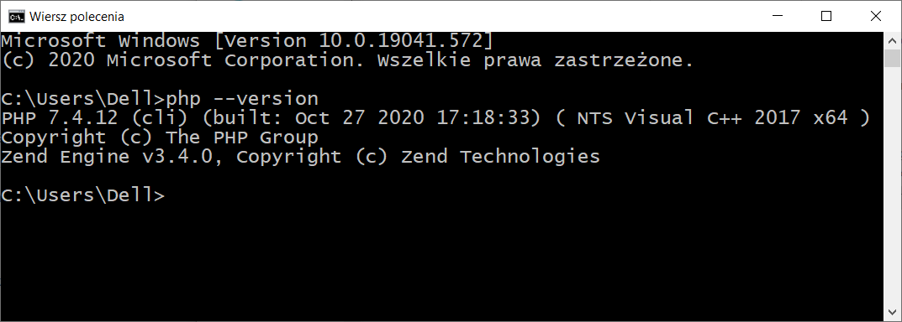

Interpreter PHP
===============

Poniżej opisujemy jak zainstalować i skonfigurować interpreter PHP.

Linux
------------

W systemach opartych na Debianie (Ubuntu, Mint) używamy menedżera pakietów w linii poleceń:

.. code-block:: bash

    ~$ sudo apt-get install php-cli php-gd php-sqlite3 php-intl php-mbstring

.. note::

  Poza interpreterem dostępnym w wierszu poleceń instalujemy rozszerzenia:
  `gd`, `sqlite3`, `intl` i `mbstring`.

Windows
-------

Ze strony `PHP for Windows – Downloads <https://windows.php.net/download/>`_
pobieramy archiwum zip z ostatnia 64-bitową wersją, np. `php-7.4.12-nts-Win32-vc15-x64.zip`.
Pobrany plik rozpakowujemy do głównego katalogu wybranego dysku, np.: :file:`C:\\php`.

   Zawartość katalogu `C:\\php`

W wybranym edytorze tekstowym otwieramy plik konfiguracyjny `C:\\php\\php.ini-production`,
odkomentowujemy rozszerzenia: `gd2`, `intl`, `mbstring` i `pdo_sqlite3`. Na koniec plik
zapisujemy pod nazwą `C:\\php\\php-ini`.

   Odkomentowanie rozszerzeń PHP.

Otwieramy wiersz poleceń `cmd` i wydajemy polecenie, które katalog interpretera PHP
doda do zmiennej środowiskowej PATH:

.. code-block:: bash

   setx PATH "c:\php;%PATH%"

Restartujemy wiersz poleceń i poprawność instalacji sprawdzamy komendą:

.. code-block:: bash

   php --version

   Informacja o wersji interpretera PHP.

