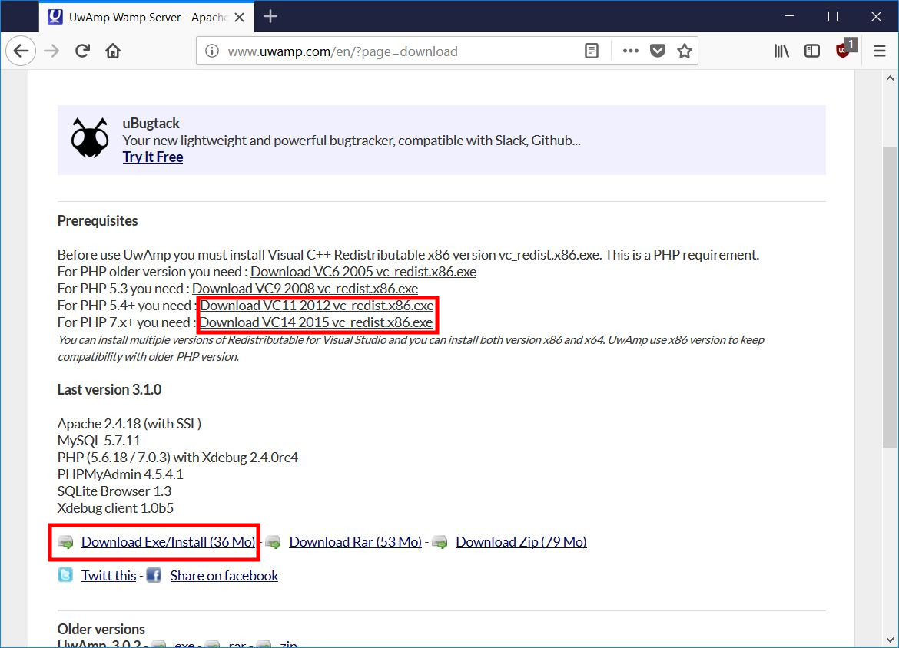
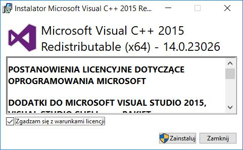
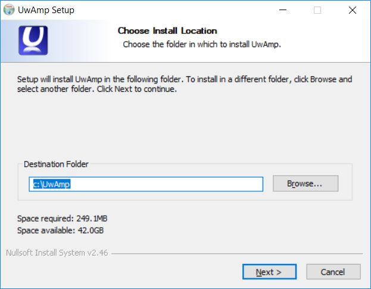
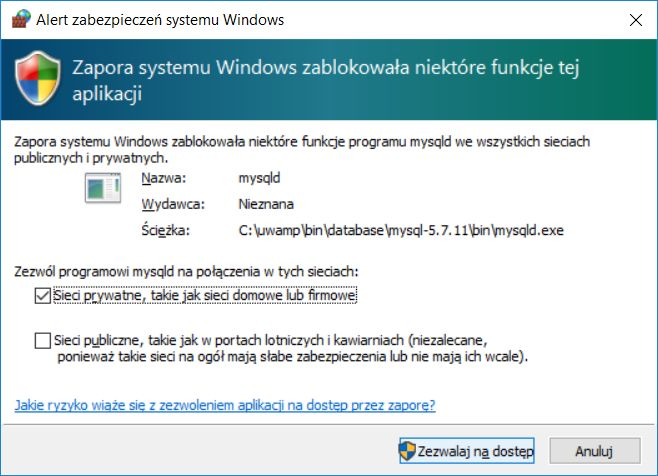
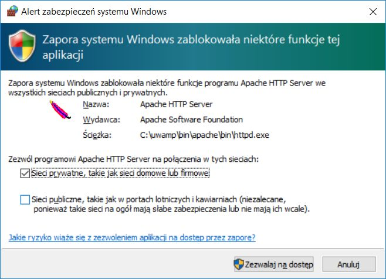
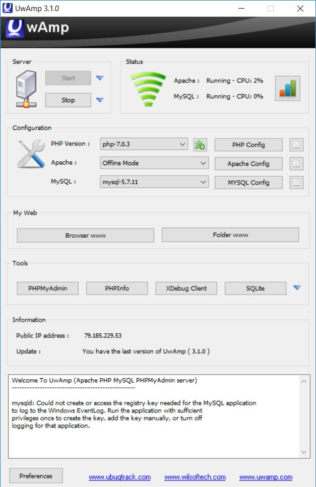
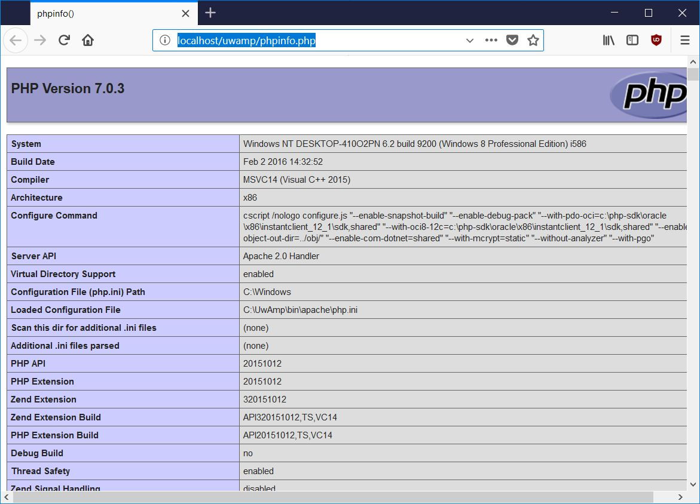

UwAmp w Windows
###############

Alternatywą dla XAMPP-a jest zestaw aplikacji `UwAmp <http://www.uwamp.com/en/>`_.
Po wejściu na stronę klikamy *Download*, a następnie link o nazwie **Download Exe/Install**.

.. caution::
  Do poprawnego działania Apache'a wymagana jest biblioteka Microsoftu Visual
  `C++ 2012 Redistributable (VC++ 11.0) <https://www.microsoft.com/en-us/download/details.aspx?id=30679>`_
  **w wersji 32-bitowej (x86)**, z kolei do PHP 7 musimy zainstalować
  `Visual C++ 2015 Redistributable <https://www.microsoft.com/en-us/download/details.aspx?id=48145>`_.

Pobieramy wymienione wyżej biblioteki i instalujemy je na początku.

.. figure:: img/vcredist2012.jpg

Następnie uruchamiamy instalację UwAmpa. Jako miejsce instalacji wybieramy główny katalog
wybranego dysku, *C:*, *D:* itp.:

Po zainstalowaniu i uruchomieniu aplikacji *UwAmp* zapora systemowa może poprosić
o odblokowanie portów serwera www i bazy danych. Godzimy się, wybierając opcję dla
sieci prywatnych i domowych.

Serwerami i narzędziami zarządzamy za pomocą wygodnego okna:

.. note::
  Korzystając z powyższego okna wybierz wersję PHP 7.

Serwery www (Apache2) i bazy danych (MySQL) startowane są automatycznie. Jeżeli nie korzystamy
z serwera MySQL, możemy go zatrzymać klikając niebieską strzałkę obok przycisku "Stop" i wybierając
go listy. Do obsługi baz SQLite dołączono bardzo wygodny interfejs graficzny *SQLite Browser*.

Strony czy projekty umieszczamy w katalogu ``www`` folderu, w którym zainstalowaliśmy UwAmpa,
np. w ``C:\\UwAmp\www``. W przeglądarce wpisujemy adres ``localhost`` lub ``localhost/podkatalog``,
jeżeli strony umieściliśmy w jakimś podkatalogu.

