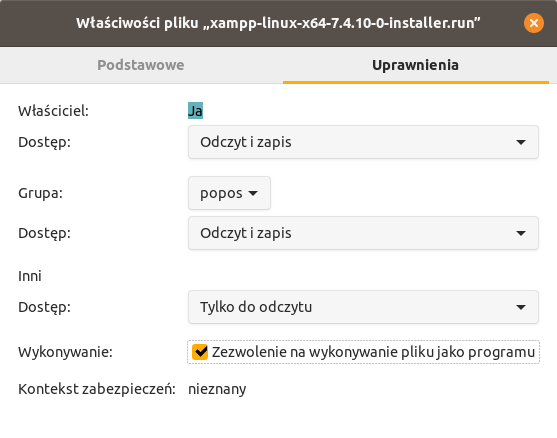
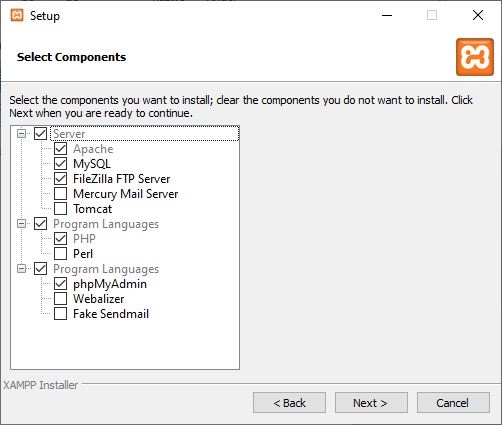
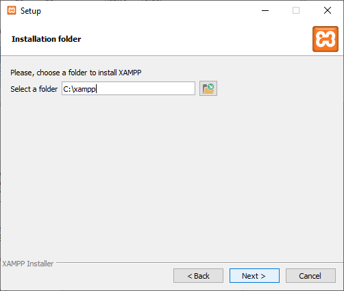
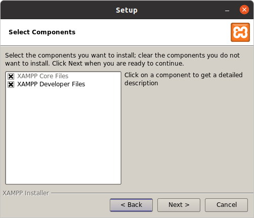
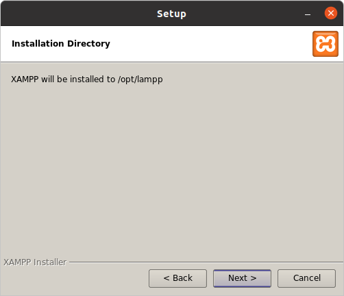
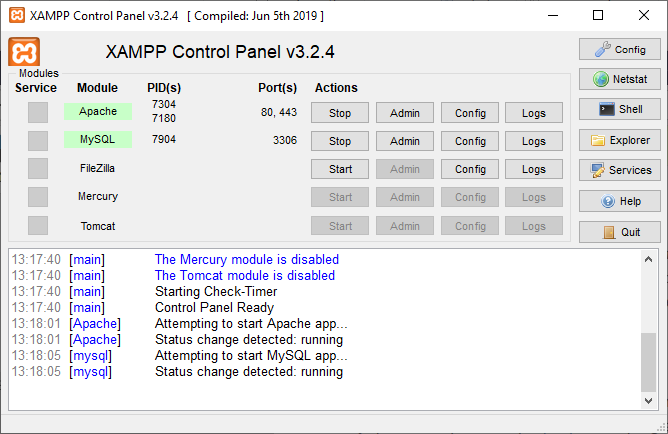

XAMPP
=====

Kompleksowym rozwiązaniem dostępnym dla wielu systemów (Linux, Windows, OS X),
zawierającym serwer Apache, bazę MariaDB oraz interpreter PHP i Perl oraz narzędzia do
zarządzania bazą danych jest `XAMPP <https://www.apachefriends.org/pl/index.html>`_.

Instalator
----------

Ze strony `XAMPP Pobierz <https://www.apachefriends.org/pl/download.html>`_
pobieramy instalator przeznaczony do naszego systemu.

W systemie Linux pobranemu i zapisanemu plikowi przyznajemy prawo do uruchamiania.
Klikamy pobrany plik prawym klawiszem i we "Właściwościach", na zakładce "Uprawnienia"
zaznaczamy "Zezwolenie na wykonywanie pliku jako programu".

Dwa razy klikamy pobrane pliki i uruchamiamy instalację z domyślnymi opcjami.
W środowisku Windows pliki zainstalowane zostaną w katalogu :file:`C:\\xampp`,
w Linuksie w katalogu :file:`/opt/lampp`.

   Opcjonalny wybór składników w Windows.

   Instalacja w domyślnym katalogu.

   Opcjonalny wybór składników w Linuksie.

   Instalacja w domyślnym katalogu.

.. attention::

   Po instalacji w systemie Windows mogą zostać wyświetlone komunikaty zapory Windows Defender,
   zezwalamy wtedy bazie danych i serwerowi WWW na działanie w sieci prywatnej lub publicznej.

   .. figure:: img/xampp_11_win.png

      Komunikat Windows Defender o zablokowaniu serwera bazy danych.

Linux
------

Do uruchomienia środowiska używamy polecenia:

.. code-block:: bash

   sudo /opt/lampp/lamp start

Zatrzymanie następuje po wydaniu polecenia:

.. code-block:: bash

   sudo /opt/lampp/lamp stop

Możemy użyć narzędzia graficznego:

.. code-block:: bash

   sudo /opt/lampp/manager-linux-x64.run

   Panel graficzny pozwalający na zarządzanie usługami XAMPP.

.. tip::

   Warto przeczytać `Linux – Najczęściej zadawane pytania <https://www.apachefriends.org/pl/faq_linux.html>`_.

Windows
-------

Do sterowania serwerami używamy aplikacji XAMPP Control Panel,
która pozwala na uruchamianie, zatrzymywanie, a także konfigurowanie
serwera WWW i bazy danych.

   Aplikacja XAMPP Control Panel, uruchomione serwery WWW i bazy danych.

Pliki źródłowe serwisów WWW, które będziemy tworzyli, umieszczamy w podkatalogach
katalogu głównego, czyli :file:`C:\\xampp\\htdocs`.

.. tip::

   Warto przeczytać `Windows – Najczęściej zadawane pytania <https://www.apachefriends.org/pl/faq_windows.html>`_.
