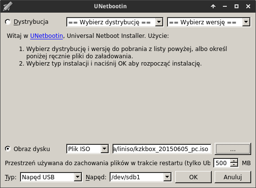

.. _linuxlive:

Linux Live USB
###################

Scenariusze zawarte w naszym serwisie tworzone są w oparciu o system Linux,
ale można je również realizować na systemach Windows. Poniżej przedstawiamy,
w jaki sposób przygotować w pełni funkcjonalną dystrybucję Linuksa uruchamianą
z klucza USB. Może posłużyć nie tylko jako środowisko programistyczne,
ale również jako podręczny sytem przenośny lub ratunkowy.

.. contents:: Spis treści
    :backlinks: none

.. _usbwin:

W Windows
*************************

Aby w systemie MS Windows przygotować bootowalny klucz USB z możliwością
zapisu ustawień i dokumentów, wykonaj następujące czynności:

1) Pobierz program `Rufus <https://rufus.akeo.ie/>`_ – małe, szybkie i sprawdzone (:-)) narzędzie
   do tworzenia bootowalnych kluczy USB. Narzędzie nie wymaga instalacji.

2) Pobierz plik :file:`kzkbox_20150716.iso`, który udostępniamy pod adresem: `Copy.com <https://copy.com/9WzmbHVn8T8UxsSN>`_.
   Plik zawiera dostosowany obraz systemu `LxPupTahr 15.05.01 <http://lx-pup.weebly.com/>`_ z pulpitem `LXDE <http://pl.wikipedia.org/wiki/LXDE>`_.

.. figure:: linimg/lxpup.png
   :alt: Pulpit LxPupTahr

   Pulpit LxPupTahr ze środowiskiem LXDE

3) Przygotuj pendrajwa o pojemności min. 2GB zawierającego jedną, główną,
   aktywną partycję FAT32. Taka partycja jest domyślna na większości kluczy.
   Pamiętaj, że zostanie ona sformatowana! A więc zarchiwizuj ewentualne dane.
   Podłącz napęd do komputera i sprawdź, jaką literę przydzielił mu system.

4) Uruchom program Rufus z uprawnieniami administratora(!):

    * z listy "Urządzenie" wybierz pendrajwa kierując się oznaczeniem literowym i pojemnością;
    * zaznacz w razie potrzeby opcję "Szybkie formatowanie" (domyślna)
    * zaznacz opcję "Utwórz bootowalny dysk używając" -> "Obraz ISO",
      kliknij ikonę obok i wskaż ściągnięty plik :file:`kzkbox_20150716.iso`;
    * wybierz "Opcje formatowania" i zaznacz "Dodaj łatkę dla starych biosów";
    * kliknij "Start" i po 4-5 min. powinieneś zobaczyć napis "Gotowe".

.. figure:: linimg/rufus02.jpg

Możesz już spróbować uruchomić komputer z wykorzystaniem tak przygotowanego pendrajwa.
Wystarczy, że podczas uruchamiania wciśniesz odpowiedni klawisz, najczęściej
:kbd:`F1`, :kbd:`F2`, :kbd:`F10`, :kbd:`F12` lub :kbd:`DEL`.

W Linuksie
*************************

* W Ubuntu i pochodnych instalujemy program `Unetbootin <http://unetbootin.sourceforge.net>`_ poleceniami:

.. code-block:: bash

    ~$ sudo apt-add-repository ppa:gezakovacs/ppa
    ~$ sudo apt-get update
    ~$ sudo apt-get install unetbootin

* W Debianie Jessie 8 ściągamy pakiet `unetbootin_608-1_i386.deb <http://ftp.pl.debian.org/debian/pool/main/u/unetbootin/unetbootin_608-1_i386.deb>`_,
  a następnie w katalogu z pobranym plikiem wydajemy polecenia jako root:

.. code-block:: bash

    ~# dpkg -i unetbootin_608-1_i386.deb
    ~# apt-get install -f

*  W Arch Linuksie i pochodnych jako root wydajemy polecenia:

.. code-block:: bash

    ~# pacman -Syu
    ~# pacman -S unetbootin

* Wpinamy pendrajwa o pojemności min. 4GB dla dystrybucji *SRU* (*Xubuntu*). Pendrajw
  powinien mieć przynajmniej jedną główną i aktywną partycję FAT32 – tak jest zazwyczaj.
* Po uruchomieniu programu "Unetbootin" zaznaczamy opcję "Obraz dysku", klikamy
  przycisk "..." i wskazujemy pobrany obraz.
* Jeżeli wybraliśmy obraz *Xubuntu*, *SRU* lub *FREE_DESKTOP*, w polu "Przestrzeń
  używana do zachowania plików..." wpisujemy min. ``512``. Jeżeli wybraliśmy
  obraz *LxPupTahr* przechodzimy do następnego punktu.
* Upewniamy się, że w polu "Napęd:" wyświetlona jest litera przydzielona
  właściwemu pendrajwowi i klikamy "OK". Czekamy w zależności od wybranej
  dystrybucji i prędkości klucza USB od 1-20 minut.

Pierwsze uruchomienie
*********************

Po pierwszym uruchomieniu zatwierdź okno kreatora ustawień przyciskiem "Ok"
i zamknij kreator połączenia z internetem. Następnie:

* :ref:`skonfiguruj typ klawiatury <klawiatura>`, aby działały skróty klawiszowe;
* zamknij system, aby zapisać ustawienia i :ref:`utworzyć plik zapisu <plikzapisu>`.

Po ponownym uruchomieniu system gotowy będzie do pracy :-)

Obsługa *LxPupTahr*
***********************

System w dostosowanej wersji zawiera:

* spolszczone prawie wszystkie elementy systemu;
* zaktualizowane listy oprogramowania;
* zaktualizowaną i spolszczoną przeglądarkę `Pale Moon <https://www.palemoon.org/>_`
  (otwartoźrodłówa, oparta na Firefoksie);
* fonty Ubuntu oraz podstawowe z Windows;
* pakiety *python-pip*, *python-virtualenv*, *git* oraz bibliotekę *Pygame*;
* skonfigurowane środowiska programistyczne *Geany IDE* oraz *Sublime Text 3*;
* możliwość łatwej instalacji środowiska *PyCharm Proffesional*;
* skonfigurowane elementy interfejsu LXDE;
* skonfigurowane skróty klawiszowe.

Wszystkie pozostałe biblioteki potrzebne do realizacji `Szkolenia z Pythona
Kzk <http://python101.readthedocs.org>`_ zainstalujemy przy użyciu narzędzia *pip*.

Połączenie z internetem
=========================

System *LxPupTahr* domyślnie wczytuje się w całości do pamięci RAM i uruchamia
środowisko graficzne LXDE z zalogowanym użytkownikiem *root*, czyli administratorem
w systemach linuksowych. Na początku będziesz chciał nawiązać połączenie
z internetem.

Z menu "Start/Konfiguracja" uruchamiamy *Internet kreator połączenia*, klikamy
"Wired or wireless LAN", w następnym oknie wybieramy narzędzie
"Simple Network Setup".

Po jego uruchomieniu powinniśmy zobaczyć listę wykrytych interfejsów,
z której wybieramy *eth0* dla połączenia kablowego, *wlan0* dla połączenia
bezprzewodowego. W przypadku *eth0* połączenie powinno zostać skonfigurowane
od razu, natomiast w przypadku *wlan0* wskazujemy jeszcze odpowiednią sieć,
metodę zabezpieczeń i podajemy hasło.

Jeżeli uzyskamy połączenie, w oknie "Network Connection Wizard/Kreator Połączenia Sieci" zobaczymy
aktywne interfejsy. Sugerujemy kliknąć "Cancel/Anuluj", a w ostatnim oknie
informacyjnym "Ok".

.. figure:: lxpupimg/internet01.png
.. figure:: lxpupimg/internet02.png
.. figure:: lxpupimg/internet03.png
.. figure:: lxpupimg/internet04.png
.. figure:: lxpupimg/internet05.png

Przeglądarka WWW
==================

Domyślną przeglądarką jest `PaleMoon <https://www.palemoon.org/>`_, otwartoźródłowa
odmiana oparta na Firefoksie. Od czasu do czasu warto ją zaktualizować.

Domyślne katalogi
==================

* :file:`/root/my-documents` lub :file:`/root/Dokumenty`
* :file:`/root/my-documents/clipart` lub :file:`/root/Pobrane` - tu zapisywane są pliki pobierane z internetu
* :file:`/root/my-documents/clipart` lub :file:`/root/Obrazy`
* :file:`/root/my-documents/tmp` lub :file:`/root/tmp` - katalogi tymczasowe
* :file:`/usr/share/fonts/default/TTF/` – dodatkowe czcionki TrueType, np. z MS Windows

.. _instalacjaprog:

Instalacja programów
====================

Jeżeli chcemy coś doinstalować, uruchamiamy **Quickpet tahr**
z menu "Start/Konfiguracja". Na początku klikamy "tahrpup updates",
aby zaktualizować listę dostępnych aplikacji. Następnie restartujemy
program i sprawdzamy, czy w poszczególnych zakładkach znajdziemy potrzebne
nam narzędzia, np.: Firefox, Chrome, Flash, Skype i inne.

.. figure:: linimg/pet_quickpet03.png

Jeżeli w *Quickpet tahr* nie znajdziemy wymaganej aplikacji, uruchamiamy
**Puppy Package Manager/Puppy Manager Pakietów** z menu "Start/Konfiguracja".
Aktualizujemy listę dostępnych aplikacaji: klikamy ikonę ustawień obok koła ratunkowego,
w następnym oknie zakładkę "Update database/Aktualizuj bazę danych"
i przycisk "Update now/Aktualizuj teraz". Po uruchomieniu okna terminala naciskamy
klawisze ENTER klika razy, aby potwierdzić aktualizację repozytoriów.
Na koniec zamykamy okno aktualizacji przyciskiem "OK", co zrestartuje menedżera pakietów.

.. figure:: lxpupimg/ppm01.png
.. figure:: lxpupimg/ppm02.png
.. figure:: lxpupimg/ppm03.png

Po ponownym uruchomieniu PPM, wpisujemy nazwę szukanego pakietu w pole wyszukiwania,
następnie wybieramy pakiet z wyświetlonej listy, co dodaje go do kolejki.
W ten sposób możemy wyszukać i dodać kilka pakietów na raz.
Na koniec zatwierdzamy instalację przyciskiem "Do it!"

.. figure:: lxpupimg/ppm04.png

.. tip::

    Trzeba pamiętać, że używamy dystrybucji okrojonej, więc nie wszystko
    warto instalować z repozytoriów, bo nie zawsze znajdziemy tam oprogramowanie
    odpowiednio dostosowane do naszej dystrybucji.

*LxPup* oferuje jednak dwa inne sposoby doinstalowywania oprogramowania na żądanie!
Pierwszy to paczki w formacie `PET <http://puppylinux.org/wikka/PETs?redirect=no>`_,
dostępne np. na stronie `pet_packages-tahr <http://distro.ibiblio.org/puppylinux/pet_packages-tahr/>`.
Ściągamy je, a następnie instalujemy dwukrotnie klikając (uruchomi się narzędzie *petget*).

.. figure:: lxpupimg/pet01.png

Drugim formatem stosowanym dla dużych pakietów, które używamy od czasu
do czasu, jest format `SFS <http://puppylinux.org/wikka/SquashFS>`_.
Spakowane w ten sposób oprogramowanie możemy dodawać "w locie" w trakcie
działania systemu. Korzystamy z narzędzia *SFS-Load w locie* (Start/Konfiguracja).

.. tip::

    Duże pliki SFS itp. zasoby warto przechowywać nie w katalogu domowym
    :file:`/root`, ale w katalogu głównym startowego pendrajwa. Jest on
    łatwo dostępny podczas pracy z systemem w ścieżce :file:`/initrd/mnt/dev_save/`,
    łatwo go również otworzyć z lewego panelu w menedżerze plików.
    Zazwyczaj oznaczony będzie ``sdb1``.

.. figure:: linimg/pcmanfm01.png

.. _klawiatura:

Skróty klawiaturowe
====================

.. attention::

    Poniższe skróty zadziałają, jeżeli ustawimy odpowiedni typ klawiatury.
    Procedura jest bardzo prosta. Uruchamiamy "Ustawienia Puppy" (pierwsza ikona obok przycisku Start,
    lub Start/Konfiguracja/Wizard Kreator), wybieramy "Mysz/Klawiatura". W następnym
    oknie "Zaawansowana konfiguracja", potwierdzamy "OK", dalej "Model klawiatury"
    i na koniec zaznaczamy "pc105". Pozostaje potwierdzenie "OK" i jeszcze
    kliknięcie przycisku "Tak" w poprzednim oknie, aby aktywować ustawienia.

.. figure:: lxpupimg/lxpup_ustawienia.png
.. figure:: lxpupimg/lxpup_klawiatura01.png
.. figure:: lxpupimg/lxpup_klawiatura02.png
.. figure:: lxpupimg/lxpup_klawiatura03.png

Oznaczenia: C – Control, A – Alt, W - Windows (SuperKey).

* **C+A+Left** - puplpit lewy
* **C+A+Right** - pulpit prawy
* **Alt + Space** - menu okna
* **C+Esc** - menu start
* **C+A+Del** - menedżer zadań
* **W+f** - menedżer plików (pcmanfm)
* **W+t** - terminal (LXTerminal)
* **W+e** - Geany IDE
* **W+s** - Sublime Text 3
* **W+p** - PyCharm IDE
* **W+w** - przeglądarka WWW (Palemoon)

Konfiguracja LXDE
=================

* **Wygląd, Ikony, Tapeta, Panel**: Start/Pulpit/Zmiana wyglądu.
* **Ekran(y)**: Start/System/System/Ustawienia wyświetlania.
* **Czcionki**: Start/Pulpit/Desktop/Manager Fontu.
* **Menedżer plików**: Edycja/Preferencje w programie.
* **Ustawienia Puppy**: Start/Konfiguracja/Wizard Kreator
* **Internet kreator połączenia**: Start/Konfiguracja
* **Zmiana rozmiaru pliku zapisu**: Start/Akcesoria
* **Puppy Manager Pakietów**: Start/Konfiguracja
* **Quickpet tahr**: Start/Konfiguracja
* **SFS-załadowanie w locie**: Start/Konfiguracja/SFS-Załadowanie w locie
* **QuickSetup ustawienia pierwszego uruchamiania**: Start/Konfiguracja
* **Restart menedżera okien** (RestartWM): Start/Zamknij
* **WM Switcher** – switch windowmanagers:
* **Startup Control – kontrola aplikacji startowych**: Start/Konfiguracja
* **Domyślne aplikacje**: Start/Pulpit/Preferowane programy
* **Terminale** Start/Akcesoria
* **Ustawienie daty i czasu**: Start/Pulpit

Wskazówki
==========

1. Dwukrotne kliknięcie – menedżer plików PcManFm domyślnie otwiera pliki
   i katalogi po pojedynczym kliknięciu. Jeżeli chcielibyśmy to zmienić,
   wybieramy "Edycja/Preferencje".

Materiały dodatkowe
*******************

.. note::

    Winę za niebootujący system z klucza USB częściej ponosi sprzęt niż
    sam pendrajw czy nagrany na nim system. Niestety, dotyczy to głównie
    przestarzałych maszyn oraz... najnowszych. Pierwsze mają niedostosowany BIOS,
    drugie zbyt "nowe" komponenty, do których może brakować sterowników.
    Problematyczne mogą być też laptopy z biosem UEFI, plus SecureBoot,
    z preinstalowanym "jedynym słusznym" systemem... Przeczytaj rozdział
    "Problemy".

.. toctree::
    :maxdepth: 2
    :numbered:

    puppy_linux
    konfiguracja
    jvm
    xfce
    problemy_llusb

.. raw:: html

    

:Autor: Robert Bednarz (ecg@ecg.vot.pl)

:Utworzony: |date| o |time|

.. |date| date::
.. |time| date:: %H:%M

.. raw:: html

    
