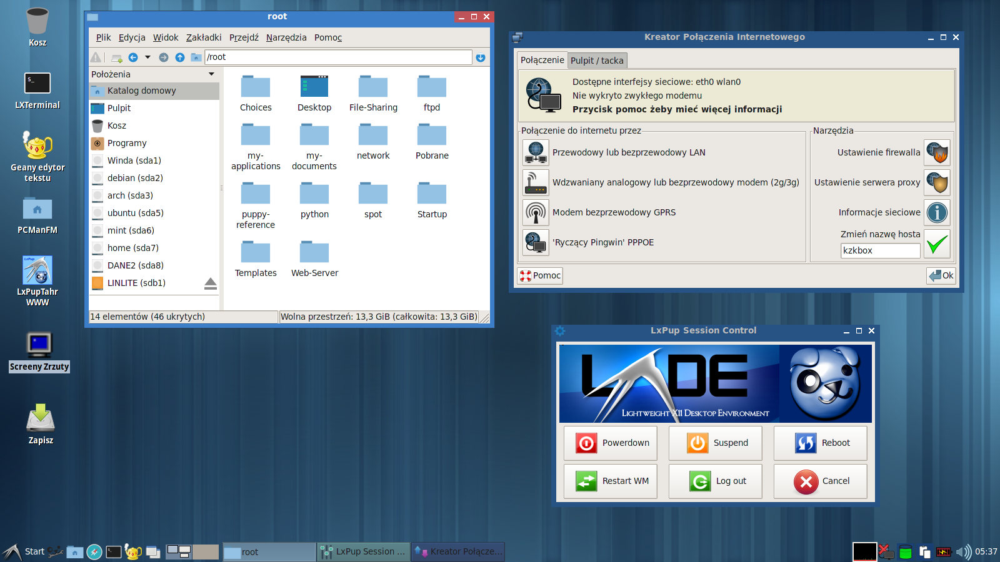
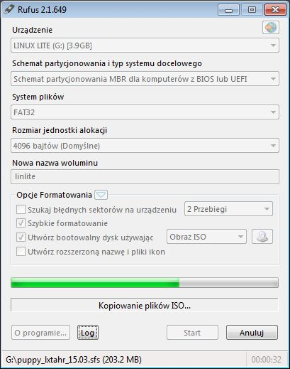
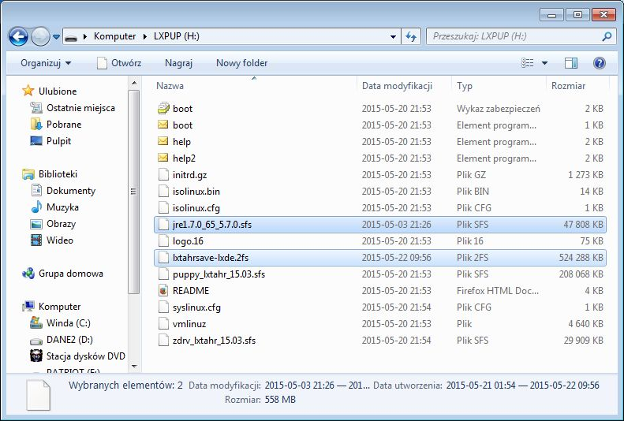
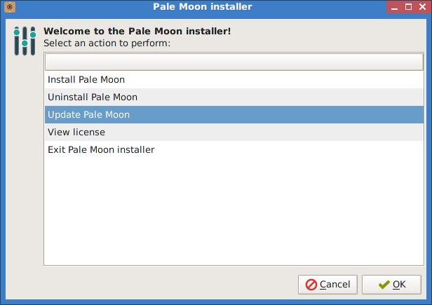
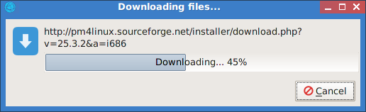
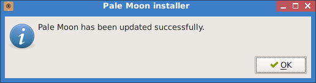
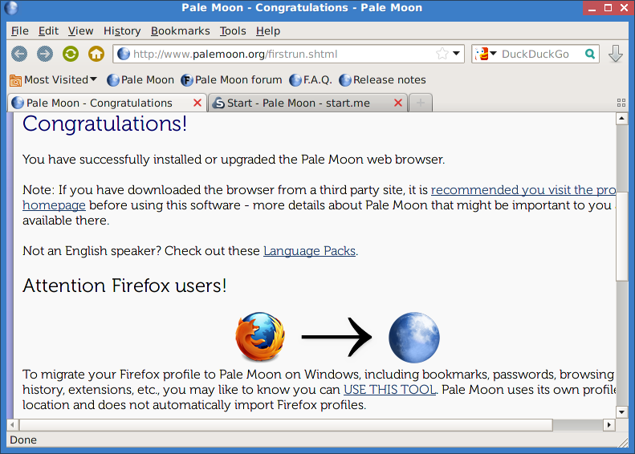
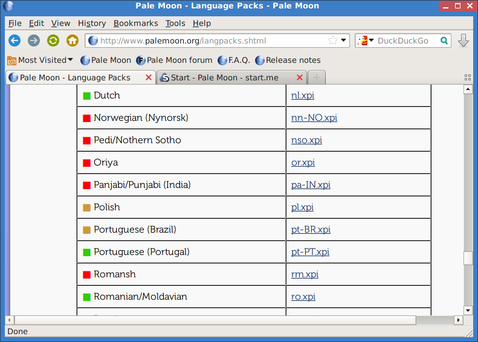
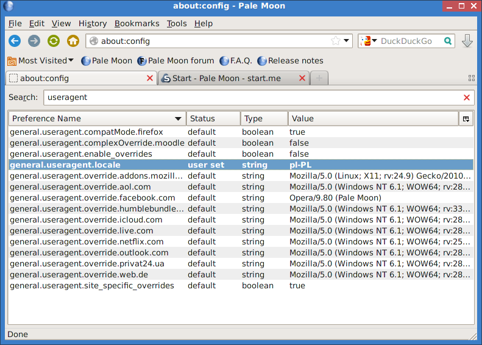

.. _linuxlive:

Linux Live USB
###################

Scenariusze zawarte w naszym serwisie tworzone są w oparciu o system Linux,
ale można je również realizować na systemach Windows. Poniżej przedstawiamy,
w jaki sposób przygotować w pełni funkcjonalną dystrybucję Linuksa uruchamianą
z klucza USB. Może posłużyć nie tylko jako środowisko programistyczne,
ale również jako podręczny sytem przenośny lub ratunkowy.

.. contents:: Spis treści
    :backlinks: none

.. _usbwin:

Klucz USB w Windows
*************************

Aby w systemie MS Windows przygotować bootowalny klucz USB z opcją persistent,
wykonaj następujące czynności:

1) Pobierz program `Rufus <https://rufus.akeo.ie/>`_ – małe, szybkie i sprawdzone (:-)) narzędzie
   do tworzenia bootowalnych kluczy USB. Narzędzie nie wymaga instalacji.

2) Pobierz plik `LxPupTahr-15.03.1-pae.iso <http://lx-pup.weebly.com/upup-tahr.html>`_ (ok. 250 MB),
   zawierający pulpit `LXDE <http://pl.wikipedia.org/wiki/LXDE>`_. System jest "odchudzoną" wersją Ubuntu 14.04 LTS.

   Pulpit LxPupTahr ze środowiskiem LXDE

3) Przygotuj pendrajwa o pojemności min. 2GB zawierającego jedną, pustą,
   aktywną partycję FAT32. Taka partycja jest domyślna na większości kluczy.
   Pamiętaj, że zostanie ona sformatowana! A więc zarchiwizuj ewentualne dane.
   Podłącz napęd do komputera i sprawdź, jaką literę przydzielił mu system.

4) Uruchom program Rufus z uprawnieniami administratora(!):

    * z listy "Urządzenie" wybierz pendrajwa kierując się oznaczeniem literowym i pojemnością;
    * zaznacz w razie potrzeby opcję "Szybkie formatowanie" (domyślna)
    * zaznacz opcję "Utwórz bootowalny dysk używając" -> "Obraz ISO",
      kliknij ikonę obok i wskaż ściągnięty plik :file:`LxPupTahr-15.03.1-pae.iso`;
    * kliknij "Start" i po chwili (naprawdę szybko) powinieneś zobaczyć napis "Gotowe".

Możesz spróbować uruchomić komputer z wykorzystaniem tak przygotowanego pendrajwa
i... eksperymentować, ile chcesz. Wprowadzonych zmian nie musisz zapisywać.
Ale zanim to zrobisz przeczytaj jeszcze jeden rozdział poniżej!

Plik zapisu
============

*LxPup* po pierwszym uruchomieniu ma interfejs w języku angielskim i wymaga wstępnej konfiguracji.
Dlatego sugerujemy pobranie `pliku zapisu <http://puppylinux.org/wikka/SaveFile>`_
(ang. *savefile*) :file:`lxtahrsave-lxde.2fs` udostępnionego w serwisie `Copy.com <https://copy.com/9WzmbHVn8T8UxsSN>`_,
oraz dodatkowego pakietu `jre1.7.0_65_5.7.0.sfs <http://puppylinuxstuff.meownplanet.net/aarf/java_jre/jre1.7.0_65_5.7.0.sfs>`_.
Obydwa pliki należy wgrać do głównego katalogu pendrajwa.

Plik zapisu zawiera zapisaną konfigurację systemu, czyli:

* zaktualizowane listy oprogramowania;
* zaktualizowaną i spolszczoną domyślną przeglądarkę `Pale Moon <https://www.palemoon.org/>_`
  (otwartoźrodłówa, oparta na Firefoksie);
* fonty Droid, Ubuntu oraz podstawowe z Windows;
* pakiety python-pip, python-virtualenv oraz bibliotekę pygame;
* skonfigurowane mini środowisko programistyczne IDE – Geany.
* środowisko PyCharm IDE Educational
* skonfigurowane elementy interfejsu LXDE

.. attention::

    Na pendrajwie nie może znajdować się żaden inny plik o nazwie rozpoczynającej
    się na `lxtahrsave`. Ewentualne utworzone wcześniej pliki zapisu
    trzeba albo skasować, albo zmienić im nazwy.

    **ZALECAMY powiększyć rozmiar pliku zapisu do 1024 MB** za pomocą narzędzia:
    *Zmiana rozmiaru pliku osobistego przechowywania* (Start/Setup).

.. note::

    Nazwa pliku :file:`pupsave` zawsze zaczyna się "lxtahrsave-", np.:
    :file:`lxtahrsave-lxde.2fs`. Położenie jest dowolne, tzn. można go zapisać
    na kluczu USB, ale równie dobrze może być zapisany na dowolnej partycji
    szybkiego dysku stacjonarnego. Podczas uruchamiania *LxPup* potrafi
    odnaleźć ten plik na wszystkich dostępnych partycjach i załadować go!

.. tip::

    Pracując w systemie, mamy dostęp do głównego katalogu naszego pendrajwa
    (zazwyczaj oznaczonego w menedżerze plików ``sdb1``). Możemy w nim tworzyć
    dowolne foldery i zapisywać pliki, np. *pet* i *sfs*, z których
    będziemy korzystać w miarę potrzeb. Dzięki temu unikniemy zbędnego
    rozrastania się pliku zapisu.
    Należy uważać, aby z katalogu głównego nie usunąć plików *LxPup*.

Przechowywanie ustawień i dokumentów w pliku zapisu ma swoje zalety:

* wystarczy usunąć omawiany plik, a system uruchomi się w wersji domyślnej;
  będzie można skonfigurować go od podstaw;
* można udostępniać innym pliki zapisu; wystarczy, że wgrają go na
  pendrajwa przygotowanego zgodnie z naszą instrukcją, a dostaną
  skonfigurawane środowisko i programy, a nawet ewentualne dokumenty.

Ostatecznie zawartość katalogu głównego pendrajwa przedstawiać powinna się
następująco:

Obsługa *LxPupTahr*
***********************

System *LxPup* domyślnie wczytuje się w całości do pamięci RAM i uruchamia
środowisko graficzne LXDE z zalogowanym użytkownikiem *root*, czyli administratorem
w systemach linuksowych.

Jeżeli system uruchamiany jest po raz pierwszy, wita nas kreator konfiguracji.
Jeżeli jednak skorzystamy z poleconego wyżej pliku zapisu, czynnością,
którą będziemy chcieli wykonać na początku, jest nawiązanie połączenia
z internetem.

Połączenie z internetem
=========================

Z menu "Start/Setup" uruchamiamy *Internet kreator połączenia*, klikamy
"Wired or wireless LAN", w następnym oknie wybieramy narzędzie
"Simple Network Setup".

Po jego uruchomieniu powinniśmy zobaczyć listę wykrytych interfejsów,
z której wybieramy *eth0* dla połączenia kablowego, *wlan0* dla połączenia
bezprzewodowego. W przypadku *eth0* połączenie powinno zostać skonfigurowane
od razu, natomiast w przypadku *wlan0* wskazujemy jeszcze odpowiednią sieć,
metodę zabezpieczeń i podajemy hasło.

Jeżeli uzyskamy połączenie, w oknie "Network Connection Wizard/Kreator Połączenia Sieci" zobaczymy
aktywne interfejsy. Sugerujemy kliknąć "Cancel/Anuluj", a w ostatnim oknie
informacyjnym "Ok".

.. figure:: lxpupimg/internet01.png
.. figure:: lxpupimg/internet02.png
.. figure:: lxpupimg/internet03.png
.. figure:: lxpupimg/internet04.png
.. figure:: lxpupimg/internet05.png

Instalacja programów
====================

Jeżeli chcemy coś doinstalować, uruchamiamy **Quickpet tahr**
z menu "Start/Setup". Na początku klikamy "tahrpup updates",
aby zaktualizować listę dostępnych aplikacji. Następnie restartujemy
program i sprawdzamy, czy w poszczególnych zakładkach znajdziemy potrzebne
nam narzędzia, np.: Firefox, Chrome, Flash, Skype i inne.

.. figure:: linimg/pet_quickpet03.png

Jeżeli w *Quickpet tahr* nie znajdziemy wymaganej aplikacji, uruchamiamy
**Puppy Package Manager/Puppy Manager Pakietów** z menu "Start/Setup".
Aktualizujemy listę dostępnych aplikacaji: klikamy ikonę ustawień obok koła ratunkowego,
w następnym oknie zakładkę "Update database/Aktualizuj bazę danych"
i przycisk "Update now/Aktualizuj teraz". Po uruchomieniu okna terminala naciskamy
klawisze ENTER klika razy, aby potwierdzić aktualizację repozytoriów.
Na koniec zamykamy okno aktualizacji przyciskiem "OK", co zrestartuje menedżera pakietów.

.. figure:: lxpupimg/ppm01.png
.. figure:: lxpupimg/ppm02.png
.. figure:: lxpupimg/ppm03.png

Po ponownym uruchomieniu PPM, wpisujemy nazwę szukanego pakietu w pole wyszukiwania,
następnie wybieramy pakiet z wyświetlonej listy, co dodaje go do kolejki.
W ten sposób możemy wyszukać i dodać kilka pakietów na raz, np. *python-pip*,
*python-virtual*, *pygame*. Na koniec zatwierdzamy instalację przyciskiem "Do it!"

.. figure:: lxpupimg/ppm04.png

.. tip::

    Trzeba pamiętać, że używamy dystrybucji okrojonej, więc nie wszystko
    warto instalować z repozytoriów, bo nie zawsze znajdziemy tam oprogramowanie
    odpowiednio dostosowane do naszej dystrybucji.

*LxPup* oferuje jednak dwa inne sposoby doinstalowywania oprogramowania na żądanie!
Pierwszy to paczki w formacie `PET <http://puppylinux.org/wikka/PETs?redirect=no>`_,
dostępne np. na stronie `pet_packages-tahr <http://distro.ibiblio.org/puppylinux/pet_packages-tahr/>`.
Ściągamy je, a następnie instalujemy dwukrotnie klikając (uruchomi się narzędzie *petget*).

.. figure:: lxpupimg/pet01.png

Drugim formatem stosowanym dla dużych pakietów, które używamy od czasu
do czasu, jest format `SFS <http://puppylinux.org/wikka/SquashFS>`_.
Spakowane w ten sposób oprogramowanie możemy dodawać "w locie" w trakcie
działania systemu. Korzystamy z narzędzia *SFS-Load w locie* (Start/Setup).

.. tip::

    Duże pliki SFS itp. zasoby warto przechowywać nie w katalogu domowym
    :file:`/root`, ale w katalogu głównym startowego pendrajwa. Jest on
    łatwo dostępny podczas pracy z systemem w ścieżce :file:`/initrd/mnt/dev_save/`,
    łatwo go również otworzyć z lewego panelu w menedżerze plików.
    Zazwyczaj oznaczony będzie ``sdb1``.

.. figure:: linimg/pcmanfm01.png

.. note::

    Pod adresem `Copy.com <https://copy.com/9WzmbHVn8T8UxsSN>`_ znajdziesz
    niedługo przydatne pakiety w formacie PET i SFS.

Przeglądarka WWW
==================

Domyślną przeglądarką jest `PaleMoon <https://www.palemoon.org/>`_, otwartoźródłowa
odmiana oparta na Firefoksie. Aktualizujemy ją wybierając *Start/Internet/Palemoon-updater*.
Zaznaczamy "Update Pale Moon" i klikamy OK.

Jeśli po aktualizacji przywita nas angielskojęzyczny interfejs, na stronie powitalnej
klikamy link "Language Packs", pobieramy plik tłumaczeń :file:`pl.xpi` i instalujemy.
Na koniec wpisujemy polu adresu polecenie "about:config", w pole wyszukiwania
"useragent" i zmieniamy opcję "general.useragent.locale" na "pl-PL" (o ile potrzeba).

.. figure:: linimg/palemoon06.png

Domyślne katalogi
==================

* :file:`/root/my-documents` lub :file:`/root/Dokumenty`
* :file:`/root/my-documents/clipart` lub :file:`/root/Obrazy`
* :file:`/root/my-documents/tmp` lub :file:`/root/tmp` - katalog tymczasowy
  oŋólnego przeznaczenia, wszystkie dane są z niego usuwane po zakończeniu sesji!
* :file:`/root/.icons` – dodatkowe zestawy ikon
* :file:`/root/.themes` – dodatkowe tematy Gtk
* :file:`/usr/share/fonts/default/TTF/` – dodatkowe czcionki TrueType, np. z MS Windows

Skróty klawiaturowe
====================

.. attention::

    Poniższe skróty będą działać, jeżeli wykorzystamy udostępniony przez
    nas plik zapisu, który zawiera odpowiednie ustawienia.

Oznaczenia: C – Control, A – Alt, W - Windows (SuperKey).

* **C+A+Left** - puplpit lewy
* **C+A+Right** - pulpit prawy
* **Alt + Space** - menu okna
* **C+Esc** - menu start
* **C+A+Del** - menedżer zadań
* **W+f** - menedżer plików (pcmanfm)
* **W+t** - terminal (LXTerminal)
* **W+e** - Geany IDE
* **W+p** - PyCharm IDE
* **W+w** - przeglądarka WWW (Palemoon)

Konfiguracja LXDE
=================

* **Wygląd, Ikony, Tapeta, Panel**: Start/Desktop/Change appearance.
* **Ekran(y)**: Start/System/System/Ustawienia wyświetlania.
* **Czcionki**: Start/Desktop/Desktop/Manager Fontu.
* **Menedżer plików**: Edycja/Preferencje w programie.
* **Ustawienia Puppy**: Start/Setup/Wizard Kreator
* **Internet kreator połączenia**: Start/Setup
* **Zmiana rozmiaru pliku osobistego przechowywania**: Start/Utility
* **Puppy Manager Pakietów**: Start/Setup
* **Quickpet tahr**: Start/Setup
* **SFS-załadowanie w locie**: Start/Setup/SFS-Załadowanie w locie
* **QuickSetup ustawienia pierwszego uruchamiania**: Start/Setup
* **Restart menedżera okien** (RestartWM): Session Control
* **WM Switcher** – switch windowmanagers:
* **Startup Control – kontrola aplikacji startowych**: Start/Setup
* **Domyślne aplikacje**: Start/Desktop/Preferowane programy
* **Terminale** Start/Utility
* **Ustawienie daty i czasu**: Start/Desktop

Materiały dodatkowe
*******************

.. toctree::
    :maxdepth: 2
    :numbered:

    puppy_linux
    konfiguracja
    jvm
    xfce
    problemy_llusb

.. raw:: html

    

:Autor: Robert Bednarz (ecg@ecg.vot.pl)

:Utworzony: |date| o |time|

.. |date| date::
.. |time| date:: %H:%M

.. raw:: html

    
