Linux Live USB
###################

.. _linuxlive:

Scenariusze zawarte w naszym serwisie tworzone są w oparciu o system Linux,
ale można je również realizować na systemach Windows. Poniżej przedstawiamy,
w jaki sposób przygotować w pełni funkcjonalną dystrybucję Linuksa uruchamianą
z klucza USB. Może posłużyć nie tylko jako środowisko programistyczne,
ale również jako podręczny sytem przenośny lub ratunkowy.

.. contents:: Spis treści
    :backlinks: none

.. _puppy:

Klucz USB w Windows
*************************

Aby w systemie MS Windows przygotować bootowalny klucz USB z opcją persistent,
wykonaj następujące czynności:

1) Pobierz program `Rufus <https://rufus.akeo.ie/>`_ – małe, szybkie i sprawdzone (:-)) narzędzie
   do tworzenia bootowalnych kluczy USB. Narzędzie nie wymaga instalacji.

2) Pobierz plik `LxPupTahr-15.03.1-pae.iso <http://lx-pup.weebly.com/upup-tahr.html>`_ (ok. 250 MB),
   zawierający pulpit LXDE lub
   plik `tahr-6.0.2_PAE.iso <http://ftp.nluug.nl/ftp/pub/os/Linux/distr/puppylinux/puppy-tahr/iso/tahrpup%20-6.0-CE/>`_
   (ok. 201 MB) zawierający pulpit JVM/ROX z opcją doinstalowania środowiska XFCE.
   Są to warianty systemu *TahrPup*, będącego jedną z wersji *Puppy Linux*.

.. figure:: linimg/lxpup.png
   :alt: Pulpit LxPup

   Pulpit LxPup ze środowiskiem LXDE

.. figure:: linimg/puptahr_jvm.png
   :alt: Pulpit JVM

   Pulpit PupThar ze środowiskiem JVM/ROX

.. figure:: linimg/puptahr_xfce.png
   :alt: Pulpit XFCE

   Pulpit PupTahr ze środowiskiem XFCE

3) Przygotuj pendrajwa o pojemności min. 2GB zawierającego jedną, pustą,
   aktywną partycję FAT32. Taka partycja jest domyślna na większości kluczy.
   Pamiętaj, że zostanie ona sformatowana! A więc zarchiwizuj ewentualne dane.
   Podłącz napęd do komputera i sprawdź, jaką literę przydzielił mu system.

4) Uruchom program Rufus z uprawnieniami administratora(!):

    * z listy "Urządzenie" wybierz pendrajwa kierując się oznaczeniem literowym i pojemnością;
    * zaznacz w razie potrzeby opcję "Szybkie formatowanie" (domyślna)
    * zaznacz opcję "Utwórz bootowalny dysk używając" -> "Obraz ISO",
      kliknij ikonę obok i wskaż ściągnięty plik :file:`LxPupTahr-15.03.1-pae.iso`
      (LXDE) lub :file:`tahr-6.0.2_PAE.iso` (JVM/ROX/XFCE);
    * kliknij "Start" i po chwili (naprawdę szybko) powinieneś zobaczyć napis "Gotowe".

.. figure:: linimg/rufus01.jpg

Możesz spróbować uruchomić komputer z wykorzystaniem tak przygotowanego pendrajwa
i... eksperymentować, ile chcesz. Wprowadzonych zmian nie musisz zapisywać.

Pliki persystencji
===================

Ponieważ obydwa warianty są po angielsku i wymagają wstępnej konfiguracji,
sugerujemy pobranie plików persystencji do odpowiedniej wersji:
*LXDE* – :file:`lxtahrsave-lxde.2fs`, *JVM/XFCE* – :file:`tahrsave-xfce.2fs`.
Pliki udostępniamy w serwisie `Copy.com <https://copy.com/9WzmbHVn8T8UxsSN>`_.
Zawierają on wstępną konfigurację oraz następujące dostosowania:

* zaktualizowane listy oprogramowania;
* zaktualizowaną i spolszczoną domyślną przeglądarkę `Pale Moon <https://www.palemoon.org/>_`
  (otwartoźrodłówa, oparta na Firefoksie);
* fonty Droid, Ubuntu oraz podstawowe z Windows;
* pakiety python-pip, python-virtualenv oraz bibliotekę pygame;
* skonfigurowane mini środowisko programistyczne IDE – Geany.
* skonfigurowane elementy interfejsu LXDE lub XFCE

Uwaga: wersja dla LXDE jest bardziej "dopieszczona", wersja dla JVM/XFCE wymaga
jeszcze dopracowania środowiska XFCE (np. brak ikony kosza na Pulpicie),
które uruchamia się domyślnie. JVM działa bezbłędnie i można łatwo się do niego
przełączyć przy użyciu narzędzia *WM Switcher* – przełączanie menedżerów okien.

Po pobraniu należy wgrać je do głównego katalogu pendrajwa i uruchomić
z niego komputer.

.. attention::

    Na pendrajwie nie może znajdować się żaden inny plik o nazwie rozpoczynającej
    się na `lxtahrsave` (wersja LXDE) lub `tahrsave` (dla XFCE). Ewentualne
    utworzone wcześniej pliki persystencji trzeba albo skasować, albo
    zmienić im nazwy.

.. tip::

    Z miejsca pozostałego na pendrajwie można normalnie korzystać: tworzyć
    katalogi, zapisywać pliki itp. Nawet jest to wskazane, aby oszczędzać
    miejsce w pliku persystencji. Wszystkie zapisane dane są dostępne w
    uruchomionym systemie live, a także w każdym innym.
    Należy tylko uważać, aby nie usunąć plików dystrybucji.

Poniżej dokładniej omawiamy działanie i konfigurację wykorzystywanego systemu
*TahrPup*.

Puppy Linux -> TahrPup
***********************

Praktycznie wszystkie dystrybucje Linuksa można bez problemu nagrać na pendrajwa
i uruchamiać komputer przy jego użyciu. Jednak nie wszystkie obsługują tzw.
tryb persystencji, który pozwala na zachhowywanie wprowadzonych zmian, tzn.
konfiguracji, tworzonych dokumentów czy doinstalowanego oprogramowania.

Jedną ze specjalnie zaprojektowanych do tego celu dystrybucji jest
`Puppy Linux <http://puppylinux.org/main/Overview%20and%20Getting%20Started.htm>`_.
Odmiana ta tworzona jest na bazie systemu Slackware i Ubuntu.
Oferuje różne środowiska graficzne. Domyślnym jest połączenie
menedżera okien `JVM <http://www.joewing.net/projects/jwm/>`_ z pulpitem
`ROX Desktop <http://rox.sourceforge.net/desktop/>`_ i menedżerem
plików `ROX-Filer <http://rox.sourceforge.net/desktop/ROX-Filer>`_.

Do naszych zastosowań wybraliśmy wersję `Puppy Linux 6.0.2 tahrpup CE <http://www.murga-linux.com/puppy/viewtopic.php?t=96178>`_
opartą na systemie Ubuntu Tahr 14.04 LTS, czyli na ostatniej wersji Ubuntu
o przedłużonym wsparciu. Dalej będziemy nazywać ją po prostu *TahrPup*.
Domyślny pulpit JVM/ROX Desktop/ROX-Filer tworzy ekstremalnie szybki
i funkcjonalny zestaw. Naprawdę warto go wypróbować.

Użytkownikom dotychczasowych wersji MS Windows (<8) proponujemy wersję
`LxPup <http://lx-pup.weebly.com/downloads.html>`_ zawierającą domyślne
środowisko `LXDE <http://pl.wikipedia.org/wiki/LXDE>`_. Lub doinstalowanie
do *TahrPupa* pulpitu `XFCE <http://www.xfce.org/?lang=pl>`_. Oba warianty
wykorzystują menu start, pasek zadań i tradycyjny pulpit, są lekkie, przyjazne,
szybkie i sprawdzone.

Obsługa systemu
********************

System *TahrPup* domyślnie wczytuje się w całości do pamięci RAM i uruchamia
środowisko graficzne z zalogowanym użytkownikiem *root*, czyli administratorem
w systemach linuksowych. Podczas pierwszego uruchomienia wyświetlany jest kreator
konfiguracji.

Ustawienia wstępne
===================

Okno *QuickSetup ustawienia pierwszego uruchamiania* konfigurujemy
wg zrzutu i klikamy "Ok", dalej potwierdzamy konieczność doinstalowania
pakietu językowego, a w trzecim oknie klikamy "Exit" – bo niczego
jeszcze nie doinstalowaliśmy.

.. figure:: linimg/quicksetup01.png
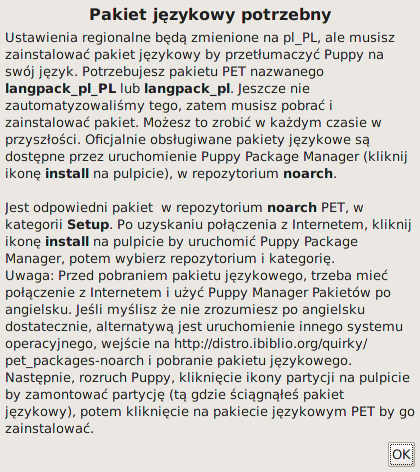
.. figure:: linimg/quicksetup03.png

Połączenie z internetem
=========================

Uruchamia się *Internet kreator połączenia*, jeśli jesteśmy podpięci do
sieci kablem i dostajemy parametry przez DHCP, powinniśmy zobaczyć komunikat
"Congratulations, you are connected". W przeciwnym razie klikamy "Wired or wireless LAN",
w następnym oknie wybieramy na początek narzędzie "Simple Network Setup".
Po jego uruchomieniu powinniśmy zobaczyć listę wykrytych interfejsów,
z której wybieramy *wlan0* dla połączenia bezprzewodowego. Następnie
w razie potrzeby wskazujemy odpowiednią sieć, metodę zabezpieczeń
i podajemy hasło.

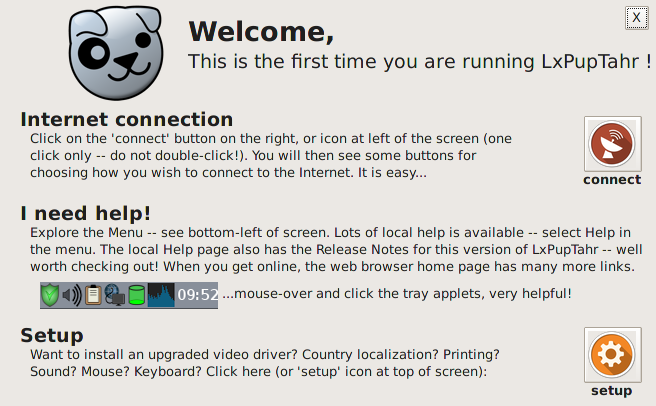
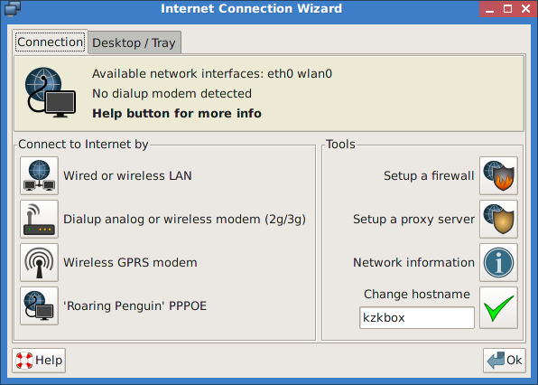
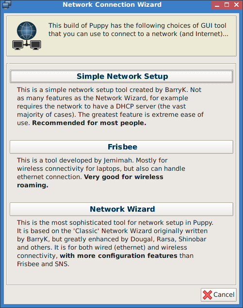
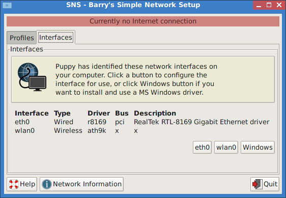
.. figure:: linimg/internet05.png

Jeżeli uzyskamy połączenie, w oknie "Network Connection Wizard" zobaczymy
aktywne interfejsy. Sugerujemy kliknąć "Cancel", a w ostatnim oknie
informacyjnym "Ok". Na koniec zamykamy okno *Welcome* kreatora.

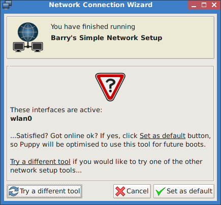
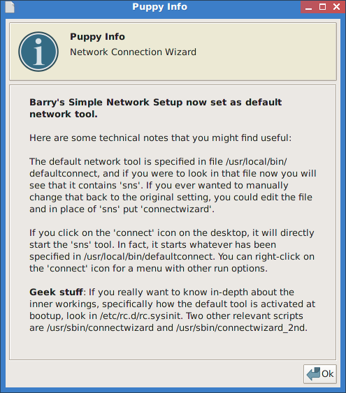

Instalacja pakietów
===================

Uruchamiamy *Puppy Package Manager* (Start/Setup/) i klikamy ikonę ustawień
obok koła ratunkowego, w następnym oknie zakładkę "Update database"
i przycisk "Update now". Uruchomi się okno terminala z pytaniami
o zgodę na aktualizację kolejnych list pakietów. Potwierdzamy klawiszem ENTER
tyle razy, ile trzeba. Na koniec zamykamy okno aktualizacji przyciskiem
"OK", co zrestartuje menedżera pakietów.

.. figure:: linimg/ppm01.png
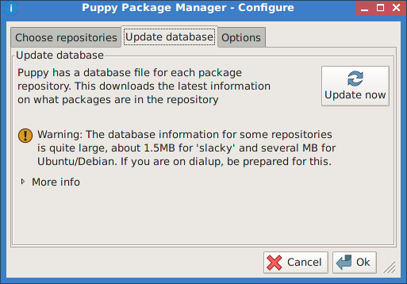
.. figure:: linimg/ppm03.png

**Spolszczenie**: zaznaczamy repozytorium "puppy-noarch", wybieramy
kategorię "Setup" i klikamy *langpack_pl-20141129* (ostatni dostępny).
Na koniec zatwierdzamy instalację przycikiem "Do it!". Po zainstalowaniu
pakietu klikamy "Start/Session Control" i klikamy "Restart WM" – czyli
restartujemy serwer X.

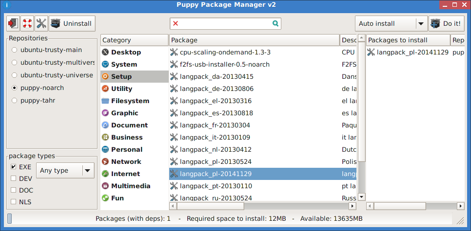
.. figure:: linimg/sessionctrl01.png

Tłumaczenie nie obejmuje głównych pozycji menu "Start". Można je przetłumaczyć
doinstalowując pakiet *lxmenu_data*, ale polskie menu nie jest tak
przejrzyste jak angielskie, więc na razie odradzamy.

**Instalacja programów**: polega na uruchomieniu PPM, wpisaniu nazwy lub
fragmentu w pole wyszukiwania, a następnie wybraniu pakietu z wyświetlonej
listy co spowoduje dodanie go do kolejki. W ten sposób możemy wyszukać
i dodać kilka pakietów na raz, np. *python-pip*, *python-virtual*, *pygame*.
Na koniec zatwierdzamy instalację przyciskiem "Do it!"

.. figure:: linimg/ppm05.png

.. tip::

    Trzeba pamiętać, że używamy dystrybucji okrojonej, więc nie wszystko
    warto instalować z repozytoriów, bo nie zawsze znajdziemy tam oprogramowanie
    odpowiednio dostosowane do naszej dystrybucji.

Twórcy PuppyLinux oferują więc co najmniej dwa dedykowane sposoby instalowania
dodatkowych pakietów. Pierwszy to paczki w formacie `PET <http://puppylinux.org/wikka/PETs?redirect=no>`_,
które ściągamy i instalujemy dwukrotnie klikając (uruchomi się narzędzie *petget*).

.. figure:: linimg/pet_xfce02.png

Dużym ułatwieniem jest dedykowany interfejs instalacyjny *quickpet tahr* (Start/Setup/).
Po pierwszym uruchomieniu klikamy przycisk "tahrpup updates", a następnie
restartujemy narzędzie. Oferuje ono najczęściej doinstalowywane programy,
które wystarczy wybrać w odpowiedniej kategorii.

.. figure:: linimg/pet_quickpet03.png

Drugim formatem stosowanym dla dużych pakietów, które używamy od czasu
do czasu, jest format `SFS <http://puppylinux.org/wikka/SquashFS>`_.
Spakowane w ten sposób oprogramowanie możemy dodawać "w locie" w trakcie
działania systemu. Korzystamy z narzędzia SFS-Load w locie (Start/Setup).

.. tip::

    Duże pliki SFS itp. zasoby warto przechowywać nie w katalogu domowym
    :file:`/root`, ale w katalogu głównym startowego pendrajwa. Jest on
    łatwo dostępny podczas pracy z systemem w ścieżce :file:`/initrd/mnt/dev_save/`,
    łatwo go również otworzyć z lewego panelu w menedżerze plików.

.. figure:: linimg/pcmanfm01.png

.. note::

    Pod adresem `Copy.com <https://copy.com/9WzmbHVn8T8UxsSN>`_ znajdziesz
    przydatne pakiety w formacie PET i SFS.

Przeglądarka WWW
==================

Domyślną przeglądarką jest `PaleMoon <https://www.palemoon.org/>`_, otwartoźródłowa
odmiana oparta na Firefoksie. Aktualizujemy ją wybierając Start/Internet/Palemoon-updater.
Zaznaczamy "Update Pale Moon" i klikamy OK.

.. figure:: linimg/palemoon01.png
.. figure:: linimg/palemoon02.png
.. figure:: linimg/palemoon03.png

Po aktualizacji uruchamiamy i na stronie powitalnej klikamy link "Language Packs",
na otwartej stronnie klikamy plik tłumaczeń :file:`pl.xpi` i instalujemy.
Na koniec wpisujemy polu adresu polecenie "about:config", w pole wyszukiwania
"useragent" i zmieniamy opcję "general.useragent.locale" na "pl-PL".

.. figure:: linimg/palemoon04.png
.. figure:: linimg/palemoon05.png
.. figure:: linimg/palemoon06.png
.. figure:: linimg/palemoon07.png

Po ponownym uruchomieniu warto wybrać "Edycja/Preferencje" i
skonfigurować stronę domyślną, katalog pobieranych plików,
np. :file:`root/Pobrane` (trzeba go utworzyć),
wreszcie opcje śledzenia i historii (ważne: wpływa na rozmiar wolnego
miejsca w pliku persystencji!).

.. figure:: linimg/palemoon08.png
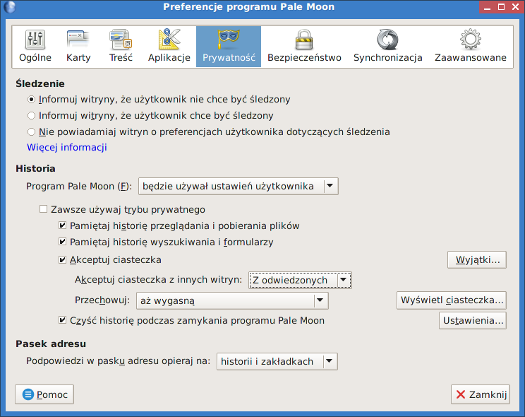
.. figure:: linimg/palemoon10.png

Na koniec można zainstalować blocker reklam wybierając odpowiedni dodatek,
np. AdBlockEdge, albo korzystając z narzędzia *Pup-Advert-Blocker* (Start/Internet/),
w którym wybieramy serwis "Mvps.org" i klikamy ikonę koła zębatego.
Ściągnięta lista zawierająca adresy IP oraz nazwy serwerów reklamowych
zostanie dodana do pliku :file:`/etc/hosts` i przekierowana na adres
lokalny, co uniemożliwi jakąkolwiek z nimi komunikację ;-)

Plik persystencji
===================

Podczas pierwszego zamknięcia system prosi o utworzenie pliku `savefile <http://puppylinux.org/wikka/SaveFile>`_,
w którym zapisywane będą wprowadzane przez nas zmiany: konfiguracja, instalacja programów,
utworzone dokumenty.

Klikamy więc "Zapisz", następnie "administrator",
wybieramy partycję oznaczającą pendrajwa. W konfiguracjach z 1 dyskiem twardym
będzie ona oznaczona najczęsciej `sdb1` (kierujemy się rozmiarem i typem plików: vfat).

.. figure:: linimg/pupsave01.png
.. figure:: linimg/pupsave02.png
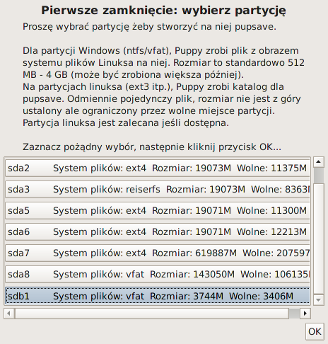

Następnie wybieramy ewentualnie szyfrowanie i system plików. Sugerujemy
`ext2` – najszybszy. Minimalny rozmiar to 512MB, zalecany 768MB.

.. figure:: linimg/pupsave04.png
.. figure:: linimg/pupsave05.png
.. figure:: linimg/pupsave06.png

Opcjonalnie rozszerzamy domyślną nazwę i potwierdzamy zapis.

.. figure:: linimg/pupsave07.png
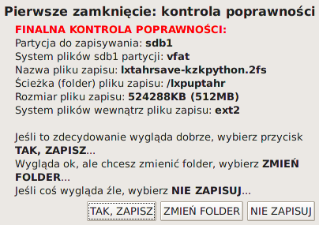

.. note::

    Nazwa pliku :file:`pupsave` zawsze zaczyna się "(lx)tahrsave-", np.:
    :file:`tahrsave-kzkxfce.2fs`. Położenie jest dowolne, tzn. można go zapisać
    na kluczu USB, ale równie dobrze może być zapisany na dowolnej partycji
    szybkiego dysku stacjonarnego. Podczas uruchamiania *TahrPup* potrafi
    odnaleźć ten plik na wszystkich dostępnych partycjach i załadować go!

Na końcu może pojawić się pytanie o przetłumaczenie informacji rozruchowych,
wybieramy "Yes" i potwierdzamy kolejny komunikat. Gdyby pytanie to pojawiło się
następnym razem, wybierzmy "No".

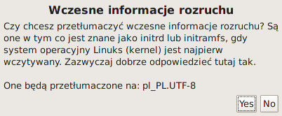

Przechowywanie ustawień i dokumentów w pliku ma swoje zalety:

* wystarczy usunąć omawiany plik, a system uruchomi się w wersji domyślnej;
* można udostępniać innym pliki persystencji; wystarczy, że wgrają go na
  pendrajwa przygotowanego zgodnie z naszą instrukcją, a dostaną
  skonfigurawane środowisko i programy, a nawet ewentualne dokumenty.
  Oczywiście plik musi odpowiadać wersji LXDE lub JVM/ROX/XFCE.

.. tip::

    Pracując w systemie mamy dostęp do naszego pendrajwa, możemy
    na nim tworzyć dowolne foldery i zapisywać w nich duże pliki, z których
    będziemy korzystać w miarę potrzeb. Dzięki temu unikniemy zbędnego
    zaśmiecania pliku persystencji.

    W katalogach na pendrajwie warto np. przechowywać opcjonalne pakiey
    oprogramowania w formacie *pet* i *sfs*.

Pulpit – dostrajanie
*********************

Instalacja fontów
==================

Czcionki *ttf* wystarczy wgrać do katalogu :file:`/usr/share/fonts/default/TTF`.
Można użyć narzędzia *Manager fontów* (Start/Desktop/Desktop).

Katalogi
==========

Niezależnie od środowiska graficznego, warto wykonać następujące czynności:

* po uruchomieniu terminala w katalogu domowym :file:`/root` tworzymy dowiązania symboliczne,
  katalog na pobierane pliki:

.. code-block:: bash

    ~# ln -s my-documents Dokumenty
    ~# ln -s my-applications Aplikacje
    ~# mkdir Pobrane

* :file:`/root/my-documents/clipart` lub :file`/usr/share/backgrounds` – dodatkowe tapety
* :file:`/root/.icons` – dodatkowe zestawy ikon
* :file:`/root/.themes` – dodatkowe tematy Gtk
* :file:`/usr/share/fonts/default/TTF/` – dodatkowe czcionki TrueType, np. z MS Windows

LXDE
=============

* Wygląd: Start/Desktop/Change appearance, Start/System/System/Ustawienia wyświetlania
* Czcionki: Start/Desktop/Desktop/Manager Fontu

JVM
=============

* Wygląd: Menu/Pulpit/Chtheme wybór motywu GTK; Menu/Pulpit/JVM konfiguracja/Wybierz motyw JVM.
* Tapeta: umieść plik graficzny w :file:/root/my-documents/clipart, kliknij prawym klawiszem
  myszy i wybierz "set background".
* Ikony pulpitu i menu: Menu/Pulpit/Desktop zmiana ikony
* Czcionki: Menu/Pulpit/Manager fontu -> Wygląd, zaznaczamy wszystkie opcje,
  styl hintingu ustawiamy na 1.
* Menedżer plików ROX-Filer: prawy klawisz myszy w pustym oknie, wybierz "Ustawienia";
  otwieranie elmentów dwukrotnym kliknięciem – sekcja Biurko,
  ikony menedżera – sekcja Typy/Style.

XFCE
============

Jeżeli nie przypadnie nam do gustu domyślne środowisko systemu TahrPup,
czyli JVM/ROX Desktop/ROX-Filer, wystarczy zaktualizować pakiety w narzędziu
*quickpet-tahr* (omówione wyżej), zrestartować je, a następnie zainstalować
pulpit XFCE z kategorii "desktops". Po zakończeniu instalacji wybieramy narzędzie
przełączania menedżerów okien WM Switcher (Menu/Pulpit/), zaznaczamy XFCE i klikamy
przycisk "Restart X".

* Menu "Start": domyślnie są na pasku zadań dwa, tradycyjny aplet "Programy"
  i nowsze "Menu Whisker" – na niepotrzebnym kliknij prawym klawiszem i wybierz "Usuń".
* Menu Whisker: prawy klawisz na ikonie i "Właściwości"; wpisywanie pierwszych liter
  programu wyszukuje go w menu.
* Wygląd: Start/Ustawienia/Wygląd
* Tapeta i ikony pulpitu: prawy klawisz na pulpicie i "Ustawienia";
  zakładka "Tło", opcja "Katalog" pozwala wskazać inny niż domyślny katalog z tapetami,
  zkładka "Ikony", "Domyślne" – jakie ikony pokazywać.
* Czionki: Start/Ustawienia/Wygląd -> Czcionki, zaznacz "Antyaliasing", przyciąganie "Lekkie",
  podpiksele "RGB".
* Menedżer plików Thunar: Start/Ustawienia/Menedżer plików lub Edycja/Preferencje w programie;
  zaznaczanie elementów dwukrotnym kliknięciem -> zakładka "Zachowanie"
* Montowanie: Start/Ustawienia/Napędy i nośniki wymienne; zaznacz "Montowanie napędów...",
  "Montowanie nośników...", "Przeglądanie nośników..."
* Panele (pasek zadań itp.): Start/Ustawienia/Panel;
  zakładka "Aplety" pozwala dodawać, usuwać aplety, warto dodać "Wyświetlanie pulpitu";
  warto dodać również aktywatory do uruchamiania aplikacji; po zaznaczeniu aktywatora
  wybierz okno preferencji (druga od dołu ikona z prawej), a następnie wybierz aplikację,
  np. *Menedżer plików*, *Emulator terminala*, *Przeglądarkę internetu*. Koniecznie
  dodaj aktywator dla *PopShutdown Manager*. Kolejność elementów ustal przeciągając je myszą.
* Obszary robocze: Start/Ustawienia/; ilość – 2.
* Powiązania plików z domyślnymi aplikacjami: prawy klawisz na pliku, "Właściwości" -> "Otwieranie
  za pomocą", wybieramy z listy lub "Inny program".

Ustawienia i programy
======================

* **Ustawienia Puppy**:
    [LXDE] ...
    [JVM] Menu/Ustawienia/Wizard Kreator
    [XFCE] Programy/Puppy Setup/Puppy Setup

* **Internet kreator połączenia**:
    [JVM] Menu/Ustawienia
    [XFCE] Programy/Puppy Setup/Internet Connection Wizard

* **Zmiana rozmiaru pliku osobistego przechowywania**:
    [LXDE] Start/Utility
    [JVM] ...
    [XFCE] Programy/Akcesoria/Resize personal storage file

* **Puppy Manager Pakietów**:
    [LXDE] ...
    [JVM] Menu/Ustawienia
    [XFCE] Programy/Puppy Setup/Puppy Package Manager

* **Quickpet tahr**:
    [LXDE] ...
    [JVM] ...
    [XFCE] Programy/Puppy Setup

* **SFS-załadowanie w locie**
    [LXDM] Start/Setup/SFS-Załadowanie w locie
    [JVM] ...
    [XFCE] Programy/SFS...

* **QuickSetup ustawienia pierwszego uruchamiania**:
    [LXDE] ...
    [JVM] Menu/Ustawienia
    [XFCE] Programy/Puppy Setup/QuickSetup...

* **Restart menedżera okien** (RestartWM):
    [LXDE] Session Control
    [JVM] Menu/Wyjście

* **WM Switcher** – switch windowmanagers:
    [JVM] Menu/Pulpit
    [XFCE] Programy/Ustawienia

* **Startup Control – kontrola aplikacji startowych**:
    [LXDE] Start/Setup
    [JVM] Menu/Ustawienia
    [XFCE] Programy/Ustawienia/Sesja i uruchamianie

* **Domyślne aplikacje**:
    [LXDE] ...
    [JVM] Menu/Ustawienia/Wybór domyślnych aplikacji
    [XFCE] Programy/Ustawienia/Preferowane programy

* **Terminale**
    [LXDE] ...
    [JVM] Menu/Narzędzia
    [XFCE] Programy/Akcesoria

* **Ustawienie daty i czasu**
    [LXDE] Start/Desktop
    [XFCE] Programy/Ustawienia/Set date and time

* Konfiguracja Geany:
    Narzędzia/Menedżer wtyczek
    HTML Characters
    Przeglądarka plików/Preferencje/
    Pokaż ukryte pliki i Podążanie za ścieżką do bieżącego pliku
    Edycja/Preferencje/
    Edytor/Wcięcia/Spacje
    Interfejs/Edytor/Ubuntu Mono

* Konfiguracja LXTerminal:
    Edycja/Preferencje
    Zaawansowane/Wyłączenie skrótu klawiszowego menu (domyślnie F10)

Problemy?
**************

Jeśli nie da się uruchomić komputera za pomocą przygotowanego klucza, przeczytaj
poniższe wskazówki.

Narzędzia, które mogą pomóc:

* `Linux Live USB Creator <http://www.linuxliveusb.com/en/download>`_ –
  wymagane narzędzie do tworzenia kluczy USB Live na podstawie wielu dystrybucji;
* `HP-USB-Disk-Storage-Format-Tool <http://www.dobreprogramy.pl/HP-USB-Disk-Storage-Format-Tool,Program,Windows,27581.html>` –
  opcjonalne narzędzie do formatowania kluczy USB. Pobieramy w razie problemów przy użyciu
  przycisku "Linki bezpośrednie";
* `Bootice <http://www.dobreprogramy.pl/BOOTICE,Program,Windows,47749.html>`_ –
  opcjonalne narzędzie do różnych operacji na dyskach. Pobieramy w razie problemów
  odpowiednią wersję przy użyciu przycisku "Wszystkie wersje".

[todo]

Metryka
========

:Autor: Robert Bednarz (ecg@ecg.vot.pl)

:Utworzony: |date| o |time|

.. |date| date::
.. |time| date:: %H:%M

.. raw:: html

    
