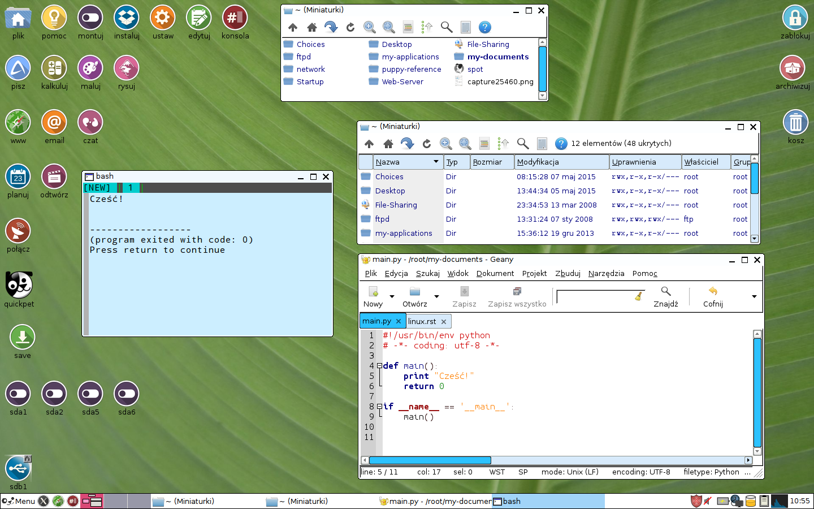
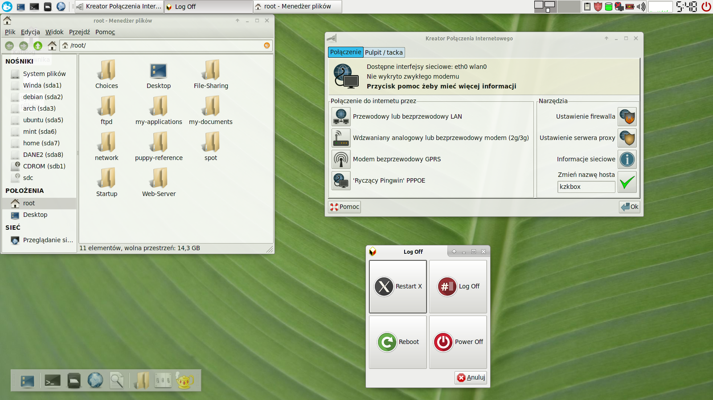

.. _puppy:

Puppy Linux
###################

`LxPupTahr <http://lx-pup.weebly.com/downloads.html>`_ to wersja systemu `Puppy Linux 6.0.3 tahrpup CE <http://www.murga-linux.com/puppy/viewtopic.php?t=96178>`_
opartego na systemie Ubuntu Tahr 14.04 LTS. `Puppy Linux <http://puppylinux.org/main/Overview%20and%20Getting%20Started.htm>`_
to dystrybucja zaprojektowanych specjalnie do pracy w trybie live,
ale z możliwością przechowywania dokonywanych zmian, takich jak
dodawanie/usuwanie oprogramowanie, zmienianie ustawień, tworzenie dokumentów.

LxPupTahr
***********

Zaproponowana przez nas wersja jest dostosowana do potrzeb szkoleń z Pythona.
Bez problemu można jednak przygotować swoją wersję. Wystarczy pobrać oryginalny
obraz `LxPupTahr-15.05.1-pae.iso <http://lx-pup.weebly.com/upup-tahr.html>`_ (251 MB)
i wgrać go na pendrajwa.

.. figure:: linimg/lxpup.png
   :alt: Pulpit LxPupTahr

   Pulpit LxPupTahr ze środowiskiem LXDE

TahrPup
********

W systemie *TahrPup* domyślne środowisko graficzne jest połączeniem
menedżera okien `JVM <http://www.joewing.net/projects/jwm/>`_ z pulpitem
`ROX Desktop <http://rox.sourceforge.net/desktop/>`_ i menedżerem
plików `ROX-Filer <http://rox.sourceforge.net/desktop/ROX-Filer>`_.
Łatwo je wypróbować. Wystarczy pobrać plik `tahr-6.0.2_PAE.iso <http://ftp.nluug.nl/ftp/pub/os/Linux/distr/puppylinux/puppy-tahr/iso/tahrpup%20-6.0-CE/>`_
(ok. 201 MB). W wersji tej łatwo doinstalować środowisko `XFCE <http://www.xfce.org/?lang=pl>`_.

   Pulpit PupThar ze środowiskiem JVM/ROX

   Pulpit PupTahr ze środowiskiem XFCE

Plik zapisu
============

Jeżeli omawiane systemy uruchamiany po raz pierwszy (w zasadzie wtedy, kiedy nie
ma żadnego pliku zapisu), wita nas kreator konfiguracji, a system ma interfejs w języku angielskim.
Dostosowywanie systemu i tworzenie pliku zapisu omówione zostały w rozdziale :ref:`konfiguracja`
Można tego uniknąć, jeżeli dysponujemy jakimś przygotowanym `plikiem zapisu <http://puppylinux.org/wikka/SaveFile>`_
(ang. *savefile*).

W serwisie `Copy.com <https://copy.com/9WzmbHVn8T8UxsSN>`_ udostępniliśmy
plik :file:`lxtahrsave-lxde.2fs` oraz :file:`tahrsave-xfce.2fs`. Pierwszy
przeznaczony jest dla *LxPupTahr*, drugi dla *TahrPup*. Należy wgrać je
do głównego katalogu pendrajwa. Trzeba również pobrać pakiet `jre1.7.0_65_5.7.0.sfs <http://puppylinuxstuff.meownplanet.net/aarf/java_jre/jre1.7.0_65_5.7.0.sfs>`_
i umieścić go w tym samym miejscu co plik zapisu.

Plik zapisu zawiera konfigurację systemu, czyli:

* zaktualizowane listy oprogramowania;
* zaktualizowaną i spolszczoną domyślną przeglądarkę `Pale Moon <https://www.palemoon.org/>_`
  (otwartoźrodłówa, oparta na Firefoksie);
* fonty Droid, Ubuntu oraz podstawowe z Windows;
* pakiety python-pip, python-virtualenv oraz bibliotekę pygame;
* skonfigurowane mini środowisko programistyczne IDE – Geany.
* środowisko PyCharm IDE Educational
* skonfigurowane elementy interfejsu LXDE lub JVM/ROX i XFCE

.. attention::

    Na pendrajwie nie może znajdować się żaden inny plik o nazwie rozpoczynającej
    się na `(lx)tahrsave`. Ewentualne utworzone wcześniej pliki zapisu
    trzeba albo skasować, albo zmienić im nazwy.

    **ZALECAMY powiększyć rozmiar pliku zapisu do 1024 MB** za pomocą narzędzia:
    *Zmiana rozmiaru pliku osobistego przechowywania* (Start/Setup).

.. note::

    Nazwa pliku :file:`pupsave` zawsze zaczyna się "(lx)tahrsave-", np.:
    :file:`lxtahrsave-lxde.2fs`. Położenie jest... dowolne, tzn. można go zapisać
    na kluczu USB, ale równie dobrze może być zapisany na dowolnej partycji
    szybkiego dysku stacjonarnego. Podczas uruchamiania system potrafi
    odnaleźć ten plik na wszystkich dostępnych partycjach i załadować go!

.. tip::

    Pracując w systemie, mamy dostęp do głównego katalogu naszego pendrajwa
    (zazwyczaj oznaczonego w menedżerze plików ``sdb1``). Możemy w nim tworzyć
    dowolne foldery i zapisywać pliki, np. *pet* i *sfs*, z których
    będziemy korzystać w miarę potrzeb. Dzięki temu unikniemy zbędnego
    rozrastania się pliku zapisu.
    Należy uważać, aby z katalogu głównego nie usunąć plików systemowych.

Przechowywanie ustawień i dokumentów w pliku zapisu ma swoje zalety:

* wystarczy usunąć omawiany plik, a system uruchomi się w wersji domyślnej;
  będzie można skonfigurować go od podstaw;
* można udostępniać innym pliki zapisu; wystarczy, że wgrają go na
  pendrajwa przygotowanego zgodnie z naszą instrukcją, a dostaną
  skonfigurawane środowisko i programy, a nawet ewentualne dokumenty.

Ostatecznie zawartość katalogu głównego pendrajwa przedstawiać powinna się
następująco:

.. figure:: linimg/lxpup_explorer.jpg
   :alt: zawartość pendrajwa po wgraniu *LXPupTahr* i wymaganych plików

   Katalog główny pendrajwa z systemem *LXPupTahr*

Nazwa pliku zapisu (persystencji) w systemie *TahrPup* zaczyna się zawsze
od ``tahrsave-``. Przykładowy plik udostępniamy udostępniamy w serwisie
`Copy.com <https://copy.com/9WzmbHVn8T8UxsSN>`_ pod nazwą :file:`tahrsave-xfce.2fs`.
Zawiera on wstępną konfigurację oraz następujące dostosowania:

W systemie *TahrPup* pulpit JVM/ROX uruchomić można przy użyciu narzędzia *WM Switcher*
– przełączanie menedżerów okien.

.. raw:: html

    

:Autor: Robert Bednarz (ecg@ecg.vot.pl)

:Utworzony: |date| o |time|

.. |date| date::
.. |time| date:: %H:%M

.. raw:: html

    
