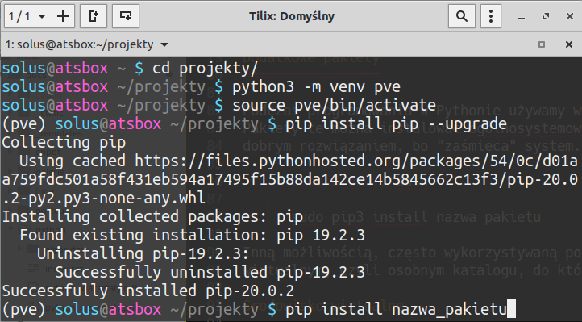

.. _interpreter-pythona:

Interpreter Pythona
###################

Aktualnie zalecaną i wspieraną wersją interpretera Pythona jest 3.x.

Linux
=====

W systemach **Linux** Python 3 jest szeroko stosowany i dostępny w standardowej instalacji.
W termnalu uruchomimy interpreter po wydaniu polecenia:

.. code-block:: bash

    ~$ python3

Windows
=======

.. note::

   Przed rozpoczęciem instalacji Pythona zaktualizuj system. Przed instalacją nowszej wersji
   interpretera, odinstaluj starą.

Na stronie `Python Releases for Windows <https://www.python.org/downloads/windows/>`_
klikamy link *Last Python 3 Release - ...*, pobieramy instalator
:file:`Windows installer (64-bit) Recommended` i uruchamiamy instalację.

.. figure:: ../img/python01.png

.. warning::

   Podczas instalacji zaznaczamy opcję "Add Python 3.x to Path" i wybieramy "Customize installation".

.. figure:: ../img/python02.png

.. figure:: ../img/python03.png

   Można zaznaczyć opcje "Install for all users" i "Precompile standard library" (prekompilacja biblioteki standardowej).

.. figure:: ../img/python04.png

   W ostatnim oknie klikamy "Close".

.. note::

   Jeżeli podczas pierwszego uruchomienia zobaczymy komunikat zapory systemowej, zezwalamy na dostęp wybierając sieci prywatne.

Po instalacji uruchom wiersz poleceń (``cmd`` lub PowerShell) i sprawdź poprawność instalacji uruchamiając interpreter:

.. figure:: ../img/python05.jpg

Dodatkowe narzędzia i pakiety
=============================

Podczas tworzenia większych aplikacji i projektów bardzo przydatne są dodatkowe narzędzia.
Do instalowania i zarządzania dodatkowymi pakietami używa się menedżera `pip3` oraz środowisk wirtualnych.
W terminalu wydajemy polecenie, które zainstaluje odpowiednie pakiety:

   .. code-block:: bash

      ~$ sudo apt-get install python3-pip python3-venv

Pakiety można instalować ogólnosystemowo za pomocą polecenia:

   .. code-block:: bash

      ~$ sudo pip3 install nazwa_pakietu

– przy czym `sudo` używamy tylko w systemie Linux, ale nie w Windows. W taki sposób można zainstalować
rozszerzony interpreter `IPython <https://ipython.readthedocs.io/en/stable/>`_ i/lub
aplikację `Jupyter QtConsole <https://github.com/jupyter/qtconsole>`_:

   .. code-block:: bash

       ~$ sudo pip3 install ipython3 qtconsole

Pakiety wykorzystywane na potrzeby konkretnej aplikacji lepiej instalować w katalogu użytkownika
– wystarczy, że do polecenia dodamy opcję `--user`:

   .. code-block:: bash

      ~$ pip3 install nazwa_pakietu --user

– lub w wirtualnym środowisku, czyli osobnym katalogu.

Środowisko wirtualne
--------------------

1. Uruchom terminal (wiersz poleceń). Jeżeli chcesz, przejdź do katalogu, w którym chcesz utworzyć środowisko wirtualne.
2. Wydaj polecenie:

   .. code-block:: bash

      python3 -m venv pve

   .. note::

      Przełącznik `-m` wskazuje moduł, którego chcemy użyć, `pve` to umowna nazwa katalogu, który zostanie utworzony
      i do którego zostaną skopiowane podstawowe pliki Pythona.

3. Jeżeli chcesz skorzystać z wirtualnego środowiska, musisz go aktywować:

   .. code-block:: bash

      ~$ source pve/bin/activate

   .. note::

      W systemie Windows: :code:`pve\\Scripts\\activate.bat`

   Po udanej aktywacji przed ścieżką zobaczymy nazwę katalogu z wirtualnym środowiskiem w okrągłych nawiasach,
   np. `(pve)`.

4. Po aktywacji środowiska warto zaktualizować menedżer pakietów:

   .. code-block:: bash

      pip install pip --upgrade

5. W środowisku wirtualnym można instalować dowolne pakiety bez uprawnień administracyjnych:

   .. code-block:: bash

      pip install nazwa_pakietu

6. Listę zainstalowanych pakietów wyświetlisz poleceniem: :code:`pip list`

Frameworki
----------

Poniżej lista często używanych pakietów dodatkowych. ALternatywne polecenia działają w systemach Linux
opartych na Debianie (Ubuntu, Linux Mint).

1. Aplikacje WWW Django: :code:`pip3 install django`
2. Aplikacje Flask: :code:`pip3 install flask flask-wtf peewee`
3. Aplikacje okienkowe PyQt5: :code:`pip3 install pyqt5` albo :code:`apt install python3-pyqt5`
4. Wykresy z Matplotlib: :code:`pip3 install matplotlib` albo :code:`apt install python3-matplotlib`

Problemy w systemie Windows
===========================

Jeżeli możesz, zainstaluj system Linux, unikniesz wielu poniższych problemów.
Jeżeli musisz używać systemu Windows, wcześniej czy później zetkniesz się z problemami.
Poniżej kilka wskazówek, które mogą pomóc je rozwiązać.

1) Przed instalacją interpretera Pythona odinstaluj ewentualne starsze wersje i zrestartuj system.
2) W przypadku błędów *odmowa dostępu* (ang. *access denied*) podczas aktualizowania menedżera `pip` lub
   instalowania wypróbuj następujące sposoby:

   a) spróbuj zrestartować system, aby zakończyć ewentualne zadania wykorzystujące Pythona, i ponów instalację
   b) podczas aktualizacji użyj opcji `--user`, np.: :code:`python -m pip install --upgrade --user pip`
   c) podczas instalacji użyj opcji `--user`, np.: :code:`python -m pip install --user pyqt5`
   d) uruchom wiersz poleceń (``cmd`` lub PowerShell) jako administrator i dopiero wtedy wydaj polecenie

Materiały
=========

1. `Język Python`_

.. _Język Python: https://www.python.org/
