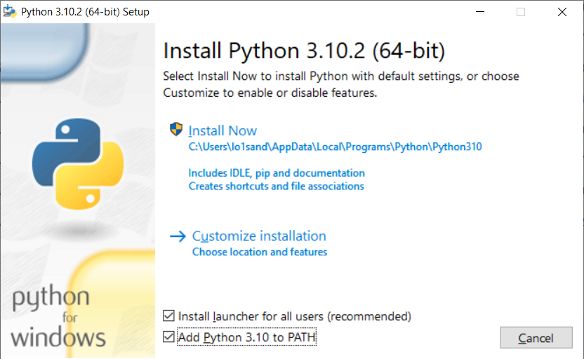
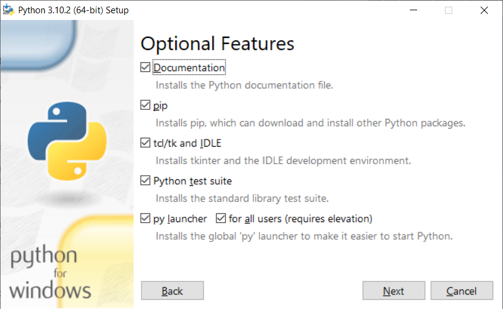
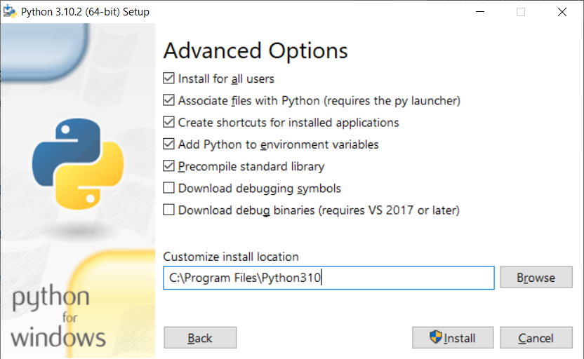
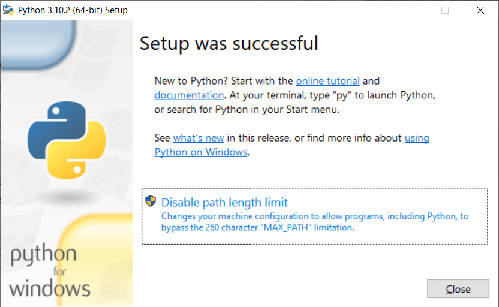
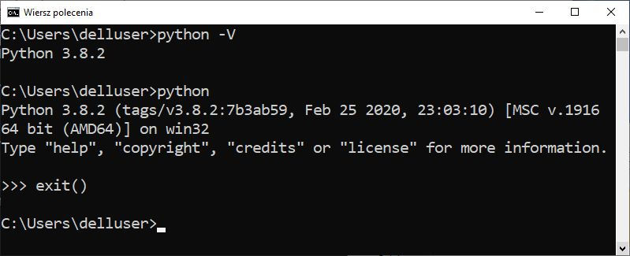
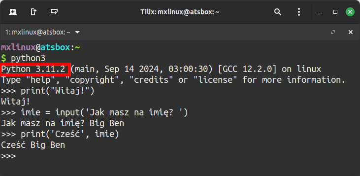
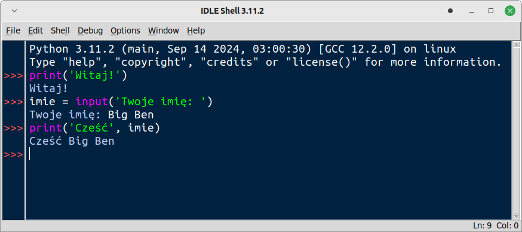

.. _interpreter-pythona:

Interpreter Pythona
###################

Aktualnie zalecaną i wspieraną wersją interpretera Pythona jest `3.x`, gdzie `x` oznacza podwersję.

Linux
=====

W systemach **Linux** Python 3 jest szeroko stosowany i dostępny w standardowej instalacji.

Windows
=======

W systemie Windows interpreter trzeba doinstalować. 

.. note::

   Przed rozpoczęciem instalacji Pythona zaktualizuj system. Przed instalacją nowszej wersji
   interpretera, odinstaluj starą.

Na stronie `Python Releases for Windows <https://www.python.org/downloads/windows/>`_
klikamy link *Last Python 3 Release - ...*, pobieramy instalator
:file:`Windows installer (64-bit) Recommended` i uruchamiamy instalację.

.. warning::

   Podczas instalacji zaznaczamy opcję "Add Python 3.x to Path" i wybieramy "Customize installation".

   Można zaznaczyć opcje "Install for all users" i "Precompile standard library" (prekompilacja biblioteki standardowej).

   W ostatnim oknie klikamy "Close".

.. note::

   Jeżeli podczas pierwszego uruchomienia zobaczymy komunikat zapory systemowej, zezwalamy na dostęp wybierając sieci prywatne.

Po instalacji uruchom wiersz poleceń (``cmd`` lub PowerShell) i sprawdź poprawność instalacji uruchamiając interpreter:

Tryb interaktywny
=================

Poprawność instalacji, dostępność lub wersję Pythona sprawdzamy uruchamiając tryb interaktywny interpretera za pomocą polecenia
w terminalu (wierszu poleceń):

Środowisko programistyczne
===========================

Domyślnym narzędziem programistycznym dla języka Python jest środowisko IDLE (ang. *Integrated Development and Learning Environment*).
W systemach Linux może być konieczne doinstalowanie go np. za pomocą polecenia w terminalu:

   .. code-block:: bash

      ~$ sudo apt-get install idle3
      lub
      ~$ sudo apt-get install idle-python3.x

- gdzie `x` oznacza podwersję Pythona.

W systemie Windows środowisko jest instalowane domyślnie razem z interpreterem Pythona.

Dodatkowe narzędzia i pakiety
=============================

Podczas tworzenia większych aplikacji i projektów bardzo przydatne są dodatkowe narzędzia.
Do instalowania i zarządzania dodatkowymi pakietami używa się menedżera `pip3` oraz środowisk wirtualnych.
W systemach Linux może być konieczne doinstalowanie tych narzędzi:

   .. code-block:: bash

      ~$ sudo apt-get install python3-pip python3-venv

Środowisko wirtualne
====================

Wirtualne środowisko Pythona (ang. *Python virtual environment*) pozwala instalować dodatkowe pakiety
w wybranych wersjach bez uprawnień administratora. W praktyce to katalog zawierający niezbędne pliki
potrzebne do działania interpretera oraz menedżer instalacji pakietów **pip**.

Linux
-----

Środowisko tworzymy, a następnie aktywujemy i korzystamy z niego przy użyciu dowolnego terminala.

.. code-block:: bash

    ~$ python3 -m venv .venv        # utworzenie środowiska w katalogu .venv
    ~$ source .venv/bin/activate    # aktywacja
    (.venv) ~$ python3              # uruchamianie interpretera w trybie interaktywnym
    (.venv) ~$ python3 skrypt.py    # uruchamianie skryptu w wirtualnym środowisku
    (.venv) ~$ deactivate           # deaktywacja środowiska

Windows
-------

W systemie **Windows** korzystamy z wiersza poleceń (CMD), `Windows PowerShell` lub `Windows Terminal`.

.. code-block:: bash

    py -m venv .venv                # utworzenie środowiska w katalogu .venv
    .venv\\Scripts\\activate.bat    # aktywacja w wierszu poleceń (cmd)
    .venv\\Scripts\\Activate.ps1    # aktywacja w Windows PowerSchell
    (.venv) py                      # uruchamianie interpretera w trybie interaktywnym
    (.venv) py     skrypt.py        # uruchamianie skryptu w wirtualnym środowisku
    (.venv) .venv\\Scripts\\deactivate.bat  # deaktywacja w wierszu poleceń (cmd)
    (.venv) deactivate                      # deaktywacja w Windows PowerSchell

Zarządzanie pakietami
---------------------

Do zarządzania pakietami w aktywnym środowisku używamy narzędzia `pip`, np.:

.. code-block:: bash

    (.venv) pip install matplotlib  # instalacja pakietu
    (.venv) pip list  # lista zainstalowanych pakietów

Materiały
=========

1. `Strona języka Python`_

.. _Strona języka Python: https://www.python.org/
