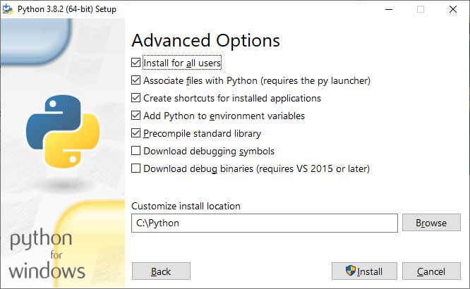
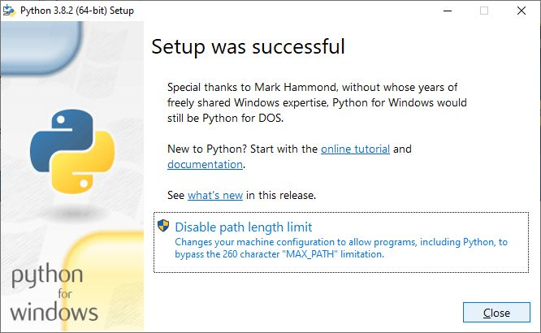

.. _interpreter-pythona:

Interpreter Pythona
###################

Aktualnie zalecaną i wspieraną wersją interpretera Pythona jest 3.x.

Linux
=====

W systemach **Linux** Python jest szeroko stosowany i dostępny w standardowej instalacji większości dystrybucji
i to zarówno w wersji 2.x, jak i 3.x. Dla formalności polecenie instalacyjne w systemach opartych na Debianie (Ubuntu, Linux Mint) to:

.. code-block:: bash

    ~$ sudo apt-get install python3

.. note::

    Warto zauważyć, że w dystrybucjach opartych na Debianie polecenie ``python``
    jest dowiązaniem do wersji 2.x, a paczki nazywają się odpowiednio ``python2-...``
    lub ``python3-...``.

Windows
=======

.. note::

   Przed rozpoczęciem instalacji Pythona zaktualizuj system. Jeżeli będziesz instalował nowszą wersję
   interpretera, odinstaluj starą.

Na stronie `Python Releases for Windows <https://www.python.org/downloads/windows/>`_
klikamy link *Last Python 3 Release - ...* i pobieramy instalator
:file:`Windows executable installer` w odpowiedniej wersji, tj.
*x86-64* (64-bitowe, wersja zalecana) lub *x86* (32-bitowej.

.. figure:: ../img/python01.jpg

.. warning::

   Podczas instalacji zaznaczamy opcję "Add Python.exe to Path" i wybieramy "Customize installation".

   Można zaznaczyć "Install for all users" (instalacja dla wszystkich użytkowników) i "Precompile standard library"
   (prekompilacja biblioteki standardowej).

   W ostatnim oknie klikamy "Close".

.. note::

   Jeżeli podczas pierwszego uruchomienia zobaczymy komunikat zapory systemowej, zezwalamy na dostęp wybierając sieci prywatne.

Po instalacji uruchom wiersz poleceń (`cmd` lub `Power Shell`) i sprawdź poprawność instalacji uruchamiając interpreter:

.. figure:: ../img/python05.jpg

Narzędzia dodatkowe
===================

Do pracy z Pythonem można wykorzystać dodatkowe narzędzia, przede wszystkim rozszerzone konsole
`IPython <https://ipython.readthedocs.io/en/stable/>`_ oraz `Jupyter QtConsole <https://github.com/jupyter/qtconsole>`_.
Najwygodniej zainstalować je za pomocą menedżera pakietów:

.. code-block:: bash

    ~$ pip install ipython3 qtconsole pyqt5

W systemach Linux można też użyć prekompilowanych pakietów systemowych instalowanych za pomocą menedżerów, np.

.. code-block:: bash

   ~$ sudo apt install python3-ipython ipython3-qtconsole

Dodatkowe pakiety
=================

Podczas programowania w Pythonie używamy wielu dodatkowych pakietów zawierających mniejsze lub większe frameworki.
Pakiety te można instalować ogólnosystemowo. Wymaga to zazwyczaj uprawnień administratora i nie zawsze jest
dobrym rozwiązaniem, ponieważ "zaśmieca" system. Instalacja ogólnosystemowa polega na wydaniu polecenia:

   .. code-block:: bash

      sudo pip3 install nazwa_pakietu

– przy czym `sudo` używamy tylko w systemie Linux, ale nie w Windows.

Inną możliwością, często polecaną, jest instalacja w katalogu użytkownika. Wystarczy, że do polecenia dodamy opcję
`--user`:

   .. code-block:: bash

      pip3 install nazwa_pakietu --user

Ostatnia możliwość to instalacja w tzw. środowisku wirtualnym, czyli osobnym katalogu,
do którego zwykły użytkownik ma pełen dostęp. Wykorzystaj tę możliwość przy dużych frameworkach (np. Django).

Środowisko wirtualne
--------------------

1. Uruchom terminal (wiersz poleceń). Jeżeli chcesz, przejdź do katalogu, w którym chcesz utworzyć środowisko wirtualne.
2. Wydaj polecenie:

   .. code-block:: bash

      python3 -m venv pve

   .. note::

      Przełącznik `-m` wskazuje moduł, którego chcemy użyć, `pve` to umowna nazwa katalogu, który zostanie utworzony
      i do którego zostaną skopiowane podstawowe pliki Pythona.

3. Jeżeli chcesz skorzystać z wirtualnego środowiska, musisz go aktywować:

   .. code-block:: bash

      source pve/bin/activate

   .. note::

      W systemie Windows: :code:`pve\Scripts\activate.bat`

   Po udanej aktywacji przed ścieżką zobaczymy nazwę katalogu z wirtualnym środowiskiem w okrągłych nawiasach,
   np. `(pve)`.

4. Po aktywacji środowiska warto zaktualizować menedżer pakietów:

   .. code-block:: bash

      pip install pip --upgrade

5. W środowisku wirtualnym można instalować dowolne pakiety bez uprawnień administracyjnych:

   .. code-block:: bash

      pip install nazwa_pakietu

.. figure:: ../img/pve_linux.png

6. Listę zainstalowanych pakietów wyświetlisz poleceniem: :code:`pip list`

Frameworki
----------

Poniżej lista często używanych pakietów dodatkowych.

1. Aplikacje WWW Django: :code:`pip3 install django`
2. Aplikacje Flask: :code:`pip3 install flask flask-wtf peewee`
3. Aplikacje okienkowe PyQt5: :code:`pip3 install pyqt5`
4. Wykresy z Matplotlib: :code:`pip3 install matplotlib`

Problemy w systemie Windows
===========================

Jeżeli możesz, zainstaluj system Linux, unikniesz wielu poniższych problemów.
Jeżeli musisz używać systemu Windows, wcześniej czy później zetkniesz się z problemami.
Poniżej kilka wskazówek, które mogą pomóc je rozwiązać.

1) Przed instalacją interpretera Pythona upewnij się, że ewentualne starsze wersje zostały usunięte.
2) Jeżeli odinstalowałeś starszą wersję Pythona, zrestartuj system.
3) W przypadku błędów *odmowa dostępu* (ang. *access denied*) podczas aktualizowania menedżera `pip` lub
   instalowania wypróbuj następujące sposoby:

   a) spróbuj zrestartować system, aby zakończyć ewentualne zadania wykorzystujące Pythona, i ponów instalację
   b) podczas aktualizacji użyj opcji `--user`, np.: :code:`python -m pip install --upgrade --user pip`
   c) podczas instalacji użyj opcji `--user`, np.: :code:`python -m pip install --user pyqt5`
   d) uruchom wiersz poleceń (*cmd* lub *Power Shell*) jako administrator i dopiero wtedy wydaj polecenie

Materiały
=========

1. `Język Python`_

.. _Język Python: https://www.python.org/
