.. _geany-opis:

Geany
######

`Geany <http://www.geany.org/>`_ to proste i lekkie środowisko IDE dostępne na licencji
`GNU General Public Licence <http://pl.wikipedia.org/wiki/GNU_General_Public_License>`_.
Geany oferuje kolorowanie składni, wsparcie dla kodowania, dopełnianie poleceń, mechanizmy automatycznego zamykanie tagów, auto-wcięć, pracy na kartach i inne udogodnienia.
Np. brudnopis czy możliwość uruchamiania plików źródłowych bezpośrednio z poziomu programu.

**Instalacja**

W systemie **Linux** korzystamy z dedykowanego menedżera pakietów, np. w Xubuntu
(i innych debianopochodnych) lub Archu wystarczy wpisać w terminalu:

.. code-block:: bash

    ~$ sudo apt-get install geany geany-plugins
    ~# pacman -S geany geany-plugins

W **MS Windows** ściągamy i instalujemy `pełną wersję binarną Geany <http://www.geany.org/Download/Releases>`_
przeznaczoną dla tych systemów. *Pełna* oznacza tutaj, ze zawiera biblioteki
GTK wykorzystywane przez program. Podczas standardowej instalacji można
zmienić katalog docelowy, np. na ``C:\Geany``.

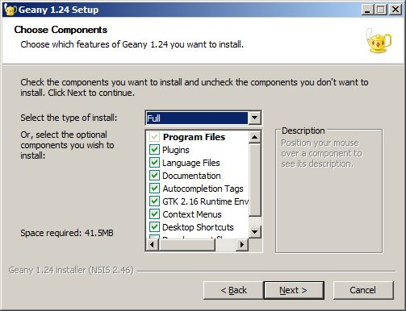

**Koniguracja**

W menu `Narzędzia/Menedżer wtyczek` zaznaczamy pozycję "Addons" (dostępna
po zainstalowaniu wtyczek), a następnie "Przeglądarka plików".
Zanim wyjdziemy z okna naciskamy przycisk "Preferencje" i na zakładce
"Przeglądarka plików" zaznaczamy opcję "Podążanie za ścieżką do bieżącego pliku".
Dzięki temu w panelu bocznym w zakładce "Pliki" zobaczymy listę katalogów i plików,
które łatwo możemy otwierać.

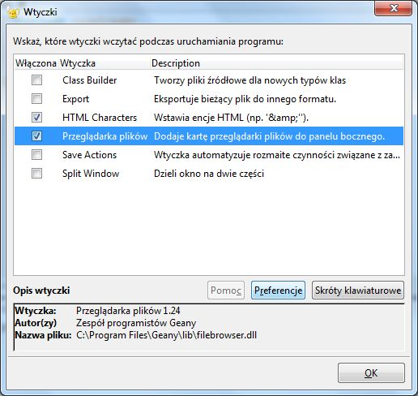
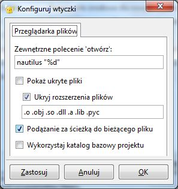

W menu `Edycja/Preferencje` :kbd:`CTRL+ALT+P` w zakładce `Edytor/Wcięcia` jako
"Typ" wcięć wybieramy opcję "spacje".

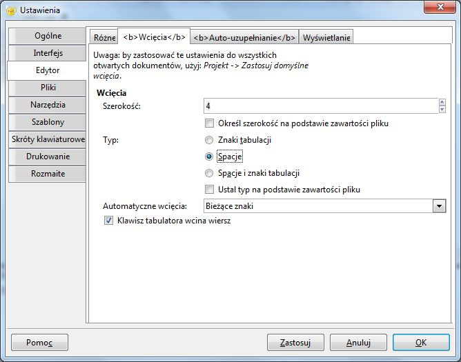

Warto zapamiętać i stosować kilka użytecznych skrótów. Jeśli kodujemy w C/C++: :kbd:`F8` – uruchamia
linker, :kbd:`F9` – buduje plik wykonawczy. Klawisz :kbd:`F5` uruchamia
z kolei pliki wykonywalne, skrypty Pythona lub otwiera strony HTML w przeglądarce.
Wcięcia wstawiają się automatycznie lub poprzez naciśnięcie klawisza :kbd:`TAB`.
Jeżeli chcemy wciąć od razu cały blok kodu, zaznaczamy go i również używamy
:kbd:`TAB` lub :kbd:`CTRL+I`, zmniejszenie wcięcia uzyskamy naciskając :kbd:`CTRL+U`.

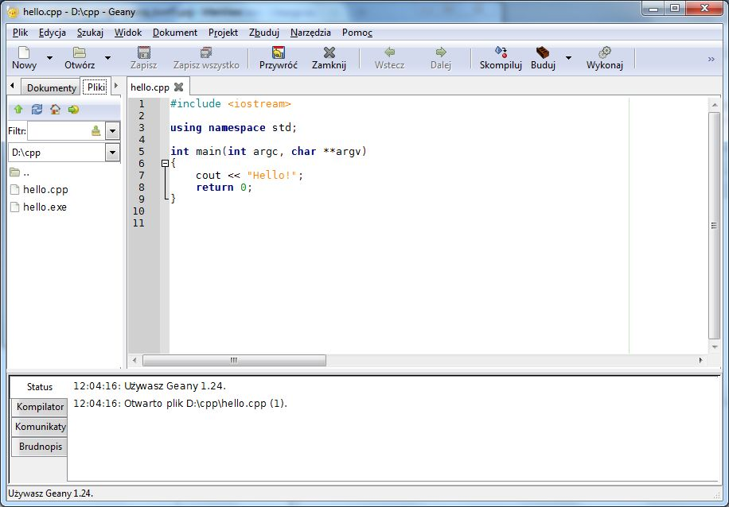

Środowisko Geany nie zawiera narzędzi potrzebnych do kompilowania czy wykonywania
programów pisanych w różnych językach. Wymagane narzędzia musimy doinstalować osobno.

Kompilator C/C++
################

W systemie **Linux** potrzebne narzędzia są zazwyczaj obecne, ale w razie potrzeby wystarczy
doinstalować pakiet ``gcc`` odpowiednim menedżerem pakietów, np.:

.. code-block:: bash

    ~$ sudo apt-get install gcc

W **MS Windows** instalujemy minimalistyczne środowisko deweloperskie
dostarczające wolne narzędzia :term:`GNU Compiler Collection`, czyli `MinGw`_. W tym
celu pobieramy instalator `mingw-get-setup.exe <http://sourceforge.net/projects/mingw/files/Installer>`_
i uruchamiamy.

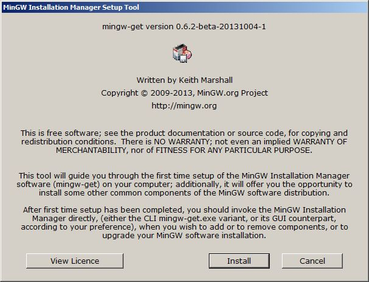

W oknie wyboru pakietów zaznaczamy widoczne poniżej paczki, w tym przede wszystkim
``mingw32-gcc-g++``, a następnie wybieramy polecenie *Installation/Apply*.

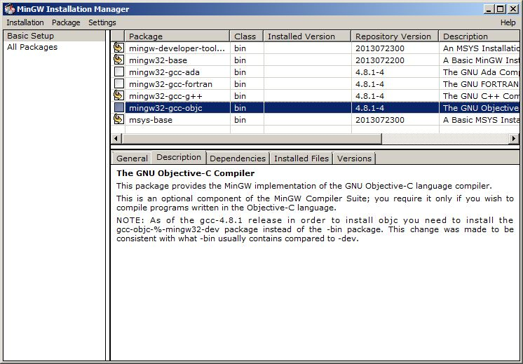

Po pobraniu i rozpakowaniu wskazanych narzędzi oraz zakończeniu instalatora (*Close*)
trzeba dodać do ścieżki systemowej położenie kompilatora i linkera;
dzięki temu będzie można korzystać z tych i innych narzędzi bezpośrednio
z Geany lub okienka konsoli tekstowej. W oknie "Uruchamianie" (:kbd:`WIN+R`)
wpisujemy polecenie wywołujące okno "Zmienne środowiskowe" – można je również
uruchomić z okna właściwości komputera:

.. figure:: img/mingw03.jpg
.. figure:: img/mingw04.jpg

Klikamy przycisk *Nowa* i tworzymy nową zmienną użytkownika zgodnie z podanym
zrzutem:

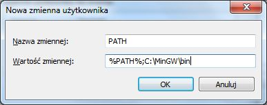
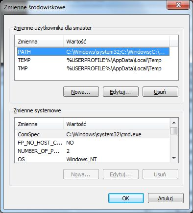

.. tip::

    Powyżej przedstawiliśmy instalację narzędzi :term:`MinGw` z konta zwykłego
    użytkownika. Można w razie potrzeby czynności te wykonać również z konta administratora,
    co pozwoli udostępnić narzędzia wszystkim użytkownikom. Podobnie
    ścieżkę do kompilatora itd. można dopisać do zmiennej systemowej ``PATH``,
    dzięki czemu wszyscy użytkownicy będą mogli wywoływać narzędzia bez
    podawania pełnej ich lokalizacji.

.. _interpreter-pythona:

Interpreter Pythona
###################

W systemach **Linux** Python jest szeroko stosowany i dostępny jest w ramach
standardowej instalacji większości dystrybucji i to zarówno w wersji 2.x,
jak i 3.x. Dla formalności polecenia instalacyjne to:

.. code-block:: bash

    ~$ sudo apt-get install python2 python3
    ~# pacman -S python python2

.. note::

    Warto zauważyć, że w dystrybucjach opartych na Debianie polecenie ``python``
    jest dowiązaniem do wersji 2.x, a paczki nazywają się odpowiednio ``python2-...``
    lub ``python3-...``. W Arch Linuksie i pochodnych nazwa ``python`` domyślnie
    wskazuje wersję 3.x (!), podobnie nazwy pakietów dodatkowych. Wersja i paczki
    z liniii 2.x mają w nazwie ``python2``.

Polecić natomiast można doinstalowanie dodatkowych narzędzi, w tym rozszerzonej konsoli:

.. code-block:: bash

    ~$ sudo apt-get install ipython2 ipython3
    ~# pacman -S python-pip ipython python2-pip ipython2

W **MS Windows** najprościej zainstalować Pythona przy użyciu skryptu konsoli PowerShell
dostępnej w wersjach *Professional* (oznaczoną niebieską ikoną i niebieskiem tłem):

.. code-block:: posh

    (new-object System.Net.WebClient).DownloadFile("https://www.python.org/ftp/python/2.7.8/python-2.7.8.msi", "$pwd\python-2.7.8.msi")
    msiexec /i python-2.7.8.msi TARGETDIR=C:\Python27
    [Environment]::SetEnvironmentVariable("Path", "$env:Path;C:\Python27\;C:\Python27\Scripts\", "User")
    (new-object System.Net.WebClient).DownloadFile("https://raw.github.com/pypa/pip/master/contrib/get-pip.py", "$pwd\get-pip.py")
    C:\Python27\python.exe get-pip.py virtualenv

Jeżeli w naszej wersji Windows nie ma PowerShella, ściągamy `interpreter Pythona <https://www.python.org/downloads/>`_
i instalujemy ręcznie, pamiętając o zaznaczeniu opcji "Add Python.exe to Path".

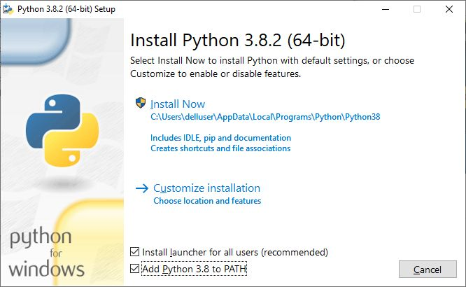

Następnie instalujemy program ``pip`` do zarządzania dodatkowymi bibliotekami za pomocą polecenia:

.. code-block:: bash

    python -c "exec('try: from urllib2 import urlopen \nexcept: from urllib.request import urlopen');f=urlopen('https://raw.github.com/pypa/pip/master/contrib/get-pip.py').read();exec(f)"

Aby uruchamiać skrypty bezpośrednio z poziomu Geany lub konsoli tekstowej bez
podawania pełnej ścieżki warto ją dodać do zmiennej użytkownika lub systemu
o nazwie ``PATH``, tak jak pokazano wyżej dla narzędzi *MinGw*.
Na potrzeby pojedynczej sesji odpowiedni efekt osiągniemy wydając polecenie
w konsoli:

.. code-block:: bat

    set PATH=%PATH%;c:\Python27\;c:\Python27\Scripts\

.. _st3-opis:

Sublime Text 3
##############

Sublime Text 3 to profesjonalny edytor dla programistów, który właściwie skonfigurowany
bardzo dobrze nadaje się do pisania programów w wielu językach, m.in. w Pythonie.
Zobacz: `instalacja i konfiguracja ST3 <http://python101.readthedocs.io/pl/latest/env/index.html#sublime-text-3>`_.

Biblioteka Qt
#############

:term:`Qt` to zestaw bibliotek przeznaczonych dla języka C++, QML i Java,
który znakomicie ułatwia tworzenie graficznego interfejsu użytkownika.
Zawiera również klasy udostępniające obsługę m.in. multimediów , sieci
czy baz danych.

System i środowisko IDE
=======================

Bilioteka :term:`Qt` jest przenośna z założenia, więc programować z jej wykorzystaniem
można w wielu systemach i środowiskach. Proponujemy system Linux,
np. dystrybucję :term:`Debian` (v. Jessie) lub :term:`Xubuntu 14.04`.
Instalacja wymaganych narzędzi sprowadza się do wydania prostych poleceń
w terminalu:

.. code-block:: bash

    ~$ sudo apt-get update
    ~$ sudo apt-get install qtcreator qt5-qmake qt5-default qt4-qtconfig

Pierwsze polecenie zaktualizuje repoytoria, czyli wersje dostępnego oprogramowania;
drugie zainstaluje dedykowane :term:`środowisko IDE`, które pozwala projektować
interfejs graficzny, bardzo ułatwia edycję kodu, pozwala budować, uruchamiać
i debugować różne wersje tworzonych aplikacji.

Qt5 w systemie Windows
========================

Instalacja jest bardzo prosta. Pobieramy `Qt Online Installer for Windows <https://www.qt.io/download-open-source/>`_
i uruchamiamy. Następnie przeprowadzamy standardową instalację z domyślnymi
ustawieniami, podając w razie potrzeby hasło administratora.

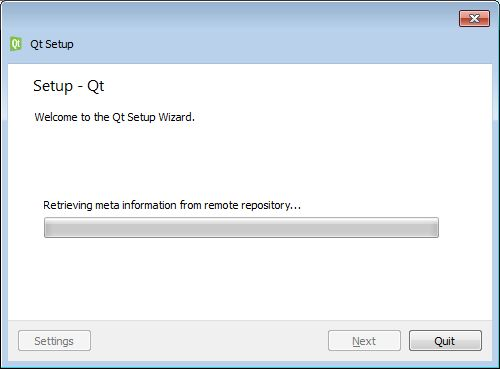

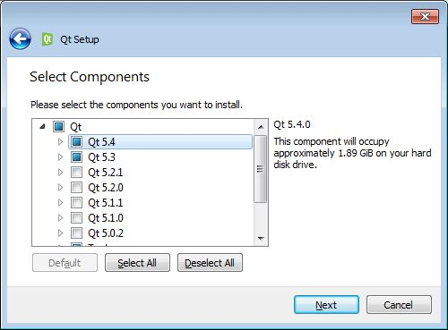

Wygląd i działanie aplikacji :term:`Qt Creator` w systemie Linux i Windows są
takie same.

.. figure:: img/qtcreator.png

Baza SQLite
###########

W wielu projektach nie ma potrzeby wykorzystywania dużych i skomplikowanych systemów zarządzania
bazami danych takich jak MySQL, MariaDB czy PostgreSQL. Lepiej skorzystać
z prostszej `bazy SQLite <https://www.sqlite.org/>`_, która ma jednak duże możliwości.
Do zarządzania bazami danych SQLite'a, które przechowywane są w pojednyczych plikach,
wykorzystuje się **interepreter** działający w terminalu.

**W systemach Linux** instalowany jest on poleceniami typu:

.. code-block:: bash

    ~$ sudo apt-get install sqlite3

    ~# pacman -S sqlite

– i uruchamiany komendą ``sqlite3``. Podstawowe polecenia:

.. code-block:: bash

    ~$ sqlite3 baza.db // otwarcie pliku z bazą
    ~$ sqlite3 baza.db < schemat.sql // utworzenie bazy na podstawie pliku .sql
    sqlite> .tables // lista tabel
    sqlite> .help // lista poleceń interpretera
    sqlite> .schema tabela // pokazuje klauzulę CREATE dla podanej tabeli
    sqlite> .quit // wyjście z interpretera

Najlepszym narzędziem z interfejsem graficznym jest z kolei
polski program `SQLiteStudio <http://sqlitestudio.pl/>`_. Po pobraniu archiwum z rozszerzeniem *tar.xz*
rozpakowujemy go i tworzymy dowiązanie:

.. code-block:: bash

    ~$ sudo tar -xf sqlitestudio-3.0.7.tar.xz -C /opt
    ~$ cd /usr/bin
    ~$ sudo ln -sf /opt/SQLiteStudio/sqlitestudio .

W systemach opartych na Arch Linuksie możemy instalować z repozytorium AUR:

.. code-block:: bash

    ~# yaourt -S sqlitestudio

Program uruchamiamy poleceniem ``sqlitestudio``.

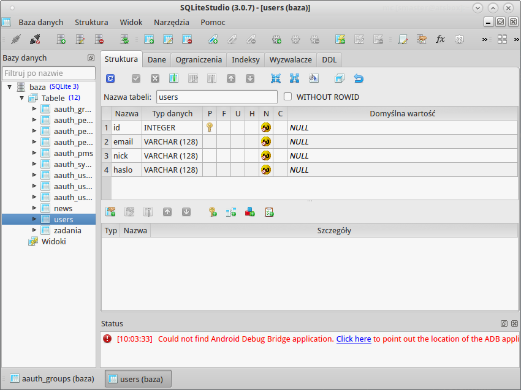

**W systemie Windows** ze strony `SQLite3 Download Page <https://www.sqlite.org/download.html>`_
z sekcji *Precompiled Binaries for Windows* pobieramy archiwum *sqlite-tools-win32-(...).zip*.
Następnie należy je rozpakować najlepiej do katalogu będącego w ścieżce systemowej.
Interpreter uruchamiamy albo poleceniem ``sqlite3`` albo podwójnym kliknięciem.

Graficzne narzędzia do baz SQLite3 pod Windowsem to wspomniane wyżej polskie *SQLiteStudio*
w wersji `dla Windows <http://sqlitestudio.pl/?act=download>`_. Pobrane archiwum *.zip* rozpakowujemy
i uruchamiamy program *SQLiteStudio.exe*. Drugi program to np. angielskojęzyczny *SQLite Browser*
dołączony do opisanego wyżej środowiska *UwAmp*. Można go pobrać ze strony
`DB Browser for SQLite <http://sqlitebrowser.org/>`_.

L(W)amp
=======

Zobacz: :ref:`Serwer deweloperski WWW <lwamp>` »»»

Materiały
=========

1. `Edytor Geany`_
2. `MinGw`_
3. `Język Python`_
4. `Biblioteka Qt`_
5. `Qt Creator`_
6. `Interpreter SQLite3`_

.. _Edytor Geany: http://www.geany.org/
.. _MinGw: http://www.mingw.org/
.. _Język Python: https://www.python.org/
.. _Biblioteka Qt: https://qt-project.org/
.. _Qt Creator: http://pl.wikipedia.org/wiki/Qt_Creator
.. _Interpreter SQLite3: https://www.sqlite.org/cli.html

Słownik
===========

.. glossary::

    Qt
        zestaw bibliotek programistycznych ułatwiających tworzenie aplikacji
        z interfejsem graficznym w językach C++, QML i Java.

    środowisko IDE
        zintegrowane środowisko programistyczne (ang. Integrated Development Environment, IDE),
        składające się z jednej lub wielu aplikacji, umożliwiające tworzenie,
        testowanie, budowanie i uruchamianie kodu.

    Qt Creator
        wieloplatformowe :term:`środowisko IDE` dla aplikacji pisanych
        w językach C++, JavaScript i QML.
        Zawiera m.in. `debugger <http://pl.wikipedia.org/wiki/Debugger>`_
        i edytor GUI (graficznego interfejsu użytkownika).

    MinGw
        ang. *Minimalist GNU for Windows*; minimalistyczne środowisko
        dostarczające narzędzia GNU (linker, kompilator itd.) pozwalające
        na kompilację natywnych plików wykonywalnych dla Windows
        z kodu pisanego w C/C++.

    GNU Compiler Collection
        zestaw kompilatorów do różnych języków programowania rozwijany
        w ramach projektu GNU i udostępniany na licencji GPL oraz LGPL.
        Zob. hasło w `Wikipedii <http://pl.wikipedia.org/wiki/GNU_Compiler_Collection>`__.

    GPL
        ang. GNU General Public License – licencja wolnego i otwartego
        oprogramowania stworzona w 1989 roku przez Richarda Stallmana
        i Ebena Moglena na potrzeby Projektu GNU. Ostatnia wersja, trzecia,
        opublikowana została 29 czerwca 2007 r.
        Zob. hasło w `Wikipedii <http://pl.wikipedia.org/wiki/GNU_General_Public_License>`__.

    Debian
        jedna z najstarszych i wiądących dystrybucji Linuksa, umożliwia
        elastyczną konfigurację systemu i dostosowanie go do własnych potrzeb.
        Jak większość dystrybucji, umożliwia wybór wielu środowisk graficznych,
        np. XFCE lub Gnome.

    Xubuntu 14.04
        odmiana jednej z najpopularniejszych dystrybucji Linuksa, Ubuntu,
        dostarczana z klasycznym, lekkim i konfigurowlanym środowiskiem
        graficznym XFCE.

    środowisko graficzne
        w systemach linuksowych zestaw oprogramowania tworzący GUI, czyli graficzny
        interfejs użytkownika, często zawiera domyślny wybór aplikacji przeznaczonych
        do wykonywania typowych zadań. Najpopularnijesze środowiska to `XFCE`_,
        `Gnome`_, `KDE`_, `LXDE`_, `Cinnamon`_, `Mate`_.

    serwer WWW
        (ang. web server) – oprogramowanie obsługujące protokół http, podstawowy protokół sieci WWW,
        służący przesyłaniu dokumentów hipertekstowych.

    interpreter
        program, który analizuje kod źródłowy, a następnie go wykonuje. Interpretery są
        podstawowym składnikiem języków wykorzystywanych do pisania skryptów wykonywanych
        po stronie klienta WWW (`JavaScript`_) lub serwera (np. Python, `PHP`_).

    system bazodanowy
        system zarządzania bazą danych (ang. Database Management System, DBMS) – oprogramowanie
        służące do zarządzania bazami danych, np. SQLite, MariaDB, MySQL, PostgreSQL.

    framework
        (ang. framework – struktura) – oprogramowanie będące zestawem narzędzi ułatwiających
        i przyśpieszających tworzenie aplikacji.

.. _Debian: https://www.debian.org/index.pl.html
.. _Ubuntu: http://ubuntu.pl
.. _Xubuntu: http://xubuntu.org/
.. _Gnome: http://pl.wikipedia.org/wiki/GNOME
.. _KDE: http://pl.wikipedia.org/wiki/KDE
.. _LXDE: http://pl.wikipedia.org/wiki/LXDE
.. _Cinnamon: http://en.wikipedia.org/wiki/Cinnamon_%28software%29
.. _Mate: http://pl.wikipedia.org/wiki/MATE
.. _XFCE: http://www.xfce.org/
.. _JavaScript: http://pl.wikipedia.org/wiki/JavaScript
.. _PHP: http://pl.wikipedia.org/wiki/PHP
