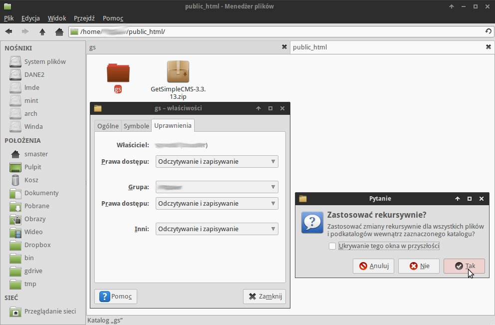
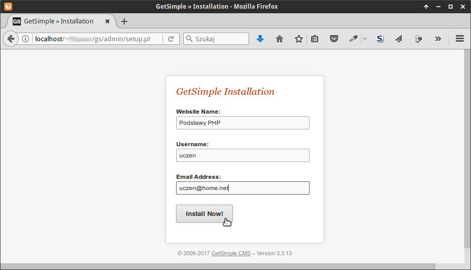
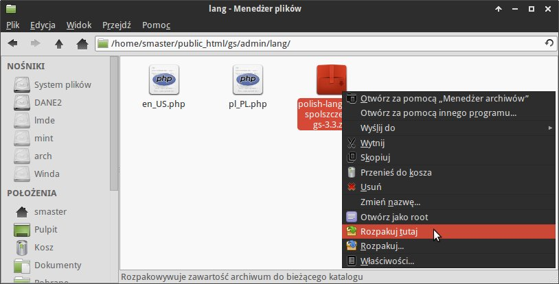
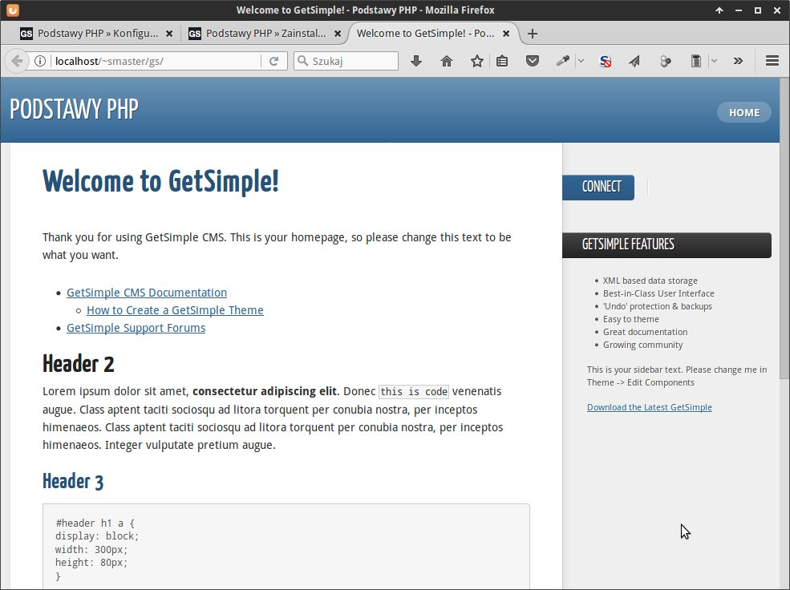

GetSimple CMS
#############

GetSimple jest przykładem popularnych od dłuższego czasu systemu zarządzania
treścią (ang. *Content Management System*, :term:`CMS`). Zadaniem CMS-ów jest
wspomaganie tworzenia serisów intenetowych WWW i wspomaganie zarządzania nimi przy wykorzystaniu
przyjaznych dla użytkownika interfejsów, dzięki czemu nie musi on być
specjalistą od wspomnianych na wstępie technologii WWW.
Inne przykłady popularnych CMS-ów to: `Drupal <http://pl.wikipedia.org/wiki/Drupal>`_,
`Joomla! <http://pl.wikipedia.org/wiki/Joomla!>`_ czy `WordPress <http://pl.wikipedia.org/wiki/WordPress>`_.

Pobranie archwium
*****************

.. note::

    GetSimple wymaga działającego serwera WWW, przy czym serwery bazodanowe
    typu MySQL itp. nie są koniecznie, ponieważ GS przechowuje pliki w formacie
    ``XML``. Zob. materiał :ref:`Serwer deweloperski WWW <lwamp>`.

Najnowszą wersję GS pobieramy ze strony `Download GetSimple CMS <http://get-simple.info/download>`_
lub z :download:`od nas <gs/GetSimpleCMS-3.3.13.zip>`.
Ściągnięte archiwum ``zip`` umieszczamy w podkatalogu ``public_html`` katalogu domowego
użytkownika Linuksa lub w podkatalogu ``www`` folderu instalacyjnego ``UwAmp``.
Rozpakowujemy je, a następnie nazwę utworzonego katalogu zmieniamy na ``gs``.

.. warning::

    W środowisku Linux folderowi ``gs`` musimy nadać uprawnienia do zapisu
    i odczytu nie tylko dla właściciela, ale i dla grupy oraz innych.
    Robimy to z poziomu menedżera plików po kliknięciu prawym klawiszem
    myszy nazwy katalogu i wybraniu "Właściwości/Uprawnienia" (zob. zrzut poniżej).
    Uwaga: na pytanie typu "Zastosować rekursywnie" odpowiadamy twierdząco.
    Można też w katalogu ``public_html`` wydać polecenie w terminalu ``chmod -R 777 gs``.

Następnie przechodzimy do przeglądarki i rozpoczynamy instalację wpisując w polu adresu:
``http://localhost/~nazwa_użytkownika/gs/admin`` (Linux)
lub ``http://localhost/gs/admin`` (Windows).
Jeżeli skorzystałeś z udostępnionego przez nas archiwum GetSimple,
na stronie instalacyjnej możesz od razu wybrać język polski. Później
klikamy "Continue with Setup" ("Kontynuuj instalację").

.. figure:: gs/gs02.jpg

.. note::

    W środowisku Linux ewentualne błędy ``chmod`` ignorujemy.

Instalacja
**********

Na następnej stronie wpisujemy nazwę strony, login i email administratora.

Po naciśnięciu "Install Now!" ("Instaluj") może zostać wyświetlona strona z błędem ze względu
na brak możliwości wysłania wiadomości e-mail z danymi logowania. To normalne.
Wyświetlone hasło możemy ewentualnie skopiować, po czym kilkamy link "login here".

.. figure:: gs/gs04.jpg

Spolszczenie i konfiguracja
***************************

Jeżeli jest taka potrzeba, plik spolszczenia pobieramy ze strony
`Extend <http://get-simple.info/extend/>`_, na której wyszukujemy w polu
"Serach Repository" hasło "polish" i wybieramy link do ostatniej wersji:

.. figure:: gs/gs05.jpg

Spolszczenie możemy również pobrać :download:`od nas <gs/polish-language-spolszczenie-gs-3.3.zip>`.
Ściągnięte archiwum przenosimy do folderu ``gs/admin/lang`` i tam rozpakowujemy.

Wracamy do panelu administracyjnego w przeglądarce (``http://localhost/~nazwa_użytkownika/gs/admin``),
w razie potrzeby odświeżamy stronę naciskając :kbd:`F5` i wybieramy w prawym górnym rogu "Settings".
Ustawiamy: strefę czasową ("Local Timezone"), język interfejsu admina ("Language") oraz
nowe hasło ("New Password") – i klikamy "Save settings".

.. figure:: gs/gs07.jpg

Wtyczki
*******

Jak większość CMS-ów, GetSimple oferuje mechanizm wtyczek, pozwalający rozszerzać
w miarę potrzeb funkcjonalność zarówno od strony użytkownika, jak i administratora.
Instalacja wtyczek polega na pobraniu ich ze strony `Extend Repository <http://get-simple.info/extend/>`_,
a następnie rozpakowaniu archiwum ``zip`` w podfolderze ``gs/plugins``.

Pakiet przykładowych wtyczek można pobrać :download:`od nas <gs/plugins.zip>` lub pojedynczo:

* `I18N <http://get-simple.info/extend/plugin/i18n/69/>`_ – dodaje wsparcie
  dla stron w różnych językach oraz bardzo użyteczne hierarchiczne menu;
* `I18N Gallery <http://get-simple.info/extend/plugin/i18n-gallery/160/>`_
  – dodaje możliwość wygodnego tworzenia galerii zdjęć i umieszczania ich
  na stronach;
* `DynPages <http://get-simple.info/extend/plugin/dynpages/81/>`_  – możliwość umieszczania
  na stronach kodu generowanego przez komponenty php;
* `I18N Search <http://get-simple.info/extend/plugin/i18n-search/82/>`_
  – umożliwia m. in. wyszukiwanie tekstu na stronach serwisu, ale również
  tworzenie list zasobów oznaczonych tymi samymi tagami;
* `I18N Special Pages <http://get-simple.info/extend/plugin/i18n-special-pages/319/>`_
  – pozwala tworzyć strony specjalne typu newsy, artykuły, karty produktów
  itp.

Zawartość przykładowego folderu ``plugins`` powinna wyglądać następująco:

.. figure:: gs/gs08.jpg

.. note::

    W Linuksie po umieszczeniu archiwów zip w podkatalogu ``gs/plugins``
    wygodnie je rozpakujesz wydając w terminalu polecenie typu:
    ``unzip nazwa_archiwum.zip``.

    Użycie polecenia "Rozpakuj tutaj" w menedżerze plików może umieścić pliki
    w dodatkowym i niepotrzebnym podfolderze, z którego trzeba je będzie przenieść
    do folderu nadrzędnego (``plugins``).

Wtyczkami zarządzamy w sekcji "Wtyczki" panelu administracyjnego. Tam można
je m. in. włączać lub wyłączać.

.. figure:: gs/gs09.jpg

Strona główna
*************

Domyślnie dodana zostanie demonstracyjna strona główna widoczna w panelu "Strony",
którą wyświetlimy w przeglądarce, jeżeli klikniemy nazwę serwisu w panelu administracyjnym
lub wpiszemy ``http://localhost/~nazwa_użytkownika/gs/`` (Linux) lub ``http://localhost/gs/`` (Windows)
w polu adresu.

Materiały
**************

1. `GetSimple`_
2. `GetSimple – dodatki`_

.. _GetSimple: http://get-simple.info/
.. _GetSimple – dodatki: http://get-simple.info/extend/

Słownik
===========

.. glossary::

    WWW
        (ang. *World Wide Web*) – `ogólnoświatowa sieć <http://pl.wikipedia.org/wiki/World_Wide_Web>`_, jedna z najważniejszych
        usług sieciowych; hipertekstowy, internetowy sposób udostępniania informacji.

    HTTP(S)
        (ang. *Hypertext Transfer Protocol*) – `protokół przesyłania dokumentów hipertekstowych <http://pl.wikipedia.org/wiki/Hypertext_Transfer_Protocol>`_,
        protokół sieci WWW za pomocą którego przesyłane są żądania udostępnienia lub
        modyfikacji zasobów, określa reguły komunikacji między klientem (np. przeglądarką)
        a serwerem, który zwraca odpowiedzi. Zalecane jest używanie wersji
        szyfrowanej tego protokołu oznaczanego ``https``.

    HTML
        HTML (ang. *HyperText Markup Language*) – `hipertekstowy język znaczników <http://pl.wikipedia.org/wiki/HTML>`_,
        wykorzystywany do tworzenia stron internetowych. Aktualnie zalecana wersja
        to HTML5.

    XML
        XML (ang. *Extensible Markup Language*) – `rozszerzalny język znaczników <http://pl.wikipedia.org/wiki/XML>`_,
        przeznaczony do strukturalnego i semantycznego opisu danych.

    PHP
        `obiektowy, skryptowy język programowania <http://pl.wikipedia.org/wiki/PHP>`_,
        służący m. in. do generowania po stronie serwera dynamicznych stron internetowych.

    Python
        `obiektowy język programowania <http://pl.wikipedia.org/wiki/Python>`_ wysokiego poziomu służący m. in. do tworzenia aplikacji internetowych, oferuje przyjazną składnię, czytelność i klarowność kodu.

    CSS
        (ang. *Cascading Style Sheets*, CSS) – `kaskadowe arkusze stylów <http://pl.wikipedia.org/wiki/Kaskadowe_arkusze_styl%C3%B3w>`_,
        język opisu wyglądu stron internetowych, stanowi dopełnienie HTML-a.

    JavaScript
        `skryptowy język programowania <http://pl.wikipedia.org/wiki/JavaScript>`_
        służący m. in. do tworzenia aktywnych właściwości stron internetowych,
        działa po stronie klienta (tj. w przeglądarce).

    AJAX
        AJAX (ang. *Asynchronous JavaScript and XML*) – `asynchroniczny JavaScript i XML <http://pl.wikipedia.org/wiki/AJAX>`_,
        sposób tworzenia stron internetowych, które oferując dynamiczną
        zmianę zawartości, nie wymagają przeładowywania, ponieważ komunikują się
        z serwerm asynchronicznie.

    CMS
        (ang. *Content Management System*, CMS) – system zarządzania treścią,
        wykorzystujące różne technologie internetowe, służący do tworzenia
        serwisów internetowych i zarządzania nimi.

    serwer WWW
        (ang. web server) – oprogramowanie obsługujące protokół http, podstawowy protokół sieci WWW,
        służący przesyłaniu dokumentów hipertekstowych.

    interpreter
        program, który analizuje kod źródłowy, a następnie go wykonuje. Interpretery są
        podstawowym składnikiem języków wykorzystywanych do pisania skryptów wykonywanych
        po stronie klienta WWW (JavaScript) lub serwera (np. Python, PHP).

    system bazodanowy
        system zarządzania bazą danych (ang. Database Management System, DBMS) – oprogramowanie
        służące do zarządzania bazami danych, np. SQLite, MariaDB, MySQL, PostgreSQL.

    framework
        (ang. framework – struktura) – oprogramowanie będące zestawem narzędzi ułatwiających
        i przyśpieszających tworzenie aplikacji.

