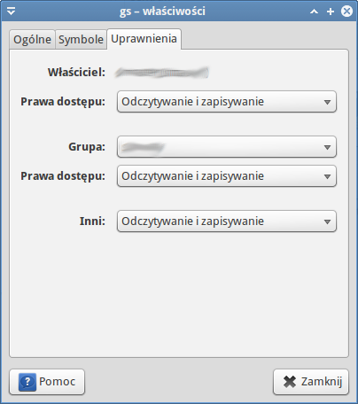
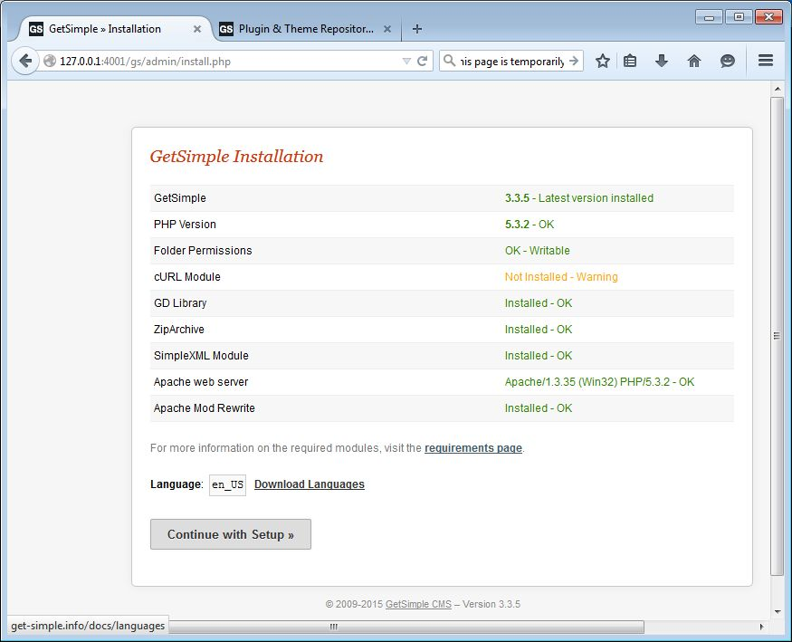
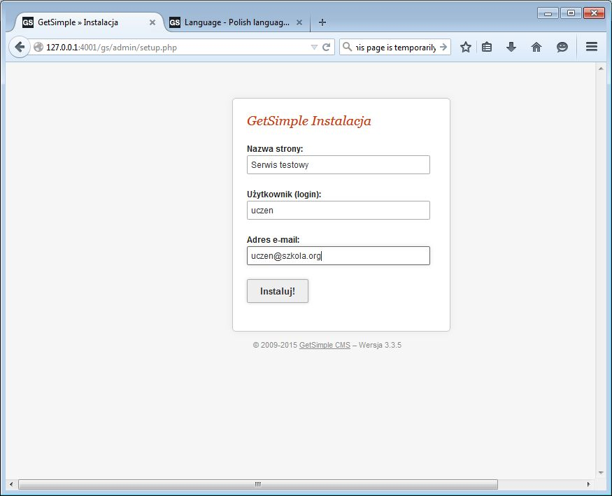
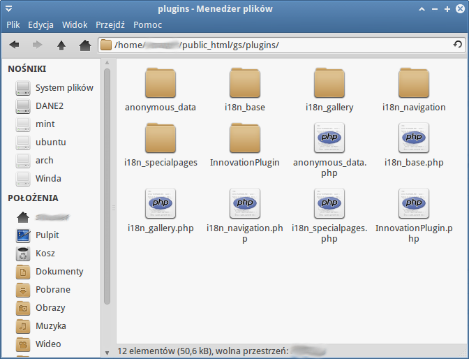

GetSimple CMS
#############

GetSimple jest przykładem popularnych od dłuższego czasu systemu zarządzania
treścią (ang. *Content Management System*, :term:`CMS`). Zadaniem CMS-ów jest
wspomaganie tworzenia serisów intenetowych WWW i wspomaganie zarządzania nimi przy wykorzystaniu
przyjaznych dla użytkownika interfejsów, dzięki czemu nie musi on być
specjalistą od wspomnianych na wstępie technologii WWW.
Inne przykłady popularnych CMS-ów to: `Drupal <http://pl.wikipedia.org/wiki/Drupal>`_,
`Joomla! <http://pl.wikipedia.org/wiki/Joomla!>`_ czy `WordPress <http://pl.wikipedia.org/wiki/WordPress>`_.

Pobranie archwium
*****************

.. note::

    GetSimple wymaga działającego serwera WWW, przy czym serwery bazodanowe
    typu MySQL itp. nie są koniecznie, ponieważ GS przechowuje pliki w formacie
    ``XML``. W rozdziale :ref:`narzędzia <tools>` omówiono instalację instalację
    środowiska :ref:`LAMP <lamp-ins>` (dla Linuksa) i :ref:`WAMP <serwer2go-ins>`
    (Serwer2Go dla Windowsa).

Najnowszą wersję GS pobieramy ze strony `Download GetSimple CMS <http://get-simple.info/download>`_.
Ściągnięte archiwum ``zip`` umieszczamy w podkatalogu ``public_html`` katalogu domowego
użytkownika Linuksa lub w podkatalogu ``htdocs`` folderu instalacyjnego ``Serwer2Go``.
Rozpakowujemy je, a następnie nazwę utworzonego katalogu zmieniamy na ``gs``.

.. figure:: img/getsimple02.jpg

.. note::

    W środowisku Linux folderowi ``gs`` musimy nadać uprawnienia do zapisu
    i odczytu nie tylko dla właściciela, ale i dla grupy oraz innych.
    Można to zrobić z poziomu menedżera plików po kliknięciu prawym klawiszem
    myszy nazwy katalogu i wybraniu "Właściwości/Uprawnienia" (zob. zrzut poniżej).
    Uwaga: na pytanie typu "Zastosować rekursywnie" odpowiadamy twierdząco.
    Można też w katalogu ``public_html`` wydać polecenie w terminalu ``chmod -R 777 gs``.

Następnie przechodzimy do przeglądarki (w Windows ``Serwer2Go`` musi być uruchomiony!)
i rozpoczynamy instalację wpisując w polu adresu: ``http://127.0.0.1/~nazwa_użytkownika/gs/admin``
(Linux) lub ``http://127.0.0.1:4001/gs/admin`` (Windows).

.. note::

    W środowisku Linux ewentualne błędy ``chmod`` ignorujemy.

Spolszczenie
============

Jak widać, domyślnie dostępny jest język angielski. Można to łatwo zmienić już
podczas instalacji (później również). W nowej karcie przeglądarki otwieramy
link ``Download Languages``, a na otwartej stronie wchodzimy do sekcji ``Extend``.
W polu wyszukiwania wpisujemy ``polish``, po wyświetleniu znalezionych zasobów
klikamy link ``Polish language (spolszczenie) 1.3.7``. Ściągamy spakowane archiwum
na dysk. Przenosimy je do folderu ``gs/admin/lang`` i tam rozpakowujemy.

.. figure:: img/getsimple06.jpg

.. figure:: img/getsimple07.jpg

Instalacja
**********

Wracamy do przęglądarki, odświeżamy stronę instalacyjną, np. klawiszem :kbd:`F5`,
i wybieramy polską wersję językową. Po kliknięciu przycisku "Kontynuuj instalację"
na następnej stronie wpisujemy nazwę strony, login i hasło administratora.

Po naciśnięciu "Instaluj!" może zostać wyświetlona strona z błędem (pod Windowsem)
ze względu na brak możliwości wysłania wiadomości e-mail z danymi logowania. Jest to
normalne. Wyświetlone hasło możemy ewentualnie zapisać, po czym kilkamy link "Logowanie".
Zobaczymy panel administracyjny, w którym będziemy mogli zmienić hasło
klikając po prawej stronie "Ustawienia", a następnie "Profil użytkownika".

Domyślnie dodana zostanie demonstracyjna strona główna widoczna w panelu "Strony",
którą wyświetlimy w przeglądarce, jeżeli klikniemy nazwę serwisu w panelu administracyjnym
lub wpiszemy ``http://127.0.0.1/~nazwa_użytkownika/gs/`` (Linux) lub ``http://127.0.0.1:4001/gs/`` (Windows)
w polu adresu.

.. figure:: img/getsimple14.jpg

Zobacz galerię :ref:`Instalacja GetSimple CMS <gsimple-gal>`.

Wtyczki
*******

Jak większość CMS-ów, GetSimple oferuje mechanizm wtyczek, pozwalający rozszerzać
w miarę potrzeb funkcjonalność zarówno od strony użytkownika, jak i administratora
serwisu. Instalacja wtyczek polega na pobraniu ich ze strony `Extend Repository <http://get-simple.info/extend/>`,
a następnie rozpakowaniu archiwum ``zip`` w podfolderze ``gs/plugins``.
Wtyczkami zarządzamy w sekcji "Wtyczki" panelu administracyjnego. Tam można
je m. in. włączać lub wyłączać.

Przykładowe wtyczki
===================

- `I18N <http://get-simple.info/extend/plugin/i18n/69/>`_ – dodaje wsparcie
  dla stron w różnych językach oraz bardzo użyteczne hierarchiczne menu;
- `I18N Gallery <http://get-simple.info/extend/plugin/i18n-gallery/160/>`_
  – dodaje możliwość wygodnego tworzenia galerii zdjęć i umieszczania ich
  na stronach;
- `I18N Search <http://get-simple.info/extend/plugin/i18n-search/82/>`_ –
  umożliwia m. in. wyszukiwanie tekstu na stronach serwisu, ale również
  tworzenie list zasobów oznaczonych tymi samymi tagami.
- `I18N Special Pages <http://get-simple.info/extend/plugin/i18n-special-pages/319/>`_
  – pozwala tworzyć strony specjalne typu newsy, artykuły, karty produktów
  itp.

.. note::

    W Linuksie po umieszczeniu archiwów zip w podkatalogu ``gs/plugins``
    wygodnie je rozpakujesz wydając w terminalu polecenie typu:
    ``unzip nazwa_archiwum.zip``.

    Uwaga: użycie polecenia "Rozpakuj tutaj" w menedżerze
    plików umieści pliki w dodatkowym i niepotrzebnym podfolderze (o nazwie wtyczki),
    z którego trzeba je będzie przenieść do folderu nadrzędnego (``plugins``).

Zawartość przykładowego folderu ``plugins`` powinna wyglądać następująco:

Materiały
**************

1. `GetSimple`_
2. `GetSimple – dodatki`_

.. _GetSimple: http://get-simple.info/
.. _GetSimple – dodatki: http://get-simple.info/extend/

Słownik
===========

.. glossary::

    WWW
        (ang. *World Wide Web*) – `ogólnoświatowa sieć <http://pl.wikipedia.org/wiki/World_Wide_Web>`_, jedna z najważniejszych
        usług sieciowych; hipertekstowy, internetowy sposób udostępniania informacji.

    HTTP(S)
        (ang. *Hypertext Transfer Protocol*) – `protokół przesyłania dokumentów hipertekstowych <http://pl.wikipedia.org/wiki/Hypertext_Transfer_Protocol>`_,
        protokół sieci WWW za pomocą którego przesyłane są żądania udostępnienia lub
        modyfikacji zasobów, określa reguły komunikacji między klientem (np. przeglądarką)
        a serwerem, który zwraca odpowiedzi. Zalecane jest używanie wersji
        szyfrowanej tego protokołu oznaczanego ``https``.

    HTML
        HTML (ang. *HyperText Markup Language*) – `hipertekstowy język znaczników <http://pl.wikipedia.org/wiki/HTML>`_,
        wykorzystywany do tworzenia stron internetowych. Aktualnie zalecana wersja
        to HTML5.

    XML
        XML (ang. *Extensible Markup Language*) – `rozszerzalny język znaczników <http://pl.wikipedia.org/wiki/XML>`_,
        przeznaczony do strukturalnego i semantycznego opisu danych.

    PHP
        `obiektowy, skryptowy język programowania <http://pl.wikipedia.org/wiki/PHP>`_,
        służący m. in. do generowania po stronie serwera dynamicznych stron internetowych.

    Python
        `obiektowy język programowania <http://pl.wikipedia.org/wiki/Python>`_ wysokiego poziomu służący m. in. do tworzenia
        aplikacji internetowych, oferuje przyjazną składnię, czytelność i klarowność
        kodu.

    CSS
        (ang. *Cascading Style Sheets*, CSS) – `kaskadowe arkusze stylów <http://pl.wikipedia.org/wiki/Kaskadowe_arkusze_styl%C3%B3w>`_,
        język opisu wyglądu stron internetowych, stanowi dopełnienie HTML-a.

    JavaScript
        `skryptowy język programowania <http://pl.wikipedia.org/wiki/JavaScript>`_
        służący m. in. do tworzenia aktywnych właściwości stron internetowych,
        działa po stronie klienta (tj. w przeglądarce).

    AJAX
        AJAX (ang. *Asynchronous JavaScript and XML*) – `asynchroniczny JavaScript i XML <http://pl.wikipedia.org/wiki/AJAX>`_,
        sposób tworzenia stron internetowych, które oferując dynamiczną
        zmianę zawartości, nie wymagają przeładowywania, ponieważ komunikują się
        z serwerm asynchronicznie.

    CMS
        (ang. *Content Management System*, CMS) – system zarządzania treścią,
        wykorzystujące różne technologie internetowe, służący do tworzenia
        serwisów internetowych i zarządzania nimi.

    serwer WWW
        (ang. web server) – oprogramowanie obsługujące protokół http, podstawowy protokół sieci WWW,
        służący przesyłaniu dokumentów hipertekstowych.

    interpreter
        program, który analizuje kod źródłowy, a następnie go wykonuje. Interpretery są
        podstawowym składnikiem języków wykorzystywanych do pisania skryptów wykonywanych
        po stronie klienta WWW (JavaScript) lub serwera (np. Python, PHP).

    system bazodanowy
        system zarządzania bazą danych (ang. Database Management System, DBMS) – oprogramowanie
        służące do zarządzania bazami danych, np. SQLite, MariaDB, MySQL, PostgreSQL.

    framework
        (ang. framework – struktura) – oprogramowanie będące zestawem narzędzi ułatwiających
        i przyśpieszających tworzenie aplikacji.

Metryka
========

:Autor: Robert Bednarz (ecg@ecg.vot.pl)

:Utworzony: |date| o |time|

.. |date| date::
.. |time| date:: %H:%M

.. raw:: html

    
