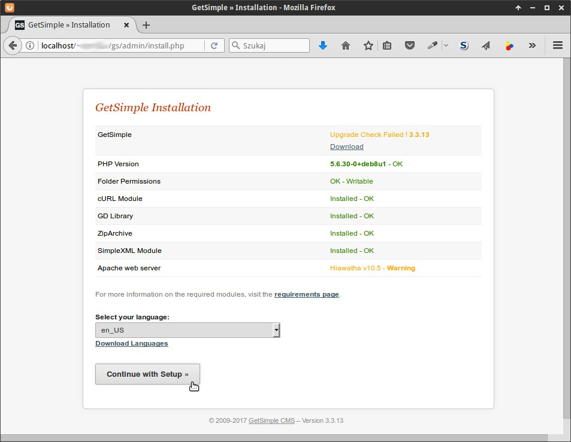
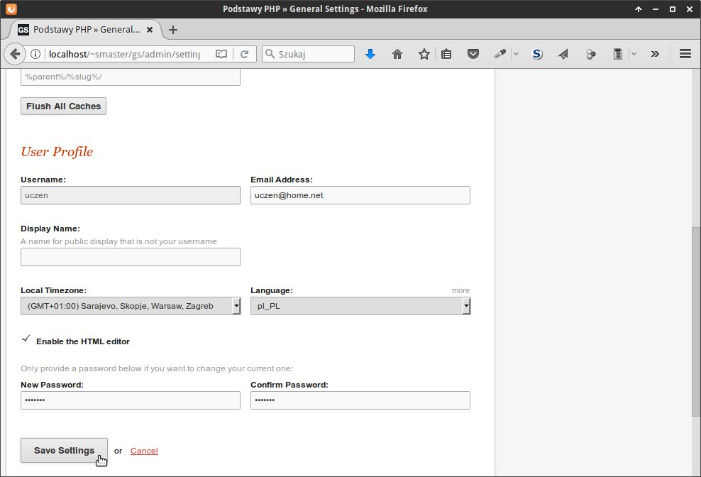
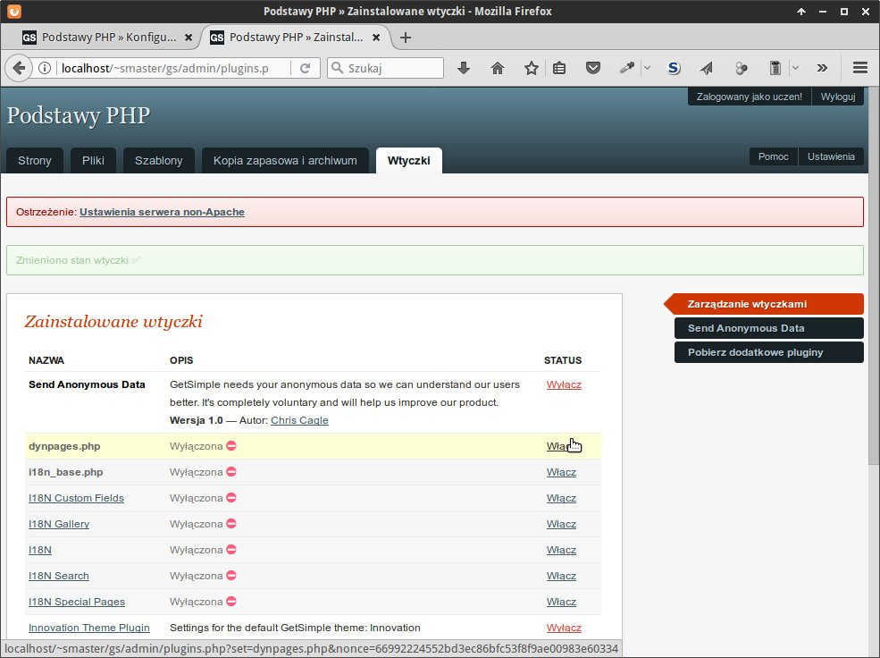

.. _getsimple:

GetSimple CMS
#############

`GetSimple <http://http://get-simple.info>`_ jest przykładem systemu zarządzania treścią
(ang. *Content Management System*, :term:`CMS`). Zadaniem CMS-ów jest
wspomaganie tworzenia serisów intenetowych WWW i zarządzania nimi przy wykorzystaniu
przyjaznych dla użytkownika interfejsów. Inne przykłady popularnych CMS-ów to:
`Drupal <http://pl.wikipedia.org/wiki/Drupal>`_,
`Joomla! <http://pl.wikipedia.org/wiki/Joomla!>`_
czy `WordPress <http://pl.wikipedia.org/wiki/WordPress>`_.

Pobranie archwium
*****************

.. note::

    GetSimple wymaga działającego serwera WWW, przy czym serwery bazodanowe
    typu MySQL itp. nie są koniecznie, ponieważ GS przechowuje pliki w formacie
    ``XML``. Zob. materiał :ref:`Serwer deweloperski WWW <lwamp>`.

Pobieramy :download:`archiwum GS <GetSimpleCMS-3.3.13.zip>`
i umieszczamy w podkatalogu ``public_html`` katalogu domowego (Linux)
lub w podkatalogu ``www`` folderu instalacyjnego ``UwAmp`` (Windows).
Rozpakowujemy je, a nazwę utworzonego katalogu zmieniamy na ``gs``.

.. warning::

    W Linuksie folderowi ``gs`` musimy nadać uprawnienia do zapisu
    i odczytu nie tylko dla właściciela, ale i dla grupy oraz innych.
    Robimy to z poziomu menedżera plików po kliknięciu prawym klawiszem
    myszy nazwy katalogu i wybraniu "Właściwości/Uprawnienia" (zob. zrzut poniżej).
    Uwaga: na pytanie typu "Zastosować rekursywnie" odpowiadamy twierdząco.
    Można też w katalogu ``public_html`` wydać w terminalu polecenie: ``chmod -R 777 gs``.

.. figure:: img/gs01.jpg

Instalacja
**********

Uruchamiamy przeglądarkę i rozpoczynamy instalację wpisując w polu adresu:
``http://localhost/~nazwa_użytkownika/gs/admin`` (Linux)
lub ``http://localhost/gs/admin`` (Windows).
Jeżeli skorzystałeś z udostępnionego przez nas archiwum GetSimple,
na stronie instalacyjnej wybieramy od razu język polski. Później
klikamy "Continue with Setup" ("Kontynuuj instalację").

.. note::

    W środowisku Linux ewentualne błędy ``chmod`` ignorujemy.

Na następnej stronie wpisujemy nazwę strony, login i email administratora.

.. figure:: img/gs03.jpg

Po naciśnięciu "Install Now!" ("Instaluj") może zostać wyświetlona strona z błędem
ze względu na brak możliwości wysłania wiadomości e-mail z danymi logowania. To normalne.
Wyświetlone hasło możemy ewentualnie skopiować, po czym kilkamy link "login here".

.. figure:: img/gs04.jpg

Spolszczenie
************

Jeżeli jest taka potrzeba, pobieramy :download:`plik spolszczenia <polish-language-spolszczenie-gs-3.3.zip>` i rozpakowujemy go w podkatalogu
``gs/admin/lang``.

.. figure:: img/gs06.jpg

Konfiguracja
*************

W panelu administracyjnym (``http://localhost/~nazwa_użytkownika/gs/admin``)
wybieramy w prawym górnym rogu **Settings** (**Ustawienia**).
Ustawiamy: strefę czasową ("Local Timezone"), język interfejsu admina ("Language") oraz
nowe hasło ("New Password") – i klikamy "Save settings" ("Zapisz").

Wtyczki
*******

Za pomocą wtyczek (ang. *plugins*) rozszerzamy funkcjonalność GetSimple'a.
Pobieramy przygotowany przez nas :download:`zestaw wtyczek <plugins.zip>`
i rozpakowujemy w podfolderze ``gs/plugins``.

Zawartość przykładowego folderu ``plugins`` powinna wyglądać następująco:

.. figure:: img/gs08.jpg

.. tip::

    W Linuksie po umieszczeniu archiwów zip w podkatalogu ``gs/plugins``
    wygodnie je rozpakujesz wydając w terminalu polecenie typu:
    ``unzip nazwa_archiwum.zip``.

    Użycie polecenia "Rozpakuj tutaj" w menedżerze plików może umieścić pliki
    w dodatkowym i niepotrzebnym podfolderze, z którego trzeba je będzie przenieść
    do folderu nadrzędnego (``plugins``).

Przykładowe wtyczki:

* `I18N <http://get-simple.info/extend/plugin/i18n/69/>`_ – wsparcie
  dla stron w różnych językach oraz bardzo użyteczne hierarchiczne menu;
* `I18N Gallery <http://get-simple.info/extend/plugin/i18n-gallery/160/>`_
  – tworzenie galerii zdjęć;
* `DynPages <http://get-simple.info/extend/plugin/dynpages/81/>`_  – wykonywanie kodu php umieszczonego w komponentach;
* `I18N Search <http://get-simple.info/extend/plugin/i18n-search/82/>`_
  – wyszukiwanie tekstu na stronach serwisu, tworzenie list zasobów oznaczonych tagami;
* `I18N Special Pages <http://get-simple.info/extend/plugin/i18n-special-pages/319/>`_
  – tworzenie stron specjalnych typu newsy, artykuły, karty produktów itp.

Wtyczkami zarządzamy w sekcji "Wtyczki" panelu administracyjnego.
**Po instalacji należy wtyczkę(i) włączyć.**

Strona główna
*************

Domyślnie dodana zostanie demonstracyjna strona główna widoczna w panelu "Strony",
którą wyświetlimy w przeglądarce, jeżeli klikniemy nazwę serwisu w lewym górnym rogu
panelu administracyjnego. Strona główna dostępna jest pod adresem:
``http://localhost/~nazwa_użytkownika/gs/`` (Linux)
lub ``http://localhost/gs/`` (Windows).

.. figure:: img/gs10.jpg

Materiały
**************

1. `Download GetSimple CMS <http://get-simple.info/download>`_ – najnowsze wersje GS;
2. `Extend <http://get-simple.info/extend/>`_ – najnowsze wersje tłumaczenia i wtyczek;
   w polu "Serach Repository" wpisujemy hasło "polish" i wybieramy link do ostatniej
   wersji:

   .. figure:: img/gs05.jpg

3. `Wiki <http://get-simple.info/wiki/>`_ – dokumentacja.
