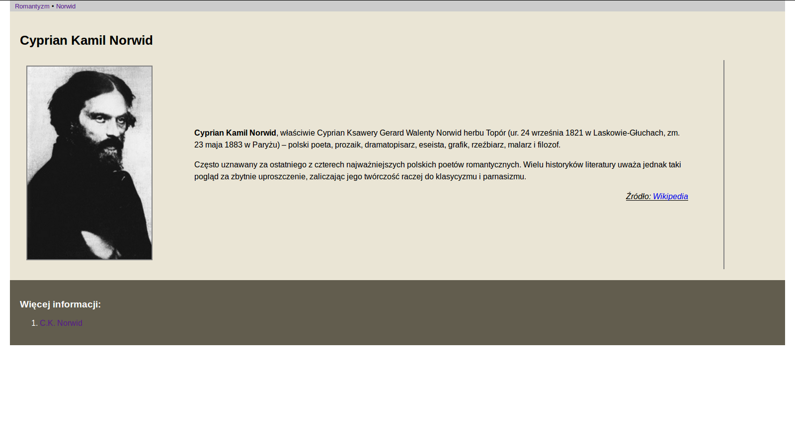

HTML&CSS – ćwiczenie 1
######################

.. note::

	W pliku :file:`index.html` należy przygotować stronę HTML, która wygląda podobnie do poniższej.

.. image:: html_css1/index.png

:download:`Kliknij, aby zobaczyć większy obrazek <html_css1/index.png>`

.. attention::

	W katalogu :file:`html_css_cw1` znajdziesz 3 pliki:

	- :file:`index.html` – szkielet strony HTML, tu wprowadzaj wszystkie zmiany;
	- :file:`style.css` – podstawowy arkusz stylów CSS, tu dodawaj definicje stylów;
	- :file:`norwid.jpg` – obrazek potrzebny tylko w części rozszerzonej.

	**Uwaga**: Treść i obrazki, które masz umieścić w dokumencie ``index.html``,
	skopiuj ze strony `Romantyzm <http://https://pl.wikipedia.org/wiki/Romantyzm>`_ Wikipedii.

Część podstawowa
****************

W pliku ``index.html`` dokonaj następujących zmian:

- wstaw taki sam tytuł strony i nagłówek pierwszego stopnia
- wstaw dwa odnośniki w menu
- wstaw dwa akapity, a w każdym wstaw obrazki
- wstaw akapit z tekstem "Źródło" i odnośnikiem do Wikipedii
- wstaw poziomą linię
- wstaw nagłówek stopnia drugiego
- wstaw listę wypunktowaną
- na końcu listy umieść odnośnik do konkretnej strony w Internecie
- w stopce wstaw znacznik trzeciego poziomu
- wstaw listę wypunktowaną zawierającą dwa odnośniki do stron w Internecie
- dołącz do dokumentu arkusz stylów CSS o nazwie :file:`style.css`
- w pliku :file:`style.css` umieść:

	- definicję ustawiającą marginesy zewnętrzne strony (poza marginesem górnym) na 20px
	- definicję powiększającą czcionkę nagłówka stopnia pierwszego do 26px
	- definicje zmieniające kolor tła (wybierz) i wewnętrzne marginesy elementu ``<section>`` na 20px
	- definicje zmieniające kolor tła (wybierz), kolor czcionki (wybierz) i wewnętrzne marginesy elementu ``footer`` na 20px
	- klasę ``.obrazek`` definiującą szerokość (250px), obramowanie (2px solid grey) i marginesy zewnętrzne obrazków (10px)
	- klasy ``.nalewo``, ``.naprawo`` pozwalające wyrównywać elementy do lewej i prawej strony
	- klasę ``.źródlo`` podkreślającą tekst, pochylającą czcionkę i wyrównującą tekst akapitu "Źródło" do prawej  strony

- przypisz odpowiednim elementom zdefiniowane klasy CSS

Po wykonaniu ćwiczenia lub upłynięciu przeznaczonego na nie czasu utwórz archiwum w formacie *zip* zawierające katalog :file:`html_css_cw1`, zmień jego nazwę wg schematu: ``kl1ag1_nazwisko_imie_html1.zip`` i wgraj na wskazany serwer.

Część rozszerzona
*****************

W pliku :file:`norwid.html` należy przygotować stronę HTML, która wygląda podobnie do poniższej.

:download:`Kliknij, aby zobaczyć większy obrazek <html_css1/norwid.png>`

.. attention::

	**Uwaga**: Treści zawarte w pliku ``norwid.html`` pobierz z odpowiedniej strony Wikipedii.

- zapisz plik :file:`index.html` pod nazwą ``norwid.html``;
- upewnij się, że działają odnośniki w menu;

W pliki :file:`norwid.html` dokonaj następujących zmian:

- zmień tytuł dokumentu i zawartość nagłówka strony;
- z elementu ``<section>`` usuń wszystko poza nagłówkiem;
- wstaw 2-komórkową tabelę, szerokość lewej komórki ustaw 10%;
- w lewej komórce umieść obrazek, w prawej akapity z tekstem oraz akapit "Źródło";
- zmień treść i url odnośnika na dole strony;
- za pomocą stylów CSS ustaw prawy zewnętrzny margines tabeli na 100px;
- utwórz klasę CSS ``.tdright``, która definiuje 5% wewnętrzne marginesy oraz prawe obramowanie (2px solid grey);
- zastosuj utworzoną klasę.

Po wykonaniu ćwiczenia lub upłynięciu przeznaczonego na nie czasu utwórz archiwum w formacie *zip* zawierające katalog :file:`html_css_cw1`, zmień jego nazwę wg schematu: ``kl1ag1_nazwisko_imie_html1_roz.zip`` i wgraj na wskazany serwer.

Materiały
**************

1. `Elementy HTML <http://webkod.pl/dodatki/html/mapa-html-elementy-atrybuty-wartosci>`_
2. `HTML Element Reference <http://www.w3schools.com/tags/default.asp>`_
3. `Właściwości CSS <http://webkod.pl/kurs-css/wlasciwosci/tekst/text-align>`_
4. `CSS Reference <http://www.w3schools.com/cssref/default.asp>`_

.. raw:: html

	
