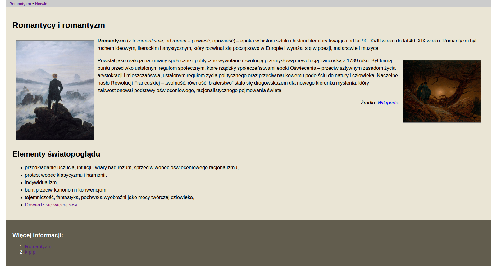
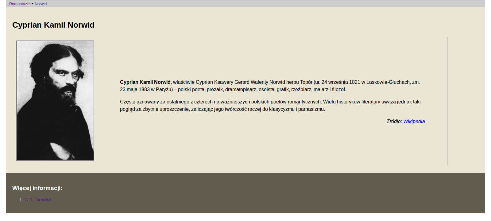

HTML&CSS – ćwiczenie 1
######################

Pobierz archiwum :download:`html_css_cw1.zip<html_css1/html_css_cw1.zip>` i rozpakuj w dowolnym katalogu.
W katalogu :file:`html_css_cw1` znajdziesz pliki:

- :file:`index.html` – szkielet strony HTML, tu wprowadzaj wszystkie zmiany,
- :file:`style.css` – podstawowy arkusz stylów CSS, tu dodawaj definicje stylów,
- :file:`norwid.jpg` – obrazek potrzebny w części drugiej,
- :file:`index_done.png` – zrzut gotowej strony ``index.html``,
- :file:`norwid_done.png` – zrzut gotowej strony ``norwid.html``.

Część pierwsza
****************

Twoim zadaniem jest przygotowanie strony HTML, która wygląda jak poniżej.

:download:`Kliknij, aby zobaczyć większy obrazek <html_css1/index_done.png>`

Treści (tekst i obrazki) zawarte w dokumencie ``index.html`` kopiuj (pobieraj)
ze strony `Romantyzm <https://pl.wikipedia.org/wiki/Romantyzm>`_ umieszczonej na Wikipedii.

W pliku ``index.html`` dokonaj następujących zmian:

#. Wstaw taki sam tytuł strony i zawartość nagłówka pierwszego stopnia.
#. W menu wstaw dwa odnośniki:

	a) jeden o treści "Romantyzm" do strony zapisanej w pliku ``index.html``,
	b) drugi o treści "Norwid" do strony zapisanej w pliku ``norwid.html``.

#. Wstaw dwa akapity, a w każdym wstaw obrazek.
#. Wstaw akapit z tekstem "Źródło" i odnośnikiem do Wikipedii.
#. Wstaw poziomą linię.
#. Wstaw nagłówek stopnia drugiego.
#. Wstaw listę wypunktowaną.
#. Ostatni element listy powinien być odnośnikiem do konkretnej strony w Internecie.
#. W stopce wstaw znacznik nagłówka trzeciego poziomu.
#. Wstaw listę wypunktowaną zawierającą dwa odnośniki do stron w Internecie.
#. Dołącz do dokumentu arkusz stylów CSS o nazwie :file:`style.css`.
#. W pliku :file:`style.css` dodaj:

	a) definicję ustawiającą marginesy zewnętrzne strony (poza marginesem górnym) na 20px
	b) definicję powiększającą czcionkę nagłówka stopnia pierwszego do 26px
	#) definicje zmieniające kolor tła (wybierz) i wewnętrzne marginesy (wypełnienie) elementu ``<section>`` na 20px
	#) definicje zmieniające kolor tła (wybierz), kolor czcionki (wybierz) i wewnętrzne marginesy (wypełnienie) elementu ``footer`` na 20px
	#) klasę ``.obrazek`` definiującą szerokość (250px), obramowanie (2px solid grey) i marginesy zewnętrzne obrazków (10px)
	#) klasy ``.nalewo``, ``.naprawo`` pozwalające wyrównywać elementy do lewej i prawej strony
	#) klasę ``.źródlo`` podkreślającą tekst, pochylającą czcionkę i wyrównującą tekst akapitu "Źródło" do prawej strony

#. Przypisz odpowiednim elementom zdefiniowane klasy CSS.

Część druga
*****************

Twoim zadaniem jest przygotowanie strony HTML, która wygląda podobnie do poniższej.

:download:`Kliknij, aby zobaczyć większy obrazek <html_css1/norwid_done.png>`

Treści (tekst i obrazki) zawarte w dokumencie ``norwid.html`` kopiuj (pobieraj) z Wikipedii.

#. Zapisz plik :file:`index.html` pod nazwą ``norwid.html``.
#. Upewnij się, że działają odnośniki w menu.

W pliku :file:`norwid.html` dokonaj następujących zmian:

#. Zmień tytuł dokumentu i zawartość nagłówka strony.
#. Z elementu ``<section>`` usuń wszystko poza nagłówkiem.
#. Wstaw 2-komórkową tabelę, szerokość lewej komórki ustaw na 10%.
#. W lewej komórce umieść obrazek, w prawej akapity z tekstem oraz akapit "Źródło".
#. Zmień treść i url odnośnika na dole strony.
#. Za pomocą stylów CSS ustaw prawy zewnętrzny margines tabeli na 100px.
#. Utwórz klasę CSS ``.tdright``, która definiuje 5% wewnętrzne marginesy (wypełnienie) oraz prawe obramowanie (2px solid grey).
#. Zastosuj utworzoną klasę do prawej komórki tabeli.

Materiały
**************

#. `HTML Tutorial <https://www.w3schools.com/html/default.asp>`
#. `HTML Element Reference <http://www.w3schools.com/tags/default.asp>`_
#. `HTML Tables <https://www.w3schools.com/html/html_tables.asp>`
#. `Właściwości CSS <http://webkod.pl/kurs-css/wlasciwosci/tekst/text-align>`_
#. `CSS Layout - float and clear <https://www.w3schools.com/css/css_float.asp>`
#. `CSS Reference <http://www.w3schools.com/cssref/default.asp>`_
#. `CSS: Kaskadowe arkusze stylów <https://developer.mozilla.org/pl/docs/Web/CSS>`